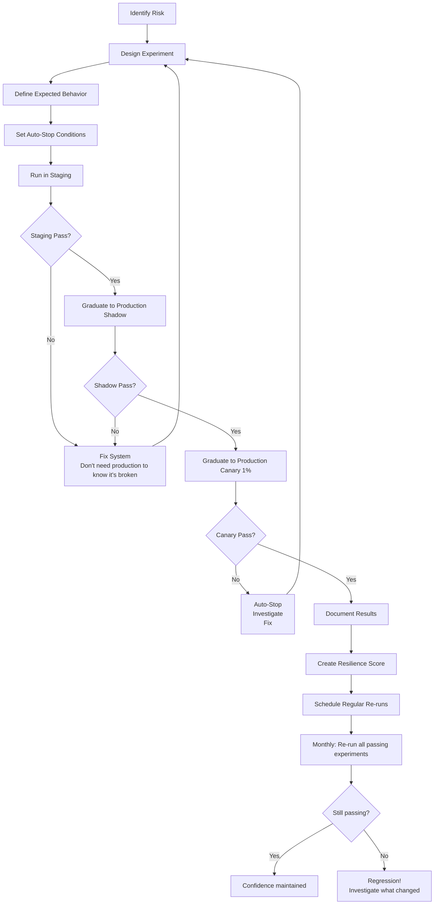

# Chaos Engineering for AI Systems

## What is Chaos Engineering for AI?

Chaos engineering is the practice of **intentionally injecting failures** into a system to verify it handles them gracefully. Think of it as a "fire drill" — you practice handling emergencies so when a real one happens, you're prepared.

For AI systems, traditional chaos (kill a server, drop network packets) is necessary but insufficient. AI systems have unique failure modes that require **AI-specific chaos experiments**.

---

## Why AI Needs Its Own Chaos Engineering

Traditional chaos testing covers:
- Server crashes → Auto-restart, load balancing
- Network partition → Retry, failover
- Disk full → Alerts, cleanup

But it DOESN'T cover:
- Model returns garbage → What happens?
- Provider goes slow (not down) → Does your timeout work?
- Quality degrades 20% → Do you even notice?
- Vector DB returns wrong results → Do guardrails catch it?
- Someone injects prompts → Does defense hold?
- Cost explodes → Do budget limits work?

**If you haven't tested these failures, you don't know if your system handles them.**

---

## AI-Specific Chaos Experiments

### Experiment 1: Model Provider Outage

**What we simulate**: Primary model provider returns 500 errors for all requests.

**Setup**:
```python
# Inject fault: intercept all calls to primary provider, return 500
chaos_config = {
    "target": "openai_api",
    "fault_type": "error",
    "error_code": 500,
    "duration": "5m",
    "blast_radius": 1.0  # 100% of requests
}
```

**Expected behavior**:
- System detects provider failure within 30 seconds
- Automatic failover to secondary provider (Azure OpenAI / Anthropic)
- User experience: slight latency increase, no errors
- Alert fires notifying on-call

**Measurements**:
- Failover time: how long until secondary is serving?
- Error rate during failover: how many requests failed?
- Quality during failover: is secondary provider quality acceptable?
- Recovery time: when primary returns, how long to shift back?

**Pass criteria**:
- Failover < 30 seconds
- User-facing error rate < 1% during transition
- Quality score on secondary > 0.85

### Experiment 2: Latency Injection

**What we simulate**: Model responses take 5-10 seconds longer than normal.

**Setup**:
```python
chaos_config = {
    "target": "model_inference",
    "fault_type": "latency",
    "delay_ms": 5000,  # Add 5s to every response
    "duration": "10m",
    "blast_radius": 0.5  # 50% of requests
}
```

**Expected behavior**:
- Streaming starts showing "thinking" indicator to user
- Timeout protection activates for requests > threshold
- Queue management prevents cascade
- Circuit breaker opens if latency persists
- Alert fires for latency SLO violation

**Measurements**:
- User experience: do they see a loading state or just hang?
- Cascade effects: does slowness cause upstream timeouts?
- Queue depth: are requests backing up?
- Circuit breaker: does it open appropriately?
- Recovery: when latency returns to normal, does system recover?

**Pass criteria**:
- User always sees feedback within 2s (loading indicator)
- No cascade failures to other services
- Circuit breaker opens after 30s of high latency
- System recovers within 60s of fault removal

### Experiment 3: Quality Degradation

**What we simulate**: Model returns plausible but low-quality responses.

**Setup**:
```python
chaos_config = {
    "target": "model_response",
    "fault_type": "quality_degradation",
    "method": "replace_with_generic",  # Replace 30% of responses with vague answers
    "degradation_level": 0.3,
    "duration": "15m",
    "blast_radius": 0.3  # 30% of requests get degraded responses
}
```

**Expected behavior**:
- Quality monitoring detects drop within 10 minutes
- Confidence scoring flags low-quality responses
- Alert fires for quality SLO violation
- System may activate fallback (retry with different prompt, escalate to human)

**Measurements**:
- Detection time: how long until quality monitoring flags the issue?
- User impact: how many users received degraded responses before detection?
- Response: does the system take any automatic action?
- False positive rate: does the system over-react to normal variation?

**Pass criteria**:
- Detection within 10 minutes
- Automatic alert fires
- Less than 50 users receive degraded responses before detection

### Experiment 4: Vector DB Failure

**What we simulate**: Vector search returns errors or empty results.

**Setup**:
```python
chaos_config = {
    "target": "vector_db",
    "fault_type": "error",  # or "empty_results" or "wrong_results"
    "error_rate": 1.0,  # 100% failure
    "duration": "5m",
    "blast_radius": 1.0
}
```

**Expected behavior**:
- System detects retrieval failure
- Fallback activates: cached results, or respond without context (with warning)
- User is informed that answers may be less accurate
- Alert fires for vector DB health
- No system crash or unhandled exception

**Measurements**:
- Fallback activation time
- User experience during fallback (what do they see?)
- Quality of fallback responses
- Error propagation (does it crash other components?)
- Recovery time when vector DB returns

**Pass criteria**:
- Graceful fallback within 5 seconds
- No unhandled exceptions
- User informed of degraded mode
- Full recovery within 30s of vector DB returning

### Experiment 5: Token Budget Exhaustion

**What we simulate**: Rate limits hit, all requests return 429 Too Many Requests.

**Setup**:
```python
chaos_config = {
    "target": "model_api",
    "fault_type": "rate_limit",
    "response_code": 429,
    "retry_after": 60,  # Provider says retry after 60s
    "duration": "5m",
    "blast_radius": 1.0
}
```

**Expected behavior**:
- Request queue activates (don't drop requests)
- Priority system ensures high-priority requests served first
- Low-priority requests gracefully degraded or queued
- User sees "busy" message with ETA
- Alert fires for rate limiting

**Measurements**:
- Queue behavior: orderly or chaotic?
- Priority enforcement: do VIP users still get served?
- User communication: informed about wait?
- Request loss: any requests silently dropped?
- Recovery: orderly drain when limits lift?

**Pass criteria**:
- Zero request loss (all queued or gracefully rejected)
- Priority ordering maintained
- User informed within 2s of hitting queue
- Queue drains within 2 minutes of rate limit lifting

### Experiment 6: Hallucination Injection

**What we simulate**: Feed incorrect/contradictory context to the RAG system.

**Setup**:
```python
chaos_config = {
    "target": "retrieval_context",
    "fault_type": "inject_false_info",
    "method": "replace_facts",  # Replace correct facts with plausible falsehoods
    "injection_rate": 0.5,  # 50% of retrieved context is false
    "duration": "10m",
    "blast_radius": 0.1  # Only 10% of requests
}
```

**Expected behavior**:
- Output guardrails detect inconsistencies
- Confidence scoring drops for affected responses
- Cross-reference checking catches contradictions
- Hallucinated claims blocked before reaching user

**Measurements**:
- Guardrail catch rate: what % of hallucinations were caught?
- Leaked hallucinations: how many false claims reached users?
- Detection confidence: were caught items correctly identified?
- Latency impact: does extra checking add unacceptable delay?

**Pass criteria**:
- Guardrail catches > 80% of injected hallucinations
- Less than 5% of affected requests have hallucinations reach user
- Additional checking latency < 500ms

### Experiment 7: Cache Stampede

**What we simulate**: All caches invalidated simultaneously.

**Setup**:
```python
chaos_config = {
    "target": "cache_layer",
    "fault_type": "flush_all",
    "duration": "instant",  # One-time event
    "blast_radius": 1.0
}
```

**Expected behavior**:
- Thundering herd protection activates (request coalescing)
- Backend load increases but stays within capacity
- Cache rebuilds gradually (not all at once)
- Response times increase temporarily but don't timeout
- No cascade failure

**Measurements**:
- Backend QPS spike: how much? Within capacity?
- Cache refill time: how long until hit rate normalizes?
- User latency during refill period
- Error rate during the stampede
- Cost impact (all requests hitting model)

**Pass criteria**:
- Backend QPS stays below 3x normal
- No errors during cache refill
- Latency < 3x normal during refill
- Cache hit rate recovers within 10 minutes
- No cascade failures

### Experiment 8: Cross-Tenant Probe

**What we simulate**: Attempt to access another tenant's data through various vectors.

**Setup**:
```python
chaos_config = {
    "target": "multi_tenant_isolation",
    "fault_type": "probe",
    "vectors": [
        "vector_db_namespace_bypass",
        "cache_key_guessing",
        "session_context_manipulation",
        "document_id_enumeration"
    ],
    "duration": "continuous",
    "blast_radius": "probe_only"  # No actual data exposure
}
```

**Expected behavior**:
- ALL probes blocked by permission system
- Each blocked attempt logged
- Alert fires for attempted cross-tenant access
- No data exposed in any vector

**Measurements**:
- Block rate: 100% of probes must be blocked
- Logging: every probe attempt logged with details
- Alert latency: how fast does security team get notified?
- Information leakage: even error messages shouldn't reveal data existence

**Pass criteria**:
- 100% block rate (zero tolerance)
- All attempts logged with full context
- Alert fires within 1 minute
- Error messages reveal nothing about other tenants

---

## Running Chaos Experiments Safely

### The Safety Ladder

```
Level 1: Staging/Dev (full blast, no risk)
Level 2: Production shadow (replay traffic, compare results)
Level 3: Production canary (1% of traffic, auto-stop)
Level 4: Production limited (10% of traffic, auto-stop)
Level 5: Production full (100% of traffic, auto-stop)
```

Always start at Level 1. Graduate only after passing at current level.

### Blast Radius Control

```python
experiment_safety = {
    "max_blast_radius": 0.01,  # Start with 1% of production traffic
    "auto_stop_conditions": [
        {"metric": "error_rate", "threshold": 0.05, "action": "stop"},
        {"metric": "latency_p95", "threshold": 10000, "action": "stop"},
        {"metric": "cost_per_minute", "threshold": 100, "action": "stop"},
    ],
    "duration_limit": "10m",  # Never run longer than 10 minutes
    "rollback_ready": True,  # Mitigation ready before starting
    "approval_required": True,  # Human approves before production
}
```

### Pre-Experiment Checklist

```markdown
Before running any chaos experiment in production:

□ Experiment documented with expected outcomes
□ Runbook ready for unexpected results
□ Auto-stop conditions configured and tested
□ Blast radius limited and verified
□ On-call notified (they know experiment is happening)
□ Rollback tested and ready
□ No other active incidents
□ Not during peak traffic (unless testing peak behavior)
□ Monitoring dashboards open and watched
□ Communication channel ready (if user impact possible)
```

### Post-Experiment Actions

```markdown
After every chaos experiment:

□ Document results: pass/fail, measurements
□ If FAIL: create ticket for remediation
□ If PASS: document as verified resilience
□ Update confidence score for the system
□ Schedule next experiment (harder or different scenario)
□ Share learnings with team
```

---

## Chaos Experiment Lifecycle



---

## Chaos Experiment Schedule

| Experiment | Frequency | Environment | Blast Radius |
|-----------|-----------|-------------|--------------|
| Provider outage | Weekly | Production | 1% |
| Latency injection | Weekly | Production | 5% |
| Quality degradation | Bi-weekly | Staging + Shadow | N/A |
| Vector DB failure | Monthly | Production | 1% |
| Token exhaustion | Monthly | Production | 5% |
| Hallucination injection | Monthly | Staging only | N/A |
| Cache stampede | Quarterly | Production (off-peak) | 100% |
| Cross-tenant probe | Weekly (automated) | Production | Probe only |

---

## Key Takeaways

1. **If you haven't tested a failure mode, assume your system doesn't handle it**
2. **Start small** — 1% blast radius, auto-stop, staging first
3. **Expected behavior must be defined BEFORE the experiment** — otherwise you learn nothing
4. **Chaos experiments that always pass aren't hard enough** — increase difficulty
5. **The goal is confidence, not breakage** — you want to KNOW your system handles failures
6. **Schedule experiments regularly** — systems regress, re-verify continuously
7. **Cross-tenant isolation must be verified with zero tolerance** — any failure is critical
