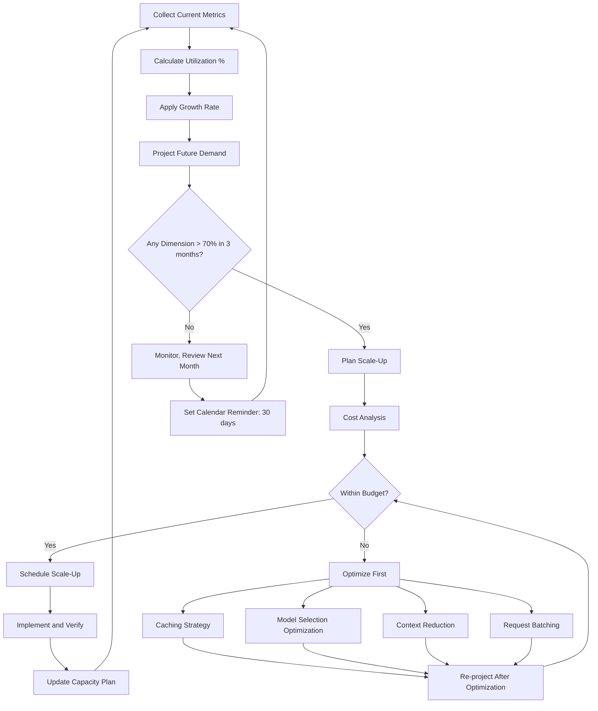

# Capacity Planning for AI Systems

## Why AI Capacity Planning is Different

Traditional capacity planning: "How many servers do I need for X requests/second?"

AI capacity planning: "How many GPUs, how much vector storage, how many tokens/second, and how much will it cost — and all of these scale non-linearly?"

Key differences:
- **Non-linear cost**: A 2x traffic increase might mean 4x cost (longer contexts at scale)
- **Multiple dimensions**: CPU, GPU, memory, vector DB, token throughput, embedding throughput
- **Provider limits**: You can't just add more servers — providers have rate limits
- **Variable request size**: One request might use 100 tokens, another 100,000
- **Batch vs real-time**: Different capacity needs for different processing modes

---

## Capacity Dimensions

### 1. Token Throughput

```
Metric: tokens processed per second (across all users)

Components:
- Input tokens: user messages + system prompts + retrieved context
- Output tokens: model-generated responses
- Total: input + output tokens/sec

Example:
- 100 concurrent users
- Average request: 2,000 input tokens + 500 output tokens
- Average request duration: 5 seconds
- Throughput needed: 100 × 2,500 / 5 = 50,000 tokens/sec
```

### 2. Concurrent Requests

```
Metric: simultaneous active requests at any moment

Calculation:
- Peak QPS × average_request_duration = concurrent requests
- Example: 50 QPS × 4s avg duration = 200 concurrent requests

Considerations:
- Model providers have concurrency limits
- Self-hosted: limited by GPU count and batch size
- Queue depth = overflow capacity
```

### 3. Vector DB Capacity

```
Metric: total vectors, queries per second (QPS), memory

Dimensions:
- Total vectors: number of chunks × vector dimensions
- Memory: vectors × dimensions × 4 bytes (float32) × overhead_factor
- QPS: search queries per second
- Write throughput: vectors ingested per second

Example:
- 1M documents × 10 chunks/doc = 10M chunks
- Vector size: 1536 dimensions (OpenAI ada-002)
- Memory: 10M × 1536 × 4 bytes × 1.5 overhead = ~92 GB
- QPS needed: 200 searches/sec
```

### 4. Embedding Throughput

```
Metric: embeddings generated per second (for ingestion)

Considerations:
- Batch ingestion: thousands of documents per hour
- Real-time: user uploads need embedding within seconds
- Rate limits: embedding APIs have separate rate limits

Example:
- Daily ingestion: 10,000 new documents
- Chunks per document: 10
- Embeddings needed: 100,000/day = ~1.2/sec average
- Peak (batch job): 100/sec for 15 minutes
```

### 5. Storage

```
Metric: total storage across all systems

Components:
- Vector DB: vectors + metadata + indices
- Document store: original documents
- Conversation history: user sessions
- Logs and traces: observability data
- Model artifacts: fine-tuned models, adapters

Growth rate:
- Vectors: new_docs/day × chunks × vector_size
- Conversations: active_users × avg_session_size × sessions/day
- Logs: requests/day × avg_log_size
```

### 6. GPU Memory (Self-Hosted)

```
Metric: GPU VRAM utilization

Components:
- Model weights: model_parameters × precision_bytes
- KV Cache: batch_size × sequence_length × layers × hidden_dim × 2 × precision
- Activation memory: varies with batch size
- Overhead: CUDA, framework, buffers (~10-20%)

Example (Llama 70B, FP16):
- Weights: 70B × 2 bytes = 140 GB (needs multiple GPUs)
- KV Cache per request: ~2 GB for 4K context
- Batch of 8: 140 + 16 = 156 GB minimum
- Needs: 3× A100 80GB or 2× H100 80GB
```

---

## Capacity Planning Formulas

### Required GPU Count (Self-Hosted)

```
GPUs_needed = ceil(
    (peak_QPS × avg_tokens_per_request) / tokens_per_GPU_per_sec
) × redundancy_factor

Example:
- Peak QPS: 50
- Avg tokens/request: 2,500
- Tokens/GPU/sec: 10,000 (A100 with 70B model)
- Redundancy: 1.5 (N+1 for failover)

GPUs = ceil(50 × 2,500 / 10,000) × 1.5 = ceil(12.5) × 1.5 = 13 × 1.5 = 20 GPUs
```

### Vector DB Nodes

```
nodes_needed = ceil(
    total_vectors / vectors_per_node
) × headroom_factor

Where:
- vectors_per_node = memory_per_node / (vector_dimensions × 4 bytes × overhead)
- headroom_factor = 1.3 (30% headroom for growth and performance)

Example:
- Total vectors: 10M
- Node memory: 64 GB
- Vector dimensions: 1536
- Overhead: 2x (index structures, metadata)
- Vectors per node: 64GB / (1536 × 4 × 2) = ~5.2M vectors

Nodes = ceil(10M / 5.2M) × 1.3 = ceil(1.92) × 1.3 = 2 × 1.3 = 3 nodes
```

### Redis Memory (Caching)

```
redis_memory = active_users × avg_context_size × cache_multiplier

Where:
- active_users: concurrent users with active sessions
- avg_context_size: average cached context per user (conversation + retrieved docs)
- cache_multiplier: 2x (for key overhead, fragmentation)

Example:
- Active users: 5,000
- Avg context: 50 KB (conversation history + cached retrievals)
- Multiplier: 2

Redis = 5,000 × 50KB × 2 = 500 MB (modest, but grows with context length)
```

### Storage Growth (Monthly)

```
monthly_storage_growth = (
    new_docs_per_day × avg_chunks_per_doc × vector_size × 30 +
    requests_per_day × avg_log_size × 30 +
    active_users × avg_session_size × sessions_per_day × 30
)

Example:
- New docs: 1,000/day × 10 chunks × 6KB vector = 60 MB/day
- Logs: 100,000 requests/day × 2KB = 200 MB/day
- Sessions: 10,000 users × 20KB × 3 sessions = 600 MB/day

Monthly growth: (60 + 200 + 600) × 30 = 25.8 GB/month
```

---

## Forecasting Demand

### Historical Growth Rate

```python
# Simple growth projection
def project_demand(current_qps, monthly_growth_rate, months):
    return current_qps * (1 + monthly_growth_rate) ** months

# Example: 20% month-over-month growth
current = 100  # QPS
month_3 = project_demand(100, 0.20, 3)   # = 173 QPS
month_6 = project_demand(100, 0.20, 6)   # = 299 QPS
month_12 = project_demand(100, 0.20, 12) # = 892 QPS
```

### Seasonal Patterns

```
Typical AI SaaS traffic patterns:
- Weekday vs weekend: 3:1 ratio (business product)
- Business hours vs off-hours: 5:1 ratio
- Monday morning spike: 1.5x average weekday
- Month-end: 1.2x (reporting, analysis usage)
- Year-end: 0.5x (holidays)

Plan for: peak_traffic = average × peak_ratio × growth × headroom
```

### Feature Launch Impact

```
New feature launches cause traffic spikes:
- New RAG feature: expect 2x traffic for first week
- Mobile app launch: expect 3x daily users within month
- Enterprise customer onboard: step-function increase

Rule of thumb: plan capacity for 2x expected spike
```

---

## Auto-Scaling Policies

### Scale Metric: Queue Depth (Not CPU)

For AI systems, **queue depth** is the best scaling signal:
- CPU can be low while queue is backing up (waiting on model API)
- GPU utilization can be high without user impact (batch processing)
- Queue depth directly reflects user experience

```yaml
autoscaling:
  metric: request_queue_depth
  
  scale_up:
    threshold: 100  # requests in queue
    duration: 30s   # sustained for 30 seconds
    action: add 2 instances
    cooldown: 60s
    
  scale_down:
    threshold: 0    # empty queue
    duration: 300s  # empty for 5 minutes
    action: remove 1 instance
    cooldown: 300s
    
  limits:
    minimum: 3      # always at least 3 (HA)
    maximum: 20     # cost safety cap
    
  # Additional signals (override scale-down)
  prevent_scale_down_if:
    - time_of_day: "08:00-18:00"  # business hours
    - day_of_week: "Mon-Fri"
    - upcoming_event: true  # scheduled feature launch
```

### Provider Rate Limit Scaling

```yaml
# When approaching provider rate limits, scale strategies not instances
rate_limit_scaling:
  warning_threshold: 0.7   # 70% of rate limit
  actions:
    - enable_aggressive_caching
    - route_to_secondary_provider
    - reduce_context_length
    - queue_low_priority_requests
    
  critical_threshold: 0.9  # 90% of rate limit
  actions:
    - activate_all_providers
    - enable_request_coalescing
    - defer_non_critical_requests
    - alert_on_call
```

---

## Cost Forecasting

### Monthly Cost Formula

```
monthly_cost = (
    # API costs (variable)
    avg_requests_per_day × 30 × avg_tokens_per_request × cost_per_token +
    
    # Infrastructure (fixed-ish)
    gpu_instances × gpu_cost_per_hour × 720 +
    vector_db_nodes × node_cost_per_hour × 720 +
    redis_memory_gb × redis_cost_per_gb +
    storage_gb × storage_cost_per_gb +
    
    # Operational (fixed)
    monitoring_cost +
    logging_cost +
    network_egress
)
```

### Example Cost Projection

```
Current state (Month 0):
- 50,000 requests/day
- Avg 3,000 tokens/request (input + output)
- Using GPT-4o: $2.50/1M input, $10/1M output (assume 2:1 ratio)
- Token cost: 50K × 3K × $5/1M avg = $750/day = $22,500/month
- Infrastructure: $3,000/month (vector DB, cache, app servers)
- Total: ~$25,500/month

Growth rate: 25% month-over-month

Month 3:  $25,500 × 1.25³ = ~$49,800/month
Month 6:  $25,500 × 1.25⁶ = ~$97,200/month
Month 12: $25,500 × 1.25¹² = ~$372,500/month
```

### Break-Even Analysis: Self-Hosting

```
Self-hosting becomes cheaper when:
  monthly_api_cost > monthly_gpu_cost + operational_overhead

API cost per token (GPT-4o): ~$5/1M tokens average
Self-hosted cost per token (70B model on H100):
  - H100 rental: $3/hour
  - Throughput: ~2,000 tokens/sec = 7.2M tokens/hour
  - Cost: $3 / 7.2M = $0.42/1M tokens
  
Break-even (ignoring ops overhead):
  Self-hosting is ~12x cheaper per token
  But: add engineering time, maintenance, lower quality
  
  Rule of thumb: Self-host when spending > $50K/month on API
  AND have ML engineering team to maintain
```

---

## Capacity Planning Review

### Monthly Review Checklist

```markdown
## Monthly Capacity Review

### Current Utilization
- [ ] Token throughput: current vs capacity (% utilized)
- [ ] Vector DB: storage used vs capacity, QPS vs limit
- [ ] Cache: memory used vs allocated, hit rate
- [ ] Provider rate limits: current usage vs limits
- [ ] Cost: actual vs budget, trend

### Growth Tracking
- [ ] Month-over-month request growth: ___%
- [ ] Storage growth: ___ GB/month
- [ ] User growth: ___ new users
- [ ] Cost growth: ___% increase

### Projections
- [ ] At current growth, when do we hit limits?
  - Provider rate limit: Month ___
  - Vector DB capacity: Month ___
  - Budget ceiling: Month ___
- [ ] Actions needed in next 30 days: ___

### Decisions
- [ ] Scale up anything? What and when?
- [ ] Optimize anything? (caching, model selection, context reduction)
- [ ] New provider needed? (higher limits, better pricing)
```

### Quarterly Re-Planning

```markdown
## Quarterly Capacity Plan

### Strategic Assessment
- Business growth targets for next quarter
- Planned features and their capacity impact
- Budget allocation for AI infrastructure

### Capacity Actions
| Action | Why | When | Cost Impact |
|--------|-----|------|-------------|
| Add 2 vector DB nodes | 80% capacity in 6 weeks | Next month | +$800/month |
| Upgrade provider tier | Hitting rate limits | Immediate | +$2K/month |
| Implement caching layer | Reduce costs 30% | This quarter | -$5K/month (after build) |
| Evaluate self-hosting | Costs exceeding $50K | Start research | TBD |

### Risk Register
| Risk | Probability | Impact | Mitigation |
|------|-------------|--------|------------|
| Provider rate limit hit | High (6 weeks) | Service degradation | Multi-provider + tier upgrade |
| Budget overrun | Medium (if viral) | Feature shutdown | Budget alerts + auto-throttle |
| Vector DB capacity | Low (3 months) | Slow retrieval | Scheduled scale-up |
```

---

## Capacity Planning Process



---

## Key Takeaways

1. **Capacity planning for AI has more dimensions** — tokens, vectors, GPUs, not just CPU/memory
2. **Costs scale non-linearly** — 2x traffic might mean 4x cost
3. **Provider rate limits are your ceiling** — plan around them, not just your own infra
4. **Scale on queue depth, not CPU** — AI workloads are I/O bound to model providers
5. **Monthly review is mandatory** — AI growth can be exponential
6. **Self-hosting break-even is real** — calculate it when API costs exceed $50K/month
7. **Always maintain headroom** — 30% minimum for unexpected spikes
