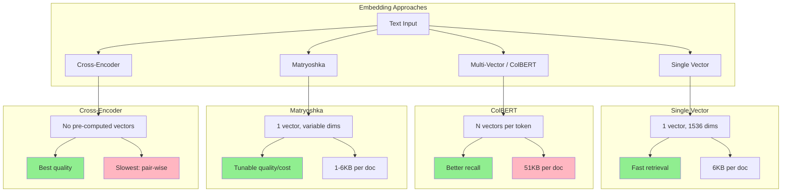

# Beyond Basic Embeddings

## Review: Basic Embeddings

Basic embeddings compress text into a **single dense vector**:

```
"The cat sat on the mat" → [0.12, -0.34, 0.56, ..., 0.89]  (1536 dimensions)
```

This single vector captures the "meaning" of the entire text in a fixed-size representation.
You compare two texts by computing cosine similarity between their vectors.

**What basic embeddings do well:**
- Fast: one comparison = one dot product
- Simple: store one vector per document
- Good for semantic similarity at the concept level
- Scales to billions of documents with ANN indexes

**But there are fundamental limitations...**

---

## Limitations of Single-Vector Embeddings

### 1. Information Loss (Lossy Compression)

An entire document compressed to one vector is extreme lossy compression:

```
1000-word document about:
  - Machine learning algorithms
  - Python implementation details
  - Performance benchmarks
  - Deployment considerations

All compressed → [0.12, -0.34, ..., 0.89]  (1536 floats = 6KB)
```

The original document had ~5KB of text with multiple distinct topics.
The embedding is ~6KB but represents a BLEND of all topics.
Query about "deployment" matches the blended vector, not the deployment section specifically.

### 2. No Term-Level Matching

```
Query: "Python 3.11 performance improvements"
Document: "Python 3.11 introduced significant performance improvements..."

Basic embedding: computes similarity of overall meaning
Problem: might rank a general "programming languages" doc higher
         because it discusses "performance" and "Python" broadly
```

Single vectors can't do exact phrase matching. The word "3.11" might be
lost in the overall semantic blend.

### 3. No Decomposition (Black Box Similarity)

```
similarity("machine learning engineer", "ML ops specialist") = 0.82

WHY 0.82? Which parts contributed?
- "machine learning" ↔ "ML" → high match?
- "engineer" ↔ "specialist" → moderate match?
- "ops" → unique, reduces score?

With single vectors, you CANNOT decompose the score.
```

### 4. Length Sensitivity

```
Short: "transformer architecture"
Long:  "The transformer architecture was introduced in 2017 by Vaswani et al.
        in their paper 'Attention Is All You Need'. It revolutionized NLP by
        replacing recurrent neural networks with self-attention mechanisms,
        enabling parallel computation and better long-range dependencies..."

Both produce ONE vector of the same size (1536 dims).
The long text's vector is diluted across all the information.
The short text's vector is concentrated on one concept.
```

### 5. No Handling of Polysemy in Context

```
"Java" in your document corpus:
  - Software engineering context: programming language
  - Geography context: Indonesian island
  - Food context: coffee variety

A single embedding model encodes a BLEND of all meanings.
In YOUR domain, you want ONE meaning prioritized.
```

---

## Evolution of Embedding Approaches

### Single Vector (Basic)

```
Text → Encoder → 1 vector (768 or 1536 dims)

Speed:   ★★★★★ (one dot product per comparison)
Storage: ★★★★★ (one vector per doc)
Quality: ★★★☆☆ (good, not great)
```

### Multi-Vector (ColBERT)

```
Text → Encoder → N vectors (one per token, 128 dims each)

Speed:   ★★★☆☆ (N×M comparisons per query-doc pair)
Storage: ★★☆☆☆ (N vectors per doc, ~50KB each)
Quality: ★★★★☆ (significantly better recall)
```

### Matryoshka (Variable-Length)

```
Text → Encoder → 1 vector, but usable at any prefix length
                  [dim_1, dim_2, ..., dim_64, ..., dim_256, ..., dim_1536]
                   |_____ 64-dim _____|
                   |_________ 256-dim _____________|
                   |_________________ full 1536-dim ________________________|

Speed:   ★★★★★ (tunable: fewer dims = faster)
Storage: ★★★★★ (tunable: fewer dims = smaller)
Quality: ★★★★☆ (tunable: more dims = better)
```

### Cross-Encoder (Full Attention)

```
(Query, Document) → Encoder → similarity score (scalar)

Speed:   ★☆☆☆☆ (must process BOTH texts together)
Storage: N/A     (no pre-computed vectors)
Quality: ★★★★★ (best possible quality)
```

---

## The Accuracy-Speed Tradeoff

```
Quality (accuracy):
  Cross-Encoder > ColBERT/Multi-Vector > Single-Vector

Speed (latency):
  Single-Vector > ColBERT/Multi-Vector > Cross-Encoder

Typical numbers:
  Single-vector:  1M docs in 5ms    (ANN search)
  ColBERT:        1M docs in 50ms   (with pre-computation + ANN)
  Cross-encoder:  100 docs in 200ms (must score each pair)
```

### Production Pattern: Retrieve then Rerank

```
┌─────────────────────────────────────────────────────┐
│ Stage 1: RETRIEVAL (fast, broad)                    │
│   Single-vector or BM25 → top 100 candidates       │
│   Latency: 5-10ms                                  │
├─────────────────────────────────────────────────────┤
│ Stage 2: RERANKING (slow, precise)                  │
│   Cross-encoder scores each of 100 candidates       │
│   Latency: 100-300ms                               │
│   Result: top 10, much better quality               │
└─────────────────────────────────────────────────────┘
```

This is the **dominant production architecture** because:
- Retrieval narrows 1M → 100 (fast, approximate)
- Reranker refines 100 → 10 (slow, precise)
- Total latency: ~200-400ms (acceptable for most apps)

---

## When to Go Beyond Basic Embeddings

### Problem: Basic Embeddings Miss Exact Matches

```
Query: "error code 0x80070005"
Basic embedding: encodes semantic meaning of "error code"
Result: misses the EXACT error code, returns generic error docs

Solution: Hybrid search (BM25 keyword + vector semantic)
```

### Problem: Need Better Ranking

```
Basic retrieval returns 10 results, but rank order is wrong.
Result #7 is actually the best answer.

Solution: Add cross-encoder reranker
- Takes (query, document) pair
- Returns precise relevance score
- Reorders the top-K results
```

### Problem: Need Better Recall with Speed

```
Basic embeddings miss 20% of relevant documents.
Cross-encoder is too slow for initial retrieval.

Solution: ColBERT (multi-vector with late interaction)
- Better recall than single-vector
- Much faster than cross-encoder
- Can still use ANN indexes
```

### Problem: Flexible Storage/Cost

```
Have 100M embeddings. Storage cost is $X/month.
Some queries need high precision, most are simple.

Solution: Matryoshka embeddings
- Store full embeddings (1536-dim)
- For simple queries: use first 256 dims (save compute)
- For hard queries: use full dimensions
- Or: adaptive retrieval (coarse → fine)
```

---

## Decision Framework

```
Start here: Are basic embeddings good enough?
  │
  ├─ Yes → Keep using them (simplest is best)
  │
  └─ No → What's the problem?
       │
       ├─ Missing keyword matches → Add BM25 hybrid
       │
       ├─ Bad ranking of results → Add cross-encoder reranker
       │
       ├─ Missing relevant docs → Try ColBERT or multi-vector
       │
       ├─ Storage too expensive → Try Matryoshka (fewer dims)
       │
       └─ Domain mismatch → Fine-tune embeddings
```

---

## Embedding Approaches Comparison



---

## Summary Table

| Approach | Vectors/Doc | Dims | Storage/Doc | Latency (1M docs) | Quality |
|----------|-------------|------|-------------|-------------------|---------|
| Single | 1 | 1536 | 6KB | 5ms | Good |
| ColBERT | ~200 | 128 | 51KB | 50ms | Very Good |
| Matryoshka (256) | 1 | 256 | 1KB | 3ms | Good- |
| Matryoshka (full) | 1 | 1536 | 6KB | 5ms | Good |
| Cross-encoder | 0 | N/A | 0 | 200ms (per 100) | Best |
| Hybrid (BM25+vec) | 1 | 1536 | 6KB + index | 10ms | Good+ |

---

## What's Next

In the following sections we'll deep-dive into each approach:
- **ColBERT and Late Interaction** (multi-vector with MaxSim scoring)
- **Matryoshka Embeddings** (variable-dimension with adaptive retrieval)
- **Multi-Vector Embeddings** (parent-child and aspect-based)
- **Embedding Fine-Tuning** (domain adaptation)
- **Embedding Versioning and Migration** (operational concerns)
