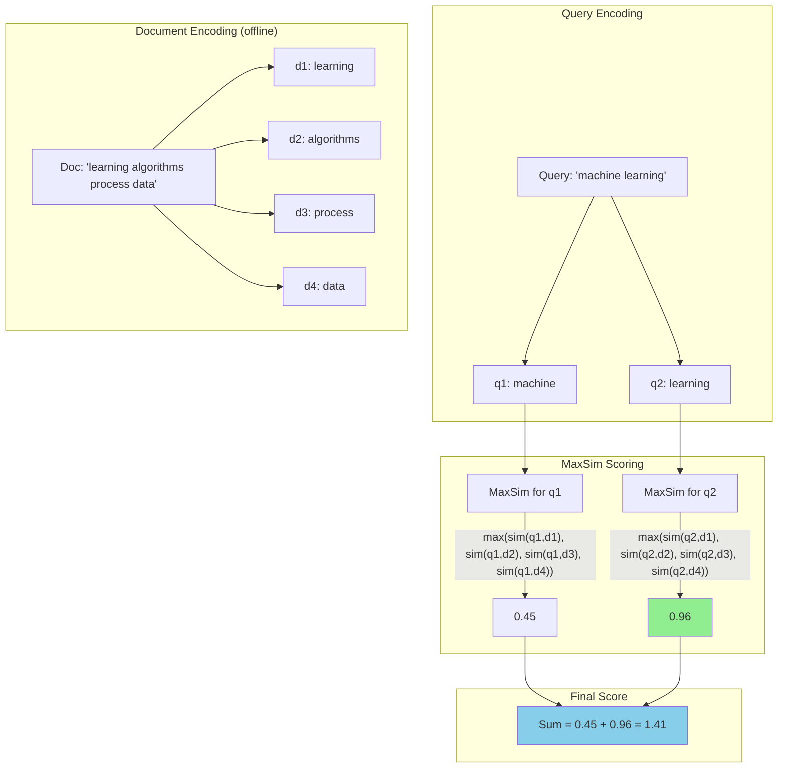

# ColBERT and Late Interaction

## What is ColBERT?

**ColBERT** = **C**ontextualized **L**ate **I**nteraction over **BERT**

The key insight: instead of compressing an entire document into ONE vector,
create one vector PER TOKEN. Then compare query tokens against document tokens
individually at retrieval time.

```
Traditional embedding:
  "machine learning is great" → [single vector: 0.12, -0.34, ..., 0.89]

ColBERT embedding:
  "machine learning is great" → [
    vec("machine"):  [0.45, 0.12, ..., 0.33],   (128 dims)
    vec("learning"): [0.67, -0.23, ..., 0.11],  (128 dims)
    vec("is"):       [0.01, 0.02, ..., 0.05],   (128 dims)
    vec("great"):    [0.89, 0.34, ..., 0.67],   (128 dims)
  ]
```

**"Late interaction"** means the query and document are encoded INDEPENDENTLY,
but their token-level vectors INTERACT at search time (not at training time like cross-encoders).

---

## How ColBERT Works

### Step 1: Encode Query

Each query token gets its own contextualized vector:

```python
query = "what is machine learning"
Q = encode_query(query)
# Q = [q1, q2, q3, q4]  (4 token vectors, each 128-dim)
# q1 = vector for "what" in context of this query
# q2 = vector for "is" in context of this query
# q3 = vector for "machine" in context of this query
# q4 = vector for "learning" in context of this query
```

### Step 2: Encode Document (Done Offline)

Each document token gets its own contextualized vector:

```python
doc = "machine learning algorithms process data to find patterns"
D = encode_document(doc)
# D = [d1, d2, d3, d4, d5, d6, d7, d8]  (8 token vectors)
# d1 = vector for "machine" in context of this document
# d2 = vector for "learning" in context of this document
# ...
```

### Step 3: Score with MaxSim

For each query token, find its MAXIMUM similarity with ANY document token:

```
For q1 ("what"):
  sim(q1, d1) = 0.1, sim(q1, d2) = 0.05, ..., sim(q1, d8) = 0.2
  max_sim(q1) = 0.2

For q2 ("is"):
  sim(q2, d1) = 0.02, sim(q2, d2) = 0.01, ..., sim(q2, d8) = 0.03
  max_sim(q2) = 0.03

For q3 ("machine"):
  sim(q3, d1) = 0.95, sim(q3, d2) = 0.3, ..., sim(q3, d8) = 0.1
  max_sim(q3) = 0.95  ← "machine" in query matches "machine" in doc!

For q4 ("learning"):
  sim(q4, d1) = 0.3, sim(q4, d2) = 0.92, ..., sim(q4, d8) = 0.1
  max_sim(q4) = 0.92  ← "learning" in query matches "learning" in doc!
```

### Step 4: Sum MaxSim Scores

```
score(Q, D) = max_sim(q1) + max_sim(q2) + max_sim(q3) + max_sim(q4)
            = 0.2 + 0.03 + 0.95 + 0.92
            = 2.10
```

### The Formula

```
score(Q, D) = Σᵢ maxⱼ (qᵢ · dⱼ)

Where:
  Q = [q₁, q₂, ..., qₙ]  (query token vectors)
  D = [d₁, d₂, ..., dₘ]  (document token vectors)
  qᵢ · dⱼ = cosine similarity between token vectors
```

---

## Why ColBERT Works Better

### 1. Term-Level Matching

```
Query: "transformer attention mechanism"

Document A: "The attention mechanism in transformers enables parallel processing"
Document B: "Neural network architectures have evolved significantly"

Single-vector similarity:
  sim(Q, A) = 0.78
  sim(Q, B) = 0.71  (both discuss neural networks, similar overall meaning)

ColBERT MaxSim:
  score(Q, A):
    "transformer" → max match with "transformers" = 0.96
    "attention"   → max match with "attention"    = 0.98
    "mechanism"   → max match with "mechanism"    = 0.97
    Total = 2.91

  score(Q, B):
    "transformer" → max match with "architectures" = 0.45
    "attention"   → max match with "network"       = 0.30
    "mechanism"   → max match with "evolved"       = 0.20
    Total = 0.95

ColBERT clearly separates relevant from irrelevant!
```

### 2. Better for Long Documents

```
Query: "CUDA memory optimization"

Long document (5000 tokens) about GPU programming:
  - Paragraph 1: intro to GPUs
  - Paragraph 7: CUDA memory management tips  ← relevant!
  - Paragraph 12: conclusion

Single vector: blends all 5000 tokens → diluted match (0.65)
ColBERT: "CUDA" matches token in paragraph 7 with score 0.94
         "memory" matches token in paragraph 7 with score 0.91
         → high score regardless of document length!
```

### 3. Partial Matching

```
Query: "Python asyncio event loop implementation"

Document: "Event loops in asyncio handle coroutine scheduling"
  - Matches: "asyncio" ✓, "event" ✓, "loop" ✓
  - Missing: "Python" (implied), "implementation" (not discussed)

Single vector: moderate similarity (0.72)
ColBERT: partial match gives proportional score
  "Python"         → best match: "asyncio" → 0.5
  "asyncio"        → best match: "asyncio" → 0.97
  "event"          → best match: "Event"   → 0.95
  "loop"           → best match: "loops"   → 0.93
  "implementation" → best match: "handle"  → 0.3
  Total: 3.65 (high because 3/5 terms matched strongly)
```

### 4. Interpretable Scoring

Unlike single-vector similarity, ColBERT scores are DECOMPOSABLE:

```
score(Q, D) = 2.91

Breakdown:
  "transformer" contributed: 0.96 / 2.91 = 33%
  "attention"   contributed: 0.98 / 2.91 = 34%
  "mechanism"   contributed: 0.97 / 2.91 = 33%

You can explain WHY a document was ranked highly!
```

---

## ColBERT v2 Improvements

### Problem: Storage

Original ColBERT storage is enormous:
```
Document with 200 tokens × 128 dims × 4 bytes (float32) = 102KB per document!
1M documents = 102GB just for embeddings!
```

### ColBERT v2 Solutions

**1. Residual Compression**

```
Instead of storing full vectors, store:
  1. Nearest centroid ID (2 bytes)
  2. Residual (difference from centroid) quantized to 1-2 bits per dim

Storage: 200 tokens × (2 + 128×0.25) bytes ≈ 6.8KB per document
Savings: 15x reduction!
```

**2. Centroid-Based Indexing**

```
Train K centroids (e.g., 65536 centroids)
Each token vector → assigned to nearest centroid
Index: centroid_id → list of (doc_id, token_position)

At query time:
  1. Find nearest centroids for each query token
  2. Only compare against tokens in those centroid clusters
  3. Much faster than brute-force N×M comparison
```

**3. Denoising (Token Pruning)**

```
Not all token vectors are useful:
  "the", "a", "is" → low information tokens
  
ColBERT v2 prunes low-importance tokens:
  200 tokens → keep top 100 most informative
  
Further 2x storage and speed improvement
```

---

## Storage Requirements Comparison

```
Document: 200 tokens average

Single vector (768-dim, float32):
  1 × 768 × 4 = 3,072 bytes = 3KB per document

Single vector (1536-dim, float32):
  1 × 1536 × 4 = 6,144 bytes = 6KB per document

ColBERT original (200 tokens, 128-dim, float32):
  200 × 128 × 4 = 102,400 bytes = 100KB per document

ColBERT v2 (compressed, 200 tokens):
  200 × 34 bytes ≈ 6,800 bytes = 7KB per document

ColBERT v2 (compressed + pruned, 100 tokens):
  100 × 34 bytes ≈ 3,400 bytes = 3.4KB per document
```

**At scale (10M documents):**

| Method | Storage | Cost (at $0.10/GB/month) |
|--------|---------|--------------------------|
| Single (1536) | 60GB | $6/month |
| ColBERT original | 1TB | $100/month |
| ColBERT v2 compressed | 70GB | $7/month |
| ColBERT v2 pruned | 34GB | $3.40/month |

---

## When to Use ColBERT

### Good Use Cases

1. **High-precision recall (legal, medical)**
   ```
   Query: "Section 230 immunity for user-generated content"
   Need: find ALL relevant case law, missing one could be malpractice
   ColBERT: term-level matching catches references single-vector misses
   ```

2. **Long documents where exact phrases matter**
   ```
   Query: "NULL pointer dereference in function allocate_buffer"
   ColBERT: matches exact function name and error type independently
   Single vector: might match generic "programming error" docs
   ```

3. **When basic embeddings miss keyword matches**
   ```
   Query: "CVE-2023-44487 HTTP/2 rapid reset"
   ColBERT: each token matches independently
   Single vector: CVE number is noise in the overall semantic blend
   ```

4. **Explainable search (why was this result returned?)**
   ```
   User clicks "why this result?"
   ColBERT: "matched 'machine' (95%), 'learning' (92%), 'Python' (78%)"
   Single vector: "overall similarity 0.82" (not helpful)
   ```

### When NOT to Use

1. **Very large corpus with tight budget**
   ```
   1B documents × 7KB = 7TB storage
   May not be worth the improvement over single-vector + reranker
   ```

2. **Ultra-low latency (< 10ms)**
   ```
   ColBERT requires more computation at query time
   Even with indexing, typically 20-50ms vs 5ms for single vector
   ```

3. **Simple factual queries**
   ```
   Query: "What is the capital of France?"
   Basic embeddings work fine here — no need for term-level matching
   ```

4. **When reranking is already effective**
   ```
   If single-vector + cross-encoder reranker gives you 95%+ recall,
   adding ColBERT complexity isn't justified
   ```

---

## Implementation Options

### RAGatouille (Easiest)

```python
from ragatouille import RAGPretrainedModel

# Load pre-trained ColBERT
RAG = RAGPretrainedModel.from_pretrained("colbert-ir/colbertv2.0")

# Index documents
RAG.index(
    collection=["doc1 text", "doc2 text", ...],
    index_name="my_index"
)

# Search
results = RAG.search(query="machine learning algorithms", k=10)
```

### Stanford ColBERT (Research-grade)

```python
from colbert import Indexer, Searcher
from colbert.infra import ColBERTConfig

config = ColBERTConfig(
    nbits=2,           # compression level
    doc_maxlen=300,    # max tokens per document
    query_maxlen=32,   # max query length
)

# Index
indexer = Indexer(checkpoint="colbert-ir/colbertv2.0", config=config)
indexer.index(name="my_index", collection=documents)

# Search
searcher = Searcher(index="my_index")
results = searcher.search("machine learning", k=10)
```

### PyLate (Flexible)

```python
from pylate import models, indexes

# Load model
model = models.ColBERT("colbert-ir/colbertv2.0")

# Encode
query_embeddings = model.encode([query], is_query=True)
doc_embeddings = model.encode(documents, is_query=False)

# Score
scores = model.score(query_embeddings, doc_embeddings)
```

---

## ColBERT Scoring Mechanism



---

## Performance Benchmarks (Typical)

```
Dataset: MS MARCO Passage Ranking (8.8M passages)

Method                  | MRR@10 | Recall@100 | Latency
------------------------|--------|------------|--------
BM25                    | 0.187  | 0.661      | 15ms
Single-vector (BERT)    | 0.334  | 0.867      | 8ms
ColBERT v1              | 0.360  | 0.936      | 58ms
ColBERT v2              | 0.397  | 0.948      | 42ms
Cross-encoder (rerank)  | 0.412  | N/A        | 1200ms

Note: ColBERT v2 approaches cross-encoder quality at 30x the speed
```

---

## Summary

ColBERT provides a sweet spot between:
- **Single-vector** (fast but misses fine-grained matches)
- **Cross-encoder** (accurate but too slow for retrieval)

Key properties:
- Token-level matching catches what single vectors miss
- Pre-computation means documents are encoded ONCE
- Late interaction means scoring is independent (no pairs needed)
- ColBERT v2 compression makes storage practical
- Explainable: you can decompose WHY a score is high
