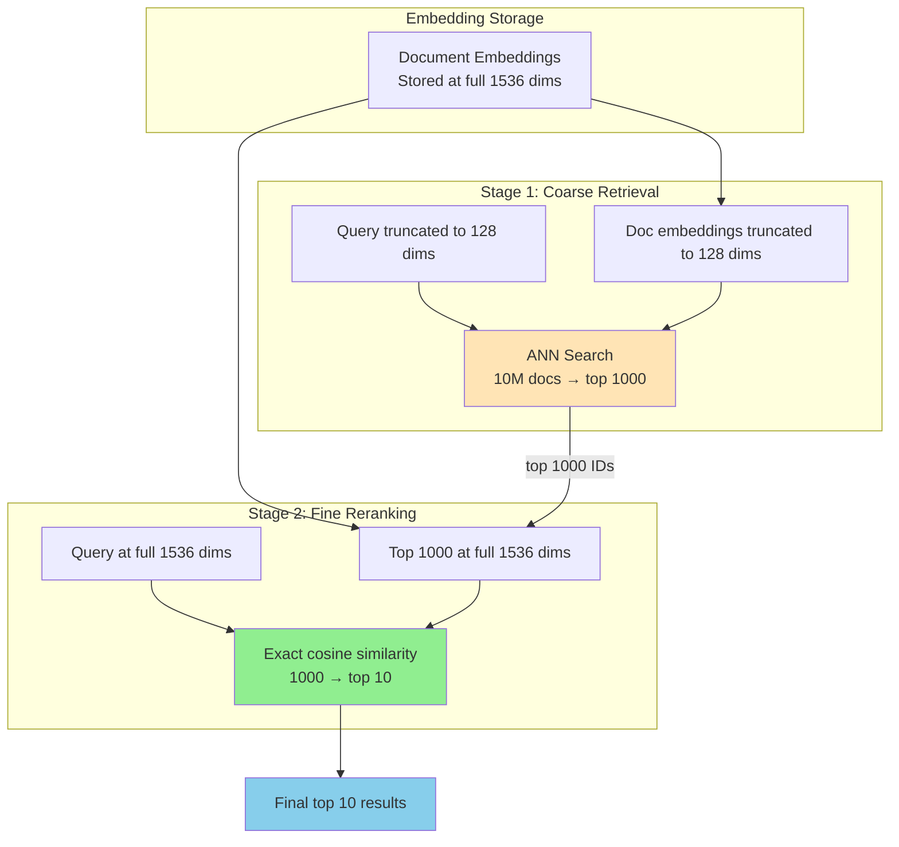

# Matryoshka Embeddings

## What are Matryoshka Embeddings?

Named after **Matryoshka dolls** (Russian nesting dolls), where smaller dolls nest inside larger ones.

The key idea: train the embedding model so that the **first N dimensions** of the vector
are meaningful BY THEMSELVES, for any N.

```
Full embedding (1536 dims):
[d1, d2, d3, d4, ..., d64, ..., d128, ..., d256, ..., d512, ..., d1536]
 |___ 64 dims ___|
 |_______ 128 dims ________|
 |_____________ 256 dims ________________|
 |_____________________ 512 dims _________________________________|
 |_________________________________ 1536 dims (full) _____________________________________|

Each prefix is a VALID embedding (just lower quality)!
```

**Regular embeddings**: must use ALL dimensions. Truncating loses random information.
**Matryoshka embeddings**: truncating is safe because important info is front-loaded.

---

## Why This Matters for Architecture

### Storage Cost

```
1M documents:
  1536 dims × 4 bytes × 1M = 6.1 GB
   256 dims × 4 bytes × 1M = 1.0 GB  (6x savings!)
    64 dims × 4 bytes × 1M = 0.25 GB (24x savings!)
```

### Search Speed

Distance computation is proportional to dimensions:
```
Cosine similarity (1536 dims): 1536 multiply + 1536 add = 3072 ops
Cosine similarity (256 dims):   256 multiply + 256 add  = 512 ops  (6x faster!)
```

### The Key Insight

**You choose the quality-cost tradeoff AT QUERY TIME, not at embedding time.**

Embed once at full dimensions. Store the full vector.
At search time, decide how many dimensions to use based on:
- Query difficulty (simple → fewer dims, hard → more dims)
- Latency budget (tight → fewer dims)
- Stage in pipeline (retrieval → fewer dims, reranking → more dims)

---

## How Matryoshka Training Works

### Standard Embedding Training

```python
# Normal contrastive loss
embedding = model(text)  # 1536 dims
loss = contrastive_loss(embedding, positive, negatives)
loss.backward()
```

### Matryoshka Training

```python
# Loss computed at MULTIPLE truncation points
embedding = model(text)  # 1536 dims

loss_64   = contrastive_loss(embedding[:64],   positive[:64],   negatives[:64])
loss_128  = contrastive_loss(embedding[:128],  positive[:128],  negatives[:128])
loss_256  = contrastive_loss(embedding[:256],  positive[:256],  negatives[:256])
loss_512  = contrastive_loss(embedding[:512],  positive[:512],  negatives[:512])
loss_1536 = contrastive_loss(embedding[:1536], positive[:1536], negatives[:1536])

total_loss = loss_64 + loss_128 + loss_256 + loss_512 + loss_1536
total_loss.backward()
```

**Effect**: The model is forced to put the MOST important information into the
first dimensions, because those dimensions must work well even in isolation.

Think of it like:
- First 64 dims: "coarse category" (is this about science? law? cooking?)
- Dims 65-128: "sub-topic" (within science: physics? biology? ML?)
- Dims 129-256: "specific concept" (within ML: transformers? CNNs? RL?)
- Dims 257-1536: "fine details" (specific techniques, nuances)

---

## Quality vs Dimensions (Typical Results)

Based on benchmarks with OpenAI text-embedding-3-small:

```
Dimensions | Relative Quality | Storage (per vec) | Use Case
-----------|-----------------|-------------------|------------------
1536 (full)| 100% baseline   | 6,144 bytes       | Maximum precision
768        | ~99%            | 3,072 bytes       | Almost no loss
512        | ~97-98%         | 2,048 bytes       | Great tradeoff
256        | ~95-97%         | 1,024 bytes       | Good for most cases
128        | ~90-93%         | 512 bytes         | Coarse retrieval
64         | ~85-88%         | 256 bytes         | Very coarse filtering
```

**Key observation**: You get 95%+ quality at 256 dims (6x less storage than full).
The last 1280 dimensions (256→1536) only add ~3-5% quality.

---

## Adaptive Retrieval Pattern

The most powerful use of Matryoshka embeddings: **multi-stage retrieval**.

### Architecture

```
┌────────────────────────────────────────────────────────┐
│ Stage 1: COARSE RETRIEVAL (128 dims)                   │
│                                                        │
│   Query embedding[:128] vs all doc embeddings[:128]    │
│   ANN search → top 1000 candidates                    │
│   Latency: ~2ms (very fast, short vectors)            │
├────────────────────────────────────────────────────────┤
│ Stage 2: FINE RETRIEVAL (full 1536 dims)               │
│                                                        │
│   Query embedding[:1536] vs 1000 candidates[:1536]    │
│   Exact comparison of 1000 full vectors               │
│   Result: top 10 with high precision                  │
│   Latency: ~5ms (only 1000 comparisons)              │
└────────────────────────────────────────────────────────┘

Total: ~7ms with near-full-dimension quality!
```

### Why This Works

```
Without adaptive retrieval:
  ANN search over 10M × 1536 dims = ~10ms, moderate quality

With adaptive retrieval:
  Stage 1: ANN over 10M × 128 dims = ~2ms (fast, catches most relevant)
  Stage 2: Exact over 1000 × 1536 dims = ~5ms (precise reranking)
  Total: ~7ms, BETTER quality (exact scoring on full dims for top candidates)
```

The coarse stage acts as a "funnel" — it might miss some edge cases (128-dim
quality is ~90%), but for the documents it DOES retrieve, the fine stage
ensures precise ranking.

---

## Implementation with OpenAI

OpenAI's `text-embedding-3-small` and `text-embedding-3-large` support
Matryoshka natively via the `dimensions` parameter:

```python
from openai import OpenAI

client = OpenAI()

# Full dimensions (1536)
response = client.embeddings.create(
    model="text-embedding-3-small",
    input="machine learning algorithms",
    dimensions=1536  # default
)
full_embedding = response.data[0].embedding  # 1536 floats

# Reduced dimensions (256)
response = client.embeddings.create(
    model="text-embedding-3-small",
    input="machine learning algorithms",
    dimensions=256  # Matryoshka truncation
)
short_embedding = response.data[0].embedding  # 256 floats
```

**Important**: The 256-dim embedding from the API is the SAME as taking
the first 256 dims of the 1536-dim embedding (normalized).
You can embed once at full dimensions and truncate locally.

```python
import numpy as np

# Embed once at full dimensions
full = np.array(get_embedding(text, dimensions=1536))

# Truncate and normalize for any dimension
def truncate(embedding, dims):
    truncated = embedding[:dims]
    return truncated / np.linalg.norm(truncated)

emb_256 = truncate(full, 256)   # Valid 256-dim embedding
emb_128 = truncate(full, 128)   # Valid 128-dim embedding
emb_64  = truncate(full, 64)    # Valid 64-dim embedding
```

---

## Models Supporting Matryoshka

| Model | Provider | Full Dims | Min Dims | Notes |
|-------|----------|-----------|----------|-------|
| text-embedding-3-small | OpenAI | 1536 | 64 | Native `dimensions` param |
| text-embedding-3-large | OpenAI | 3072 | 256 | Native `dimensions` param |
| nomic-embed-text-v1.5 | Nomic | 768 | 64 | Open-source |
| mxbai-embed-large | Mixedbread | 1024 | 64 | Open-source |
| snowflake-arctic-embed | Snowflake | 1024 | 256 | Open-source |
| Various sentence-transformers | HuggingFace | varies | varies | Community models |

---

## Practical Design Patterns

### Pattern 1: Cost-Optimized Storage

```
Scenario: 100M documents, budget-constrained

Strategy:
  - Store at 256 dims (1KB per vector = 100GB total)
  - Instead of 1536 dims (6KB per vector = 600GB total)
  - Accept 3-5% quality reduction for 6x cost savings

Cost savings: $50/month instead of $300/month (cloud vector DB)
```

### Pattern 2: Tiered Search Quality

```
Scenario: Different query types need different precision

Simple queries ("what is Python"):
  - Use 128 dims → fast, cheap, good enough

Complex queries ("differences between asyncio and threading for I/O bound"):
  - Use full 1536 dims → maximum precision

Implementation:
  - Classify query complexity (simple heuristic: length, keywords)
  - Route to appropriate dimension search
```

### Pattern 3: Progressive Loading

```
Scenario: Mobile app with bandwidth constraints

1. Initial search: send 64-dim vectors (small payload)
2. User scrolls/wants more: fetch 256-dim for re-ranking
3. User selects result: fetch full 1536-dim for precise similarity

Benefit: responsive UI with progressive quality improvement
```

---

## Matryoshka Adaptive Retrieval



---

## Comparison: Matryoshka vs Alternatives

### vs PCA/Random Projection

```
PCA: reduces dimensions AFTER embedding (post-hoc)
  - Quality: worse (not trained for truncation)
  - Flexibility: must choose dim at index time
  - Extra step: need PCA fit + transform

Matryoshka: reduces dimensions BY DESIGN (during training)
  - Quality: much better (model optimized for each prefix)
  - Flexibility: choose dim at query time
  - No extra step: just truncate
```

### vs Product Quantization (PQ)

```
PQ: compresses vectors by quantizing sub-vectors
  - Storage: very efficient (can get 32x compression)
  - Quality: good for approximate search
  - Complexity: needs codebook training

Matryoshka: reduces by truncation
  - Storage: less aggressive (6x typical)
  - Quality: better (no quantization noise)
  - Simplicity: just use fewer dimensions
  
Can combine: Matryoshka truncation + PQ on the truncated vectors!
```

---

## Summary

Matryoshka embeddings are one of the most practical advances in embedding technology:

1. **No extra cost at embedding time** — embed once, truncate as needed
2. **Tunable quality-cost tradeoff** — choose dimensions based on requirements
3. **Enables adaptive retrieval** — coarse-to-fine pipeline with single model
4. **Widely supported** — OpenAI, Nomic, Mixedbread all support it
5. **Drop-in replacement** — same API, just add `dimensions` parameter

**When to use**: Almost always. If your model supports Matryoshka, use it.
Store full dimensions, but search at reduced dimensions when speed/cost matters.
