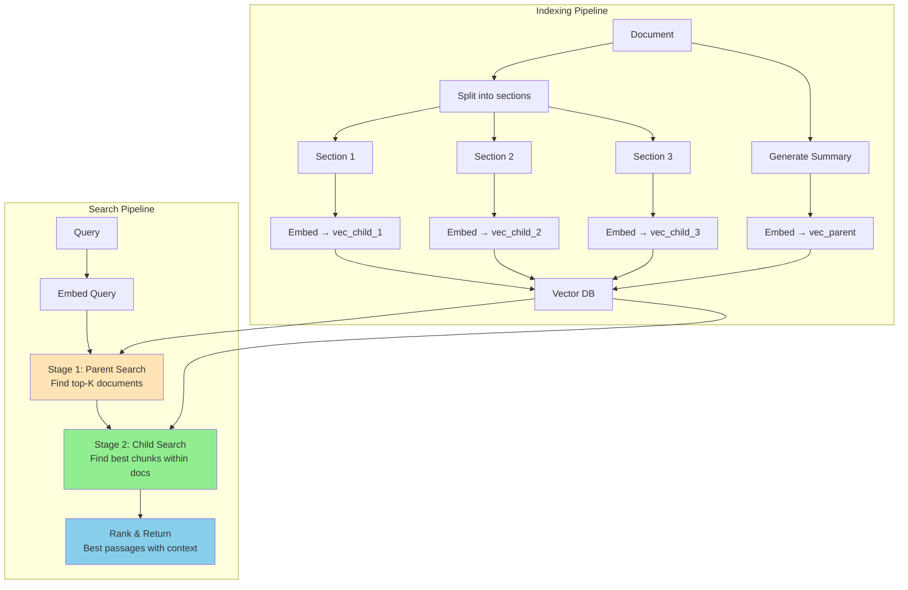

# Multi-Vector Embeddings

## What Are Multi-Vector Embeddings?

Instead of representing a text with ONE vector, use MULTIPLE vectors to capture
different aspects, sections, or granularities.

```
Single-vector:
  "Long document about ML, deployment, and testing" → [one vector]

Multi-vector:
  "Long document..." → [
    vec_summary: overall topic vector,
    vec_section1: ML algorithms vector,
    vec_section2: deployment vector,
    vec_section3: testing vector,
  ]
```

Each vector captures a DIFFERENT facet of the content.
A query can match against ANY of these vectors.

---

## Types of Multi-Vector Approaches

### 1. Section-Level Embedding

Split document into sections, embed each independently:

```
Document: "Machine Learning in Production"
├── Section 1: "Introduction to ML Systems"     → vec_1
├── Section 2: "Data Pipeline Design"           → vec_2
├── Section 3: "Model Training Best Practices"  → vec_3
├── Section 4: "Deployment Strategies"          → vec_4
└── Section 5: "Monitoring and Maintenance"     → vec_5

Query: "how to deploy ML models"
  → Matches vec_4 strongly (0.92)
  → Matches vec_1 weakly (0.45)
  → Single-vector would give blended score (0.68)
```

**Best for**: Long documents with distinct sections.

### 2. Aspect-Level Embedding

Embed different semantic aspects separately:

```
Product: "Sony WH-1000XM5 Headphones"
├── Topic vector:     "wireless noise-canceling headphones"  → vec_topic
├── Sentiment vector: "highly rated, premium quality"        → vec_sentiment
├── Feature vector:   "30hr battery, multipoint, LDAC"      → vec_features
└── Category vector:  "electronics > audio > headphones"     → vec_category

Query: "best battery life headphones"
  → Matches vec_features strongly (battery life)
  → Single-vector would dilute battery info across all aspects
```

**Best for**: Structured data with multiple searchable facets.

### 3. Token-Level Embedding (ColBERT)

One vector per token (covered in detail in the ColBERT section):

```
"machine learning" → [vec_machine, vec_learning]
```

**Best for**: Fine-grained matching where individual terms matter.

### 4. Summary + Detail (Hierarchical)

```
Document → [
  vec_summary:    embedding of a generated summary,
  vec_chunk_1:    embedding of paragraph 1,
  vec_chunk_2:    embedding of paragraph 2,
  ...
  vec_chunk_n:    embedding of paragraph n,
]

Search strategy:
  - First: match against summary vectors (find right document)
  - Then: match against chunk vectors (find right passage)
```

**Best for**: Large document collections needing both document-level and passage-level retrieval.

---

## Parent-Child Embedding Strategy

The most practical multi-vector approach for production systems.

### Architecture

```
┌─────────────────────────────────────────────────────────────┐
│ PARENT LEVEL (document or section)                          │
│                                                             │
│ Doc 1 summary → vec_parent_1                                │
│ Doc 2 summary → vec_parent_2                                │
│ Doc 3 summary → vec_parent_3                                │
│                                                             │
│ Purpose: find the RIGHT DOCUMENT                            │
├─────────────────────────────────────────────────────────────┤
│ CHILD LEVEL (chunks within documents)                       │
│                                                             │
│ Doc 1, chunk 1 → vec_child_1_1                              │
│ Doc 1, chunk 2 → vec_child_1_2                              │
│ Doc 1, chunk 3 → vec_child_1_3                              │
│ Doc 2, chunk 1 → vec_child_2_1                              │
│ Doc 2, chunk 2 → vec_child_2_2                              │
│ ...                                                         │
│                                                             │
│ Purpose: find the RIGHT PASSAGE within a document           │
└─────────────────────────────────────────────────────────────┘
```

### Search Flow

```python
def hierarchical_search(query, top_k_docs=5, top_k_chunks=3):
    query_vec = embed(query)
    
    # Stage 1: Find relevant DOCUMENTS (parent search)
    parent_results = vector_search(
        query_vec, 
        collection="parents",
        top_k=top_k_docs
    )
    
    # Stage 2: Within each document, find relevant CHUNKS
    final_results = []
    for doc in parent_results:
        chunk_results = vector_search(
            query_vec,
            collection="children",
            filter={"parent_id": doc.id},
            top_k=top_k_chunks
        )
        final_results.extend(chunk_results)
    
    # Return best chunks with their document context
    return sorted(final_results, key=lambda x: x.score, reverse=True)
```

### Why Hierarchical Beats Flat Search

```
Scenario: 1000 documents, 50 chunks each = 50,000 total chunks

FLAT search (search all chunks):
  Query: "deployment best practices"
  Results: [chunk_723, chunk_12045, chunk_892, chunk_31002, chunk_45601]
  Problem: Results from 5 different documents, no context
  Problem: Chunk 723 might be from a "testing" doc (noisy match)

HIERARCHICAL search:
  Stage 1: Top 5 documents about "deployment"
  Stage 2: Best chunks WITHIN those 5 deployment documents
  Results: all chunks are from relevant documents
  Benefit: much higher precision, results have document context
```

---

## When Multi-Vector Helps

### 1. Long Documents (Information Dilution)

```
Single vector for 10-page document:
  - All information compressed to 1536 dims
  - Query about specific detail gets diluted match

Multi-vector (section per paragraph):
  - Each paragraph has its own vector
  - Query matches the SPECIFIC relevant paragraph
  - No dilution from unrelated content
```

### 2. Multi-Faceted Content

```
Research paper:
  - Abstract → vec_abstract (what it's about)
  - Methods → vec_methods (how they did it)
  - Results → vec_results (what they found)
  - Related work → vec_related (connections to other work)

Query: "what methods did they use for image segmentation?"
  → Matches vec_methods strongly
  → Single-vector might match papers that MENTION segmentation anywhere
```

### 3. Hierarchical Search (Find then Drill Down)

```
User journey:
  1. "Tell me about Kubernetes networking"
     → Finds the right document (parent match)
  
  2. System returns document + highlighted passage (child match)
     → User sees exactly WHERE in the doc their answer is
```

---

## Implementation Considerations

### Storage

```
Documents: 10,000
Average chunks per document: 20

Single-vector: 10,000 × 6KB = 60MB
Multi-vector:  10,000 × 6KB (parents) + 200,000 × 6KB (children) = 1.26GB

~20x more storage for multi-vector
```

### Mapping Table

Need to track which vectors belong to which document:

```sql
CREATE TABLE vector_mapping (
    vector_id UUID PRIMARY KEY,
    document_id UUID NOT NULL,
    level TEXT NOT NULL,          -- 'parent' or 'child'
    chunk_index INT,             -- position within document
    chunk_text TEXT,             -- original text
    metadata JSONB              -- additional info
);
```

### Query Strategy

Which vectors do you match against?

| Strategy | Approach | Best For |
|----------|----------|----------|
| All vectors | Query vs all parents + children | Maximum recall |
| Parents first | Query vs parents, then drill into children | Speed + precision |
| Children only | Query vs all child chunks (flat) | When you need exact passages |
| Best parent | Query vs parents, return top parent's full doc | Document-level retrieval |

---

## Scoring Multi-Vector Results

### Max Score (most common)

Document score = max similarity across all its vectors:

```python
doc_score = max(
    sim(query, vec_chunk_1),
    sim(query, vec_chunk_2),
    sim(query, vec_chunk_3),
)
```

"A document is as relevant as its most relevant chunk."

### Average Score

Document score = average similarity across vectors:

```python
doc_score = mean([
    sim(query, vec_chunk_1),
    sim(query, vec_chunk_2),
    sim(query, vec_chunk_3),
])
```

"A document is relevant if it's consistently about the topic."

### Weighted Score

```python
doc_score = (
    0.3 * sim(query, vec_summary) +     # summary match
    0.7 * max(sim(query, vec_chunk_i))   # best chunk match
)
```

"Combine overall relevance with specific passage match."

---

## Multi-Vector Search Architecture



---

## Real-World Examples

### Example 1: Technical Documentation

```
Kubernetes docs (5000 pages):
  Parent = one page (e.g., "Pods Overview")
  Children = sections within page (e.g., "Pod Lifecycle", "Init Containers")

Query: "how do init containers work"
  Parent search → "Pods Overview" page
  Child search → "Init Containers" section specifically
```

### Example 2: Legal Documents

```
Contract (200 pages):
  Parent = contract summary + metadata
  Children = individual clauses

Query: "termination for breach"
  Parent search → finds the right contract
  Child search → finds clause 12.3 "Termination for Material Breach"
```

### Example 3: E-commerce Products

```
Product listing:
  Parent = product title + description summary
  Children = individual review chunks

Query: "does this laptop get hot during gaming"
  Parent search → finds the right laptop
  Child search → finds review mentioning "runs hot during intensive gaming"
```

---

## Comparison with Alternatives

| Approach | Vectors/Doc | Precision | Storage | Complexity |
|----------|-------------|-----------|---------|------------|
| Single vector | 1 | Lower | Minimal | Simple |
| Multi-vector (5 chunks) | 5 | Higher | 5x | Moderate |
| Multi-vector (20 chunks) | 20 | Highest | 20x | Complex |
| ColBERT (200 tokens) | 200 | Very High | 50-100x | Complex |

---

## Summary

Multi-vector embeddings trade storage for precision:
- **More vectors = more chances to match** the right aspect of a document
- **Hierarchical search** (parent → child) combines document-level and passage-level retrieval
- **Most practical approach**: section-level chunking with parent summaries
- **Key tradeoff**: 5-20x more storage for significantly better precision on long documents

Use multi-vector when:
- Documents are long and multi-topical
- Users need exact passage retrieval (not just "right document")
- You can afford the extra storage
- Single-vector search returns the right documents but wrong passages
