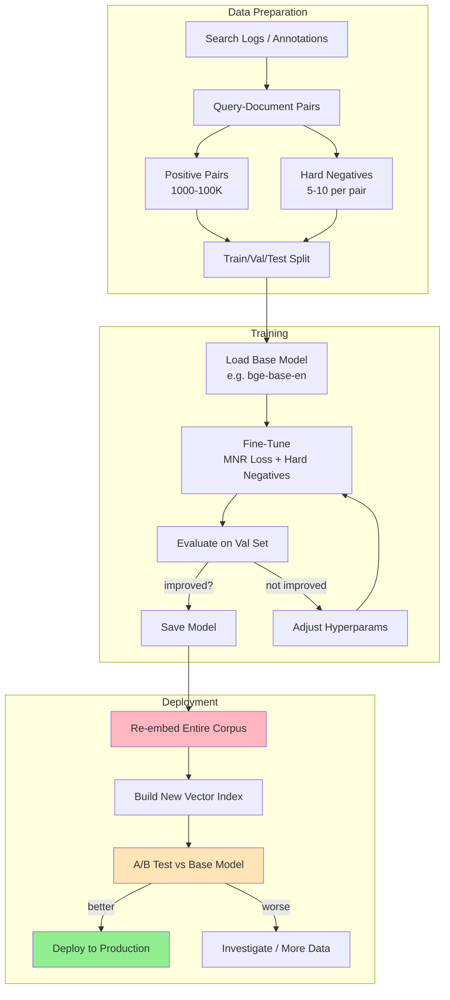

# Embedding Fine-Tuning

## Why Fine-Tune Embeddings?

General-purpose embedding models are trained on broad internet text.
They encode GENERAL similarity. But your domain may have DIFFERENT similarity judgments.

```
General model:
  "Java" similar to → "coffee", "Indonesia", "programming"

Your software engineering domain:
  "Java" similar to → "JVM", "Spring Boot", "Kotlin" (NOT coffee!)

General model:
  "breach" similar to → "break", "gap", "opening"

Your legal domain:
  "breach" similar to → "violation", "non-compliance", "default"
```

Fine-tuning teaches the model YOUR domain's notion of similarity.

---

## When to Fine-Tune

### Signs You Need Fine-Tuning

1. **Domain-specific vocabulary**
   ```
   Medical: "MI" = myocardial infarction (not "Michigan")
   Finance: "bull" = market trend (not animal)
   Legal: "consideration" = contractual element (not "thinking about")
   ```

2. **Different similarity judgments**
   ```
   In general: "Apple" ↔ "Microsoft" = somewhat similar (tech companies)
   In your app: "Apple M2" ↔ "ARM architecture" = very similar (chip design)
   ```

3. **Poor retrieval on domain eval**
   ```
   If recall@10 < 80% on your golden test set,
   fine-tuning typically improves by 5-15%
   ```

4. **Hybrid search outperforms pure vector search significantly**
   ```
   If BM25 beats your embeddings on domain queries,
   the embeddings don't understand your terminology
   ```

### When NOT to Fine-Tune

- General Q&A (Wikipedia-style) → base models work well
- Very small corpus (< 1000 docs) → not enough data
- Query types change frequently → model can't adapt fast enough
- Budget doesn't allow reindexing → new model requires re-embedding everything

---

## Training Data for Embedding Fine-Tuning

### What You Need

**Positive pairs**: (query, relevant_document) — things that SHOULD be similar

```json
{"query": "how to handle null pointer exceptions",
 "positive": "NullPointerException occurs when you try to use a reference that points to no location in memory. To fix: add null checks, use Optional, or validate inputs."}
```

**Hard negatives**: (query, close_but_irrelevant) — most valuable training signal

```json
{"query": "how to handle null pointer exceptions",
 "hard_negative": "Pointer arithmetic in C allows you to navigate memory addresses. Use the dereference operator * to access values."}
```

This is "hard" because it's about pointers (related topic) but doesn't answer the query.
The model must learn the DIFFERENCE between related and relevant.

### Data Sources

| Source | Quality | Effort |
|--------|---------|--------|
| User search logs + clicks | Best | Low (if you have traffic) |
| Expert annotations | Excellent | High (expensive) |
| LLM-generated pairs | Good | Medium |
| Existing FAQ/docs | Good | Low |
| Cross-encoder labels | Very good | Medium |

### Generating Training Data with LLMs

```python
prompt = """
Given this document, generate 3 questions that this document answers:

Document: {document_text}

Questions:
"""

# For each document → generate queries → (query, document) = positive pair
# For hard negatives: use BM25 to find similar-but-irrelevant documents
```

### Minimum Data Requirements

```
Minimum viable: 1,000 positive pairs
Good quality:   10,000 positive pairs
Best results:   50,000-100,000 positive pairs

Hard negatives: 5-10 per positive pair (most impactful for quality)
```

---

## Fine-Tuning Approaches

### 1. Contrastive Learning (InfoNCE Loss)

Push positives together, push negatives apart:

```python
# For a batch of (query, positive, negative1, negative2, ...)
def info_nce_loss(query_emb, positive_emb, negative_embs, temperature=0.05):
    # Similarity with positive
    pos_sim = cosine_similarity(query_emb, positive_emb) / temperature
    
    # Similarities with negatives
    neg_sims = [cosine_similarity(query_emb, neg) / temperature 
                for neg in negative_embs]
    
    # Loss: maximize positive similarity relative to negatives
    all_sims = [pos_sim] + neg_sims
    loss = -pos_sim + log(sum(exp(s) for s in all_sims))
    return loss
```

### 2. Triplet Loss

```python
# (anchor, positive, negative) → anchor should be closer to positive
def triplet_loss(anchor, positive, negative, margin=0.2):
    pos_dist = distance(anchor, positive)
    neg_dist = distance(anchor, negative)
    loss = max(0, pos_dist - neg_dist + margin)
    return loss
```

### 3. Multiple Negatives Ranking Loss (Most Popular)

```python
# In a batch of N pairs, each positive becomes a negative for other queries
# Very efficient: N positives give you N×(N-1) negative pairs for free

# Batch: [(q1, d1), (q2, d2), (q3, d3), ...]
# For q1: d1 is positive, d2 and d3 are negatives (in-batch negatives)
# For q2: d2 is positive, d1 and d3 are negatives
# For q3: d3 is positive, d1 and d2 are negatives

from sentence_transformers import losses
loss = losses.MultipleNegativesRankingLoss(model)
```

---

## Fine-Tuning with Sentence-Transformers

The most accessible way to fine-tune embeddings:

```python
from sentence_transformers import SentenceTransformer, InputExample, losses
from torch.utils.data import DataLoader

# 1. Load base model
model = SentenceTransformer('BAAI/bge-base-en-v1.5')

# 2. Prepare training data
train_examples = [
    InputExample(texts=["query text", "positive document"]),
    InputExample(texts=["query text", "positive document"]),
    # ... thousands of pairs
]

train_dataloader = DataLoader(train_examples, shuffle=True, batch_size=32)

# 3. Define loss (Multiple Negatives Ranking is most effective)
train_loss = losses.MultipleNegativesRankingLoss(model)

# 4. Train
model.fit(
    train_objectives=[(train_dataloader, train_loss)],
    epochs=3,
    warmup_steps=100,
    output_path="./fine-tuned-model",
    show_progress_bar=True,
)

# 5. Use fine-tuned model
model = SentenceTransformer('./fine-tuned-model')
embeddings = model.encode(["your domain text"])
```

### With Hard Negatives (Better Results)

```python
from sentence_transformers import InputExample
from sentence_transformers.losses import TripletLoss

# Triplet format: (anchor, positive, negative)
train_examples = [
    InputExample(texts=[
        "null pointer exception handling",           # query
        "To fix NPE, add null checks before use",   # positive
        "Pointer arithmetic in C is powerful"        # hard negative
    ]),
    # ... more triplets
]

train_loss = TripletLoss(model)
```

---

## Fine-Tuning with OpenAI (Coming)

OpenAI has announced custom embedding fine-tuning (limited availability):

```python
# Upload training file
# Format: {"prompt": "query", "completion": "relevant document"}
training_file = client.files.create(
    file=open("training_pairs.jsonl", "rb"),
    purpose="fine-tune"
)

# Create fine-tuning job
job = client.fine_tuning.jobs.create(
    training_file=training_file.id,
    model="text-embedding-3-small",
    hyperparameters={"n_epochs": 3}
)

# Use custom model
response = client.embeddings.create(
    model="ft:text-embedding-3-small:your-org:custom-name:id",
    input="domain-specific query"
)
```

---

## Evaluation After Fine-Tuning

### Build a Golden Test Set

```python
# 100-500 (query, relevant_documents) pairs that you KNOW are correct
# These should NOT be in your training data

golden_set = [
    {"query": "how to fix memory leak in Java",
     "relevant_docs": ["doc_id_45", "doc_id_892", "doc_id_1203"]},
    # ...
]
```

### Metrics

```python
def evaluate(model, golden_set, corpus, k=10):
    recall_scores = []
    mrr_scores = []
    
    for item in golden_set:
        query_emb = model.encode(item["query"])
        results = vector_search(query_emb, corpus, top_k=k)
        retrieved_ids = [r.id for r in results]
        
        # Recall@K: what fraction of relevant docs were retrieved?
        relevant = set(item["relevant_docs"])
        retrieved = set(retrieved_ids)
        recall = len(relevant & retrieved) / len(relevant)
        recall_scores.append(recall)
        
        # MRR: how high is the first relevant result?
        for rank, doc_id in enumerate(retrieved_ids, 1):
            if doc_id in relevant:
                mrr_scores.append(1.0 / rank)
                break
        else:
            mrr_scores.append(0.0)
    
    return {
        "recall@10": mean(recall_scores),
        "mrr@10": mean(mrr_scores),
    }
```

### Expected Improvements

```
Typical results after fine-tuning:

Metric          | Base Model | Fine-Tuned | Improvement
----------------|-----------|------------|------------
Recall@10       | 72%       | 85%        | +13%
MRR@10          | 0.45      | 0.62       | +0.17
NDCG@10         | 0.51      | 0.67       | +0.16

Note: improvements are HIGHLY domain-dependent.
Specialized domains (medical, legal) see larger gains.
General domains see smaller gains.
```

### A/B Testing in Production

```python
# Route 50% of traffic to base model, 50% to fine-tuned
# Measure: click-through rate, time-to-answer, user satisfaction

if user_id % 2 == 0:
    results = search_with_model("base")
else:
    results = search_with_model("fine-tuned")

log_metrics(user_id, model_variant, results, user_engagement)
```

---

## Common Pitfalls

### 1. Overfitting to Training Queries

```
Problem: model works great on training-like queries, fails on new ones
Solution: diverse training data, early stopping, validation set monitoring
```

### 2. Catastrophic Forgetting

```
Problem: fine-tuned model loses general language understanding
Solution: mix domain pairs with general pairs (80/20 ratio)
```

### 3. Not Enough Hard Negatives

```
Problem: model only learns obvious distinctions
Solution: mine hard negatives using BM25 or the base model itself
  - Retrieve top-50 with BM25
  - Remove actually relevant ones
  - Remaining are hard negatives
```

### 4. Forgetting to Re-embed

```
Problem: fine-tune model, but corpus still has OLD embeddings
Solution: ALWAYS re-embed entire corpus after fine-tuning
  - Old embeddings + new model = meaningless similarities
```

---

## Embedding Fine-Tuning Pipeline



---

## Summary

Embedding fine-tuning is the most impactful improvement you can make when:
- Your domain has specialized vocabulary
- General embeddings give mediocre recall on your data
- You have (or can generate) training pairs

Key takeaways:
1. **Hard negatives are the secret** — most improvement comes from teaching what's NOT similar
2. **Multiple Negatives Ranking Loss** is the go-to training objective
3. **Always evaluate on held-out data** — fine-tuning can overfit
4. **Re-embed everything** after fine-tuning (old vectors are incompatible)
5. **A/B test** before committing to the fine-tuned model in production
