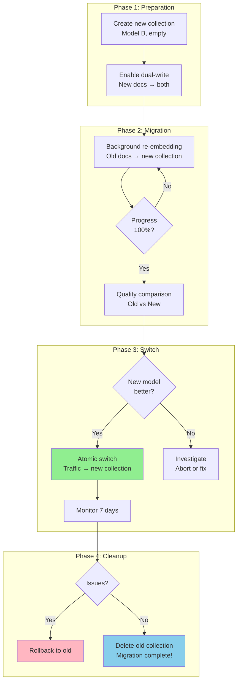

# Embedding Versioning and Migration

## The Versioning Problem

When you change embedding models, **ALL existing vectors become invalid**.

```
Model A produces vectors in "space A":
  "machine learning" → [0.12, -0.34, 0.56, ...]  (in space A)

Model B produces vectors in "space B":
  "machine learning" → [0.45, 0.23, -0.78, ...]  (in space B)

cosine_similarity(space_A_vector, space_B_vector) = MEANINGLESS
```

You CANNOT:
- Mix old vectors (model A) with new vectors (model B) in the same index
- Search old vectors with a new model's query embedding
- Gradually replace vectors one-by-one (breaks consistency)

You MUST re-embed EVERYTHING when changing models.

---

## Why Embedding Migration is Hard

### Scale

```
10M documents × $0.00002 per embedding = $200 per full re-embed
10M documents at 3000 embeddings/sec = 56 minutes (with parallelism)
10M documents × 6KB per vector = 60GB of vectors to replace

100M documents: $2000, 9 hours, 600GB
1B documents: $20,000, 4 days, 6TB
```

### Downtime Risk

```
Naive approach:
1. Stop serving search
2. Re-embed all documents
3. Rebuild index
4. Resume serving

Downtime: minutes (small) to DAYS (large corpus)
Unacceptable for production systems.
```

### Quality Uncertainty

```
New model might be:
  - Better overall BUT worse for YOUR specific queries
  - Better for English BUT worse for multilingual
  - Better for short text BUT worse for long documents

You won't know until you test with YOUR data.
```

---

## Migration Strategies

### Strategy 1: Big Bang

Re-embed everything, swap atomically.

```
Timeline:
  Day 0: Start re-embedding into NEW collection
  Day 1-3: All documents re-embedded
  Day 3: Rebuild ANN index
  Day 3: Atomic swap (point search to new collection)
  Day 4: Verify quality
  Day 7: Delete old collection

During migration: search uses OLD collection (no disruption)
At swap: instant cutover to NEW collection
```

**Pros**: Clean, simple, no compatibility issues
**Cons**: Double storage during transition, delayed availability of new model

### Strategy 2: Blue-Green

Two parallel collections, traffic switches when ready.

```
┌────────────────────┐    ┌────────────────────┐
│  BLUE (active)     │    │  GREEN (standby)   │
│  Model A vectors   │    │  Model B vectors   │
│  Serving traffic   │    │  Being populated   │
└────────────────────┘    └────────────────────┘
        │                          │
        │ ← search traffic         │ ← background re-embedding
        │                          │
   After green is ready:
        │                          │
        │                          │ ← search traffic (switched!)
        │ ← keep as fallback       │
```

**Pros**: Zero downtime, instant rollback, can compare quality
**Cons**: Double storage, double compute during transition

### Strategy 3: Incremental

Re-embed in background, serve from whichever version is available.

```python
def search(query):
    query_vec_a = model_a.embed(query)  # old model
    query_vec_b = model_b.embed(query)  # new model
    
    results_a = search_collection_a(query_vec_a)  # old vectors
    results_b = search_collection_b(query_vec_b)  # new vectors (partial)
    
    # Merge results (complex: different score distributions!)
    return merge_and_deduplicate(results_a, results_b)
```

**Pros**: Gradual, low risk, no big-bang moment
**Cons**: Complex routing, inconsistent quality during transition, score normalization

### Strategy 4: Dual-Write

New documents go to BOTH collections immediately.

```python
def index_document(doc):
    # Write to old collection (for continuity)
    vec_a = model_a.embed(doc.text)
    collection_a.upsert(doc.id, vec_a)
    
    # Write to new collection (for future)
    vec_b = model_b.embed(doc.text)
    collection_b.upsert(doc.id, vec_b)

# Background job: re-embed old documents into collection B
def background_migration():
    for doc in get_unmigrated_documents():
        vec_b = model_b.embed(doc.text)
        collection_b.upsert(doc.id, vec_b)
        mark_migrated(doc.id)
```

**Pros**: New content immediately in both, smooth transition
**Cons**: Extra compute for dual embedding, old content takes time

---

## Zero-Downtime Migration Playbook

The recommended approach for production systems:

### Step 1: Create New Collection

```python
# Create collection with new model's dimensions
new_collection = vector_db.create_collection(
    name="documents_v2",
    dimension=1536,  # new model's dimensions
    metric="cosine",
    metadata={"model": "text-embedding-3-large", "version": "2024-01"}
)
```

### Step 2: Start Dual-Write

```python
# All new documents go to BOTH collections
def index_new_document(doc):
    # Old collection (model A)
    vec_a = model_a.embed(doc.text)
    old_collection.upsert(doc.id, vec_a, doc.metadata)
    
    # New collection (model B)
    vec_b = model_b.embed(doc.text)
    new_collection.upsert(doc.id, vec_b, doc.metadata)
```

### Step 3: Background Re-Embedding

```python
import asyncio
from datetime import datetime

async def migrate_batch(batch, model_b, new_collection):
    texts = [doc.text for doc in batch]
    vectors = await model_b.embed_batch(texts)
    await new_collection.upsert_batch(
        ids=[doc.id for doc in batch],
        vectors=vectors
    )

async def run_migration(batch_size=100):
    total = await get_document_count()
    migrated = 0
    
    async for batch in get_documents_in_batches(batch_size):
        await migrate_batch(batch, model_b, new_collection)
        migrated += len(batch)
        
        # Rate limit to avoid overloading embedding API
        await asyncio.sleep(0.1)
        
        if migrated % 10000 == 0:
            print(f"Progress: {migrated}/{total} ({migrated/total*100:.1f}%)")
```

### Step 4: Monitor Quality

```python
def compare_quality(test_queries, golden_answers):
    """Compare search quality between old and new collections."""
    results = []
    
    for query, expected in zip(test_queries, golden_answers):
        # Search old collection
        vec_a = model_a.embed(query)
        old_results = old_collection.search(vec_a, top_k=10)
        old_recall = compute_recall(old_results, expected)
        
        # Search new collection
        vec_b = model_b.embed(query)
        new_results = new_collection.search(vec_b, top_k=10)
        new_recall = compute_recall(new_results, expected)
        
        results.append({"query": query, "old": old_recall, "new": new_recall})
    
    avg_old = mean([r["old"] for r in results])
    avg_new = mean([r["new"] for r in results])
    
    print(f"Old model recall@10: {avg_old:.3f}")
    print(f"New model recall@10: {avg_new:.3f}")
    print(f"Improvement: {avg_new - avg_old:+.3f}")
    
    return avg_new >= avg_old  # True if new is better
```

### Step 5: Atomic Switch

```python
def switch_to_new_collection():
    """Switch search traffic from old to new collection."""
    # Verify new collection is complete
    old_count = old_collection.count()
    new_count = new_collection.count()
    
    if new_count < old_count * 0.99:
        raise Exception(f"New collection incomplete: {new_count}/{old_count}")
    
    # Atomic switch (update config/feature flag)
    config.set("active_collection", "documents_v2")
    config.set("active_model", "text-embedding-3-large")
    
    print(f"Switched to new collection at {datetime.now()}")
```

### Step 6: Keep Fallback

```python
# Keep old collection for 7 days as fallback
# Monitor error rates, quality metrics, user complaints
# If something goes wrong: revert config to old collection

def rollback():
    config.set("active_collection", "documents_v1")
    config.set("active_model", "text-embedding-ada-002")
    alert("Rolled back to old embedding model!")
```

### Step 7: Decommission

```python
# After 7 days with no issues
def decommission_old():
    old_collection.delete()
    print("Old collection decommissioned")
```

---

## Embedding Version Registry

Track all embedding models and their usage:

```python
EMBEDDING_REGISTRY = {
    "v1": {
        "model": "text-embedding-ada-002",
        "dimensions": 1536,
        "provider": "openai",
        "deployed_date": "2023-06-15",
        "retired_date": "2024-03-01",
        "collections": [],  # no longer in use
        "mteb_score": 61.0,
    },
    "v2": {
        "model": "text-embedding-3-small",
        "dimensions": 1536,
        "provider": "openai",
        "deployed_date": "2024-03-01",
        "retired_date": None,  # currently active
        "collections": ["documents_prod", "faq_prod"],
        "mteb_score": 62.3,
    },
    "v3": {
        "model": "text-embedding-3-large",
        "dimensions": 3072,
        "provider": "openai",
        "deployed_date": None,  # planned
        "retired_date": None,
        "collections": ["documents_staging"],
        "mteb_score": 64.6,
        "migration_status": "in_progress",  # pending | in_progress | complete
        "migration_progress": 0.45,  # 45% re-embedded
    },
}
```

### What to Track

| Field | Why |
|-------|-----|
| Model name + version | Identify exactly which model |
| Dimensions | Know vector sizes for storage planning |
| Training date | Know if model might be outdated |
| MTEB/benchmark scores | Compare quality objectively |
| Collections using it | Know what's affected by changes |
| Migration status | Track ongoing migrations |
| Recall on your eval set | YOUR quality metric (not just benchmarks) |

---

## Cost of Migration

### Compute Cost (Embedding API)

```
OpenAI text-embedding-3-small: $0.02 per 1M tokens
Average document: 500 tokens

10M documents:
  10M × 500 tokens = 5B tokens
  5B / 1M × $0.02 = $100

100M documents:
  100M × 500 tokens = 50B tokens
  50B / 1M × $0.02 = $1,000
```

### Time Cost

```
OpenAI rate limits: ~3000 embeddings/second (with batching)

10M documents:
  10M / 3000 = 55 minutes (single-threaded)
  With 5 parallel workers: ~11 minutes

100M documents:
  100M / 3000 = 9.3 hours (single-threaded)
  With 10 parallel workers: ~56 minutes
```

### Storage Cost (During Transition)

```
10M documents × 1536 dims × 4 bytes = 60GB per collection
During blue-green: 2 × 60GB = 120GB

At $0.10/GB/month (cloud vector DB):
  Extra cost during migration: $6/month
  Duration: ~1 week
  Actual extra cost: ~$1.50
```

### Total Migration Cost (10M docs)

```
Embedding API:     $100
Extra storage:     $1.50
Engineering time:  4-8 hours (setup, monitoring, verification)
Risk:              Low (with blue-green + rollback)

Total: ~$100 + engineering time
```

---

## Blue-Green Embedding Migration



---

## Common Migration Mistakes

### 1. Not Testing with YOUR Queries

```
"Model B has higher MTEB score, so it must be better"
→ WRONG. Test with YOUR actual queries on YOUR data.
→ MTEB is a benchmark average; your domain may differ.
```

### 2. Mixing Vector Spaces

```
"We'll just start using the new model for new documents"
→ WRONG. Old vectors (model A) and new vectors (model B) can't coexist
→ Query embedded with model B won't find model A documents
```

### 3. No Rollback Plan

```
"We'll switch and see how it goes"
→ DANGEROUS. Keep old collection for at least 7 days.
→ If quality drops, you need instant rollback.
```

### 4. Underestimating Time

```
"It's just re-embedding, should take an hour"
→ WRONG. Consider: rate limits, retries, validation, index rebuild.
→ Plan for 2-3x the theoretical minimum time.
```

---

## Summary

Embedding migration is an operational challenge, not a technical one:

1. **Plan for it** — treat embedding model changes like database migrations
2. **Blue-green is safest** — parallel collections with atomic switch
3. **Always test quality** before switching, using YOUR queries
4. **Budget time and money** — re-embedding isn't free
5. **Keep rollback** — things can go wrong that benchmarks don't predict
6. **Track versions** — know exactly which model powers which collection

The best architecture makes migration a routine operation, not a crisis.
