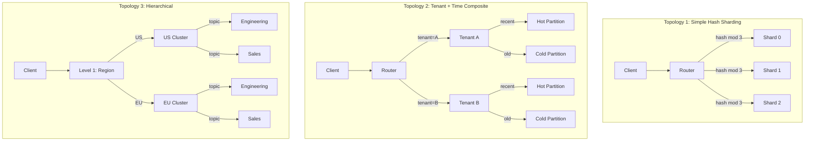
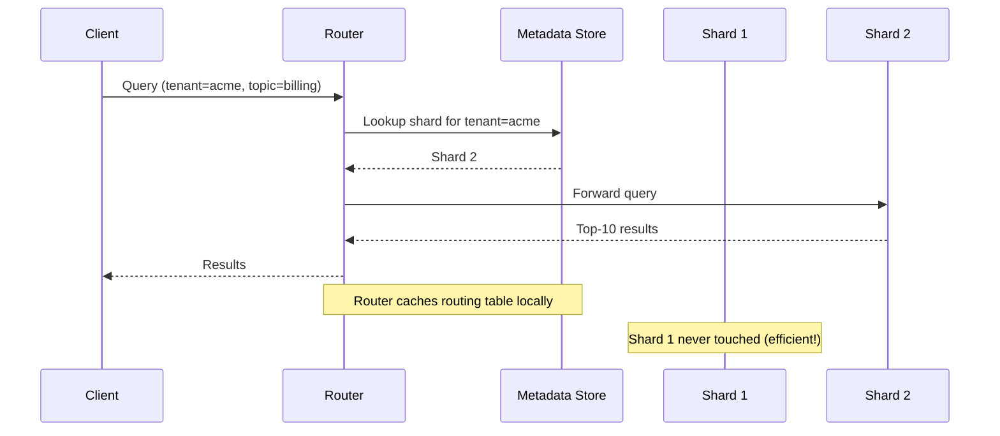

# Sharding Fundamentals for AI Systems

## What is Sharding?

### The "Library Branches" Analogy

Imagine a city library with 10 million books. One building can't hold them all efficiently:
- Shelves overflow, finding books takes forever
- Too many visitors crowd a single location
- If the building floods, ALL books are lost

**Solution**: Split books across multiple branch libraries:
- Branch A: Science & Engineering books
- Branch B: Literature & Arts books
- Branch C: History & Social Sciences
- Branch D: Recent publications (last 2 years)

Each branch is a **shard** — an independent subset of the total data that can be searched independently.

### Sharding for AI/Vector Databases

In AI systems, sharding means splitting your vector collection across multiple independent storage units (nodes, servers, or logical partitions).

```
Without Sharding:
┌─────────────────────────────────────┐
│   Single Node: 1 Billion Vectors    │
│   Memory: 6TB needed                │
│   Latency: 500ms+ per query         │
│   Risk: Single point of failure     │
└─────────────────────────────────────┘

With Sharding (50 shards):
┌──────────┐ ┌──────────┐ ┌──────────┐
│ Shard 1  │ │ Shard 2  │ │ Shard 3  │ ... × 50
│ 20M vecs │ │ 20M vecs │ │ 20M vecs │
│ 120GB    │ │ 120GB    │ │ 120GB    │
│ P95: 20ms│ │ P95: 20ms│ │ P95: 20ms│
└──────────┘ └──────────┘ └──────────┘
```

---

## Why Shard: The Inevitability at Scale

### Single-Node Limits

| Resource        | Single Node Max  | Real Requirement  | Gap       |
|----------------|-----------------|-------------------|-----------|
| Memory         | 512GB–2TB       | 6TB+ for 1B vecs | 3-12x     |
| HNSW index     | ~10M vectors    | 1B vectors        | 100x      |
| Query throughput| ~1000 QPS       | 50,000 QPS        | 50x       |
| Availability   | Single failure  | 99.99% uptime     | Impossible|

### Benefits of Sharding

1. **Horizontal scalability**: Add shards as data grows
2. **Lower latency**: Search 10M vectors instead of 1B
3. **Higher throughput**: Parallel queries across shards
4. **Fault isolation**: One shard failure ≠ total outage
5. **Cost efficiency**: Different hardware per shard (hot vs cold)

---

## Sharding Dimensions for Vector Databases

### 1. By Tenant (Customer Isolation)

```
┌─────────────────────────────────────────┐
│              Shard Router                │
├─────────────┬──────────────┬────────────┤
│  Shard: Acme│  Shard: Beta │ Shard: Corp│
│  500K vecs  │  2M vecs     │ 100K vecs  │
│  Isolated   │  Isolated    │ Isolated   │
└─────────────┴──────────────┴────────────┘
```

**When to use**: Multi-tenant SaaS where data isolation is required
**Pros**: Perfect isolation, easy compliance, no cross-contamination
**Cons**: Uneven shard sizes, small tenants waste resources

### 2. By Topic/Domain

```
┌──────────────────────────────────────────┐
│               Topic Router               │
├────────────┬─────────────┬───────────────┤
│Engineering │   Sales     │   Legal       │
│  Docs      │   Docs      │   Docs        │
│ 3M vectors │ 1M vectors  │ 500K vectors  │
└────────────┴─────────────┴───────────────┘
```

**When to use**: Enterprise RAG with distinct document categories
**Pros**: Query routing by topic (most queries hit 1 shard)
**Cons**: Topic classification needed, cross-topic queries expensive

### 3. By Hash (Uniform Distribution)

```python
shard_id = hash(document_id) % num_shards
```

**When to use**: No natural partitioning key, want even distribution
**Pros**: Perfectly balanced shards, no hot spots
**Cons**: Every query hits ALL shards (no routing optimization)

### 4. By Time (Temporal Partitioning)

```
┌────────────┬────────────┬────────────┬────────────┐
│  2024-Q4   │  2024-Q3   │  2024-Q2   │  Older     │
│  Hot/Fast  │  Warm      │  Warm      │  Cold      │
│  In-Memory │  SSD       │  SSD       │  Archive   │
└────────────┴────────────┴────────────┴────────────┘
```

**When to use**: Time-series data, news, chat history, logs
**Pros**: Natural tiering, old shards become read-only (easy to manage)
**Cons**: Recent shard becomes hot spot for writes

### 5. By Size (Tenant-Size-Based)

```
Small Tenants (< 100K vectors) → Shared Shards (multi-tenant)
Medium Tenants (100K–5M vectors) → Dedicated Shard
Large Tenants (> 5M vectors) → Multiple Dedicated Shards
```

**When to use**: Mixed-size multi-tenant platforms
**Pros**: Cost-efficient for small tenants, performance for large ones
**Cons**: Complex routing logic, migration when tenants grow

---

## Shard Key Selection: The Most Important Decision

### What Makes a Good Shard Key?

A good shard key ensures **most queries hit only ONE shard** (no scatter-gather).

```
GOOD: Shard by tenant_id
  Query: "Find docs for Acme Corp about billing"
  → Route to Acme shard ONLY ✓ (fast, efficient)

BAD: Shard by random hash of document content
  Query: "Find docs for Acme Corp about billing"  
  → Must query ALL shards ✗ (slow, expensive)
```

### Decision Matrix for Shard Key Selection

| Factor                    | Weight | tenant_id | topic | hash  | time  |
|--------------------------|--------|-----------|-------|-------|-------|
| Query locality           | HIGH   | ★★★★★    | ★★★★  | ★     | ★★★   |
| Even distribution        | MED    | ★★        | ★★★   | ★★★★★ | ★★★  |
| Write scalability        | MED    | ★★★★     | ★★★   | ★★★★★ | ★★   |
| Operational simplicity   | LOW    | ★★★★     | ★★★   | ★★★★★ | ★★★  |
| Data isolation           | HIGH   | ★★★★★    | ★★    | ★     | ★★   |

### Common Mistakes

1. **Sharding by embedding dimension** — Never do this; splits individual vectors
2. **Too many shards** — Overhead exceeds benefit (< 1M vectors? don't shard)
3. **Immutable shard key** — Choose a key you won't need to change
4. **Ignoring query patterns** — Shard for HOW data is queried, not how it's stored

---

## Key Metrics Per Shard

### Health Metrics

```yaml
per_shard_metrics:
  queries_per_second: 
    healthy: < 500 QPS
    warning: 500-800 QPS
    critical: > 800 QPS
  
  vector_count:
    healthy: < 8M
    warning: 8M-10M
    critical: > 10M (HNSW)
  
  p95_latency_ms:
    healthy: < 30ms
    warning: 30-50ms
    critical: > 50ms
  
  memory_usage_percent:
    healthy: < 70%
    warning: 70-85%
    critical: > 85%
  
  disk_usage_percent:
    healthy: < 60%
    warning: 60-80%
    critical: > 80%
```

### Capacity Planning Per Shard

| Index Type | Vectors/Shard | Memory/Shard | P95 Latency | Use Case |
|-----------|--------------|--------------|-------------|----------|
| HNSW      | 5-10M        | 60-120GB     | < 20ms      | Real-time |
| IVF       | 50-100M      | 20-50GB      | < 50ms      | Batch/cost |
| Flat      | < 50K        | < 1GB        | < 5ms       | Small/exact|
| DiskANN   | 100-500M     | 10-30GB+disk | < 30ms      | Billion-scale|

### Calculating Shard Capacity

```python
# Example: 1536-dim vectors, float32
vector_size = 1536 * 4  # 6,144 bytes per vector
hnsw_overhead = 1.5     # HNSW graph overhead

# For 10M vectors per shard:
raw_data = 10_000_000 * 6_144           # ~60 GB
with_index = raw_data * hnsw_overhead   # ~90 GB
with_metadata = with_index * 1.2        # ~108 GB

# Need: 128GB RAM node minimum per shard
```

---

## Sharding Topologies



---

## Shard Routing Architecture



---

## When NOT to Shard

Sharding adds complexity. Don't shard if:

1. **< 1M vectors**: A single node handles this easily
2. **Single-tenant application**: No isolation needs
3. **Low QPS (< 100)**: Single node can handle the load
4. **No growth expected**: Premature optimization
5. **Team lacks operational capacity**: Sharding requires monitoring, rebalancing

### Decision Flowchart

```
Vectors > 10M? ─── No ──→ Don't shard (single node)
       │
      Yes
       │
Multi-tenant? ─── Yes ──→ Shard by tenant_id
       │
      No
       │
Clear topic split? ─── Yes ──→ Shard by topic
       │
      No
       │
Time-based access? ─── Yes ──→ Shard by time
       │
      No
       │
Hash shard (uniform distribution)
```

---

## Summary

| Concept | Key Takeaway |
|---------|-------------|
| Shard key | Choose based on query patterns, not data structure |
| Capacity | 5-10M vectors per HNSW shard, 50-100M per IVF shard |
| Goal | Most queries hit ≤ 1-2 shards |
| When | > 10M vectors OR multi-tenant OR high availability needed |
| Avoid | Sharding too early, wrong shard key, too many small shards |
