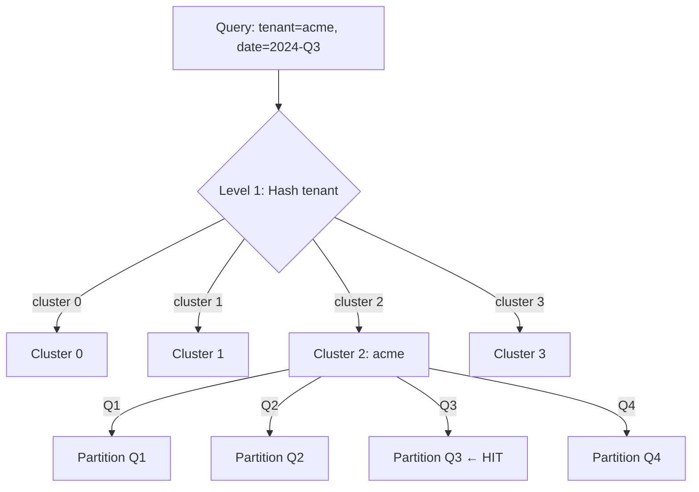
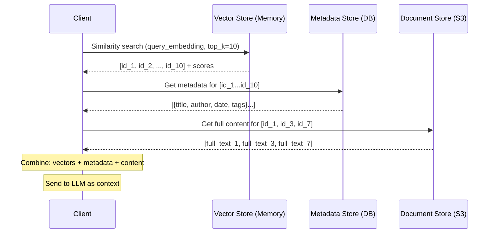
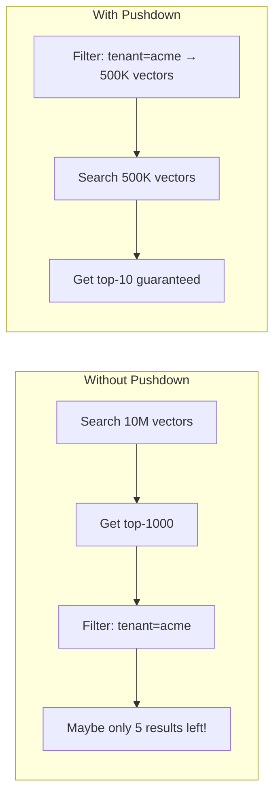
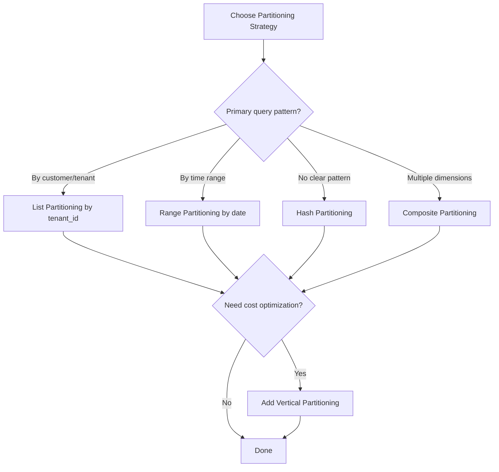

# Partitioning Strategies for AI Systems

## Horizontal Partitioning (Row-Based)

The most common approach for vector databases: split rows (vectors) across partitions.

---

### 1. Range-Based Partitioning

Split data based on a range of values in a partition key.

```
Partition Key: created_date

┌──────────────────┬──────────────────┬──────────────────┐
│   Partition 1    │   Partition 2    │   Partition 3    │
│ Jan 2024-Mar 2024│ Apr 2024-Jun 2024│ Jul 2024-Sep 2024│
│   2.5M vectors   │   3.1M vectors   │   1.8M vectors   │
└──────────────────┴──────────────────┴──────────────────┘
```

**Implementation:**
```python
def get_partition_range(document_date: datetime) -> int:
    """Range partition by quarter."""
    quarter = (document_date.month - 1) // 3
    year_offset = (document_date.year - 2024) * 4
    return year_offset + quarter

# Examples:
# 2024-02-15 → Partition 0 (2024-Q1)
# 2024-07-01 → Partition 2 (2024-Q3)
# 2025-01-10 → Partition 4 (2025-Q1)
```

**Pros:**
- Range queries are efficient (scan only relevant partitions)
- Natural for time-series data
- Old partitions become read-only (easy archival)

**Cons:**
- Uneven distribution (some ranges have more data)
- Hot partition problem (current time range gets all writes)
- Need to create new partitions as data grows

---

### 2. Hash-Based Partitioning

Apply a hash function to the partition key for uniform distribution.

```python
def get_partition_hash(document_id: str, num_partitions: int = 8) -> int:
    """Hash partition for uniform distribution."""
    hash_value = hashlib.md5(document_id.encode()).hexdigest()
    return int(hash_value, 16) % num_partitions

# Result: Perfectly balanced partitions
# Partition 0: 12.5% of data
# Partition 1: 12.5% of data
# ...
# Partition 7: 12.5% of data
```

**Pros:**
- Even distribution across all partitions
- No hot spots (writes spread uniformly)
- Simple to implement

**Cons:**
- Range queries impossible (must hit ALL partitions)
- Adding/removing partitions requires rehashing (data movement)
- No query locality (can't route to single partition)

---

### 3. List-Based Partitioning

Explicitly assign specific values to specific partitions.

```python
PARTITION_MAP = {
    "engineering": 0,
    "product": 0,
    "design": 0,
    "sales": 1,
    "marketing": 1,
    "support": 2,
    "legal": 3,
    "finance": 3,
    "hr": 3,
}

def get_partition_list(department: str) -> int:
    return PARTITION_MAP.get(department, 0)  # default to partition 0
```

**Pros:**
- Full control over data placement
- Logical grouping of related data
- Easy to understand and debug

**Cons:**
- Manual maintenance of mapping
- New values need explicit assignment
- Can become unbalanced as categories grow differently

---

### 4. Composite Partitioning

Combine multiple strategies for complex requirements.

```python
def get_partition_composite(tenant_id: str, created_date: datetime) -> tuple:
    """
    Two-level partitioning:
    Level 1: Hash on tenant_id → determines shard cluster
    Level 2: Range on date → determines partition within cluster
    """
    # Level 1: Which cluster (tenant isolation)
    cluster = hash(tenant_id) % 4
    
    # Level 2: Which partition within cluster (time-based)
    quarter = (created_date.month - 1) // 3
    partition = quarter
    
    return (cluster, partition)

# Example:
# tenant="acme", date=2024-07-15 → (cluster=2, partition=2)
# Query for acme in Q3 2024 → hits exactly ONE partition
```



---

## Vertical Partitioning for AI

### Separate Storage by Data Type

In AI systems, a single "document" has multiple representations:

```
┌─────────────────────────────────────────────────────────┐
│                    Full Document                         │
├──────────────┬───────────────────┬──────────────────────┤
│   Vectors    │    Metadata       │    Full Content      │
│  (1536 dims) │  (structured)     │  (raw text/images)   │
│              │                   │                      │
│  Storage:    │  Storage:         │  Storage:            │
│  In-Memory   │  PostgreSQL/      │  S3/Blob Storage     │
│  (fast)      │  Redis (indexed)  │  (cheap)             │
│              │                   │                      │
│  Size: 6KB   │  Size: ~500B      │  Size: ~50KB         │
│  per vector  │  per document     │  per document        │
└──────────────┴───────────────────┴──────────────────────┘
```

### Query-Time Join



### Why Vertical Partition?

| Layer | Size (10M docs) | Access Pattern | Storage Choice |
|-------|-----------------|---------------|----------------|
| Vectors | 60GB | Every query | In-memory HNSW |
| Metadata | 5GB | Every query (filters) | PostgreSQL/Redis |
| Full content | 500GB | Only for top results | Object storage |
| Thumbnails | 50GB | UI display | CDN/cache |

**Without vertical partitioning**: 615GB all in expensive fast storage
**With vertical partitioning**: 65GB in fast storage, 550GB in cheap storage

---

## Metadata Partitioning

### Which Metadata Fields to Index

**NOT all fields** — index based on query patterns:

```yaml
# Document metadata schema
document:
  id: string              # Always indexed (primary key)
  tenant_id: string       # INDEX: filtered in 100% of queries
  document_type: string   # INDEX: filtered in 70% of queries
  created_date: datetime  # INDEX: filtered in 40% of queries
  department: string      # INDEX: filtered in 30% of queries
  author: string          # SKIP: rarely filtered (< 5% of queries)
  word_count: int         # SKIP: never filtered
  language: string        # INDEX: filtered in 20% of queries
  tags: list[string]      # INDEX: filtered in 25% of queries
  
# Rule: Index fields filtered in > 10% of queries
# Cost: Each index adds ~10-20% write overhead
```

### Payload Indexes in Vector Databases

```python
# Qdrant example: creating payload indexes
from qdrant_client import QdrantClient
from qdrant_client.models import PayloadSchemaType

client = QdrantClient("localhost", port=6333)

# Create indexes on frequently filtered fields
client.create_payload_index(
    collection_name="documents",
    field_name="tenant_id",
    field_schema=PayloadSchemaType.KEYWORD,  # Exact match
)

client.create_payload_index(
    collection_name="documents",
    field_name="created_date",
    field_schema=PayloadSchemaType.DATETIME,  # Range queries
)

client.create_payload_index(
    collection_name="documents",
    field_name="document_type",
    field_schema=PayloadSchemaType.KEYWORD,  # Exact match
)
```

### Composite Filters

```python
# Query with composite filter
from qdrant_client.models import Filter, FieldCondition, MatchValue, Range

results = client.search(
    collection_name="documents",
    query_vector=query_embedding,
    query_filter=Filter(
        must=[
            FieldCondition(
                key="tenant_id",
                match=MatchValue(value="acme"),
            ),
            FieldCondition(
                key="document_type",
                match=MatchValue(value="technical"),
            ),
            FieldCondition(
                key="created_date",
                range=Range(gte="2024-01-01T00:00:00Z"),
            ),
        ]
    ),
    limit=10,
)
```

---

## Partition Pruning for AI Queries

### The Key Optimization

**Without pruning**: Search all partitions, filter results after
**With pruning**: Skip irrelevant partitions entirely, search only relevant ones

### Pruning Strategies

#### 1. Filter-Based Pruning

```python
def route_query(query_filters: dict, partition_metadata: dict) -> list:
    """Determine which partitions to search based on filters."""
    relevant_partitions = []
    
    for partition_id, metadata in partition_metadata.items():
        # Check if partition could contain matching documents
        if "tenant_id" in query_filters:
            if query_filters["tenant_id"] not in metadata["tenants"]:
                continue  # PRUNE: this partition has no docs for this tenant
        
        if "date_range" in query_filters:
            if metadata["max_date"] < query_filters["date_range"]["start"]:
                continue  # PRUNE: all docs in this partition are too old
            if metadata["min_date"] > query_filters["date_range"]["end"]:
                continue  # PRUNE: all docs in this partition are too new
        
        relevant_partitions.append(partition_id)
    
    return relevant_partitions

# Example: 20 partitions, query filter = tenant=acme + date > 2024-06
# Result: Only 2 partitions need to be searched (90% pruned!)
```

#### 2. Dynamic Pruning (Embedding-Based)

```python
def dynamic_prune(query_embedding, partition_centroids, threshold=0.3):
    """Skip partitions whose centroid is too far from query."""
    relevant = []
    for partition_id, centroid in partition_centroids.items():
        similarity = cosine_similarity(query_embedding, centroid)
        if similarity > threshold:
            relevant.append((partition_id, similarity))
    
    # Sort by similarity, search most relevant first
    relevant.sort(key=lambda x: x[1], reverse=True)
    return relevant

# Each partition stores its centroid (average of all vectors)
# If query is about "machine learning" and partition centroid
# is about "cooking recipes" → skip that partition
```

#### 3. Filter Pushdown

```
WITHOUT pushdown (slow):
1. Search ALL 10M vectors for nearest neighbors
2. Get top-1000 results
3. Filter by tenant_id = "acme"
4. Return top-10 from filtered results
Problem: Most of the 1000 results get discarded!

WITH pushdown (fast):
1. Filter to only acme's vectors (500K out of 10M)
2. Search only those 500K vectors
3. Return top-10
Benefit: Search space reduced by 95%!
```



---

## Partitioning Strategy Selection Guide



---

## Comparison Table

| Strategy | Query Locality | Distribution | Complexity | Best For |
|----------|---------------|--------------|------------|----------|
| Range | ★★★★ for range queries | Uneven | Low | Time-series, dates |
| Hash | ★ (scatter all) | Perfect | Low | No clear partition key |
| List | ★★★★★ for known values | Manual balance | Medium | Tenants, categories |
| Composite | ★★★★★ | Configurable | High | Enterprise multi-tenant |
| Vertical | N/A (different concern) | N/A | Medium | Cost optimization |

---

## Real-World Partitioning Examples

### Example 1: Multi-Tenant RAG Platform

```
Strategy: Composite (List by tenant + Range by date)

Large tenants (> 1M vectors):
  → Dedicated partition, sub-partitioned by quarter
  
Small tenants (< 100K vectors):
  → Shared partition (co-located for efficiency)
  → Metadata filter separates at query time

Partition layout:
  partition_acme_2024q3/     (dedicated, 2.1M vectors)
  partition_acme_2024q4/     (dedicated, 1.8M vectors)
  partition_shared_small_1/  (50 tenants, 800K vectors total)
  partition_shared_small_2/  (50 tenants, 750K vectors total)
```

### Example 2: E-Commerce Product Search

```
Strategy: List by category + Vertical split

Horizontal partitions:
  partition_electronics/  (5M product vectors)
  partition_clothing/     (3M product vectors)
  partition_home/         (2M product vectors)
  partition_other/        (1M product vectors)

Vertical split:
  Hot: product embeddings + key attributes (in-memory)
  Warm: full product descriptions (SSD)
  Cold: product images + reviews (object storage)
```

### Example 3: Code Search Engine

```
Strategy: Hash by repository + filter pushdown

Partitions (8 shards, hash by repo_id):
  Each shard: ~500K code snippet vectors
  
Query optimization:
  If user specifies repo → route to single shard
  If no repo specified → scatter-gather all 8 shards
  Filter pushdown: language, file_type, recency
```

---

## Anti-Patterns to Avoid

1. **Over-partitioning**: 1000 partitions for 1M vectors (overhead > benefit)
2. **Under-partitioning**: 1 partition for 100M vectors (defeats the purpose)
3. **Wrong partition key**: Partitioning by a field never used in queries
4. **No pruning**: Partitioned data but still scanning all partitions
5. **Ignoring vertical split**: Keeping full documents with vectors (wastes RAM)
6. **Static partitioning**: Never rebalancing as data distribution changes

---

## Summary

| Concept | Recommendation |
|---------|---------------|
| Default strategy | Composite (tenant + time) for multi-tenant AI |
| Vertical split | Always separate vectors, metadata, full content |
| Index metadata | Only fields filtered in > 10% of queries |
| Filter pushdown | Always apply filters BEFORE vector search |
| Partition pruning | Maintain partition-level metadata for routing |
| Partition count | 1 partition per 5-10M vectors (HNSW) |
