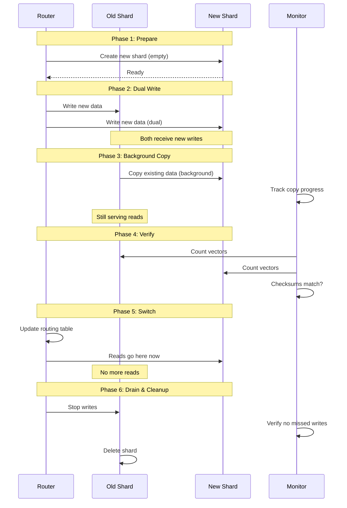

# Rebalancing Without Downtime

## The Problem: Data Grows Unevenly

In any sharded system, data distribution becomes uneven over time:

```
Initial State (balanced):
  Shard 1: 3.0M vectors (33%)
  Shard 2: 3.0M vectors (33%)
  Shard 3: 3.0M vectors (33%)

After 6 months (imbalanced):
  Shard 1: 8.5M vectors (57%) ← HOT, approaching limits
  Shard 2: 4.2M vectors (28%)
  Shard 3: 2.3M vectors (15%) ← underutilized
```

**Consequences of imbalance:**
- Hot shard: high latency, memory pressure, risk of OOM
- Cold shards: wasted resources (paying for unused capacity)
- Uneven load: some nodes saturated while others idle

---

## When to Rebalance

### Trigger Conditions

```yaml
rebalancing_triggers:
  memory_threshold:
    description: "Shard memory usage exceeds limit"
    trigger: memory_percent > 80%
    action: split_shard
    
  latency_threshold:
    description: "Shard P95 latency exceeds SLO"
    trigger: p95_latency > 50ms
    action: split_shard or move_partition
    
  size_imbalance:
    description: "Largest shard > 2x smallest shard"
    trigger: max_shard_size / min_shard_size > 2.0
    action: redistribute
    
  new_tenant:
    description: "Large tenant onboarded, needs isolation"
    trigger: new_tenant_size > 500K vectors
    action: create_dedicated_shard
    
  tenant_growth:
    description: "Tenant outgrew shared shard"
    trigger: tenant_vectors > shared_shard_capacity * 0.5
    action: move_to_dedicated_shard
```

### Decision Matrix

| Situation | Strategy | Data Movement | Risk |
|-----------|----------|--------------|------|
| One shard too large | Split | 50% of hot shard | Medium |
| Two shards too small | Merge | 100% of one shard | Low |
| Node failure recovery | Move | Entire shard to new node | High |
| General imbalance | Redistribute | 10-30% of data | Medium |
| New large tenant | Create | Extract tenant data | Low |

---

## Rebalancing Strategies

### 1. Split: Divide One Shard Into Two

```
BEFORE:
┌─────────────────────────────┐
│         Shard A             │
│      10M vectors            │
│    Memory: 95% used         │
│    Latency: 65ms P95        │
└─────────────────────────────┘

AFTER:
┌──────────────────┐ ┌──────────────────┐
│    Shard A       │ │    Shard A'      │
│   5M vectors     │ │   5M vectors     │
│  Memory: 48%     │ │  Memory: 48%     │
│  Latency: 22ms   │ │  Latency: 22ms   │
└──────────────────┘ └──────────────────┘
```

**Split criteria:**
- Range split: vectors with key < midpoint → A, key >= midpoint → A'
- Hash split: hash(id) % 2 == 0 → A, hash(id) % 2 == 1 → A'
- Tenant split: tenant X stays in A, tenant Y moves to A'

### 2. Merge: Combine Two Underutilized Shards

```
BEFORE:
┌──────────────┐ ┌──────────────┐
│   Shard B    │ │   Shard C    │
│  800K vectors│ │  600K vectors│
│ Memory: 8%   │ │ Memory: 6%   │
└──────────────┘ └──────────────┘

AFTER:
┌──────────────────────────────┐
│          Shard B             │
│       1.4M vectors           │
│       Memory: 14%            │
│  (Shard C deleted)           │
└──────────────────────────────┘
```

### 3. Move: Relocate Partition to Different Node

```
BEFORE: Node 1 overloaded, Node 3 has capacity

Node 1: [Shard A, Shard B, Shard C]  ← 90% CPU
Node 2: [Shard D, Shard E]           ← 60% CPU
Node 3: [Shard F]                     ← 30% CPU

AFTER: Move Shard C to Node 3

Node 1: [Shard A, Shard B]           ← 60% CPU
Node 2: [Shard D, Shard E]           ← 60% CPU
Node 3: [Shard F, Shard C]           ← 55% CPU
```

### 4. Redistribute: Spread Data Evenly

For hash-based systems with consistent hashing, redistribute by adjusting virtual node ownership.

---

## Zero-Downtime Rebalancing: Step by Step

### The Golden Rule

> **Never** stop serving queries. The system must remain fully available throughout the entire rebalancing process.

### Complete Process



### Detailed Steps

```python
class ZeroDowntimeRebalancer:
    def split_shard(self, shard_id: str, split_key):
        """Split a shard into two without downtime."""
        
        # Phase 1: Create new shard
        new_shard = self.create_shard(empty=True)
        print(f"[1/7] Created new shard: {new_shard.id}")
        
        # Phase 2: Enable dual-write
        self.router.add_dual_write(shard_id, new_shard.id, split_key)
        print(f"[2/7] Dual-write enabled")
        # New data with key >= split_key goes to BOTH shards
        
        # Phase 3: Background copy
        copied = 0
        for batch in self.get_vectors_to_move(shard_id, split_key):
            new_shard.insert(batch)
            copied += len(batch)
            # Throttle to avoid overloading
            time.sleep(0.1)
        print(f"[3/7] Background copy complete: {copied} vectors")
        
        # Phase 4: Verify
        old_count = self.count_vectors(shard_id, key_filter=f">= {split_key}")
        new_count = new_shard.count_vectors()
        assert old_count == new_count, "Count mismatch!"
        print(f"[4/7] Verification passed: {new_count} vectors")
        
        # Phase 5: Switch routing
        self.router.switch_reads(shard_id, new_shard.id, split_key)
        print(f"[5/7] Routing switched to new shard")
        
        # Phase 6: Stop dual-write, drain old shard
        self.router.remove_dual_write(shard_id, new_shard.id)
        time.sleep(5)  # Wait for in-flight requests
        print(f"[6/7] Dual-write stopped, draining")
        
        # Phase 7: Delete moved data from old shard
        self.delete_vectors(shard_id, key_filter=f">= {split_key}")
        print(f"[7/7] Cleanup complete")
        
        return new_shard
```

---

## Consistent Hashing for Auto-Rebalancing

### The Problem with Modular Hashing

```
hash(key) % N → partition

If N changes (add/remove node):
  hash("doc_123") % 3 = 1  (before)
  hash("doc_123") % 4 = 2  (after: DIFFERENT partition!)
  
Result: Almost ALL data needs to move! (catastrophic)
```

### Consistent Hashing Solution

```
Hash Ring (0 to 2^32):

        Node A (pos: 1000)
       /
      /
  ───●───────────────●─── Node B (pos: 5000)
  │                      │
  │    Hash Ring         │
  │                      │
  ───●───────────────●───
      \             /
       Node D      Node C
    (pos: 12000)  (pos: 8000)

Key assignment: Walk clockwise from hash(key) to find node
  hash("doc_1") = 3000 → Node B (next clockwise)
  hash("doc_2") = 9000 → Node D (next clockwise)
```

### Adding a Node (Minimal Data Movement)

```
Add Node E at position 6000:

Only data between Node B (5000) and Node E (6000) moves!
= ~1/N of total data (not all data)

Before: hash(key) in [5001, 8000] → Node C
After:  hash(key) in [5001, 6000] → Node E (moved)
        hash(key) in [6001, 8000] → Node C (stays)
```

### Virtual Nodes for Even Distribution

```python
class ConsistentHashRing:
    def __init__(self, nodes: list, virtual_nodes_per_node: int = 150):
        self.ring = {}
        self.sorted_keys = []
        
        for node in nodes:
            for i in range(virtual_nodes_per_node):
                virtual_key = f"{node}:vn{i}"
                hash_val = self._hash(virtual_key)
                self.ring[hash_val] = node
                self.sorted_keys.append(hash_val)
        
        self.sorted_keys.sort()
    
    def get_node(self, key: str) -> str:
        """Find which node owns this key."""
        hash_val = self._hash(key)
        # Binary search for next position clockwise
        idx = bisect.bisect_right(self.sorted_keys, hash_val)
        if idx == len(self.sorted_keys):
            idx = 0  # Wrap around
        return self.ring[self.sorted_keys[idx]]
    
    def _hash(self, key: str) -> int:
        return int(hashlib.md5(key.encode()).hexdigest(), 16)
```

**Why 150 virtual nodes?**
- Too few (10): uneven distribution (some nodes get 2x data)
- Too many (1000): memory overhead for ring
- Sweet spot (100-200): < 5% variance between nodes

---

## Monitoring During Rebalancing

### Key Metrics to Watch

```yaml
during_rebalancing:
  error_rate:
    acceptable: < 0.01%  # Same as normal
    alert: > 0.1%
    abort: > 1%
    
  latency_p95:
    acceptable: < 1.2x normal  # Allow 20% increase
    alert: > 1.5x normal
    abort: > 2x normal
    
  vector_count_drift:
    check_interval: 30s
    acceptable: source_count <= target_count + in_flight
    alert: drift > 1000 vectors
    abort: drift > 10000 vectors
    
  throughput:
    acceptable: > 80% of normal QPS capacity
    alert: < 60% normal
    abort: < 40% normal
```

### Rebalancing Dashboard

```
┌─────────────────────────────────────────────────────────┐
│  REBALANCING STATUS: Splitting Shard 3                  │
├─────────────────────────────────────────────────────────┤
│  Phase: Background Copy (3/7)                           │
│  Progress: ████████████░░░░ 72% (7.2M / 10M vectors)   │
│  Duration: 14 min elapsed, ~5 min remaining             │
│  Speed: 8,500 vectors/sec                               │
├─────────────────────────────────────────────────────────┤
│  Health Metrics:                                        │
│  Error rate:     0.003% ✓ (normal: 0.002%)             │
│  P95 latency:    28ms ✓ (normal: 24ms, +17%)          │
│  QPS capacity:   92% ✓ (normal: 100%)                  │
│  Vector drift:   0 ✓                                    │
├─────────────────────────────────────────────────────────┤
│  Shard Distribution:                                    │
│  Shard 1: ████████░░ 4.2M (28%)                        │
│  Shard 2: ██████░░░░ 3.1M (21%)                        │
│  Shard 3: ██████████ 5.0M (33%) → splitting            │
│  Shard 4: █████░░░░░ 2.8M (18%) ← new (receiving)     │
└─────────────────────────────────────────────────────────┘
```

---

## Rebalancing Automation

### Auto-Rebalance Policy

```python
class AutoRebalancePolicy:
    def __init__(self):
        self.check_interval = 300  # Check every 5 minutes
        self.cooldown = 3600       # Don't rebalance within 1 hour of last
        
    def evaluate(self, cluster_state: dict) -> list:
        """Determine if rebalancing is needed."""
        actions = []
        
        shards = cluster_state["shards"]
        avg_size = sum(s["vector_count"] for s in shards) / len(shards)
        
        for shard in shards:
            # Split if shard too large
            if shard["memory_percent"] > 80:
                actions.append(("SPLIT", shard["id"], "memory_pressure"))
            elif shard["p95_latency_ms"] > 50:
                actions.append(("SPLIT", shard["id"], "latency_slo"))
            elif shard["vector_count"] > avg_size * 2:
                actions.append(("SPLIT", shard["id"], "size_imbalance"))
        
        # Merge if two shards very small
        small_shards = [s for s in shards if s["vector_count"] < avg_size * 0.3]
        if len(small_shards) >= 2:
            actions.append(("MERGE", 
                          small_shards[0]["id"], 
                          small_shards[1]["id"]))
        
        return actions
```

---

## Rebalancing Patterns Comparison

| Pattern | Data Movement | Downtime | Complexity | Use Case |
|---------|--------------|----------|------------|----------|
| Split | 50% of 1 shard | Zero | Medium | Hot shard |
| Merge | 100% of 1 shard | Zero | Low | Underutilized shards |
| Move | 100% of 1 shard | Zero | Low | Node capacity |
| Redistribute | 10-30% total | Zero | High | General imbalance |
| Consistent hash rebalance | ~1/N of data | Zero | Medium | Node add/remove |

---

## Failure Handling During Rebalance

### What Can Go Wrong

```
1. New shard crashes during copy
   → Abort rebalance, old shard still serving (no data loss)
   
2. Network partition during dual-write
   → Queue writes, replay when connectivity restored
   
3. Source shard OOM during copy
   → Throttle copy rate, increase batch delay
   
4. Verification fails (count mismatch)
   → Do NOT switch routing, investigate delta
   → Re-copy missing vectors, re-verify
   
5. Latency spike during rebalance
   → Pause copy, wait for latency to normalize
   → Resume with lower throughput
```

### Rollback Plan

```python
def rollback_rebalance(self, rebalance_id: str):
    """Emergency rollback if rebalancing causes issues."""
    state = self.get_rebalance_state(rebalance_id)
    
    if state.phase <= "DUAL_WRITE":
        # Easy: just stop dual-write, delete new shard
        self.router.remove_dual_write(state.old_shard, state.new_shard)
        self.delete_shard(state.new_shard)
        
    elif state.phase == "ROUTING_SWITCHED":
        # Harder: need to switch routing back
        self.router.switch_reads_back(state.new_shard, state.old_shard)
        # Keep new shard temporarily (has some unique writes)
        # Reconcile writes that only went to new shard
        self.reconcile(state.new_shard, state.old_shard)
```

---

## Summary

| Principle | Implementation |
|-----------|---------------|
| Never stop serving | Dual-write + background copy + atomic switch |
| Always verify | Count match + checksum before switching |
| Monitor throughout | Error rate, latency, drift — abort if degraded |
| Automate triggers | Memory > 80%, latency > SLO, imbalance > 2x |
| Plan for failure | Every phase has a rollback path |
| Minimize movement | Consistent hashing: ~1/N data moved per node change |
