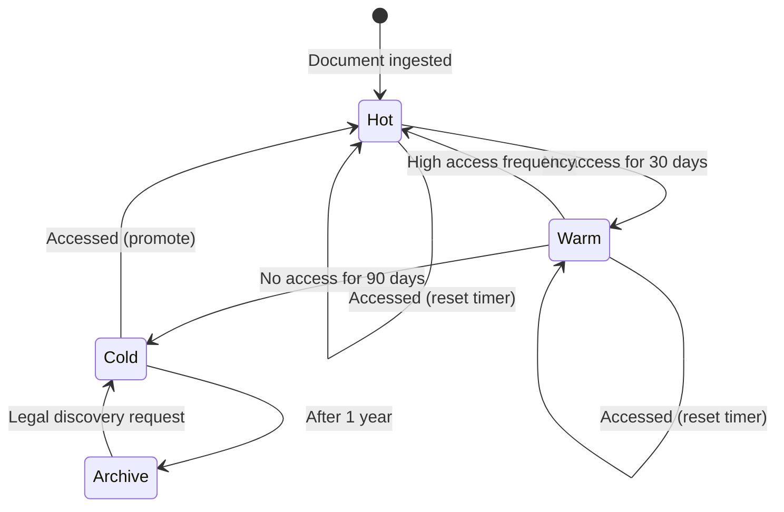
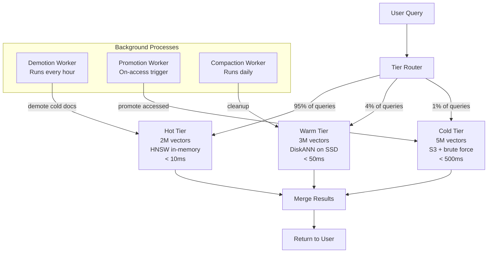

# Hot-Cold Data Tiering for AI Systems

## The Core Insight

Not all data is accessed equally:

```
Access Distribution (typical RAG system):
━━━━━━━━━━━━━━━━━━━━━━━━━━━━━━━━━━━━━━━━
█████████████████████ 80% of queries
━━━━━━━━━━━━━━━━━━━━━━━━━━━━━━━━━━━━━━━━
        ↓ hit only ↓
━━━━━━━━━━━━━━━━━━━━━━━━━━━━━━━━━━━━━━━━
████ 20% of data (recent, popular, critical)
━━━━━━━━━━━━━━━━━━━━━━━━━━━━━━━━━━━━━━━━

Remaining 80% of data:
- Old documents (> 90 days)
- Rarely referenced sources
- Archived projects
- Historical records
```

**The waste**: Storing all data in expensive high-performance storage when most of it is rarely accessed.

---

## Tier Definitions

### Four-Tier Architecture

```
┌─────────────────────────────────────────────────────────────┐
│                    TIER ARCHITECTURE                         │
├─────────────┬───────────┬───────────┬───────────┬───────────┤
│             │   HOT     │   WARM    │   COLD    │  ARCHIVE  │
├─────────────┼───────────┼───────────┼───────────┼───────────┤
│ Storage     │ In-Memory │ SSD/NVMe  │ Object    │ Glacier/  │
│             │ (DRAM)    │           │ Storage   │ Deep Arch │
├─────────────┼───────────┼───────────┼───────────┼───────────┤
│ Index Type  │ HNSW      │ DiskANN/  │ Flat/None │ None      │
│             │           │ IVF-PQ    │           │           │
├─────────────┼───────────┼───────────┼───────────┼───────────┤
│ Latency     │ < 10ms    │ < 50ms    │ < 500ms   │ Hours     │
├─────────────┼───────────┼───────────┼───────────┼───────────┤
│ Cost/GB/mo  │ $10-15    │ $1-3      │ $0.02-0.05│ $0.004    │
├─────────────┼───────────┼───────────┼───────────┼───────────┤
│ Searchable  │ Yes (fast)│ Yes (med) │ Yes (slow)│ No        │
├─────────────┼───────────┼───────────┼───────────┼───────────┤
│ Typical %   │ 15-20%    │ 25-35%    │ 40-50%    │ 10-20%    │
│ of data     │           │           │           │           │
└─────────────┴───────────┴───────────┴───────────┴───────────┘
```

### Tier Characteristics

**Hot Tier**
- All vectors in DRAM with HNSW graph
- Instant search (< 10ms)
- Highest cost per vector
- Reserved for: active projects, trending topics, VIP tenant data

**Warm Tier**
- Vectors on SSD with disk-based ANN index
- Good search performance (< 50ms)
- 5-10x cheaper than hot
- Reserved for: older documents still occasionally accessed

**Cold Tier**
- Vectors in object storage (S3, GCS, Azure Blob)
- Loaded on-demand, brute-force or basic index
- 200-500x cheaper than hot
- Reserved for: rarely accessed but must remain searchable

**Archive Tier**
- Not searchable at all
- Stored for compliance/legal requirements
- Retrieval takes hours (restore from glacier)
- Reserved for: legal holds, regulatory compliance

---

## Data Lifecycle for AI Systems

### Lifecycle State Machine



### Lifecycle Rules

```python
class TieringPolicy:
    """Determines when to move data between tiers."""
    
    rules = {
        "hot_to_warm": {
            "condition": "last_accessed > 30 days AND access_count_30d < 3",
            "exception": "importance_score > 0.8 → stay hot",
        },
        "warm_to_cold": {
            "condition": "last_accessed > 90 days AND access_count_90d < 5",
            "exception": "cited_by_active_docs → stay warm",
        },
        "cold_to_archive": {
            "condition": "last_accessed > 365 days AND no_legal_hold",
            "exception": "compliance_retention_active → stay cold",
        },
        "promote_to_hot": {
            "condition": "accessed AND current_tier != 'hot'",
            "action": "load into memory index, serve future queries from hot",
        },
    }
```

---

## Implementation Patterns

### 1. Time-Based Tiering

```python
from datetime import datetime, timedelta

def classify_by_time(document_created: datetime) -> str:
    age = datetime.now() - document_created
    if age < timedelta(days=30):
        return "hot"
    elif age < timedelta(days=90):
        return "warm"
    elif age < timedelta(days=365):
        return "cold"
    else:
        return "archive"
```

**Pros**: Simple, predictable, easy to implement
**Cons**: Ignores access patterns (old but popular docs get demoted)

### 2. Access-Based Tiering

```python
def classify_by_access(last_accessed: datetime, access_count_30d: int) -> str:
    days_since_access = (datetime.now() - last_accessed).days
    
    if days_since_access < 7 or access_count_30d > 10:
        return "hot"
    elif days_since_access < 30 or access_count_30d > 3:
        return "warm"
    elif days_since_access < 90:
        return "cold"
    else:
        return "archive"
```

**Pros**: Keeps popular content fast regardless of age
**Cons**: Requires access tracking (overhead), cold start problem

### 3. Importance-Based Tiering

```python
def classify_by_importance(doc) -> str:
    """Score based on multiple signals."""
    score = 0.0
    
    # Recency signal
    age_days = (datetime.now() - doc.created_at).days
    score += max(0, 1.0 - age_days / 365)  # 1.0 for new, 0 after 1 year
    
    # Access frequency signal
    score += min(1.0, doc.access_count_30d / 10)  # Cap at 1.0
    
    # Citation signal (referenced by other active docs)
    score += min(1.0, doc.citation_count / 5)
    
    # Source quality signal
    if doc.source_type == "official_docs":
        score += 0.5
    elif doc.source_type == "verified":
        score += 0.3
    
    # Classify
    if score > 2.0:
        return "hot"
    elif score > 1.0:
        return "warm"
    elif score > 0.3:
        return "cold"
    else:
        return "archive"
```

### 4. Hybrid Scoring (Recommended)

```python
def hybrid_tier_score(doc) -> str:
    """Combine time + access + importance."""
    weights = {"time": 0.3, "access": 0.4, "importance": 0.3}
    
    time_score = max(0, 1.0 - doc.age_days / 180)
    access_score = min(1.0, doc.access_count_30d / 5)
    importance_score = doc.importance_score  # Pre-computed
    
    final_score = (
        weights["time"] * time_score +
        weights["access"] * access_score +
        weights["importance"] * importance_score
    )
    
    if final_score > 0.7:
        return "hot"
    elif final_score > 0.4:
        return "warm"
    elif final_score > 0.1:
        return "cold"
    else:
        return "archive"
```

---

## Migration Between Tiers

### Hot → Warm Migration

```python
def demote_hot_to_warm(vector_ids: list):
    """Move vectors from in-memory HNSW to disk-based index."""
    
    # 1. Read vectors from hot tier
    vectors = hot_index.get_vectors(vector_ids)
    metadata = hot_metadata.get_batch(vector_ids)
    
    # 2. Insert into warm tier (disk-based index)
    warm_index.insert_batch(vectors, metadata)
    
    # 3. Update routing table
    for vid in vector_ids:
        routing_table[vid] = "warm"
    
    # 4. Remove from hot tier (free memory!)
    hot_index.delete_batch(vector_ids)
    
    # Memory freed: len(vector_ids) * 6KB per vector
    print(f"Freed {len(vector_ids) * 6 / 1024:.1f} MB from hot tier")
```

### Cold → Hot Promotion (On Access)

```python
def promote_on_access(vector_id: str, query_result):
    """When a cold-tier vector is accessed, promote it to hot."""
    
    if routing_table[vector_id] == "cold":
        # Async promotion (don't block the query)
        background_queue.enqueue({
            "action": "promote",
            "vector_id": vector_id,
            "from_tier": "cold",
            "to_tier": "hot",
        })
        
        # Update access stats
        access_stats[vector_id].record_access()
    
    # Return result immediately (from cold tier this time)
    return query_result


async def process_promotion(task):
    """Background worker for promotions."""
    vector = cold_store.get_vector(task["vector_id"])
    metadata = cold_store.get_metadata(task["vector_id"])
    
    # Add to hot index
    hot_index.insert(vector, metadata)
    routing_table[task["vector_id"]] = "hot"
    
    # Keep in cold tier too (lazy deletion)
    # Will be cleaned up in next cold-tier compaction
```

---

## Cost Comparison

### Scenario: 10M Vectors (1536 dimensions, float32)

```
Raw vector data: 10M × 1536 × 4 bytes = 60 GB

Option A: ALL HOT (in-memory)
┌─────────────────────────────────────┐
│ 10M vectors in HNSW (memory)        │
│ Storage: 60 GB × 1.5 (index) = 90GB│
│ Instance: r6g.4xlarge (128GB RAM)   │
│ Cost: ~$500/month                   │
│ Latency: P95 = 12ms                 │
└─────────────────────────────────────┘

Option B: TIERED (20% hot, 30% warm, 50% cold)
┌─────────────────────────────────────┐
│ Hot:  2M vectors, 18GB memory       │
│       Instance: r6g.xlarge (32GB)   │
│       Cost: $120/month              │
│                                     │
│ Warm: 3M vectors, 18GB on SSD      │
│       Instance: i3.xlarge           │
│       Cost: $25/month               │
│                                     │
│ Cold: 5M vectors, 30GB in S3       │
│       S3 storage + retrieval        │
│       Cost: $5/month                │
│                                     │
│ Total: $150/month                   │
│ Latency: P95 = 15ms (95% of queries│
│          hit hot tier)              │
└─────────────────────────────────────┘

SAVINGS: $350/month (70% reduction!)
Quality impact: < 5% (rarely accessed docs slightly slower)
```

### Cost at Scale (100M Vectors)

| Configuration | Monthly Cost | Avg Latency | Notes |
|--------------|-------------|-------------|-------|
| All hot | $5,000 | 12ms | 10× r6g.4xlarge |
| All warm | $800 | 45ms | Acceptable for batch |
| Tiered (20/30/50) | $1,200 | 15ms P95 | Best value |
| Aggressive tier (10/20/70) | $700 | 18ms P95 | Max savings |

---

## Tiered Storage Architecture



---

## Query Routing with Tiers

### Strategy: Hot-First with Fallback

```python
class TieredQueryRouter:
    def search(self, query_embedding, top_k=10, filters=None):
        """Search hot tier first, fall back to warm/cold if needed."""
        
        # Step 1: Search hot tier
        hot_results = self.hot_index.search(
            query_embedding, top_k=top_k, filters=filters
        )
        
        # Step 2: Check if hot results are sufficient
        if self._results_sufficient(hot_results, top_k):
            return hot_results
        
        # Step 3: Search warm tier for more results
        warm_results = self.warm_index.search(
            query_embedding, top_k=top_k, filters=filters
        )
        
        # Step 4: Merge and return best results
        merged = self._merge_results(hot_results, warm_results)
        return merged[:top_k]
    
    def _results_sufficient(self, results, top_k):
        """Check if we have enough high-quality results."""
        if len(results) < top_k:
            return False
        # If worst result still has good similarity, hot tier is enough
        min_score = results[-1].score
        return min_score > 0.75  # Threshold: configurable
```

### Adaptive Tier Selection

```python
def adaptive_tier_search(query, user_context):
    """Choose tiers based on query characteristics."""
    
    # Recent queries → hot tier only (fast)
    if "recent" in query.filters or "today" in query.text:
        return search_tier("hot", query)
    
    # Historical queries → include warm/cold
    if "historical" in query.filters or query.date_range.start < days_ago(90):
        results = search_tier("hot", query)
        results += search_tier("warm", query)
        if len(results) < query.top_k:
            results += search_tier("cold", query)
        return merge_and_rank(results, query.top_k)
    
    # Default: hot + warm
    hot = search_tier("hot", query)
    if sufficient(hot):
        return hot
    return merge_and_rank(hot + search_tier("warm", query), query.top_k)
```

---

## Monitoring Tiered Storage

### Key Metrics

```yaml
tiering_metrics:
  tier_distribution:
    hot_percent: 18%   # Target: 15-25%
    warm_percent: 32%  # Target: 25-35%
    cold_percent: 42%  # Target: 35-50%
    archive_percent: 8% # Target: 5-20%
    
  hit_rates:
    hot_tier_hit_rate: 94%    # Target: > 90%
    warm_tier_hit_rate: 5%    # 
    cold_tier_hit_rate: 1%    #
    
  promotion_rate: 50/hour     # Cold → Hot promotions
  demotion_rate: 200/hour     # Hot → Warm demotions
  
  cost_efficiency:
    cost_per_query_hot: $0.00001
    cost_per_query_warm: $0.00005
    cost_per_query_cold: $0.0005
    avg_cost_per_query: $0.000015  # Weighted by hit rate
```

### Alert Conditions

```
HOT tier > 30% of data → Demotion too slow, increase frequency
HOT tier hit rate < 80% → Wrong data in hot tier, review policy
Promotion rate > 500/hour → Too much cold data being accessed
Cold tier latency > 1s → Object storage degradation
```

---

## Summary

| Aspect | Recommendation |
|--------|---------------|
| Default tiers | Hot (20%) + Warm (30%) + Cold (50%) |
| Hot tier index | HNSW in-memory for < 10ms |
| Warm tier index | DiskANN or IVF-PQ on SSD |
| Demotion trigger | No access for 30 days + low importance |
| Promotion trigger | Any access from cold → promote to hot |
| Cost savings | 60-70% vs all-hot with < 5% quality loss |
| Query routing | Hot-first with warm fallback |
| Review frequency | Weekly tier distribution audit |
