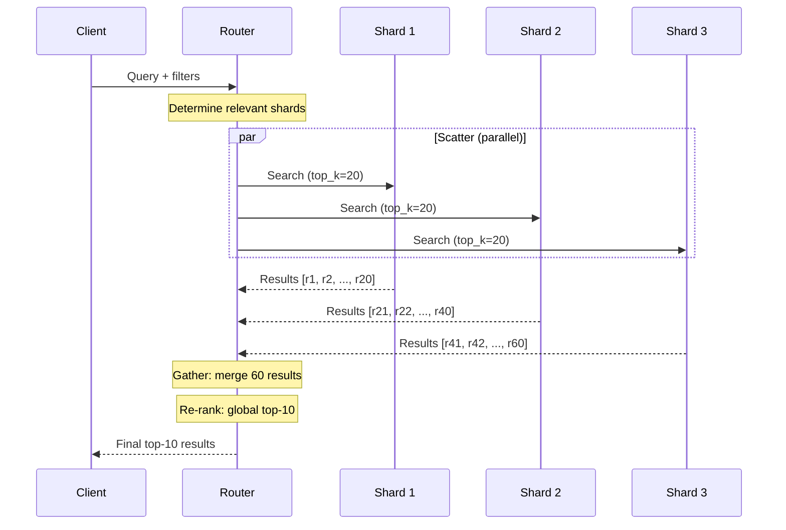
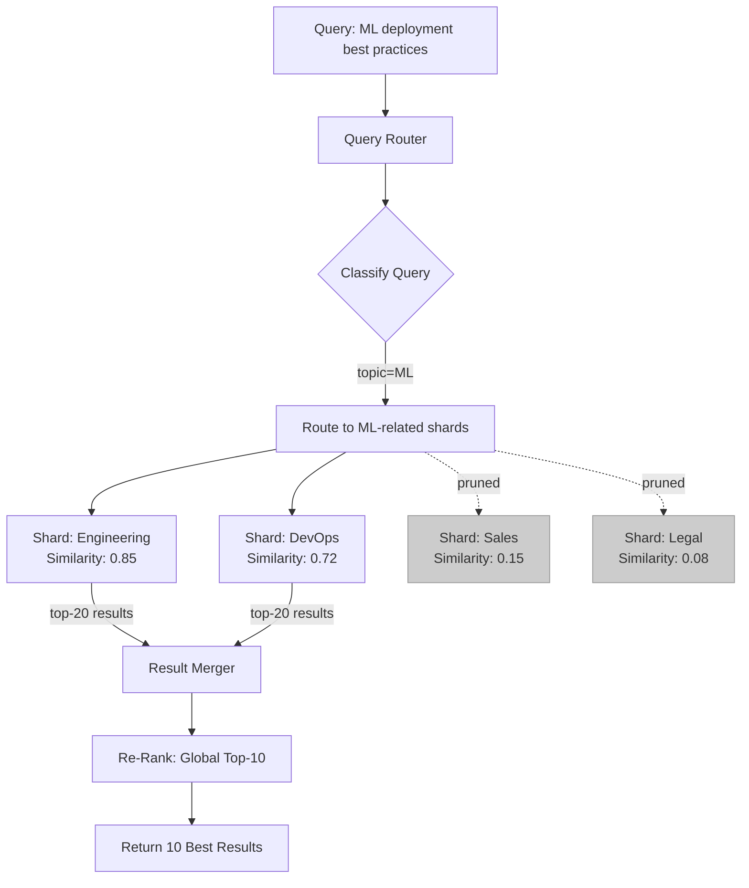

# Cross-Shard Queries

## The Challenge

When data is distributed across shards, some queries need results from multiple shards.

```
User query: "Best practices for deploying ML models"

If sharded by department:
  → Engineering shard: has ML deployment docs ✓
  → DevOps shard: has deployment infrastructure docs ✓
  → Product shard: has ML product requirements ✓
  
  Need to search 3 shards, merge results, re-rank.
```

**The tension**: Sharding improves performance, but cross-shard queries add latency and complexity.

---

## Scatter-Gather Pattern

### The Standard Approach



### Implementation

```python
import asyncio
from dataclasses import dataclass

@dataclass
class ShardResult:
    shard_id: str
    results: list  # [(doc_id, score, metadata), ...]
    latency_ms: float

class ScatterGatherRouter:
    def __init__(self, shards: list):
        self.shards = shards
    
    async def query(self, query_embedding, top_k=10, filters=None):
        """Execute scatter-gather query across shards."""
        
        # Step 1: Determine which shards to query
        target_shards = self._route(query_embedding, filters)
        
        # Step 2: Scatter - query all target shards in parallel
        tasks = [
            self._query_shard(shard, query_embedding, top_k * 2, filters)
            for shard in target_shards
        ]
        shard_results = await asyncio.gather(*tasks)
        
        # Step 3: Gather - merge results
        all_candidates = []
        for result in shard_results:
            all_candidates.extend(result.results)
        
        # Step 4: Re-rank globally
        all_candidates.sort(key=lambda x: x.score, reverse=True)
        
        return all_candidates[:top_k]
    
    def _route(self, query_embedding, filters):
        """Determine which shards to query."""
        if filters and "tenant_id" in filters:
            # Tenant routing: single shard
            return [self._get_tenant_shard(filters["tenant_id"])]
        
        if filters and "topic" in filters:
            # Topic routing: 1-2 shards
            return self._get_topic_shards(filters["topic"])
        
        # No routing hint: scatter to all shards
        return self.shards
    
    async def _query_shard(self, shard, embedding, top_k, filters):
        """Query a single shard."""
        start = time.time()
        results = await shard.search(embedding, top_k=top_k, filters=filters)
        latency = (time.time() - start) * 1000
        return ShardResult(shard_id=shard.id, results=results, latency_ms=latency)
```

---

## Optimization: Minimize Scatter

The goal: **query as few shards as possible** for each request.

### 1. Tenant Routing (Best Case: 1 Shard)

```
Query: "billing docs" + filter: tenant_id = "acme"
Routing: acme → Shard 3
Result: Query hits ONLY Shard 3 (no scatter!)

Latency: Same as single-shard system (~20ms)
```

### 2. Topic Routing (1-2 Shards)

```python
class TopicRouter:
    """Classify query to determine topic shard."""
    
    def __init__(self):
        # Pre-computed topic centroids (one per shard)
        self.shard_centroids = {
            "shard_engineering": centroid_engineering,
            "shard_sales": centroid_sales,
            "shard_legal": centroid_legal,
        }
    
    def route(self, query_embedding, max_shards=2):
        """Route to most relevant topic shards."""
        similarities = {}
        for shard_id, centroid in self.shard_centroids.items():
            sim = cosine_similarity(query_embedding, centroid)
            similarities[shard_id] = sim
        
        # Sort by relevance, take top N
        sorted_shards = sorted(
            similarities.items(), key=lambda x: x[1], reverse=True
        )
        return [shard_id for shard_id, _ in sorted_shards[:max_shards]]
```

### 3. Hybrid Routing (Tenant + Global)

```
Architecture:
  Per-tenant shards: contain tenant-specific documents
  Global shard: contains shared knowledge (public docs, common FAQs)

Query routing:
  1. Always query tenant's shard (private docs)
  2. Also query global shard (shared knowledge)
  3. Merge results (prefer tenant-specific, supplement with global)

Scatter: Always exactly 2 shards (predictable latency)
```

---

## Performance Impact of Cross-Shard Queries

### Latency Model

```
Single shard latency: L₁ = 20ms (P50), 30ms (P95)

Cross-shard latency (parallel execution):
  L_n = max(L₁, L₂, ..., Lₙ)  (bottleneck = slowest shard)
  
  P95 with N shards ≈ L₁ × (1 + 0.3 × ln(N))
  (Tail latency grows logarithmically with shard count)
```

| Shards Queried | P50 Latency | P95 Latency | P99 Latency |
|---------------|-------------|-------------|-------------|
| 1 | 20ms | 30ms | 50ms |
| 2 | 22ms | 35ms | 60ms |
| 3 | 24ms | 40ms | 70ms |
| 5 | 26ms | 50ms | 90ms |
| 10 | 30ms | 70ms | 130ms |
| 20 | 35ms | 100ms | 200ms |

**Rule of thumb**: Keep scatter to ≤ 3 shards for P95 < 50ms.

### Why Tail Latency Grows

```
Querying 10 shards in parallel:
  Shard 1:  18ms ✓
  Shard 2:  22ms ✓
  Shard 3:  19ms ✓
  Shard 4:  21ms ✓
  Shard 5:  85ms ← GC pause, network blip, disk I/O
  Shard 6:  20ms ✓
  Shard 7:  23ms ✓
  Shard 8:  17ms ✓
  Shard 9:  21ms ✓
  Shard 10: 19ms ✓

Total latency: 85ms (bottleneck: Shard 5)
P(at least one slow shard) increases with N
```

### Mitigation: Hedged Requests

```python
async def hedged_query(shard, embedding, top_k, timeout_ms=30):
    """Send query to shard + replica. Take first response."""
    primary = shard.search(embedding, top_k)
    
    # If primary doesn't respond in 30ms, also query replica
    try:
        result = await asyncio.wait_for(primary, timeout=timeout_ms/1000)
        return result
    except asyncio.TimeoutError:
        # Hedge: query replica too
        replica = shard.replica.search(embedding, top_k)
        done, pending = await asyncio.wait(
            [primary, replica],
            return_when=asyncio.FIRST_COMPLETED
        )
        for task in pending:
            task.cancel()
        return done.pop().result()
```

---

## Global vs Local Top-K

### The Problem

```
Scenario: 5 shards, want global top-10

Naive approach: Get top-10 from each shard (50 candidates) → global top-10

Problem: What if the globally 10th-best result is ranked 15th in its shard?
  → It would be MISSED (only got top-10 per shard)

Example:
  Shard 1 top-10: scores [0.95, 0.93, 0.91, ..., 0.82]
  Shard 2 top-10: scores [0.94, 0.90, 0.88, ..., 0.75]
  Shard 3 top-10: scores [0.97, 0.96, 0.85, ..., 0.70]
  
  Global #10 might have score 0.91
  But Shard 2's 11th result (score 0.74) is correctly excluded
  
  Risk: If distribution is very skewed, local top-K misses global results
```

### Solution: Over-Fetch (Local Top-K × Multiplier)

```python
def calculate_local_k(global_k: int, num_shards: int) -> int:
    """How many results to fetch from each shard."""
    # Conservative: fetch 2x globally needed per shard
    # This ensures > 99% chance of finding true global top-K
    multiplier = 2
    return global_k * multiplier

# Example:
# Want global top-10, querying 5 shards
# Fetch top-20 from each shard = 100 candidates
# Re-rank 100 → global top-10
# Much better recall than fetching only top-10 per shard
```

### Adaptive Over-Fetch

```python
def adaptive_local_k(global_k, num_shards, score_distribution="uniform"):
    """Adjust over-fetch based on expected score distribution."""
    if score_distribution == "uniform":
        # Scores evenly distributed → moderate over-fetch
        return global_k * 2
    elif score_distribution == "skewed":
        # Most results in one shard → aggressive over-fetch
        return global_k * 3
    elif score_distribution == "known_single_shard":
        # Query can be routed → no over-fetch needed
        return global_k
```

---

## Result Merging Strategies

### 1. Score-Based Merge (Default)

```python
def merge_by_score(shard_results: list, top_k: int):
    """Merge results from multiple shards by similarity score."""
    all_results = []
    for shard_result in shard_results:
        all_results.extend(shard_result.results)
    
    # Sort by score descending
    all_results.sort(key=lambda r: r.score, reverse=True)
    
    # Deduplicate (same doc might appear in multiple shards)
    seen_ids = set()
    deduplicated = []
    for result in all_results:
        if result.doc_id not in seen_ids:
            seen_ids.add(result.doc_id)
            deduplicated.append(result)
    
    return deduplicated[:top_k]
```

### 2. Score Normalization (When Shards Have Different Scales)

```python
def merge_with_normalization(shard_results: list, top_k: int):
    """Normalize scores before merging (different indexes may score differently)."""
    normalized_results = []
    
    for shard_result in shard_results:
        if not shard_result.results:
            continue
        # Min-max normalize within shard
        scores = [r.score for r in shard_result.results]
        min_s, max_s = min(scores), max(scores)
        range_s = max_s - min_s if max_s != min_s else 1.0
        
        for result in shard_result.results:
            normalized_score = (result.score - min_s) / range_s
            normalized_results.append((result, normalized_score))
    
    normalized_results.sort(key=lambda x: x[1], reverse=True)
    return [r for r, _ in normalized_results[:top_k]]
```

### 3. Reciprocal Rank Fusion (Rank-Based)

```python
def reciprocal_rank_fusion(shard_results: list, top_k: int, k=60):
    """Merge using RRF - robust to score scale differences."""
    doc_scores = {}
    
    for shard_result in shard_results:
        for rank, result in enumerate(shard_result.results):
            doc_id = result.doc_id
            rrf_score = 1.0 / (k + rank + 1)
            doc_scores[doc_id] = doc_scores.get(doc_id, 0) + rrf_score
    
    # Sort by RRF score
    sorted_docs = sorted(doc_scores.items(), key=lambda x: x[1], reverse=True)
    return sorted_docs[:top_k]
```

---

## Scatter-Gather Flow Diagram



---

## Reducing Cross-Shard Queries

### Architecture Decisions That Minimize Scatter

| Decision | Scatter Reduction | Trade-off |
|----------|------------------|-----------|
| Shard by tenant | 90%+ queries hit 1 shard | Uneven shard sizes |
| Topic-aware sharding | 70%+ hit 1-2 shards | Classification overhead |
| Global shard for shared data | Avoid full scatter for shared queries | Extra shard to maintain |
| Denormalization | Duplicate popular docs in multiple shards | Storage cost |
| Query-time caching | Repeat queries never scatter | Cache memory |

### Caching Cross-Shard Results

```python
class CrossShardCache:
    """Cache results of expensive cross-shard queries."""
    
    def __init__(self, max_size=10000, ttl_seconds=300):
        self.cache = LRUCache(max_size)
        self.ttl = ttl_seconds
    
    def get_or_query(self, query_embedding, filters, top_k):
        cache_key = self._make_key(query_embedding, filters)
        
        cached = self.cache.get(cache_key)
        if cached and not self._expired(cached):
            return cached.results  # Cache hit: no scatter!
        
        # Cache miss: execute scatter-gather
        results = self.router.scatter_gather(query_embedding, filters, top_k)
        
        # Cache the result
        self.cache.set(cache_key, CacheEntry(results, time.time()))
        return results
```

---

## Summary

| Concept | Key Point |
|---------|-----------|
| Scatter-gather | Query shards in parallel, merge results |
| Goal | Minimize number of shards queried per request |
| Best case | Tenant/topic routing → 1 shard (no scatter) |
| Worst case | Hash sharding → ALL shards (full scatter) |
| Latency rule | P95 ≈ single_shard_P95 × (1 + 0.3×ln(N)) |
| Over-fetch | Local top-K×2 to ensure global top-K accuracy |
| Target | ≤ 3 shards per query for P95 < 50ms |
| Merging | Score-based (default) or RRF (robust) |
