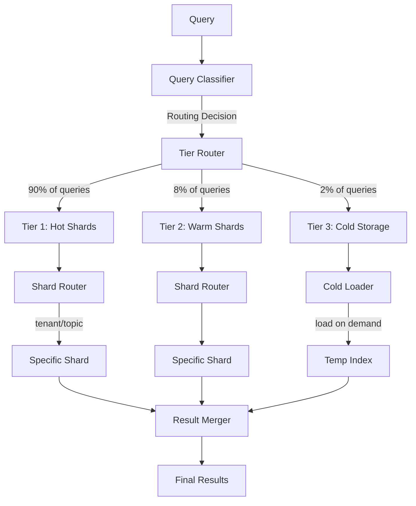
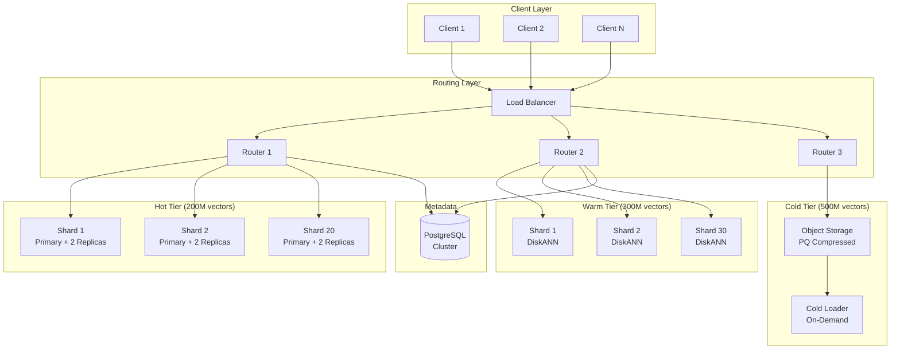

# Sharding for Billion-Scale Vector Systems

## Architecture for 1 Billion Vectors

### Tiered Shard Architecture

```
┌─────────────────────────────────────────────────────────────────┐
│                  1 BILLION VECTOR ARCHITECTURE                   │
├─────────────────────────────────────────────────────────────────┤
│                                                                 │
│  TIER 1 - HOT (200M vectors, 20 shards)                       │
│  ┌────┐┌────┐┌────┐┌────┐┌────┐ ... ×20                      │
│  │10M ││10M ││10M ││10M ││10M │                               │
│  │HNSW││HNSW││HNSW││HNSW││HNSW│  In-Memory, < 10ms           │
│  └────┘└────┘└────┘└────┘└────┘                               │
│                                                                 │
│  TIER 2 - WARM (300M vectors, 30 shards)                      │
│  ┌────┐┌────┐┌────┐┌────┐┌────┐ ... ×30                      │
│  │10M ││10M ││10M ││10M ││10M │                               │
│  │Disk││Disk││Disk││Disk││Disk│  SSD-based, < 50ms            │
│  │ANN ││ANN ││ANN ││ANN ││ANN │                               │
│  └────┘└────┘└────┘└────┘└────┘                               │
│                                                                 │
│  TIER 3 - COLD (500M vectors, compressed in object storage)   │
│  ┌──────────────────────────────────────────────┐              │
│  │  S3/GCS: PQ-compressed vectors + metadata    │              │
│  │  On-demand loading, < 500ms                  │              │
│  └──────────────────────────────────────────────┘              │
│                                                                 │
└─────────────────────────────────────────────────────────────────┘
```

### Why This Split?

| Tier | Vectors | % of Queries | Justification |
|------|---------|-------------|---------------|
| Hot | 200M (20%) | 90% | Active docs, recent, frequently accessed |
| Warm | 300M (30%) | 8% | Older but still searchable |
| Cold | 500M (50%) | 2% | Archived, compliance, rare access |

---

## Routing Architecture

### Query Classifier & Router



### Smart Routing Logic

```python
class BillionScaleRouter:
    def route(self, query, filters):
        """Route query to minimum necessary tiers and shards."""
        
        # Level 1: Tier selection
        tiers = self._select_tiers(query, filters)
        
        # Level 2: Shard selection within tier
        target_shards = []
        for tier in tiers:
            shards = self._select_shards(tier, query, filters)
            target_shards.extend(shards)
        
        return target_shards
    
    def _select_tiers(self, query, filters):
        """Most queries only need Tier 1."""
        # If date filter is recent → Tier 1 only
        if filters.get("date_after") and filters["date_after"] > days_ago(30):
            return ["hot"]
        
        # If no date filter but tenant query → Tier 1 + maybe Tier 2
        if filters.get("tenant_id"):
            hot_results = self._estimate_hot_results(filters["tenant_id"], query)
            if hot_results >= query.top_k:
                return ["hot"]
            return ["hot", "warm"]
        
        # Broad queries → Tier 1, fall back to Tier 2 if insufficient
        return ["hot"]  # Start with hot, escalate if needed
    
    def _select_shards(self, tier, query, filters):
        """Within a tier, select minimum shards."""
        if filters.get("tenant_id"):
            return [self.tenant_shard_map[tier][filters["tenant_id"]]]
        
        # Topic-based routing
        topic = self._classify_topic(query.embedding)
        return self.topic_shard_map[tier].get(topic, self._all_shards(tier))
```

---

## Replication for High Availability

### Replication Topology

```
Each Shard: 1 Primary + 2 Replicas

┌─────────────────────────────────────────┐
│             Shard Group 1               │
├─────────────┬─────────────┬─────────────┤
│  Primary    │  Replica 1  │  Replica 2  │
│  (writes)   │  (reads)    │  (reads)    │
│  Node A     │  Node B     │  Node C     │
│  Region: US │  Region: US │  Region: EU │
└─────────────┴─────────────┴─────────────┘
       │              ▲              ▲
       │   async      │   async      │
       └──────────────┴──────────────┘
            replication
```

### Read/Write Split

```python
class ReplicatedShard:
    def __init__(self, primary, replicas):
        self.primary = primary
        self.replicas = replicas
        self.read_idx = 0  # Round-robin counter
    
    def write(self, vectors, metadata):
        """Write to primary, async replicate."""
        self.primary.insert(vectors, metadata)
        # Async replication (don't block the write)
        for replica in self.replicas:
            asyncio.create_task(replica.replicate(vectors, metadata))
    
    def read(self, query_embedding, top_k, filters):
        """Read from any replica (load-balanced)."""
        target = self.replicas[self.read_idx % len(self.replicas)]
        self.read_idx += 1
        return target.search(query_embedding, top_k, filters)
    
    def failover(self, failed_node):
        """Promote replica if primary fails."""
        if failed_node == self.primary:
            new_primary = self.replicas.pop(0)
            new_primary.promote_to_primary()
            self.primary = new_primary
            # Trigger: provision new replica
            self._provision_replacement_replica()
```

### Failover Timeline

```
T=0s:    Primary dies (hardware failure)
T=1s:    Health check detects failure
T=3s:    Replica promoted to primary
T=5s:    Routing updated, writes resume
T=10s:   Full recovery (reads + writes)

Total downtime for this shard: ~5-10 seconds
Impact on users: ~0 (other replica still serving reads)
```

---

## Capacity Planning at Billion Scale

### Memory Calculations

```python
# Parameters
num_vectors = 1_000_000_000  # 1 billion
dimensions = 1536            # OpenAI ada-002
bytes_per_float = 4          # float32

# Raw vector storage
raw_size = num_vectors * dimensions * bytes_per_float
print(f"Raw vectors: {raw_size / 1e12:.1f} TB")  # 6.1 TB

# HNSW index overhead (~1.5x for graph structure)
hnsw_total = raw_size * 1.5
print(f"With HNSW: {hnsw_total / 1e12:.1f} TB")  # 9.2 TB

# With INT8 quantization (4x compression on vectors)
quantized_vectors = num_vectors * dimensions * 1  # 1 byte per dim
quantized_total = quantized_vectors * 1.5  # Still need graph
print(f"INT8 quantized: {quantized_total / 1e12:.1f} TB")  # 2.3 TB

# With Product Quantization (32x compression)
pq_vectors = num_vectors * (dimensions // 8) * 1  # ~192 bytes/vector
pq_total = pq_vectors + (num_vectors * 200)  # + graph links
print(f"PQ compressed: {pq_total / 1e12:.2f} TB")  # 0.4 TB
```

### Hardware Planning

```
TIER 1 (Hot - 200M vectors, HNSW, full precision):
  Memory needed: 200M × 1536 × 4 × 1.5 = 1.84 TB
  Nodes: 20 × r6g.4xlarge (128GB RAM each) = 2.56 TB capacity
  Utilization: 72% (healthy headroom)
  
TIER 2 (Warm - 300M vectors, DiskANN, INT8):
  Memory for graph: 300M × 200 bytes = 60 GB (in RAM)
  Vectors on SSD: 300M × 1536 × 1 = 460 GB
  Nodes: 30 × i3.xlarge (32GB RAM, 950GB NVMe)
  
TIER 3 (Cold - 500M vectors, PQ compressed):
  Storage: 500M × 192 bytes = 96 GB (object storage)
  On-demand index: loaded per query batch
  No dedicated nodes (serverless/spot)
```

### Total Infrastructure

| Component | Count | Instance Type | Monthly Cost |
|-----------|-------|--------------|-------------|
| Hot shards (primary) | 20 | r6g.4xlarge | $43,200 |
| Hot shards (replicas) | 40 | r6g.4xlarge | $86,400 |
| Warm shards | 30 | i3.xlarge | $14,400 |
| Routers/LBs | 5 | c6g.xlarge | $1,800 |
| Metadata DB | 3 | r6g.2xlarge | $6,480 |
| Object storage (cold) | - | S3 | $500 |
| **Total** | | | **~$153K/month** |

---

## Cost Optimization Strategies

### Quantization Impact

| Quantization | Memory/Vector | Total (1B) | Quality Loss | Savings |
|-------------|--------------|-----------|-------------|---------|
| Float32 (none) | 6,144 B | 6.1 TB | 0% | Baseline |
| Float16 | 3,072 B | 3.1 TB | < 0.1% | 50% |
| INT8 | 1,536 B | 1.5 TB | < 1% | 75% |
| Binary | 192 B | 0.2 TB | 5-10% | 97% |
| PQ (96 subvectors) | 96 B | 0.1 TB | 3-5% | 98% |

### Right-Sizing Strategy

```
Step 1: Start with INT8 quantization everywhere (75% savings)
Step 2: Apply tiering (70% additional savings on storage)
Step 3: Use spot instances for cold-tier compute (60% compute savings)
Step 4: Reserved instances for hot tier (40% savings vs on-demand)

Combined savings: ~85% vs naive all-hot float32
Naive cost: ~$500K/month → Optimized: ~$75K/month
```

---

## Operational Considerations

### Scaling Playbook

```yaml
scale_up_triggers:
  - condition: "avg_query_latency > 40ms for 5 minutes"
    action: "Add read replica to slowest shard"
    
  - condition: "shard_memory > 85%"
    action: "Split shard (auto-rebalance)"
    
  - condition: "QPS > 80% of rated capacity"
    action: "Add router instance + read replicas"

scale_down_triggers:
  - condition: "shard_memory < 30% for 24 hours"
    action: "Consider merging with neighbor shard"
    
  - condition: "QPS < 20% of capacity for 7 days"
    action: "Remove extra read replicas"
```

### Disaster Recovery

```
RPO (Recovery Point Objective): < 1 minute
  → Async replication lag < 1 min
  
RTO (Recovery Time Objective): < 5 minutes
  → Automatic failover to replica
  
Geographic redundancy:
  Primary: US-East-1
  DR: US-West-2
  Cross-region replication: async, 5-10 min lag
  
Full rebuild time (from backup): ~4 hours for 200M vectors
  → Never need this with proper replication
```

### Monitoring at Scale

```yaml
critical_alerts:
  - name: "Shard Down"
    condition: "shard not responding for 10s"
    action: "Auto-failover + page on-call"
    
  - name: "Replication Lag"
    condition: "replica lag > 5 minutes"
    action: "Investigate, may need to rebuild replica"
    
  - name: "Query Latency SLO"
    condition: "P99 > 100ms for 3 minutes"
    action: "Scale out or split hot shard"
    
  - name: "Data Loss Detection"
    condition: "vector count decreased unexpectedly"
    action: "CRITICAL: halt writes, investigate immediately"

dashboard_panels:
  - "Queries/sec per shard (heatmap)"
  - "P50/P95/P99 latency per tier"
  - "Memory utilization per shard"
  - "Replication lag per shard"
  - "Tier distribution (hot/warm/cold %)"
  - "Cross-shard query ratio"
```

---

## Billion-Scale Architecture Diagram



---

## Summary: Billion-Scale Checklist

| Aspect | Decision |
|--------|----------|
| Shard size | 10M vectors per HNSW shard |
| Replication | 1 primary + 2 replicas per hot shard |
| Quantization | INT8 minimum, PQ for cold tier |
| Tiering | 20% hot, 30% warm, 50% cold |
| Routing | Tenant-first, topic-second, minimize scatter |
| Failover | < 10s automatic, promote replica |
| Cost target | $75-150K/month for 1B vectors (optimized) |
| Latency target | P95 < 30ms for 90% of queries (hot tier) |
| Availability | 99.99% with multi-replica, multi-region |
