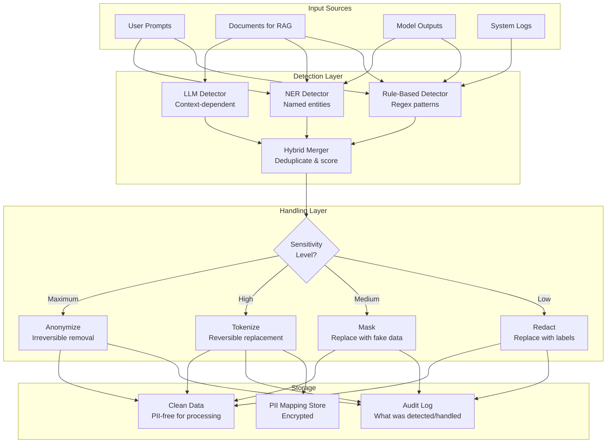

# PII Detection Pipeline for AI Systems

## Where PII Appears in AI Systems

PII (Personally Identifiable Information) can appear at every stage of an AI pipeline. Understanding where it appears is the first step to protecting it.

### 1. User Inputs (Prompts)

```
# Users naturally include PII in prompts:
"My name is Sarah Johnson, DOB 03/15/1985, and I need help with my tax return"
"Can you review this contract for John Smith at john.smith@acme.com?"
"My patient, record #12345, presents with chest pain..."
```

### 2. Retrieved Documents (RAG Context)

```
# Documents in the knowledge base contain PII:
# - Employee records: "Alice Chen, Engineering Manager, salary $175,000"
# - Customer data: "Order #789 for Bob Williams, 456 Oak Ave"
# - Medical notes: "Patient presents with depression, prescribed sertraline"
# - Legal docs: "Defendant Michael Brown, case #2024-CV-1234"
```

### 3. Model Outputs

```
# LLM generates PII from training data or retrieved context:
Prompt: "Write an example customer support email"
Output: "Dear John Smith, your account ending in 4532..."
# The model may generate real data it memorized!
```

### 4. Logs and Traces

```json
{
  "event": "llm_call",
  "input": "Help me with my account. I'm Jane Doe, account #98765",
  "output": "Hi Jane! I can see your account at 789 Elm Street...",
  "retrieved_docs": ["customer_record_jane_doe.pdf"],
  "model": "gpt-4",
  "latency_ms": 1200
}
```

### 5. Embeddings

```python
# The vector itself encodes PII information
text = "Robert Johnson, VP Engineering, robert.j@company.com, ext 4567"
vector = embed(text)  # This vector CONTAINS Robert's info encoded numerically
# Stored in vector DB — accessible to anyone with DB access
```

---

## PII Detection Approaches

### 1. Rule-Based Detection (Regex Patterns)

```python
import re
from dataclasses import dataclass
from typing import List, Tuple

@dataclass
class PIIMatch:
    type: str
    value: str
    start: int
    end: int
    confidence: float

class RuleBasedDetector:
    """Fast, deterministic PII detection using regex patterns."""
    
    PATTERNS = {
        "SSN": r"\b\d{3}-\d{2}-\d{4}\b",
        "EMAIL": r"\b[A-Za-z0-9._%+-]+@[A-Za-z0-9.-]+\.[A-Z|a-z]{2,}\b",
        "PHONE_US": r"\b(?:\+1[-.]?)?\(?\d{3}\)?[-.\s]?\d{3}[-.\s]?\d{4}\b",
        "CREDIT_CARD": r"\b(?:\d{4}[-\s]?){3}\d{4}\b",
        "IP_ADDRESS": r"\b\d{1,3}\.\d{1,3}\.\d{1,3}\.\d{1,3}\b",
        "DATE_OF_BIRTH": r"\b(?:DOB|born|birthday)[:\s]*\d{1,2}[/\-]\d{1,2}[/\-]\d{2,4}\b",
        "US_PASSPORT": r"\b[A-Z]\d{8}\b",
        "IBAN": r"\b[A-Z]{2}\d{2}[A-Z0-9]{4}\d{7}([A-Z0-9]?){0,16}\b",
    }
    
    def detect(self, text: str) -> List[PIIMatch]:
        matches = []
        for pii_type, pattern in self.PATTERNS.items():
            for match in re.finditer(pattern, text, re.IGNORECASE):
                matches.append(PIIMatch(
                    type=pii_type,
                    value=match.group(),
                    start=match.start(),
                    end=match.end(),
                    confidence=0.95  # High confidence for pattern matches
                ))
        return matches
```

**Pros:** Fast, no external dependencies, deterministic, no false negatives for exact patterns
**Cons:** Can't detect names, addresses, or context-dependent PII

### 2. NER-Based Detection (Named Entity Recognition)

```python
from transformers import pipeline

class NERDetector:
    """Uses Named Entity Recognition to find PII entities."""
    
    def __init__(self):
        self.ner = pipeline(
            "ner",
            model="dslim/bert-base-NER",
            aggregation_strategy="simple"
        )
        # Map NER labels to PII types
        self.pii_labels = {
            "PER": "PERSON_NAME",
            "LOC": "LOCATION",
            "ORG": "ORGANIZATION",
        }
    
    def detect(self, text: str) -> List[PIIMatch]:
        entities = self.ner(text)
        matches = []
        for entity in entities:
            if entity["entity_group"] in self.pii_labels:
                matches.append(PIIMatch(
                    type=self.pii_labels[entity["entity_group"]],
                    value=entity["word"],
                    start=entity["start"],
                    end=entity["end"],
                    confidence=entity["score"]
                ))
        return matches
```

**Pros:** Detects names, locations, organizations without patterns
**Cons:** Misses some PII, can have false positives, model-dependent quality

### 3. LLM-Based Detection

```python
class LLMDetector:
    """Uses an LLM to identify PII — most accurate but expensive."""
    
    PROMPT = """Identify ALL personally identifiable information (PII) in the text below.
    
For each PII found, output JSON with:
- type: the category (PERSON_NAME, EMAIL, PHONE, ADDRESS, SSN, MEDICAL, FINANCIAL, etc.)
- value: the exact text
- context: why this is PII

Text: {text}

Output as JSON array:"""
    
    def detect(self, text: str) -> List[PIIMatch]:
        response = llm.generate(self.PROMPT.format(text=text))
        # Parse JSON response
        # LLM can detect subtle PII like:
        # "the tall guy from accounting" (indirect identifier)
        # "my doctor said I should..." (implies medical condition)
        # "living in the blue house on Main St" (quasi-identifier)
        return self._parse_response(response)
```

**Pros:** Most accurate, detects context-dependent and indirect PII
**Cons:** Expensive, slow, non-deterministic, requires sending text to LLM (privacy concern itself!)

### 4. Hybrid Approach (Recommended)

```python
class HybridPIIDetector:
    """Combines all approaches for best coverage."""
    
    def __init__(self):
        self.rule_detector = RuleBasedDetector()
        self.ner_detector = NERDetector()
        self.llm_detector = LLMDetector()
    
    def detect(self, text: str, sensitivity: str = "medium") -> List[PIIMatch]:
        # Always run rule-based (fast, high precision)
        matches = self.rule_detector.detect(text)
        
        # Add NER for names/locations (medium cost)
        if sensitivity in ("medium", "high"):
            ner_matches = self.ner_detector.detect(text)
            matches = self._merge_matches(matches, ner_matches)
        
        # Add LLM for subtle PII (high cost, high sensitivity)
        if sensitivity == "high":
            llm_matches = self.llm_detector.detect(text)
            matches = self._merge_matches(matches, llm_matches)
        
        return self._deduplicate(matches)
```

---

## PII Types and Detection Difficulty

| Difficulty | PII Type | Detection Method | Example |
|-----------|----------|-----------------|---------|
| Easy | Email | Regex | john@example.com |
| Easy | Phone | Regex | (555) 123-4567 |
| Easy | SSN | Regex | 123-45-6789 |
| Easy | Credit Card | Regex + Luhn | 4532-1234-5678-9012 |
| Medium | Person Name | NER | "Sarah Johnson" |
| Medium | Address | NER + Regex | "123 Main St, Springfield" |
| Medium | Date of Birth | Context + Regex | "born March 15, 1985" |
| Medium | Medical Record # | Context + Regex | "MRN: 12345678" |
| Hard | Indirect Identifier | LLM | "the CEO's daughter" |
| Hard | Quasi-identifier | LLM | combination of zip + age + gender |
| Hard | Contextual PII | LLM | "my condition" (after mentioning diabetes) |
| Hard | Behavioral PII | LLM | browsing patterns that identify a person |

---

## PII Handling Strategies

### Redaction

```python
def redact(text: str, matches: List[PIIMatch]) -> str:
    """Replace PII with type labels."""
    # Sort by position (reverse) to maintain offsets
    for match in sorted(matches, key=lambda m: m.start, reverse=True):
        text = text[:match.start] + f"[{match.type}]" + text[match.end:]
    return text

# Input:  "Contact John Smith at john@acme.com or 555-0123"
# Output: "Contact [PERSON_NAME] at [EMAIL] or [PHONE_US]"
```

### Masking (Synthetic Replacement)

```python
from faker import Faker
fake = Faker()

def mask(text: str, matches: List[PIIMatch]) -> str:
    """Replace PII with realistic fake data."""
    replacements = {
        "PERSON_NAME": fake.name,
        "EMAIL": fake.email,
        "PHONE_US": fake.phone_number,
        "ADDRESS": fake.address,
        "SSN": lambda: fake.ssn(),
    }
    for match in sorted(matches, key=lambda m: m.start, reverse=True):
        generator = replacements.get(match.type, lambda: "[MASKED]")
        text = text[:match.start] + generator() + text[match.end:]
    return text

# Input:  "Contact John Smith at john@acme.com"
# Output: "Contact Maria Garcia at maria.g@example.net"
```

### Tokenization (Reversible)

```python
import hashlib
import json
from cryptography.fernet import Fernet

class PIITokenizer:
    """Replace PII with reversible tokens. Only authorized users can de-tokenize."""
    
    def __init__(self, encryption_key: bytes):
        self.cipher = Fernet(encryption_key)
        self.token_map = {}  # token -> encrypted original
    
    def tokenize(self, text: str, matches: List[PIIMatch]) -> str:
        for match in sorted(matches, key=lambda m: m.start, reverse=True):
            token = f"TOK_{hashlib.sha256(match.value.encode()).hexdigest()[:12]}"
            # Store encrypted mapping
            self.token_map[token] = self.cipher.encrypt(match.value.encode())
            text = text[:match.start] + token + text[match.end:]
        return text
    
    def detokenize(self, text: str) -> str:
        """Only callable by authorized users."""
        for token, encrypted_value in self.token_map.items():
            original = self.cipher.decrypt(encrypted_value).decode()
            text = text.replace(token, original)
        return text
```

### Anonymization (Irreversible)

```python
def anonymize(text: str, matches: List[PIIMatch]) -> str:
    """Irreversibly remove PII. Cannot be reversed."""
    # Use consistent pseudonyms for the same entity
    entity_map = {}
    counters = {}
    
    for match in sorted(matches, key=lambda m: m.start, reverse=True):
        if match.value not in entity_map:
            counters.setdefault(match.type, 0)
            counters[match.type] += 1
            entity_map[match.value] = f"[{match.type}_{counters[match.type]}]"
        text = text[:match.start] + entity_map[match.value] + text[match.end:]
    return text

# Input:  "John told Mary that John's email is john@x.com"
# Output: "[PERSON_1] told [PERSON_2] that [PERSON_1]'s email is [EMAIL_1]"
```

---

## Where to Apply PII Detection

### At Ingestion (Before Embedding)

```python
class PrivacyAwareIngestionPipeline:
    def ingest_document(self, document: str, doc_id: str):
        # Step 1: Detect PII
        pii_matches = self.detector.detect(document)
        
        # Step 2: Anonymize for embedding
        anonymized = self.anonymizer.anonymize(document, pii_matches)
        
        # Step 3: Store mapping (encrypted)
        self.mapping_store.save(doc_id, pii_matches, encrypted=True)
        
        # Step 4: Embed anonymized text (no PII in vectors!)
        embedding = self.embedder.embed(anonymized)
        self.vector_db.upsert(doc_id, embedding, metadata={"anonymized": True})
```

### At Query Time (Before Sending to LLM)

```python
class PrivacyAwareQueryPipeline:
    def query(self, user_prompt: str, user_id: str):
        # Detect and redact PII from user's prompt
        pii_in_prompt = self.detector.detect(user_prompt)
        safe_prompt = self.redactor.redact(user_prompt, pii_in_prompt)
        
        # Send redacted prompt to LLM
        response = self.llm.generate(safe_prompt)
        return response
```

### At Output (Before Returning to User)

```python
class OutputFilter:
    def filter_response(self, response: str, user_permissions: dict):
        # Scan output for PII
        pii_in_output = self.detector.detect(response)
        
        # Filter based on user's access level
        for match in pii_in_output:
            if not user_permissions.get(f"view_{match.type}", False):
                response = self.redact_match(response, match)
        
        return response
```

### In Logs (Before Storing)

```python
class PrivacyAwareLogger:
    def log(self, event: dict):
        # Scan all string fields for PII
        sanitized = {}
        for key, value in event.items():
            if isinstance(value, str):
                matches = self.detector.detect(value)
                sanitized[key] = self.redactor.redact(value, matches)
            else:
                sanitized[key] = value
        
        self.logger.info(json.dumps(sanitized))
```

---

## PII Detection Pipeline Architecture



---

## Performance Considerations

| Method | Latency (per 1K chars) | Accuracy | Cost |
|--------|----------------------|----------|------|
| Regex only | <1ms | 60% (structured PII only) | Free |
| NER model | 10-50ms | 80% (+ names, locations) | Compute |
| LLM-based | 500-2000ms | 95%+ (all PII types) | $$ API costs |
| Hybrid (regex+NER) | 10-50ms | 85% | Compute |
| Hybrid (all three) | 500-2000ms | 97%+ | $$$ |

**Recommendation:** Use regex+NER for real-time (query/output filtering) and add LLM-based for batch processing (document ingestion).

---

## Key Takeaways

1. **PII appears everywhere** in AI systems — inputs, documents, outputs, logs, and embeddings
2. **No single detection method is sufficient** — use hybrid approaches
3. **Apply detection at every boundary** — ingestion, query, output, and logging
4. **Match handling strategy to use case** — tokenization for reversibility, anonymization for maximum privacy
5. **Performance matters** — use fast methods for real-time, thorough methods for batch
