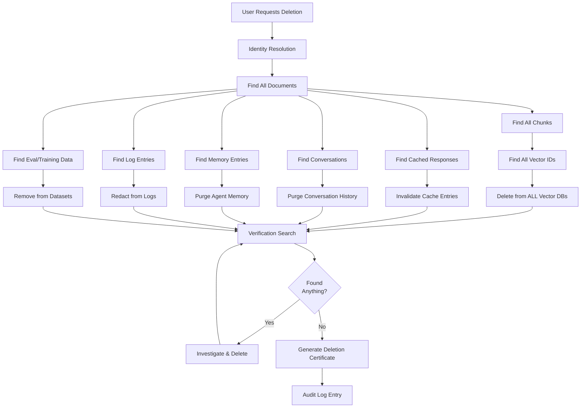
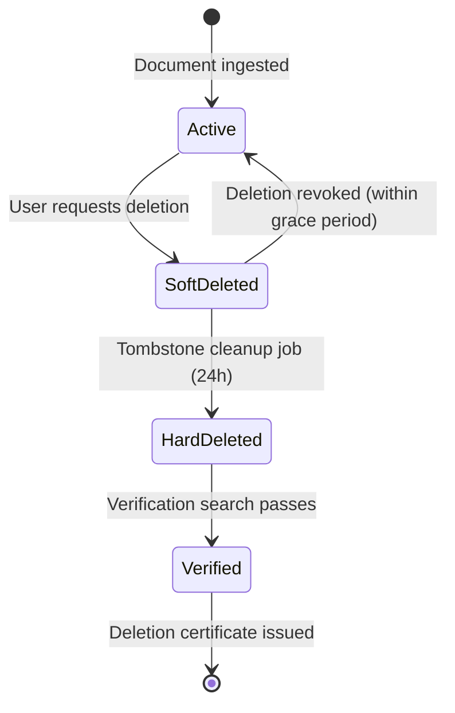

# Right to Erasure for AI Systems

## The GDPR "Right to Be Forgotten" Applied to AI

Article 17 of GDPR gives individuals the right to request deletion of their personal data. For traditional databases, this is straightforward — find rows, delete them. For AI systems, this is one of the hardest unsolved problems in the field.

---

## What Must Be Deleted When a User Requests Erasure

When User X says "delete all my data," you must delete from ALL of these:

### 1. Source Documents

```
Original files containing user's data:
- Uploaded documents (resumes, contracts, records)
- Email archives indexed for search
- Chat transcripts with the AI system
- Any file the user provided
```

### 2. Chunks Derived from Documents

```
Text chunks created during RAG ingestion:
- Document split into 512-token chunks
- Each chunk stored separately
- Overlapping chunks may duplicate data
- Must find ALL chunks from ALL user documents
```

### 3. Embeddings/Vectors

```python
# Vectors in potentially MULTIPLE vector databases:
# - Primary production index
# - Staging/test indexes (copies of prod)
# - Backup snapshots
# - Read replicas
# - A/B test variants
# Each vector encodes the user's information
```

### 4. Cached Responses

```
Semantic cache entries:
- Previous responses mentioning the user
- Cached RAG results that retrieved user's documents
- Any response that quotes user's data
```

### 5. Conversation History

```
All conversations the user had:
- Full chat history
- Summarized conversations (summaries contain PII too!)
- Conversation metadata (topics discussed)
```

### 6. Agent Memory Systems

```
Long-term memory:
- "User prefers dark mode" (preference)
- "User is a senior engineer at Acme" (personal fact)
- "User has deadline on March 15" (contextual)
- Memory summaries and reflections
```

### 7. Evaluation Datasets

```
If user's data was used for evaluation:
- Golden test sets containing user queries
- Benchmark datasets with user documents
- A/B test results referencing user
```

### 8. Logs and Traces

```
Observability data:
- Application logs with user queries
- Trace spans with full prompts/responses
- Metrics labels referencing user
- Error logs that captured user context
```

### 9. Fine-Tuning Data

```
Training datasets:
- If user's conversations used for fine-tuning
- RLHF preference data from user's feedback
- Instruction-tuning examples from user's queries
```

### 10. The Model Itself (The Hardest Problem)

```
If user's data was in pre-training or fine-tuning:
- Information encoded in billions of parameters
- Cannot "find and delete" a specific person's data
- Options:
  a) Retrain without user's data (expensive!)
  b) Machine unlearning (research-stage)
  c) Acknowledge limitation, document residual risk
```

---

## The Deletion Cascade



---

## Implementation

### Document-to-Vector ID Mapping (Critical Infrastructure)

```python
class DeletionTracker:
    """
    Maintains the mapping from users → documents → chunks → vector IDs.
    WITHOUT this mapping, deletion is nearly impossible.
    """
    
    def __init__(self, db):
        self.db = db
        # Schema:
        # user_documents: user_id → [doc_id, ...]
        # document_chunks: doc_id → [chunk_id, ...]
        # chunk_vectors: chunk_id → [vector_id, vector_db_name, ...]
        # user_conversations: user_id → [conversation_id, ...]
        # user_cache_keys: user_id → [cache_key, ...]
    
    def register_document(self, user_id: str, doc_id: str):
        self.db.add_mapping("user_documents", user_id, doc_id)
    
    def register_chunk(self, doc_id: str, chunk_id: str):
        self.db.add_mapping("document_chunks", doc_id, chunk_id)
    
    def register_vector(self, chunk_id: str, vector_id: str, db_name: str):
        self.db.add_mapping("chunk_vectors", chunk_id, {
            "vector_id": vector_id,
            "db_name": db_name
        })
    
    def get_all_vector_ids_for_user(self, user_id: str) -> list:
        """Get ALL vector IDs across ALL databases for a user."""
        doc_ids = self.db.get_mappings("user_documents", user_id)
        all_vectors = []
        for doc_id in doc_ids:
            chunk_ids = self.db.get_mappings("document_chunks", doc_id)
            for chunk_id in chunk_ids:
                vectors = self.db.get_mappings("chunk_vectors", chunk_id)
                all_vectors.extend(vectors)
        return all_vectors
```

### The Deletion Cascade Implementation

```python
import time
from dataclasses import dataclass, field
from typing import List

@dataclass
class DeletionResult:
    user_id: str
    started_at: float
    completed_at: float = 0
    documents_deleted: int = 0
    chunks_deleted: int = 0
    vectors_deleted: int = 0
    cache_entries_invalidated: int = 0
    conversations_purged: int = 0
    memory_entries_purged: int = 0
    log_entries_redacted: int = 0
    errors: List[str] = field(default_factory=list)

class DataDeletionCascade:
    def __init__(self, tracker, vector_dbs, cache, memory, log_store, conv_store):
        self.tracker = tracker
        self.vector_dbs = vector_dbs  # dict of name → VectorDB
        self.cache = cache
        self.memory = memory
        self.log_store = log_store
        self.conv_store = conv_store
    
    def execute_deletion(self, user_id: str) -> DeletionResult:
        result = DeletionResult(user_id=user_id, started_at=time.time())
        
        # Step 1: Delete vectors from ALL vector databases
        vectors = self.tracker.get_all_vector_ids_for_user(user_id)
        for vector_info in vectors:
            try:
                db = self.vector_dbs[vector_info["db_name"]]
                db.delete(ids=[vector_info["vector_id"]])
                result.vectors_deleted += 1
            except Exception as e:
                result.errors.append(f"Vector deletion failed: {e}")
        
        # Step 2: Delete chunks
        doc_ids = self.tracker.get_user_documents(user_id)
        for doc_id in doc_ids:
            chunks = self.tracker.get_chunks(doc_id)
            for chunk_id in chunks:
                self.chunk_store.delete(chunk_id)
                result.chunks_deleted += 1
        
        # Step 3: Delete source documents
        for doc_id in doc_ids:
            self.doc_store.delete(doc_id)
            result.documents_deleted += 1
        
        # Step 4: Invalidate cache
        cache_keys = self.tracker.get_user_cache_keys(user_id)
        for key in cache_keys:
            self.cache.invalidate(key)
            result.cache_entries_invalidated += 1
        
        # Step 5: Purge conversations
        conv_ids = self.tracker.get_user_conversations(user_id)
        for conv_id in conv_ids:
            self.conv_store.delete(conv_id)
            result.conversations_purged += 1
        
        # Step 6: Purge memory
        memory_count = self.memory.delete_all_for_user(user_id)
        result.memory_entries_purged = memory_count
        
        # Step 7: Redact logs
        log_count = self.log_store.redact_user(user_id)
        result.log_entries_redacted = log_count
        
        # Step 8: Clean up tracking data itself
        self.tracker.delete_all_mappings(user_id)
        
        result.completed_at = time.time()
        return result
```

### Deletion Verification

```python
class DeletionVerifier:
    """Verify that deletion was complete — no residual data remains."""
    
    def verify(self, user_id: str, user_identifiers: List[str]) -> dict:
        """
        Search ALL systems for any remaining trace of the user.
        
        user_identifiers: list of strings to search for
            e.g., ["John Smith", "john@acme.com", "555-0123"]
        """
        findings = {
            "vector_search": [],
            "cache_search": [],
            "log_search": [],
            "conversation_search": [],
            "memory_search": [],
        }
        
        # Search vector databases
        for identifier in user_identifiers:
            query_embedding = self.embedder.embed(identifier)
            for db_name, db in self.vector_dbs.items():
                results = db.search(query_embedding, top_k=10)
                for r in results:
                    if r.score > 0.9:  # High similarity = possible match
                        findings["vector_search"].append({
                            "db": db_name,
                            "vector_id": r.id,
                            "score": r.score
                        })
        
        # Search logs
        for identifier in user_identifiers:
            log_hits = self.log_store.search(identifier)
            findings["log_search"].extend(log_hits)
        
        # Search conversations
        conv_hits = self.conv_store.search_by_user(user_id)
        findings["conversation_search"].extend(conv_hits)
        
        # Search memory
        memory_hits = self.memory.search(user_id)
        findings["memory_search"].extend(memory_hits)
        
        is_clean = all(len(v) == 0 for v in findings.values())
        return {"clean": is_clean, "findings": findings}
```

---

## Implementation Challenges

### 1. Embeddings Don't Support "Delete by Content"

```python
# You CANNOT do this:
vector_db.delete(where={"text_contains": "John Smith"})

# You can ONLY do this:
vector_db.delete(ids=["vec_123", "vec_456"])

# This means you MUST maintain a mapping from user → vector IDs
# If you lose this mapping, you cannot delete!
```

**Solution:** Always maintain a document → chunk → vector ID mapping table. This is not optional — it's required infrastructure for compliance.

### 2. Distributed Systems: Propagation to ALL Replicas

```python
# Vector databases have:
# - Multiple shards (data split across machines)
# - Read replicas (copies for performance)
# - Backup snapshots (point-in-time copies)
# - CDN caches (edge copies)

# Deletion must reach ALL of them:
async def delete_everywhere(vector_id: str):
    # Primary
    await primary_db.delete(vector_id)
    
    # All replicas
    for replica in replicas:
        await replica.delete(vector_id)
    
    # Invalidate CDN
    await cdn.purge(f"/vectors/{vector_id}")
    
    # Mark in backup system (for next backup rotation)
    await backup_system.mark_for_deletion(vector_id)
```

### 3. Eventual Consistency

```
Timeline of deletion:
t=0:    User requests deletion
t=1s:   Primary DB deletes vector
t=5s:   Replica 1 propagates deletion
t=30s:  Replica 2 propagates deletion
t=1min: CDN cache expires
t=24h:  Backup snapshot rotates out

During t=0 to t=24h, data MAY still appear in some paths
Must document this latency for compliance
```

### 4. Shared Information Problem

```
# What if the same info exists in MULTIPLE users' documents?

# User A's document: "Meeting with Bob Smith on March 5"
# User B's document: "Bob Smith attended the March 5 meeting"

# User A requests deletion:
# - Delete User A's document ✓
# - But User B's document still mentions "Bob Smith"
# - Is that User A's data or User B's data?
# - Legal interpretation varies by jurisdiction
```

---

## Tombstones and Soft Deletion

### Strategy Comparison

```python
class SoftDeletion:
    """Mark as deleted, filter from results. Fast but data remains."""
    
    def delete(self, vector_id: str):
        # Just set a flag — data still physically exists
        self.db.update_metadata(vector_id, {"deleted": True, "deleted_at": time.time()})
    
    def search(self, query, top_k=10):
        # Filter out deleted items at query time
        results = self.db.search(query, top_k=top_k * 2)  # Over-fetch
        return [r for r in results if not r.metadata.get("deleted")]


class HardDeletion:
    """Actually remove from storage. Thorough but potentially slow."""
    
    def delete(self, vector_id: str):
        # Physically remove from index
        self.db.delete(ids=[vector_id])
        # May require index rebuild for some vector DBs
    
    def compact(self):
        # Some DBs need compaction to reclaim space
        self.db.compact()
```

### Tombstone Lifecycle



### Tombstone Cleanup Job

```python
class TombstoneCleanup:
    """Periodic job to hard-delete soft-deleted items."""
    
    def run(self, grace_period_hours: int = 24):
        """
        Run periodically (e.g., daily) to:
        1. Find items soft-deleted > grace_period ago
        2. Hard delete them
        3. Compact the index
        4. Log the cleanup for audit
        """
        cutoff = time.time() - (grace_period_hours * 3600)
        
        tombstones = self.db.query(
            filter={"deleted": True, "deleted_at": {"$lt": cutoff}}
        )
        
        for item in tombstones:
            self.db.hard_delete(item.id)
            self.audit_log.record(f"Hard deleted {item.id}")
        
        # Reclaim space
        self.db.compact()
        
        return len(tombstones)
```

---

## Deletion Audit Trail

```python
@dataclass
class DeletionAuditEntry:
    request_id: str
    user_id: str
    requested_at: str
    completed_at: str
    items_deleted: dict  # {type: count}
    verification_result: str  # "clean" or "residual_found"
    certificate_id: str  # Unique ID for compliance proof

class DeletionAuditLog:
    """
    Maintain proof of deletion for regulatory compliance.
    
    Paradox: You need to KEEP records that PROVE you DELETED records.
    The audit log must NOT contain the deleted PII itself.
    """
    
    def record_deletion(self, result: DeletionResult) -> str:
        entry = DeletionAuditEntry(
            request_id=generate_uuid(),
            user_id=hash(result.user_id),  # Hash, not plaintext!
            requested_at=result.started_at,
            completed_at=result.completed_at,
            items_deleted={
                "documents": result.documents_deleted,
                "chunks": result.chunks_deleted,
                "vectors": result.vectors_deleted,
                "cache_entries": result.cache_entries_invalidated,
                "conversations": result.conversations_purged,
                "memory_entries": result.memory_entries_purged,
                "log_entries": result.log_entries_redacted,
            },
            verification_result="clean" if not result.errors else "errors",
            certificate_id=generate_certificate_id()
        )
        self.store.save(entry)
        return entry.certificate_id
```

---

## Machine Unlearning (Emerging Research)

For data that was used in model training, full deletion is theoretically impossible without retraining. Emerging approaches:

```
1. SISA Training (Sharded, Isolated, Sliced, Aggregated):
   - Split training data into shards
   - Train sub-models on each shard
   - To delete: only retrain the affected shard
   - Much cheaper than full retraining

2. Gradient Ascent Unlearning:
   - Apply negative gradient for data to forget
   - Approximately "reverses" the learning
   - Not mathematically guaranteed

3. Knowledge Distillation:
   - Train a new model using old model as teacher
   - But exclude the data to be forgotten
   - New model doesn't have the knowledge

Status: All approaches are research-stage, none are production-ready
Current practical approach: Document the limitation, implement for all other systems
```

---

## Key Takeaways

1. **Maintain document → chunk → vector ID mappings** — without this, deletion is impossible
2. **Deletion is a cascade** — touching 8+ different systems for each request
3. **Verification is essential** — always search after deletion to confirm completeness
4. **Soft delete first, hard delete later** — provides grace period and faster initial response
5. **Audit trail is required** — prove you deleted without storing the deleted data
6. **Model unlearning is unsolved** — acknowledge this limitation, implement everything else
7. **Plan for deletion from day one** — retrofitting deletion support is extremely painful
