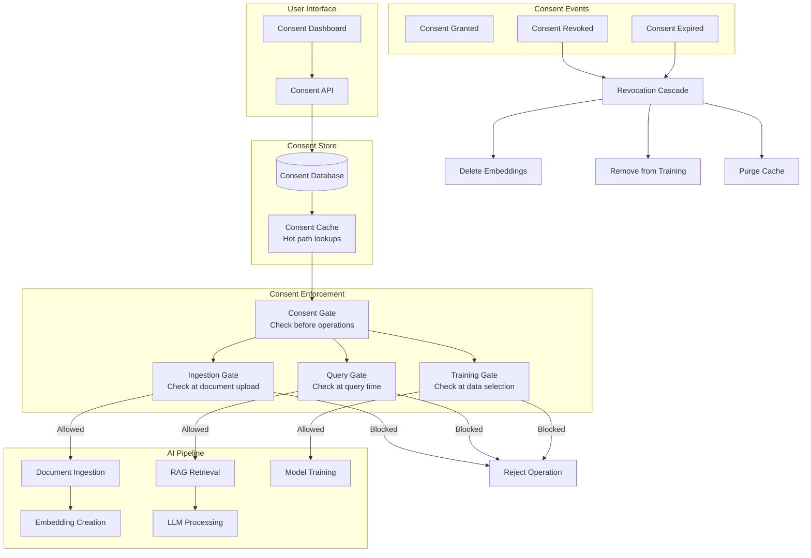

# Consent Management for AI Systems

## What Is Consent Management for AI?

Traditional consent: "Can we store your data?" (binary yes/no)

AI consent is multi-dimensional: "Can we store your data AND embed it AND search it AND use it to train models AND send it to third-party LLMs AND use it for analytics?"

Each dimension requires separate, informed consent that can be independently granted and revoked.

---

## Consent Types for AI

| Consent Type | What It Allows | Example |
|-------------|----------------|---------|
| **Data Storage** | Store documents in the system | Upload files to knowledge base |
| **AI Processing** | Send data to LLM for processing | Ask questions about documents |
| **Embedding** | Create vector embeddings for search | Enable semantic search over docs |
| **Training** | Use data to fine-tune/train models | Improve model based on interactions |
| **Analytics** | Analyze patterns in usage | Track query patterns, usage stats |
| **Third-Party** | Send data to external AI providers | Use OpenAI, Anthropic, etc. |

### Why Each Matters

```python
# User might consent to:
# ✓ Storage (keep my docs)
# ✓ AI Processing (answer questions about them)
# ✗ Embedding (don't put them in semantic search for others)
# ✗ Training (don't learn from my data)
# ✓ Analytics (track my usage)
# ✗ Third-Party (only use on-premise models)

# This is COMMON — users want utility but with boundaries
```

---

## Consent Granularity

### Per-Document Consent

```python
# Each document can have different consent levels
consent_records = {
    "doc_001": {
        "user_id": "user_123",
        "document_id": "doc_001",
        "consents": {
            "storage": True,
            "embedding": True,
            "rag_retrieval": True,
            "training": False,  # Don't use this doc for training
        }
    },
    "doc_002": {
        "user_id": "user_123",
        "document_id": "doc_002",
        "consents": {
            "storage": True,
            "embedding": False,  # Don't embed this one
            "rag_retrieval": False,
            "training": False,
        }
    }
}
```

### Per-Purpose Consent

```python
# Consent tied to specific use cases
purpose_consent = {
    "user_id": "user_123",
    "purposes": {
        "customer_support_rag": True,   # Use my data for support
        "product_improvement": False,    # Don't use for product dev
        "personalization": True,         # Personalize my experience
        "model_training": False,         # Don't train on my data
        "research": False,               # Don't use for research
    }
}
```

### Per-Provider Consent

```python
# User controls which AI providers can process their data
provider_consent = {
    "user_id": "user_123",
    "providers": {
        "openai": False,      # Don't send to OpenAI
        "anthropic": True,    # Anthropic is OK
        "on_premise": True,   # On-premise models always OK
        "google": False,      # Don't send to Google
    }
}
```

### Temporal Consent

```python
# Consent with expiration
temporal_consent = {
    "user_id": "user_123",
    "consent": "training",
    "granted_at": "2024-01-01T00:00:00Z",
    "expires_at": "2024-12-31T23:59:59Z",  # Auto-revokes after 1 year
    "renewal_required": True,  # Must re-consent to continue
}
```

---

## Consent Management Architecture



---

## Implementation

### Consent Store

```python
from datetime import datetime, timezone
from enum import Enum
from typing import Optional
import json

class ConsentStatus(Enum):
    GRANTED = "granted"
    DENIED = "denied"
    REVOKED = "revoked"
    EXPIRED = "expired"

class ConsentRecord:
    def __init__(self, user_id: str, consent_type: str, status: ConsentStatus,
                 granted_at: datetime = None, expires_at: datetime = None,
                 scope: dict = None):
        self.user_id = user_id
        self.consent_type = consent_type
        self.status = status
        self.granted_at = granted_at or datetime.now(timezone.utc)
        self.expires_at = expires_at
        self.scope = scope or {}  # e.g., {"documents": ["doc_1"], "providers": ["anthropic"]}

class ConsentStore:
    def __init__(self, db):
        self.db = db
        self.cache = {}  # user_id:consent_type → ConsentRecord
    
    def grant(self, user_id: str, consent_type: str, 
              expires_at: datetime = None, scope: dict = None) -> ConsentRecord:
        record = ConsentRecord(
            user_id=user_id,
            consent_type=consent_type,
            status=ConsentStatus.GRANTED,
            expires_at=expires_at,
            scope=scope
        )
        self.db.save(record)
        self._update_cache(record)
        self._emit_event("consent_granted", record)
        return record
    
    def revoke(self, user_id: str, consent_type: str) -> ConsentRecord:
        record = self.db.get(user_id, consent_type)
        record.status = ConsentStatus.REVOKED
        record.revoked_at = datetime.now(timezone.utc)
        self.db.save(record)
        self._update_cache(record)
        self._emit_event("consent_revoked", record)
        return record
    
    def check(self, user_id: str, consent_type: str, 
              provider: str = None, document_id: str = None) -> bool:
        """Check if user has valid consent for an operation."""
        record = self._get_from_cache(user_id, consent_type)
        
        if not record or record.status != ConsentStatus.GRANTED:
            return False
        
        # Check expiration
        if record.expires_at and datetime.now(timezone.utc) > record.expires_at:
            self.revoke(user_id, consent_type)  # Auto-expire
            return False
        
        # Check scope
        if provider and record.scope.get("providers"):
            if provider not in record.scope["providers"]:
                return False
        
        if document_id and record.scope.get("documents"):
            if document_id not in record.scope["documents"]:
                return False
        
        return True
```

### Consent Gate (Enforcement Point)

```python
class ConsentGate:
    """Blocks AI operations that lack valid consent."""
    
    def __init__(self, consent_store: ConsentStore):
        self.store = consent_store
    
    def check_ingestion(self, user_id: str, doc_id: str) -> dict:
        """Check consent before ingesting a document."""
        return {
            "storage": self.store.check(user_id, "storage"),
            "embedding": self.store.check(user_id, "embedding", document_id=doc_id),
        }
    
    def check_query(self, user_id: str, provider: str) -> dict:
        """Check consent before processing a query."""
        return {
            "ai_processing": self.store.check(user_id, "ai_processing"),
            "provider_allowed": self.store.check(user_id, "third_party", provider=provider),
        }
    
    def check_training(self, user_id: str, doc_id: str) -> bool:
        """Check consent before including data in training."""
        return self.store.check(user_id, "training", document_id=doc_id)
    
    def enforce(self, user_id: str, operation: str, **kwargs) -> bool:
        """
        Single enforcement point. Raises if consent not given.
        """
        has_consent = self.store.check(user_id, operation, **kwargs)
        if not has_consent:
            raise ConsentDeniedException(
                f"User {user_id} has not consented to '{operation}'"
            )
        return True
```

### Consent-Aware RAG Pipeline

```python
class ConsentAwareRAG:
    """RAG pipeline that respects consent at every step."""
    
    def __init__(self, consent_gate, vector_db, llm):
        self.consent_gate = consent_gate
        self.vector_db = vector_db
        self.llm = llm
    
    def query(self, user_id: str, query: str, provider: str = "anthropic"):
        # Check: does user consent to AI processing?
        self.consent_gate.enforce(user_id, "ai_processing")
        
        # Check: does user consent to this provider?
        self.consent_gate.enforce(user_id, "third_party", provider=provider)
        
        # Retrieve — but only from documents with retrieval consent
        results = self.vector_db.search(query, top_k=20)
        
        # Filter: only include documents whose owners consented to retrieval
        consented_results = []
        for result in results:
            doc_owner = result.metadata["owner_id"]
            if self.consent_gate.store.check(doc_owner, "rag_retrieval"):
                consented_results.append(result)
        
        # Generate with filtered context only
        context = "\n".join([r.text for r in consented_results[:5]])
        response = self.llm.generate(query, context=context)
        return response
```

---

## Handling Consent Withdrawal

### Revocation Cascade

```python
class ConsentRevocationHandler:
    """Handle the downstream effects when consent is withdrawn."""
    
    def __init__(self, consent_store, deletion_cascade, vector_db, training_pipeline):
        self.consent_store = consent_store
        self.deletion = deletion_cascade
        self.vector_db = vector_db
        self.training = training_pipeline
    
    def handle_revocation(self, user_id: str, consent_type: str):
        """Route revocation to appropriate handler."""
        handlers = {
            "embedding": self._revoke_embedding,
            "training": self._revoke_training,
            "storage": self._revoke_storage,
            "rag_retrieval": self._revoke_retrieval,
            "third_party": self._revoke_third_party,
        }
        handler = handlers.get(consent_type)
        if handler:
            handler(user_id)
    
    def _revoke_embedding(self, user_id: str):
        """User revokes embedding consent → delete all their vectors."""
        vectors = self.deletion.tracker.get_all_vector_ids_for_user(user_id)
        for v in vectors:
            self.vector_db.delete(ids=[v["vector_id"]])
        # Rebuild any affected indexes
        self.vector_db.rebuild_index()
    
    def _revoke_training(self, user_id: str):
        """User revokes training consent → remove from training datasets."""
        self.training.remove_user_data(user_id)
        # Flag: next training run must exclude this user's data
        self.training.add_exclusion(user_id)
    
    def _revoke_storage(self, user_id: str):
        """User revokes storage consent → full deletion cascade."""
        # This is the nuclear option — delete everything
        self.deletion.execute_deletion(user_id)
    
    def _revoke_retrieval(self, user_id: str):
        """User revokes RAG retrieval → mark docs as non-retrievable."""
        docs = self.deletion.tracker.get_user_documents(user_id)
        for doc_id in docs:
            self.vector_db.update_metadata(
                doc_id, {"retrievable": False}
            )
```

---

## Consent Audit Log

```python
class ConsentAuditLog:
    """Track all consent changes for compliance."""
    
    def record(self, event_type: str, record: ConsentRecord, context: dict = None):
        entry = {
            "timestamp": datetime.now(timezone.utc).isoformat(),
            "event_type": event_type,  # granted, revoked, expired, checked
            "user_id": record.user_id,
            "consent_type": record.consent_type,
            "status": record.status.value,
            "scope": record.scope,
            "context": context or {},
            # For compliance: WHO made the change, HOW (API, UI, auto-expire)
            "actor": context.get("actor", "system"),
            "channel": context.get("channel", "api"),
        }
        self.store.append(entry)
    
    def get_user_history(self, user_id: str) -> list:
        """Get complete consent history for a user (for data subject access requests)."""
        return self.store.query(user_id=user_id, order_by="timestamp")
    
    def generate_consent_report(self, user_id: str) -> dict:
        """Generate a compliance report showing current consent state."""
        current = self.consent_store.get_all_for_user(user_id)
        history = self.get_user_history(user_id)
        return {
            "user_id": user_id,
            "generated_at": datetime.now(timezone.utc).isoformat(),
            "current_consents": {c.consent_type: c.status.value for c in current},
            "total_changes": len(history),
            "last_updated": history[-1]["timestamp"] if history else None,
        }
```

---

## Consent UI Patterns

### Progressive Consent (Best Practice)

```
Step 1 (Account creation):
  "Can we store your documents?" [Required for service]
  ✓ Accept

Step 2 (First search):
  "To enable search, we need to create embeddings of your documents.
   This means your content will be indexed for semantic search."
  ✓ Accept  ✗ Decline (basic keyword search only)

Step 3 (First LLM query):
  "To answer questions, we'll send relevant document excerpts to [Provider].
   Your data will be processed but not stored by the provider."
  ✓ Accept  ✗ Decline (search only, no AI answers)

Step 4 (Opt-in, not default):
  "Help improve our AI? Allow your interactions to improve our models."
  ✓ Yes, contribute  ✗ No thanks
```

### Consent Dashboard

```
┌─────────────────────────────────────────────────────┐
│  Your Privacy Controls                               │
├─────────────────────────────────────────────────────┤
│                                                      │
│  Data Storage           [✓ Enabled]    [Manage]     │
│  AI Processing          [✓ Enabled]    [Manage]     │
│  Semantic Search        [✓ Enabled]    [Manage]     │
│  Model Training         [✗ Disabled]   [Enable]     │
│  Analytics              [✓ Enabled]    [Manage]     │
│  Third-Party Providers  [Partial]      [Manage]     │
│    ├─ Anthropic         [✓]                         │
│    ├─ OpenAI            [✗]                         │
│    └─ Google            [✗]                         │
│                                                      │
│  [Download My Data]  [Delete All Data]              │
│                                                      │
│  Last updated: 2024-01-15                           │
│  View full consent history →                        │
└─────────────────────────────────────────────────────┘
```

---

## Key Takeaways

1. **AI consent is multi-dimensional** — storage, embedding, retrieval, training, and third-party are all different
2. **Check consent before EVERY operation** — consent gates must be on the hot path
3. **Consent revocation triggers cascades** — revoking embedding consent means deleting all vectors
4. **Progressive consent respects users** — ask when the capability is first needed, not all upfront
5. **Audit everything** — complete history of consent changes is required for compliance
6. **Make it easy to change** — consent should be as easy to revoke as it was to grant
