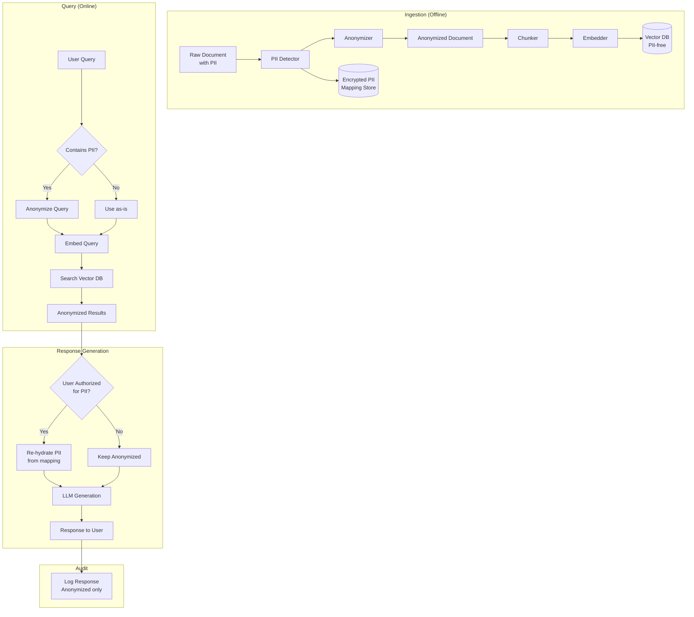

# Privacy-Preserving RAG

## The Challenge

RAG (Retrieval-Augmented Generation) needs to search across documents to find relevant context. But those documents contain PII — names, emails, medical information, financial data. Without privacy controls, RAG becomes a PII leakage machine:

```
User A asks: "What's the average salary for engineers?"
RAG retrieves: "Bob Johnson (Senior Engineer): $185,000, SSN: 123-45-6789"
LLM responds: "Based on records, engineers earn around $185,000. For example, Bob Johnson..."

# PII leaked: name, salary, potentially SSN
```

---

## Privacy-Preserving RAG Strategies

### Strategy 1: Pre-Embedding PII Removal

```
Original:  "John Smith (john@acme.com) reported a bug on March 5"
Anonymized: "[PERSON] ([EMAIL]) reported a bug on [DATE]"
Embedded:   vector of anonymized text

At retrieval: returns anonymized chunks
At generation: LLM works with anonymized context
```

**Pros:**
- No PII stored in vector database whatsoever
- Safe even if vector DB is compromised
- Simple to implement

**Cons:**
- Loses semantic meaning ("the CEO" vs the actual name)
- Can't search for specific people
- Context is degraded for the LLM

### Strategy 2: Anonymized Embeddings with Pseudonyms

```
Original:  "John Smith met with Jane Doe to discuss Project Alpha"
Pseudonymized: "Person_A met with Person_B to discuss Project Alpha"

Key insight: Same entity gets SAME pseudonym across ALL documents
- "John Smith" → "Person_A" everywhere
- Relationships preserved: "Person_A met with Person_B" is searchable
```

**Pros:**
- Maintains relational context between entities
- Consistent references across documents
- Can still reason about "who met whom"

**Cons:**
- Pseudonym mapping must be secured (it's the key to re-identify)
- Must process ALL documents consistently
- New documents must use same mapping

### Strategy 3: Access-Controlled Retrieval

```python
# Keep PII in documents, but enforce access control on retrieval

def search(query, user_id):
    results = vector_db.search(query, top_k=50)
    
    # Filter: user can only see their own docs + shared docs
    allowed = [r for r in results if can_access(user_id, r.doc_id)]
    
    return allowed[:10]
```

**Pros:**
- Full context preserved — best quality
- No data transformation needed
- Standard security model

**Cons:**
- Permission system must be bulletproof (single bug = data leak)
- Doesn't protect against compromised vector DB
- Doesn't prevent the LLM from memorizing PII in context

### Strategy 4: Differential Privacy for Retrieval

```python
import numpy as np

def private_search(query_embedding, epsilon=1.0):
    """Add noise to retrieval scores to prevent inference attacks."""
    scores = vector_db.similarity_scores(query_embedding)
    
    # Add Laplace noise calibrated to epsilon
    sensitivity = 1.0  # Max change from one document
    noise = np.random.laplace(0, sensitivity / epsilon, len(scores))
    noisy_scores = scores + noise
    
    # Return top-k based on noisy scores
    top_k_indices = np.argsort(noisy_scores)[-10:]
    return top_k_indices
```

**Pros:**
- Mathematical guarantee: can't infer if specific doc exists
- Prevents membership inference attacks

**Cons:**
- Quality degradation (wrong docs may rank higher due to noise)
- Tradeoff parameter (epsilon) is hard to tune
- Doesn't prevent PII in retrieved docs from leaking

### Strategy 5: Federated RAG

```
Architecture:
┌─────────────────┐     ┌─────────────────┐
│ User A's Env    │     │ User B's Env    │
│ ┌─────────────┐ │     │ ┌─────────────┐ │
│ │ Local Vector│ │     │ │ Local Vector│ │
│ │ DB (A's     │ │     │ │ DB (B's     │ │
│ │ data only)  │ │     │ │ data only)  │ │
│ └──────┬──────┘ │     │ └──────┬──────┘ │
└────────┼────────┘     └────────┼────────┘
         │                       │
         └───────┬───────────────┘
                 │ Only queries travel
         ┌───────▼───────┐
         │ Central Query  │
         │ Router         │
         └───────┬───────┘
                 │
         ┌───────▼───────┐
         │ LLM Generation│
         │ (sees only    │
         │  authorized   │
         │  results)     │
         └───────────────┘
```

**Pros:**
- Data never leaves user's environment
- Full privacy by architecture
- No central point of compromise

**Cons:**
- High latency (query must reach all federated nodes)
- Complex infrastructure
- Can't cross-reference between users' data

---

## Implementation: Pre-Embedding PII Removal Pipeline

### Complete Pipeline

```python
import re
import json
import hashlib
from typing import Dict, List, Tuple
from dataclasses import dataclass

@dataclass
class PIIEntity:
    original: str
    type: str
    token: str
    start: int
    end: int

class PrivacyPreservingRAG:
    """
    Full implementation of privacy-preserving RAG with PII removal.
    
    Flow:
    1. Ingest document → detect PII → replace with tokens → embed
    2. Store mapping (encrypted) for authorized re-hydration
    3. Search on anonymized text
    4. Optionally re-hydrate for authorized users
    """
    
    def __init__(self, embedder, vector_db, llm, encryption_key):
        self.embedder = embedder
        self.vector_db = vector_db
        self.llm = llm
        self.encryption_key = encryption_key
        self.entity_counters = {}  # type → counter
        self.entity_map = {}  # doc_id → {token → original}
    
    # ─── INGESTION ───────────────────────────────────────────
    
    def ingest_document(self, doc_id: str, text: str) -> str:
        """Ingest a document with PII removal."""
        
        # Step 1: Detect PII
        entities = self._detect_pii(text)
        
        # Step 2: Replace PII with consistent tokens
        anonymized_text, mapping = self._anonymize(text, entities)
        
        # Step 3: Store encrypted mapping
        self._store_mapping(doc_id, mapping)
        
        # Step 4: Chunk the anonymized text
        chunks = self._chunk(anonymized_text, doc_id)
        
        # Step 5: Embed and store
        for chunk_id, chunk_text in chunks:
            embedding = self.embedder.embed(chunk_text)
            self.vector_db.upsert(
                id=chunk_id,
                vector=embedding,
                metadata={
                    "doc_id": doc_id,
                    "text": chunk_text,
                    "anonymized": True
                }
            )
        
        return anonymized_text
    
    def _detect_pii(self, text: str) -> List[PIIEntity]:
        """Detect all PII in text using hybrid approach."""
        entities = []
        
        # Regex patterns
        patterns = {
            "EMAIL": r'\b[A-Za-z0-9._%+-]+@[A-Za-z0-9.-]+\.[A-Z|a-z]{2,}\b',
            "PHONE": r'\b\d{3}[-.]?\d{3}[-.]?\d{4}\b',
            "SSN": r'\b\d{3}-\d{2}-\d{4}\b',
        }
        
        for pii_type, pattern in patterns.items():
            for match in re.finditer(pattern, text):
                entities.append(PIIEntity(
                    original=match.group(),
                    type=pii_type,
                    token="",  # Assigned during anonymization
                    start=match.start(),
                    end=match.end()
                ))
        
        # NER for names (simplified)
        # In production, use spaCy or transformers NER
        name_pattern = r'\b[A-Z][a-z]+ [A-Z][a-z]+\b'
        for match in re.finditer(name_pattern, text):
            entities.append(PIIEntity(
                original=match.group(),
                type="PERSON",
                token="",
                start=match.start(),
                end=match.end()
            ))
        
        return sorted(entities, key=lambda e: e.start)
    
    def _anonymize(self, text: str, entities: List[PIIEntity]) -> Tuple[str, Dict]:
        """Replace PII with consistent tokens."""
        mapping = {}  # token → original
        
        # Process in reverse order to maintain positions
        for entity in sorted(entities, key=lambda e: e.start, reverse=True):
            # Generate consistent token for same entity
            entity_hash = hashlib.md5(entity.original.lower().encode()).hexdigest()[:8]
            token = f"[{entity.type}_{entity_hash}]"
            
            entity.token = token
            mapping[token] = entity.original
            text = text[:entity.start] + token + text[entity.end:]
        
        return text, mapping
    
    def _store_mapping(self, doc_id: str, mapping: Dict):
        """Store PII mapping encrypted (for authorized re-hydration)."""
        self.entity_map[doc_id] = mapping
        # In production: encrypt with self.encryption_key and store in secure DB
    
    def _chunk(self, text: str, doc_id: str) -> List[Tuple[str, str]]:
        """Split text into chunks."""
        chunk_size = 500
        chunks = []
        for i in range(0, len(text), chunk_size):
            chunk_text = text[i:i + chunk_size]
            chunk_id = f"{doc_id}_chunk_{i // chunk_size}"
            chunks.append((chunk_id, chunk_text))
        return chunks
    
    # ─── RETRIEVAL ───────────────────────────────────────────
    
    def search(self, query: str, top_k: int = 5, 
               rehydrate: bool = False, user_authorized: bool = False) -> List[dict]:
        """Search with privacy preservation."""
        
        # Anonymize query too (in case it contains PII)
        query_entities = self._detect_pii(query)
        anonymized_query, _ = self._anonymize(query, query_entities)
        
        # Search on anonymized content
        query_embedding = self.embedder.embed(anonymized_query)
        results = self.vector_db.search(query_embedding, top_k=top_k)
        
        output = []
        for result in results:
            text = result.metadata["text"]
            
            # Optionally re-hydrate PII for authorized users
            if rehydrate and user_authorized:
                doc_id = result.metadata["doc_id"]
                mapping = self.entity_map.get(doc_id, {})
                for token, original in mapping.items():
                    text = text.replace(token, original)
            
            output.append({
                "id": result.id,
                "text": text,
                "score": result.score,
                "anonymized": not (rehydrate and user_authorized)
            })
        
        return output
    
    # ─── GENERATION ──────────────────────────────────────────
    
    def generate(self, query: str, user_authorized: bool = False) -> str:
        """Generate answer with privacy-preserved context."""
        
        # Get anonymized context
        results = self.search(query, top_k=5, 
                            rehydrate=user_authorized,
                            user_authorized=user_authorized)
        
        context = "\n---\n".join([r["text"] for r in results])
        
        prompt = f"""Answer the question based on the context below.
If names are replaced with tokens like [PERSON_xxx], use those tokens in your answer.

Context:
{context}

Question: {query}

Answer:"""
        
        return self.llm.generate(prompt)
```

---

## Comparison: Standard RAG vs Privacy RAG

### Standard RAG (Leaks PII)

```
Document: "John Smith (john@acme.com, SSN: 123-45-6789) earned $185,000 in 2023"

Embedding: Contains encoded PII
Vector DB: Stores PII in metadata
Retrieval: Returns full PII to any querier
LLM context: Sees all PII
Response: May include PII
Logs: Record full PII

Attack surface: EVERYTHING leaks
```

### Privacy-Preserving RAG

```
Document: "John Smith (john@acme.com, SSN: 123-45-6789) earned $185,000 in 2023"

After anonymization: "[PERSON_a1b2] ([EMAIL_c3d4], SSN: [SSN_e5f6]) earned $185,000 in 2023"

Embedding: No PII encoded
Vector DB: Stores anonymized text only
Retrieval: Returns anonymized chunks
LLM context: Sees tokens, not PII
Response: Uses tokens (or re-hydrates for authorized users)
Logs: Only anonymized text recorded

Attack surface: Even if DB compromised, no PII exposed
```

---

## Advanced: Consistent Pseudonym Management

```python
class PseudonymManager:
    """
    Ensures the same entity gets the same pseudonym across ALL documents.
    Critical for maintaining relationships and searchability.
    """
    
    def __init__(self):
        self.global_map = {}  # normalized_entity → pseudonym
        self.reverse_map = {}  # pseudonym → original (encrypted)
    
    def get_pseudonym(self, entity: str, entity_type: str) -> str:
        """Get or create a consistent pseudonym."""
        normalized = entity.strip().lower()
        
        if normalized in self.global_map:
            return self.global_map[normalized]
        
        # Create new pseudonym
        counter = len([k for k in self.global_map.values() 
                      if k.startswith(f"[{entity_type}_")])
        pseudonym = f"[{entity_type}_{counter + 1}]"
        
        self.global_map[normalized] = pseudonym
        self.reverse_map[pseudonym] = entity  # Store encrypted in production
        
        return pseudonym
    
    def resolve(self, pseudonym: str, authorized: bool = False) -> str:
        """Resolve pseudonym back to original (authorized users only)."""
        if not authorized:
            return pseudonym
        return self.reverse_map.get(pseudonym, pseudonym)

# Usage:
# "John Smith" in doc_1 → [PERSON_1]
# "John Smith" in doc_2 → [PERSON_1] (same!)
# "Jane Doe" in doc_3 → [PERSON_2]
# Now you can search: "What did [PERSON_1] do?" and find both docs
```

---

## Privacy-Preserving RAG Pipeline



---

## Performance Impact

| Metric | Standard RAG | Privacy RAG | Impact |
|--------|-------------|-------------|--------|
| Ingestion latency | 100ms/doc | 250ms/doc | +150% (PII detection) |
| Query latency | 50ms | 55ms | +10% (query anonymization) |
| Search quality (MRR) | 0.85 | 0.78 | -8% (anonymized context) |
| Storage overhead | 1x | 1.3x | +30% (mapping store) |
| Security posture | Low | High | Significantly improved |

**The 8% quality loss** comes from the LLM receiving `[PERSON_1]` instead of "John Smith" — it can't use name familiarity or context. For most use cases, this is an acceptable tradeoff.

---

## Key Takeaways

1. **Choose strategy based on threat model** — access control is fine for internal tools; full anonymization needed for sensitive data
2. **Consistent pseudonyms are critical** — same entity must get same token across all documents
3. **Re-hydration is the privilege** — only authorized users get to see real PII
4. **The quality tradeoff is real but manageable** — 5-10% quality loss for dramatically better privacy
5. **Apply at ingestion, not just retrieval** — PII should never enter the vector database
