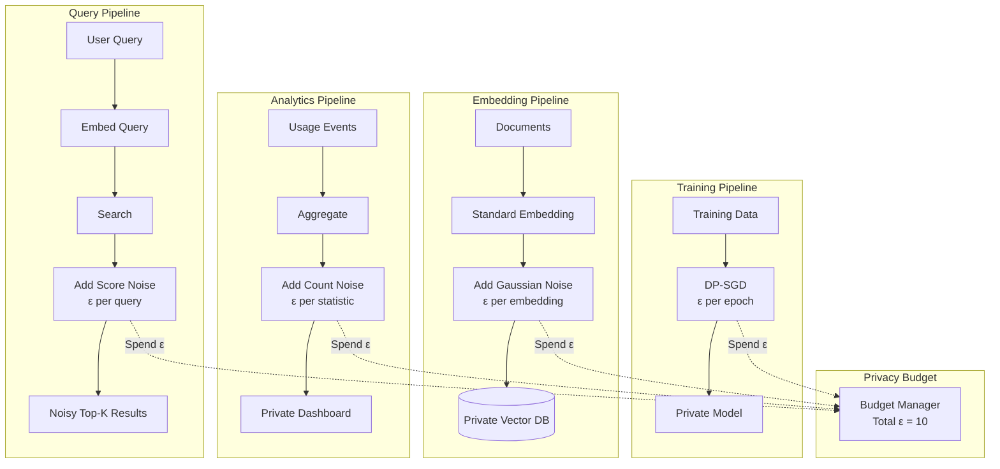

# Differential Privacy for AI Systems

## What Is Differential Privacy?

**The "plausible deniability" analogy:**

Imagine a survey asking "Have you committed tax fraud?" Nobody will answer honestly. Instead, use this protocol:
1. Flip a coin (privately)
2. If heads: answer truthfully
3. If tails: flip again — heads = "yes", tails = "no"

Now any individual "yes" has plausible deniability (could have been the coin). But in aggregate, you can still estimate the true rate. This is the essence of differential privacy.

### Formal Definition

```
A mechanism M satisfies ε-differential privacy if for any two datasets 
D and D' that differ in one record, and any output S:

    P[M(D) ∈ S] ≤ e^ε × P[M(D') ∈ S]

Translation: The output doesn't change significantly whether or not 
any specific person's data is included.
```

### Epsilon (ε): The Privacy Budget

| ε Value | Privacy Level | Utility Impact | Use Case |
|---------|--------------|----------------|----------|
| 0.1 | Excellent privacy | High noise, significant quality loss | Medical research |
| 1.0 | Good privacy | Moderate noise, noticeable quality loss | Financial analytics |
| 5.0 | Moderate privacy | Low noise, minor quality loss | General enterprise |
| 10.0 | Weak privacy | Minimal noise, negligible quality loss | Low-sensitivity data |

**Rule of thumb:** ε ≤ 1 is considered "strong" privacy. ε > 10 provides minimal protection.

---

## Where Differential Privacy Applies in AI

```mermaid
graph TB
    subgraph "Training"
        A[Training Data] -->|DP-SGD| B[Private Model]
    end
    
    subgraph "Embeddings"
        C[Text] -->|Embed + Noise| D[Private Embeddings]
    end
    
    subgraph "Retrieval"
        E[Query] -->|Search + Noise| F[Private Results]
    end
    
    subgraph "Analytics"
        G[Usage Data] -->|Aggregate + Noise| H[Private Statistics]
    end
    
    subgraph "Logs"
        I[Events] -->|Anonymize + Noise| J[Private Logs]
    end
    
    style A fill:#ffcccc
    style C fill:#ffcccc
    style E fill:#ffcccc
    style G fill:#ffcccc
    style I fill:#ffcccc
    
    style B fill:#ccffcc
    style D fill:#ccffcc
    style F fill:#ccffcc
    style H fill:#ccffcc
    style J fill:#ccffcc
```



---

## DP for Embeddings

### The Problem

Embeddings encode personal information. If an attacker has access to your vector database, they can:
- Use inversion attacks to recover approximate text
- Use nearest-neighbor queries to find related records
- Perform membership inference (is this person in the database?)

### The Solution: Add Calibrated Noise

```python
import numpy as np

def add_dp_noise_to_embedding(embedding: np.ndarray, epsilon: float, 
                                sensitivity: float = 1.0) -> np.ndarray:
    """
    Add Gaussian noise to embedding for differential privacy.
    
    Args:
        embedding: Original embedding vector
        epsilon: Privacy budget (lower = more private)
        sensitivity: Maximum L2 change from one record (usually 1.0 for normalized embeddings)
    
    Returns:
        Noisy embedding satisfying (epsilon, delta)-DP
    """
    delta = 1e-5  # Probability of privacy breach
    
    # Gaussian mechanism: sigma = sensitivity * sqrt(2 * ln(1.25/delta)) / epsilon
    sigma = sensitivity * np.sqrt(2 * np.log(1.25 / delta)) / epsilon
    
    # Add noise
    noise = np.random.normal(0, sigma, size=embedding.shape)
    noisy_embedding = embedding + noise
    
    # Re-normalize (embeddings should be unit length)
    noisy_embedding = noisy_embedding / np.linalg.norm(noisy_embedding)
    
    return noisy_embedding


# Impact on search quality at different epsilon values:
# ε=0.1:  ~40% of top-10 results are wrong (unusable for search)
# ε=1.0:  ~15-20% quality loss (acceptable for sensitive data)
# ε=5.0:  ~3-5% quality loss (good tradeoff)
# ε=10.0: ~1% quality loss (minimal privacy, minimal impact)
```

### Measuring Impact on Search Quality

```python
def measure_dp_impact(original_embeddings, queries, epsilon_values):
    """Compare search quality across different privacy levels."""
    
    results = {}
    
    # Baseline: no noise
    baseline_results = search(queries, original_embeddings)
    
    for epsilon in epsilon_values:
        # Add noise to all embeddings
        noisy_embeddings = [
            add_dp_noise_to_embedding(emb, epsilon) 
            for emb in original_embeddings
        ]
        
        # Search with noisy embeddings
        noisy_results = search(queries, noisy_embeddings)
        
        # Measure quality
        results[epsilon] = {
            "recall_at_10": compute_recall(baseline_results, noisy_results, k=10),
            "mrr": compute_mrr(baseline_results, noisy_results),
            "ndcg": compute_ndcg(baseline_results, noisy_results),
        }
    
    return results

# Typical results:
# ε=0.1:  recall@10=0.45, MRR=0.32, NDCG=0.38
# ε=1.0:  recall@10=0.72, MRR=0.65, NDCG=0.70
# ε=5.0:  recall@10=0.92, MRR=0.88, NDCG=0.90
# ε=10.0: recall@10=0.98, MRR=0.96, NDCG=0.97
```

---

## DP for Fine-Tuning (DP-SGD)

### Standard SGD vs DP-SGD

```python
# Standard SGD (no privacy):
def standard_sgd_step(model, batch, learning_rate):
    gradients = compute_gradients(model, batch)
    model.parameters -= learning_rate * mean(gradients)
    # Problem: individual examples can heavily influence the model
    # Result: model memorizes specific training examples

# DP-SGD (differentially private):
def dp_sgd_step(model, batch, learning_rate, clip_norm, noise_sigma):
    gradients = compute_gradients(model, batch)
    
    # Step 1: CLIP each gradient (bound individual contribution)
    clipped_gradients = [
        clip(g, max_norm=clip_norm) for g in gradients
    ]
    
    # Step 2: AGGREGATE clipped gradients
    avg_gradient = mean(clipped_gradients)
    
    # Step 3: ADD NOISE (calibrated to clip_norm)
    noise = gaussian(0, noise_sigma * clip_norm, shape=avg_gradient.shape)
    noisy_gradient = avg_gradient + noise
    
    # Step 4: Update model with noisy gradient
    model.parameters -= learning_rate * noisy_gradient
    # Result: model can't memorize any individual example
```

### Using DP-SGD with PyTorch (Opacus)

```python
from opacus import PrivacyEngine

# Standard training setup
model = MyModel()
optimizer = torch.optim.SGD(model.parameters(), lr=0.01)
dataloader = DataLoader(dataset, batch_size=64)

# Wrap with Opacus for DP-SGD
privacy_engine = PrivacyEngine()
model, optimizer, dataloader = privacy_engine.make_private(
    module=model,
    optimizer=optimizer,
    data_loader=dataloader,
    noise_multiplier=1.0,      # Controls noise level
    max_grad_norm=1.0,         # Gradient clipping bound
)

# Training loop (same as normal!)
for batch in dataloader:
    optimizer.zero_grad()
    loss = compute_loss(model, batch)
    loss.backward()
    optimizer.step()

# Check privacy spent
epsilon = privacy_engine.get_epsilon(delta=1e-5)
print(f"Training completed with (ε={epsilon:.2f}, δ=1e-5)-differential privacy")
```

### Impact of DP-SGD

```
Standard fine-tuning:     Accuracy = 92%, ε = ∞ (no privacy)
DP-SGD (ε=8):           Accuracy = 88%, moderate privacy
DP-SGD (ε=3):           Accuracy = 83%, good privacy
DP-SGD (ε=1):           Accuracy = 75%, strong privacy

Key observations:
- 4-17% accuracy loss depending on privacy level
- Larger models are less affected (more parameters to absorb noise)
- More training data helps (noise averages out over more samples)
- Pre-trained models + DP fine-tuning works better than DP from scratch
```

---

## DP for Retrieval Scores

```python
class DifferentiallyPrivateRetrieval:
    """
    Add noise to retrieval scores to prevent membership inference.
    
    Without DP: Attacker can determine if a specific document exists
    by measuring retrieval confidence.
    
    With DP: Scores are noisy enough that you can't distinguish
    "document exists and matches" from "noise made it rank high."
    """
    
    def __init__(self, vector_db, epsilon: float = 5.0):
        self.vector_db = vector_db
        self.epsilon = epsilon
    
    def search(self, query_embedding, top_k: int = 10):
        # Get all scores (or top-N candidates)
        candidates = self.vector_db.search(query_embedding, top_k=top_k * 5)
        
        # Add Laplace noise to scores
        sensitivity = 1.0  # Scores normalized to [0, 1]
        noise_scale = sensitivity / self.epsilon
        
        noisy_results = []
        for result in candidates:
            noisy_score = result.score + np.random.laplace(0, noise_scale)
            noisy_results.append((result, noisy_score))
        
        # Re-rank by noisy scores
        noisy_results.sort(key=lambda x: x[1], reverse=True)
        
        # Return top-k
        return [(r, s) for r, s in noisy_results[:top_k]]
```

---

## DP for Analytics

```python
class PrivateAnalytics:
    """Publish aggregate statistics without revealing individual users."""
    
    def __init__(self, epsilon: float = 1.0):
        self.epsilon = epsilon
    
    def count_with_dp(self, true_count: int) -> int:
        """Report a count with DP noise."""
        noise = np.random.laplace(0, 1.0 / self.epsilon)
        return max(0, int(true_count + noise))
    
    def mean_with_dp(self, values: list, value_range: tuple) -> float:
        """Report a mean with DP noise."""
        true_mean = np.mean(values)
        sensitivity = (value_range[1] - value_range[0]) / len(values)
        noise = np.random.laplace(0, sensitivity / self.epsilon)
        return true_mean + noise
    
    def histogram_with_dp(self, values: list, bins: list) -> list:
        """Report a histogram with DP noise on each bin."""
        hist, _ = np.histogram(values, bins=bins)
        noisy_hist = [max(0, int(c + np.random.laplace(0, 1.0 / self.epsilon))) 
                      for c in hist]
        return noisy_hist

# Example usage:
analytics = PrivateAnalytics(epsilon=1.0)

# "How many users asked about medical topics?"
true_count = 1547
reported = analytics.count_with_dp(true_count)  # e.g., 1549 (close but not exact)

# "Average query length?"
true_lengths = [45, 23, 67, 12, ...]
reported_mean = analytics.mean_with_dp(true_lengths, value_range=(1, 500))
```

---

## When to Use Differential Privacy

### Good Fit

| Scenario | Why DP Helps |
|----------|-------------|
| Training on medical records | Mathematical guarantee no patient can be identified |
| Publishing usage analytics | Can share statistics without revealing individuals |
| Embeddings of sensitive documents | Prevents inversion/membership attacks on vectors |
| Federated learning aggregation | Protects individual participants' data |
| Regulatory requirement for provable privacy | DP provides formal, auditable guarantees |

### Not a Good Fit

| Scenario | Why DP Doesn't Help / Isn't Needed |
|----------|-----------------------------------|
| Internal RAG with access control | Permission system is simpler and more effective |
| Already anonymized data | Adding noise to anonymous data adds no value |
| Quality-critical applications | If 5% quality loss is unacceptable, DP won't work |
| Small datasets | Noise overwhelms signal; need thousands of records |
| Real-time low-latency search | DP adds compute and reduces precision |

---

## Privacy Budget Management

```python
class PrivacyBudgetManager:
    """
    Track total privacy expenditure across operations.
    
    Key insight: Each DP operation "spends" some privacy budget.
    Total privacy is the SUM of all epsilons spent (composition theorem).
    Once budget is exhausted, no more queries allowed.
    """
    
    def __init__(self, total_budget: float = 10.0):
        self.total_budget = total_budget
        self.spent = 0.0
        self.history = []
    
    def request(self, epsilon: float, operation: str) -> bool:
        """Request privacy budget for an operation."""
        if self.spent + epsilon > self.total_budget:
            return False  # Budget exhausted
        
        self.spent += epsilon
        self.history.append({
            "operation": operation,
            "epsilon": epsilon,
            "total_spent": self.spent,
            "remaining": self.total_budget - self.spent,
            "timestamp": time.time()
        })
        return True
    
    @property
    def remaining(self) -> float:
        return self.total_budget - self.spent
    
    def report(self):
        return {
            "total_budget": self.total_budget,
            "spent": self.spent,
            "remaining": self.remaining,
            "operations": len(self.history),
            "exhausted": self.spent >= self.total_budget,
        }

# Usage:
budget = PrivacyBudgetManager(total_budget=10.0)
budget.request(1.0, "embedding_noise")     # remaining: 9.0
budget.request(3.0, "dp_sgd_training")     # remaining: 6.0
budget.request(1.0, "analytics_report")    # remaining: 5.0
# ... eventually budget runs out
```

---

## Differential Privacy Integration Points



---

## Key Takeaways

1. **Differential privacy provides mathematical guarantees** — unlike heuristic approaches, DP is provably private
2. **Epsilon is the key parameter** — ε ≤ 1 for strong privacy, ε ≤ 10 for moderate, higher provides minimal protection
3. **The privacy-utility tradeoff is fundamental** — more noise = more privacy = less accuracy
4. **Budget composition matters** — each operation spends budget; total privacy degrades with more queries
5. **DP-SGD prevents model memorization** — at the cost of slower convergence and lower accuracy
6. **Use DP when you need provable guarantees** — for most enterprise use cases, access control is simpler and sufficient
7. **Larger models and more data help** — DP works better at scale (noise averages out)
