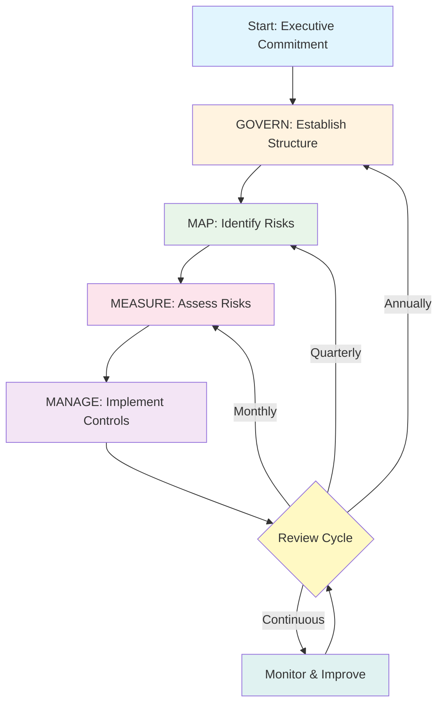

# NIST AI Risk Management Framework (AI RMF) Implementation

## What is NIST AI RMF?

The NIST AI Risk Management Framework (AI RMF 1.0, released January 2023) is the United States government's voluntary framework for managing risks associated with AI systems. Think of it as the "playbook" for organizations that want to build trustworthy AI responsibly.

Unlike regulations (EU AI Act) that mandate compliance, NIST AI RMF provides **guidance** — it tells you *what* to do but gives you flexibility in *how* to do it. This makes it adaptable to organizations of any size, from startups to enterprises.

### Why NIST AI RMF Matters

- **De facto US standard**: referenced by federal agencies, increasingly expected by enterprise customers
- **Insurance-friendly**: demonstrates due diligence for AI liability
- **Comprehensive**: covers the full AI lifecycle from design to decommission
- **Interoperable**: maps to ISO 42001, EU AI Act, and other frameworks
- **Practical**: comes with companion resources (Playbook, Crosswalks, Profiles)

---

## The 4 Core Functions

NIST AI RMF is organized around 4 functions, each with categories and subcategories:

```
┌─────────────────────────────────────────────────────┐
│                   NIST AI RMF                        │
├─────────────┬─────────────┬──────────┬──────────────┤
│   GOVERN    │     MAP     │ MEASURE  │    MANAGE    │
│             │             │          │              │
│ Culture &   │ Context &   │ Assess & │ Mitigate &   │
│ Processes   │ Risks       │ Quantify │ Respond      │
│             │             │          │              │
│ "Set up"    │ "Find risks"│ "Score"  │ "Fix it"     │
└─────────────┴─────────────┴──────────┴──────────────┘
```

---

### Function 1: GOVERN — Establish AI Risk Management Culture

GOVERN is the **foundation** — it creates the organizational structure and culture needed for everything else. Without GOVERN, MAP/MEASURE/MANAGE are ad hoc and inconsistent.

#### Key Activities

**1. Define Risk Tolerance Levels**
```
Risk Appetite Statement Example:
─────────────────────────────────
"We accept LOW residual risk for customer-facing AI features.
 We accept MEDIUM residual risk for internal productivity tools.
 We accept NO risk of AI-generated content being mistaken for
 human-authored official communications."
```

**2. Assign Roles and Responsibilities**
| Role | Responsibility | Typical Person |
|------|---------------|----------------|
| AI Risk Owner | Accountable for overall AI risk | CTO/CISO |
| AI Ethics Lead | Fairness, bias, responsible AI | Dedicated hire or committee |
| Model Owner | Specific model risks | ML Engineer |
| Data Steward | Data quality and privacy | Data Engineer |
| Compliance Officer | Regulatory alignment | Legal team |

**3. Create Policies and Procedures**
- Acceptable use policy for AI tools
- Model development standards
- Data governance for training data
- Incident response for AI failures
- Procurement standards for third-party AI

**4. Board/Leadership Oversight**
- Quarterly AI risk report to leadership
- Annual AI strategy review
- Budget allocation for AI safety
- Escalation paths for critical AI incidents

#### GOVERN Outputs
- AI governance charter
- Risk appetite statement
- RACI matrix for AI governance
- Policy document library
- Board reporting template

---

### Function 2: MAP — Identify and Understand AI Risks

MAP is the **discovery** phase — you can't manage risks you don't know about. MAP creates a comprehensive inventory of your AI systems and their associated risks.

#### Key Activities

**1. Categorize AI Systems by Risk Level**
```
Risk Level Classification:
──────────────────────────
CRITICAL: Autonomous decisions affecting health, safety, rights
  → Medical diagnosis AI, criminal justice, autonomous vehicles

HIGH: Significant impact on individuals or business
  → Credit scoring, hiring screening, content moderation

MEDIUM: Moderate impact, human-in-the-loop
  → Customer service chatbot, code suggestions, recommendations

LOW: Minimal impact, easily reversible
  → Internal search, summarization, translation (non-critical)
```

**2. Identify Stakeholders**
- **Direct users**: developers, business users
- **Affected parties**: customers receiving AI-generated outputs
- **Communities**: groups that could be systematically affected by bias
- **Regulators**: agencies with oversight authority
- **Third parties**: vendors, partners in the AI supply chain

**3. Map Data Sources and Their Risks**
```yaml
data_inventory:
  - source: "Customer support tickets"
    contains_pii: true
    consent_basis: "Legitimate interest"
    risks: ["PII leakage", "Bias from demographic data"]
    
  - source: "Web scraping (public docs)"
    contains_pii: false
    consent_basis: "Public data"
    risks: ["Copyright issues", "Outdated information"]
    
  - source: "Internal knowledge base"
    contains_pii: false
    consent_basis: "Employee contribution"
    risks: ["Confidential business info exposure"]
```

**4. Document Intended Use vs Potential Misuse**
| AI System | Intended Use | Potential Misuse |
|-----------|-------------|-----------------|
| Code assistant | Help developers write code | Generate malware |
| Content generator | Marketing copy | Deepfakes, misinformation |
| Chatbot | Answer customer questions | Social engineering |
| Summarizer | Condense documents | Strip attribution |

#### MAP Outputs
- AI system inventory/catalog
- Risk taxonomy (categorized risks)
- Stakeholder map
- Data lineage documentation
- Use case boundary documentation

---

### Function 3: MEASURE — Assess and Quantify AI Risks

MEASURE is the **quantification** phase — turning qualitative risks into measurable metrics that can be tracked over time.

#### Key Activities

**1. Define Metrics for Each Risk Type**
```yaml
metrics_by_risk_type:
  hallucination:
    metric: "Factual accuracy rate"
    measurement: "% of responses verified against ground truth"
    target: "> 95% for factual claims"
    frequency: "Weekly evaluation"
    
  bias:
    metric: "Demographic parity difference"
    measurement: "Max outcome difference across groups"
    target: "< 5% difference"
    frequency: "Monthly on production data"
    
  security:
    metric: "Injection attack success rate"
    measurement: "% of adversarial prompts that bypass guardrails"
    target: "< 1% bypass rate"
    frequency: "After each guardrail update"
    
  cost:
    metric: "Cost per request (P95)"
    measurement: "Token cost + compute at 95th percentile"
    target: "< $0.05 per request"
    frequency: "Daily monitoring"
```

**2. Test for Bias, Fairness, Accuracy**
- **Bias testing**: run prompts across demographic variations, compare outputs
- **Fairness audits**: measure outcomes across protected classes
- **Accuracy benchmarks**: domain-specific evaluation datasets
- **Robustness testing**: how does quality degrade under load/edge cases?

**3. Red Team and Adversarial Testing**
- Prompt injection attacks
- Jailbreak attempts
- Data extraction attacks
- Denial of service via complex prompts
- Social engineering through conversation

**4. Ongoing Monitoring and Evaluation**
- Production quality monitoring (drift detection)
- User feedback analysis
- Incident tracking and trend analysis
- Model performance degradation alerts

#### MEASURE Outputs
- Risk scoring matrix (filled in)
- Evaluation results and benchmarks
- Red team reports
- Monitoring dashboards
- Trend reports over time

---

### Function 4: MANAGE — Mitigate and Respond to AI Risks

MANAGE is the **action** phase — implementing controls, responding to incidents, and continuously improving.

#### Key Activities

**1. Implement Controls for Identified Risks**
```
Control Types:
─────────────
PREVENTIVE: Stop risks before they occur
  → Input validation, guardrails, access controls
  
DETECTIVE: Identify risks when they occur  
  → Monitoring, anomaly detection, user reports

CORRECTIVE: Fix issues after detection
  → Auto-rollback, human override, output filtering

COMPENSATING: Alternative controls when primary fails
  → Fallback models, cached responses, human escalation
```

**2. Incident Response Procedures**
```
AI Incident Severity Levels:
────────────────────────────
SEV1 (Critical): AI causes harm, legal exposure, data breach
  → Response: immediate shutdown, executive notification, 15-min SLA

SEV2 (High): Significant quality failure affecting many users
  → Response: rollback to previous version, 1-hour SLA

SEV3 (Medium): Quality degradation noticed by users
  → Response: investigate, implement fix within 24 hours

SEV4 (Low): Minor quality issue, no user impact
  → Response: track, fix in next sprint
```

**3. Continuous Improvement**
- Post-incident reviews (blameless retrospectives)
- Regular control effectiveness reviews
- Emerging risk scanning (new attack vectors, new regulations)
- Feedback loop from monitoring to development

**4. Regular Reviews and Updates**
- Monthly: high-risk system reviews
- Quarterly: risk register refresh
- Annually: full framework assessment
- Event-driven: after incidents, regulation changes, model updates

---

## Implementing NIST AI RMF in Practice

### Phase 1 (Months 1-3): GOVERN — Establish Governance Structure

```
Week 1-2:  Executive sponsorship, form governance committee
Week 3-4:  Draft risk appetite statement, define risk tolerance
Week 5-6:  Create AI governance charter, assign RACI
Week 7-8:  Draft initial policies (acceptable use, development standards)
Week 9-10: Establish review cadence, reporting templates
Week 11-12: Board presentation, get formal approval
```

**Deliverables**: Governance charter, risk appetite statement, initial policies, RACI matrix

### Phase 2 (Months 3-6): MAP — Catalog All AI Systems and Risks

```
Week 1-2:  Inventory all AI systems (including shadow AI)
Week 3-4:  Classify systems by risk level
Week 5-6:  Identify stakeholders for each system
Week 7-8:  Map data sources and document lineage
Week 9-10: Document intended vs potential misuse
Week 11-12: Complete risk taxonomy, prioritize for MEASURE
```

**Deliverables**: AI system catalog, risk taxonomy, stakeholder maps, data inventory

### Phase 3 (Months 6-9): MEASURE — Implement Testing and Monitoring

```
Week 1-3:  Define metrics for top-priority risks
Week 4-6:  Build evaluation pipelines (automated testing)
Week 7-9:  Conduct initial red team exercise
Week 10-12: Deploy monitoring dashboards, establish baselines
```

**Deliverables**: Evaluation framework, red team report, monitoring infrastructure, risk scores

### Phase 4 (Months 9-12): MANAGE — Operationalize Risk Management

```
Week 1-3:  Implement controls for HIGH/CRITICAL risks
Week 4-6:  Create incident response runbooks
Week 7-9:  Run tabletop exercise (simulated AI incident)
Week 10-12: Establish continuous improvement process, plan Year 2
```

**Deliverables**: Control implementations, incident runbooks, tabletop results, improvement plan

---

## NIST AI RMF vs Other Frameworks

| Dimension | NIST AI RMF | EU AI Act | ISO 42001 | IEEE 7000 |
|-----------|------------|-----------|-----------|-----------|
| **Type** | Voluntary framework | Mandatory regulation | Certification standard | Ethical standard |
| **Geography** | US-focused, global use | EU mandatory | International | International |
| **Approach** | Risk-based | Risk-level classification | Management system | Value-based design |
| **Enforcement** | None (voluntary) | Fines up to 7% revenue | Audit-based certification | None (voluntary) |
| **Scope** | All AI systems | EU market AI systems | Organizations seeking cert | System design |
| **Cost to implement** | Low-Medium | Medium-High | High (audit fees) | Medium |
| **Best for** | US companies, general guidance | EU market access | Enterprise credibility | Ethical AI design |
| **Maturity** | Released 2023 | Enacted 2024 | Released 2023 | Released 2021 |

### Key Insight
These frameworks are **complementary, not competing**:
- Use NIST AI RMF as your **operational foundation**
- Map it to EU AI Act requirements for **regulatory compliance**
- Pursue ISO 42001 for **market credibility**
- Apply IEEE 7000 for **ethical design principles**

---

## Implementation Lifecycle



---

## Quick-Start Checklist

- [ ] Get executive sponsor for AI governance
- [ ] Form cross-functional governance committee
- [ ] Write risk appetite statement (1 page)
- [ ] Inventory all AI systems (spreadsheet is fine to start)
- [ ] Classify top 5 AI systems by risk level
- [ ] Define 3 metrics per high-risk system
- [ ] Run one red team exercise
- [ ] Create incident response template
- [ ] Schedule first quarterly review
- [ ] Present to leadership with findings and plan

---

## Resources

- [NIST AI RMF 1.0](https://www.nist.gov/artificial-intelligence/risk-management-framework)
- [NIST AI RMF Playbook](https://airc.nist.gov/AI_RMF_Playbook)
- [NIST AI RMF Crosswalks](https://airc.nist.gov/Crosswalks) (mapping to other frameworks)
- [NIST Generative AI Profile](https://www.nist.gov/artificial-intelligence) (GenAI-specific guidance)
