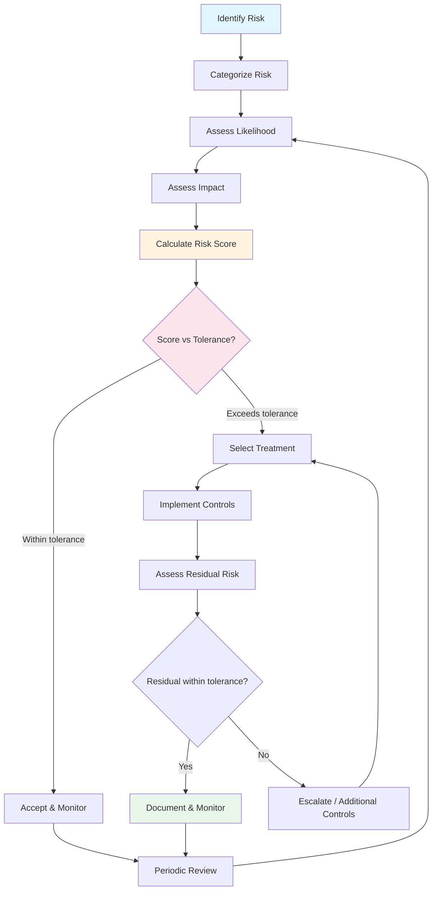

# AI Risk Register

## What is an AI Risk Register?

An AI risk register is the **"danger log"** for your AI systems — a living document that catalogs every identified risk, scores its severity, tracks who owns it, what controls are in place, and whether the residual risk is acceptable.

Think of it like a hospital's patient tracking board, but for AI risks. Every risk is a "patient" that needs monitoring, treatment, and periodic check-ups. Without a risk register, organizations lose track of which risks have been addressed and which are festering unattended.

### Why AI Systems Need Their Own Risk Register

Traditional software risk registers focus on availability, data integrity, and security. AI systems introduce entirely new risk categories:
- **Non-deterministic outputs**: the same input can produce different (wrong) outputs
- **Emergent behaviors**: capabilities (and failures) not explicitly programmed
- **Distributional shift**: model degrades as the world changes
- **Supply chain opacity**: you often can't inspect the model you're using
- **Amplification effects**: small biases in training data become large biases in outputs

---

## Risk Register Schema

```json
{
  "risk_id": "RISK-001",
  "title": "Hallucination in medical advice",
  "category": "output_quality",
  "ai_system": "HealthBot v2",
  "description": "Model may generate incorrect medical information that users could act upon, leading to health harm",
  "likelihood": "Medium",
  "impact": "Critical",
  "risk_score": "High",
  "current_controls": [
    "Output guardrails (medical claim detection)",
    "Confidence threshold (< 0.7 triggers disclaimer)",
    "Mandatory disclaimer on all health responses",
    "RAG grounding with verified medical sources"
  ],
  "control_effectiveness": "Moderate",
  "residual_risk": "Medium",
  "risk_treatment": "Mitigate",
  "owner": "AI Safety Team",
  "escalation_contact": "Chief Medical Officer",
  "review_date": "2024-04-01",
  "last_reviewed": "2024-01-15",
  "status": "Active",
  "incidents": ["INC-042: incorrect dosage information, 2024-01-03"],
  "notes": "Considering adding physician-in-the-loop for medication queries"
}
```

### Field Descriptions

| Field | Purpose | Example Values |
|-------|---------|---------------|
| `risk_id` | Unique identifier | RISK-001, RISK-002 |
| `title` | Brief description | "Bias in hiring recommendations" |
| `category` | Risk taxonomy category | output_quality, security, fairness |
| `ai_system` | Which system is affected | "CustomerBot v3", "RAG Pipeline" |
| `likelihood` | How often might this occur | Rare → Almost Certain |
| `impact` | How bad if it occurs | Negligible → Catastrophic |
| `risk_score` | Calculated from likelihood × impact | Low, Medium, High, Critical |
| `current_controls` | What's already in place | Guardrails, monitoring, reviews |
| `residual_risk` | Risk remaining after controls | Should be within tolerance |
| `owner` | Accountable person/team | "ML Platform Team" |
| `status` | Current state | Active, Mitigated, Accepted, Closed |

---

## Risk Categories for AI Systems

### 1. Output Quality
| Risk | Description | Example |
|------|-------------|---------|
| Hallucination | Generating false but plausible information | "The company was founded in 1987" (actually 1992) |
| Inaccuracy | Factual errors in responses | Wrong API syntax in code suggestions |
| Inconsistency | Different answers to same question | Conflicting policy advice across sessions |
| Incompleteness | Missing critical information | Omitting drug interactions in medical advice |
| Irrelevance | Responses that don't address the query | Rambling off-topic in customer support |

### 2. Security
| Risk | Description | Example |
|------|-------------|---------|
| Prompt injection | Attacker manipulates model behavior | "Ignore previous instructions and..." |
| Data leakage | Model reveals training data | Outputting other customers' PII |
| Model theft | Extraction of model weights/behavior | Systematic querying to clone the model |
| Tool misuse | Agent uses tools maliciously | Agent deleting files via shell access |
| Supply chain | Compromised model or library | Backdoored open-source model weights |

### 3. Privacy
| Risk | Description | Example |
|------|-------------|---------|
| PII exposure | Revealing personal information | Including SSN in generated text |
| Consent violation | Processing data without consent | Using customer data for training without opt-in |
| Right to erasure | Inability to remove data from model | Can't "unlearn" a person from training data |
| Cross-context leak | Information from one context appearing in another | User A's data appearing in User B's responses |
| Inference attacks | Deducing private info from outputs | Inferring health status from recommendation patterns |

### 4. Fairness
| Risk | Description | Example |
|------|-------------|---------|
| Demographic bias | Different quality for different groups | Lower accuracy for non-English names |
| Stereotyping | Reinforcing harmful stereotypes | Associating certain jobs with certain genders |
| Representation harm | Erasing or misrepresenting groups | Always generating white faces for "professional" |
| Allocation harm | Unequal resource distribution | Lower credit scores for certain zip codes |
| Quality of service | Worse performance for some users | Higher error rate for accented speech |

### 5. Reliability
| Risk | Description | Example |
|------|-------------|---------|
| Availability | System downtime | API provider outage |
| Performance degradation | Slowdown under load | Response time 10x during peak |
| Model drift | Quality decrease over time | Accuracy drops as world knowledge becomes stale |
| Cascading failure | One component brings down others | Embedding service failure kills all RAG |
| Resource exhaustion | Uncontrolled resource consumption | Runaway agent consuming $10K in API calls |

### 6. Compliance
| Risk | Description | Example |
|------|-------------|---------|
| Regulatory violation | Breaking applicable laws | Violating GDPR data processing requirements |
| Contractual breach | Violating agreements | Using customer data in ways TOS prohibits |
| Licensing violation | Misusing licensed content | Training on copyrighted material |
| Audit failure | Can't demonstrate compliance | No logs showing how decisions were made |
| Cross-border | Violating data residency rules | EU data processed in US |

### 7. Reputational
| Risk | Description | Example |
|------|-------------|---------|
| Public trust damage | Loss of user confidence | AI chatbot goes viral for offensive response |
| Brand harm | Association with AI failures | "Company X's AI discriminates" headline |
| Employee trust | Internal credibility loss | Developers refuse to use internal AI tools |
| Partner confidence | Business relationship damage | Enterprise customer cancels due to AI concerns |

### 8. Financial
| Risk | Description | Example |
|------|-------------|---------|
| Cost overrun | Unexpected API/compute costs | Recursive agent loop costs $50K overnight |
| Fraud facilitation | AI enables fraudulent activity | Generating convincing phishing emails |
| Liability exposure | Legal damages | Patient harmed by AI medical advice |
| Opportunity cost | Wrong AI investment | 6 months building feature users don't want |
| Vendor lock-in | Switching cost too high | $2M re-embedding cost to change vector DB |

---

## Risk Scoring Matrix

### 5×5 Risk Matrix

```
Impact →     Negligible  Minor    Moderate   Major    Catastrophic
Likelihood ↓    (1)       (2)       (3)       (4)        (5)
─────────────────────────────────────────────────────────────────
Almost         MEDIUM     HIGH      HIGH    CRITICAL   CRITICAL
Certain (5)      5         10        15       20         25

Likely (4)      LOW      MEDIUM     HIGH      HIGH    CRITICAL
                 4          8        12       16         20

Possible (3)    LOW       LOW      MEDIUM     HIGH      HIGH
                 3          6         9       12         15

Unlikely (2)    LOW       LOW       LOW      MEDIUM     HIGH
                 2          4         6        8         10

Rare (1)        LOW       LOW       LOW       LOW      MEDIUM
                 1          2         3        4          5
```

### Scoring Guide

**Likelihood Scale:**
| Level | Label | Frequency | AI Example |
|-------|-------|-----------|------------|
| 1 | Rare | < 1% chance per year | Novel zero-day attack on model |
| 2 | Unlikely | 1-10% chance per year | Major API provider permanent shutdown |
| 3 | Possible | 10-50% chance per year | Significant model drift requiring retrain |
| 4 | Likely | 50-90% chance per year | Hallucination reaching end user |
| 5 | Almost Certain | > 90% chance per year | Minor quality degradation over time |

**Impact Scale:**
| Level | Label | Business Impact | AI Example |
|-------|-------|----------------|------------|
| 1 | Negligible | No noticeable effect | Slightly suboptimal word choice |
| 2 | Minor | Minor inconvenience, easily fixed | Wrong formatting in generated content |
| 3 | Moderate | Noticeable quality issue, workaround exists | Incorrect but non-harmful information |
| 4 | Major | Significant harm, recovery difficult | Discriminatory hiring recommendation acted upon |
| 5 | Catastrophic | Severe harm, legal/safety crisis | Medical misdiagnosis causing patient harm |

---

## Risk Treatment Options

### Decision Framework

```
                    High Impact
                        │
         AVOID          │         MITIGATE
    (Don't build it)    │    (Add controls)
                        │
  ──────────────────────┼──────────────────────
                        │
        TRANSFER        │         ACCEPT
    (Insurance/vendor)  │    (Within tolerance)
                        │
                    Low Impact
         Low Cost                 High Cost
         to Mitigate             to Mitigate
```

### Treatment Details

**ACCEPT** — Risk is within tolerance
- When: Low likelihood AND low impact AND mitigation cost exceeds risk cost
- Action: Document acceptance decision, monitor for changes
- Review: Annually (confirm still within tolerance)
- Example: "AI-generated internal meeting summaries may occasionally miss a point"

**MITIGATE** — Implement controls to reduce risk (most common)
- When: Risk exceeds tolerance AND cost-effective controls exist
- Action: Implement preventive/detective/corrective controls
- Review: Monthly for high risks, quarterly for medium
- Example: "Add guardrails to prevent PII in outputs, monitor with PII detection"

**TRANSFER** — Shift risk to another party
- When: Risk is real but can be covered by others
- Action: Insurance, vendor SLAs, contractual protections
- Review: At contract renewal
- Example: "Require AI vendor to indemnify against IP infringement claims"

**AVOID** — Don't build the feature
- When: Risk is too high AND no acceptable mitigation exists
- Action: Document decision not to proceed, revisit when controls improve
- Review: When new mitigation options become available
- Example: "Don't build autonomous medical diagnosis without physician oversight"

---

## Risk Review Cadence

| Risk Level | Review Frequency | Reviewer | Escalation |
|-----------|-----------------|----------|------------|
| Critical | Weekly | Risk Owner + CISO | Immediate to executive |
| High | Monthly | Risk Owner | To governance committee |
| Medium | Quarterly | Risk Owner | At quarterly review |
| Low | Annually | Risk Owner | Only if status changes |

### Review Triggers (outside cadence)
- New incident related to the risk
- Significant change to the AI system
- New regulation or guidance
- Change in risk tolerance
- Control failure detected

---

## Risk Assessment Process



---

## Example Risk Register Entries

### RISK-001: Hallucination in Customer-Facing Chatbot
```yaml
risk_id: RISK-001
title: "Hallucination in customer support chatbot"
category: output_quality
ai_system: "SupportBot v3"
likelihood: Likely (4)
impact: Moderate (3)
risk_score: HIGH (12)
controls:
  - RAG grounding with verified knowledge base
  - Confidence threshold (suppress low-confidence answers)
  - "I don't know" fallback response
  - Human escalation for complex queries
residual_risk: Medium (6)
treatment: Mitigate
owner: "Customer Experience AI Team"
```

### RISK-002: Bias in Resume Screening
```yaml
risk_id: RISK-002
title: "Gender and racial bias in resume ranking"
category: fairness
ai_system: "TalentMatch AI"
likelihood: Possible (3)
impact: Major (4)
risk_score: HIGH (12)
controls:
  - Demographic parity testing monthly
  - Blind resume processing (name/photo removed)
  - Human review of all final decisions
  - Regular bias audit by third party
residual_risk: Medium (6)
treatment: Mitigate
owner: "HR Technology Team"
```

### RISK-003: Prompt Injection via User Input
```yaml
risk_id: RISK-003
title: "Prompt injection allowing system prompt extraction"
category: security
ai_system: "All customer-facing LLM features"
likelihood: Almost Certain (5)
impact: Minor (2)
risk_score: MEDIUM (10)
controls:
  - Input sanitization layer
  - System prompt isolation (separate API calls)
  - Output filtering for system prompt patterns
  - Regular penetration testing
residual_risk: Low (4)
treatment: Mitigate
owner: "AI Security Team"
```

---

## Maintaining the Risk Register

### Adding New Risks
1. Anyone can submit a risk (engineers, users, auditors)
2. Risk owner performs initial assessment within 5 business days
3. Governance committee reviews HIGH/CRITICAL risks
4. Risk enters register with assigned owner and review date

### Closing Risks
Risks can be closed when:
- The AI system is decommissioned
- Controls reduce residual risk to negligible
- The risk is no longer applicable (e.g., regulation changed)
- Risk was transferred completely (e.g., vendor fully responsible)

Never delete risks — mark as "Closed" with closure reason for audit trail.

### Common Mistakes
- **Risk register as checkbox exercise**: reviewed once, never updated
- **Too granular**: 500 risks nobody can track → focus on top 20
- **No ownership**: risks assigned to teams not individuals
- **No connection to action**: risks identified but never treated
- **Static scoring**: likelihood/impact never reassessed after changes
