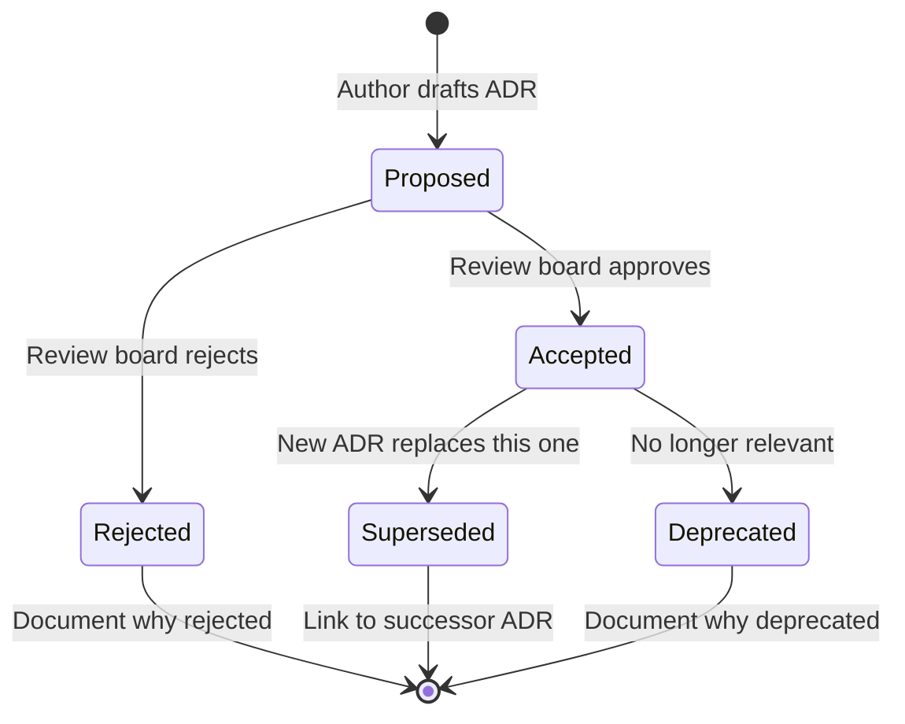
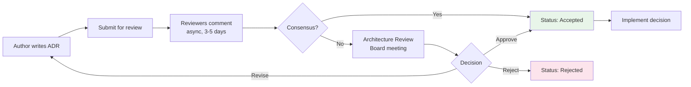

# Architecture Decision Records (ADRs) for AI Systems

## What is an ADR?

An Architecture Decision Record (ADR) is the **"diary of decisions"** for architects — a short document that captures a significant architecture decision, its context, the options considered, and why one was chosen.

Think of ADRs as "git blame for architecture." When someone asks "why do we use vector DB X instead of Y?" or "why did we pick this chunking strategy?" — the ADR has the answer, including the reasoning and trade-offs that were understood at the time.

---

## Why ADRs are Critical for AI Systems

AI architecture decisions are uniquely challenging:

1. **Complex trade-offs**: model quality vs cost vs latency vs safety — rarely one clear winner
2. **Rapidly evolving landscape**: the "best" model changes monthly
3. **Non-obvious consequences**: chunking strategy affects retrieval quality 6 months later
4. **Expensive reversibility**: re-embedding 10M documents costs time and money
5. **Team knowledge loss**: the engineer who chose the model may have left
6. **Audit requirements**: regulators want to know why you chose this model for this use case

Without ADRs, teams repeat the same evaluation work, make inconsistent decisions, and can't explain their architecture to auditors or new team members.

---

## ADR Template

```markdown
# ADR-001: Choice of Embedding Model

## Status
Accepted

## Date
2024-01-15

## Decision Makers
- Sarah Chen (AI Architect) - author
- Mike Torres (ML Engineer) - reviewer
- Lisa Park (Tech Lead) - approver

## Context
We need to select an embedding model for our RAG system serving 10M documents.
The system powers customer support, answering questions about our product
documentation, knowledge base articles, and historical support tickets.

Current pain points:
- Keyword search misses semantic matches (users ask questions differently than docs are written)
- Need multilingual support (EN, ES, FR, DE)
- Must handle mixed content types (code snippets, natural language, tables)

## Decision Drivers
- **Quality**: must achieve > 85% recall on our domain eval set (500 query-doc pairs)
- **Cost**: embedding 10M docs must be < $500 (one-time), re-embedding budget: $200/quarter
- **Latency**: embedding at query time < 50ms (p99)
- **Dimensions**: storage cost proportional to dimensions (vector DB cost)
- **Multilingual**: must support EN, ES, FR, DE with < 5% quality degradation

## Options Considered

### Option 1: OpenAI text-embedding-3-large (3072 dims)
- Pros: highest quality, Matryoshka (can truncate dims), strong multilingual
- Cons: most expensive ($0.13/1M tokens), highest storage cost, vendor lock-in
- Eval result: 96% recall on our dataset

### Option 2: OpenAI text-embedding-3-small (1536 dims)
- Pros: good quality-cost ratio, Matryoshka support, stable API
- Cons: vendor lock-in, slightly lower quality than large
- Eval result: 92% recall on our dataset

### Option 3: Cohere embed-v3 (1024 dims)
- Pros: search-optimized, lower dimensions, input type parameter
- Cons: newer API (less battle-tested), different vendor
- Eval result: 89% recall on our dataset

### Option 4: Self-hosted E5-large-v2 (768 dims)
- Pros: no vendor dependency, lowest per-query cost at scale, full control
- Cons: requires GPU infrastructure ($500/month), operational burden
- Eval result: 85% recall on our dataset

## Decision
**Option 2: OpenAI text-embedding-3-small**

## Rationale
- Best quality-cost ratio: 92% recall (exceeds 85% target) at moderate cost
- One-time embedding cost: ~$200 for full corpus (well within $500 budget)
- Matryoshka support: can reduce to 512 dims later if storage cost becomes issue
- Well-documented, stable API with strong track record
- Same vendor as our LLM (simplifies billing, support)
- Multilingual performance: < 3% degradation for ES/FR/DE

## Consequences
- **Positive**: quick to implement, good quality, reasonable cost
- **Negative**: vendor dependency on OpenAI — if API changes or pricing increases, we're affected
- **Mitigation**: abstract embedding behind interface, maintain eval set for quick comparison
- **Re-embedding cost if we switch**: ~$200 + 2 hours compute + 4 hours engineering

## Alternatives Rejected
- **Option 1**: overkill — 4% quality gain doesn't justify 2x storage cost ($800/month)
- **Option 3**: 3% lower recall on our eval; would reconsider if Cohere proves more stable
- **Option 4**: we don't have GPU infrastructure; operational cost exceeds API cost for our scale

## Review Trigger
Revisit this decision if:
- OpenAI raises embedding prices > 50%
- A new model achieves > 95% recall at lower cost
- We need to support > 5 languages
- Document count exceeds 100M (self-hosting becomes economical)
```

---

## When to Write an ADR

### Always Write ADRs For:

**Model Selection**
- Which LLM to use (and why not alternatives)
- Which embedding model (with eval results)
- Which reranker or classifier
- Fine-tuned vs base model decision

**Architecture Pattern**
- RAG vs fine-tuning vs prompt engineering
- Agent vs pipeline (deterministic flow vs autonomous)
- Single model vs model routing
- Synchronous vs asynchronous processing

**Infrastructure**
- Cloud provider for AI workloads
- Vector database selection
- Model serving framework (vLLM, TGI, TensorRT)
- Orchestration framework (LangChain, LlamaIndex, custom)

**Security Decisions**
- Authentication model for AI services
- Guardrail approach and tools
- Data isolation strategy (multi-tenant)
- Tool access permissions for agents

**Data Decisions**
- Chunking strategy (size, overlap, method)
- Data preprocessing pipeline
- Training data selection criteria
- Evaluation dataset construction

---

## ADR Lifecycle



### Status Definitions

| Status | Meaning | Action Required |
|--------|---------|----------------|
| **Proposed** | Under discussion, not yet decided | Review and decide |
| **Accepted** | Decision made and in effect | Implement |
| **Rejected** | Considered but not adopted | No action (keep for history) |
| **Superseded** | Replaced by a newer ADR | Follow the new ADR |
| **Deprecated** | No longer relevant (system decommissioned) | No action |

---

## ADR Repository Structure

```
docs/
└── adrs/
    ├── README.md              # Index of all ADRs
    ├── templates/
    │   ├── model-selection.md
    │   ├── architecture-pattern.md
    │   └── infrastructure.md
    ├── 001-embedding-model-selection.md
    ├── 002-vector-database-choice.md
    ├── 003-chunking-strategy.md
    ├── 004-guardrail-framework.md
    ├── 005-llm-provider-selection.md
    ├── 006-rag-vs-fine-tuning.md
    ├── 007-agent-orchestration.md
    ├── 008-multi-tenant-isolation.md
    ├── 009-eval-framework-selection.md
    └── 010-cost-optimization-approach.md
```

### README.md (ADR Index)
```markdown
# Architecture Decision Records

| # | Title | Status | Date | Author |
|---|-------|--------|------|--------|
| 001 | Embedding model selection | Accepted | 2024-01-15 | Sarah Chen |
| 002 | Vector database choice | Accepted | 2024-01-22 | Mike Torres |
| 003 | Chunking strategy | Superseded by 011 | 2024-02-01 | Sarah Chen |
| 004 | Guardrail framework | Accepted | 2024-02-10 | Alex Kim |
| 005 | LLM provider selection | Accepted | 2024-02-15 | Sarah Chen |
```

---

## Common AI Architecture Decisions That Need ADRs

1. Which LLM provider and model for production use
2. Which embedding model for retrieval
3. Which vector database for storage
4. RAG vs fine-tuning for domain knowledge
5. Chunking strategy (size, overlap, boundaries)
6. Agent framework vs custom orchestration
7. Guardrail framework selection
8. Evaluation framework and metrics
9. Model serving infrastructure
10. Multi-tenant data isolation approach
11. Caching strategy for LLM responses
12. Fallback strategy when primary model fails
13. Cost optimization approach (routing, caching, model tiers)
14. Observability and logging strategy
15. Prompt management approach (registry, versioning)
16. Human-in-the-loop trigger criteria
17. Data retention and deletion policy for AI logs
18. A/B testing framework for AI features
19. Model update/deployment strategy (blue-green, canary)
20. Third-party AI tool evaluation criteria

---

## Writing Effective ADRs

### Do's
- **Be specific**: include numbers (latency, cost, accuracy metrics)
- **Show your work**: include eval results, benchmark data
- **Name alternatives**: explicitly state what you didn't choose and why
- **Define review triggers**: when should this decision be revisited?
- **Keep it short**: 1-2 pages max; link to detailed evaluation docs
- **Write them promptly**: capture context while it's fresh

### Don'ts
- **Don't retroactively justify**: if the decision was made for political reasons, say so
- **Don't omit trade-offs**: every decision has downsides, be honest
- **Don't write novels**: ADRs should be scannable in 2 minutes
- **Don't skip "rejected" options**: future engineers need to know what was considered
- **Don't make them immutable**: supersede with new ADRs, don't edit old ones

### ADR Anti-Patterns
- **The Ghost ADR**: decision was made, ADR was never written
- **The Novel**: 10-page ADR that nobody reads
- **The Rubber Stamp**: ADR written after implementation to check a box
- **The Orphan**: ADR exists but nobody knows where to find it
- **The Zombie**: superseded ADR still being followed because nobody noticed the update

---

## ADR Review Process



---

## Connecting ADRs to Governance

ADRs are a key governance artifact:
- **Audit trail**: shows decisions were deliberate, not accidental
- **Risk management**: connects to risk register (ADR shows how risks were considered)
- **Compliance**: demonstrates due diligence in model/data selection
- **Knowledge management**: onboards new team members quickly
- **Change management**: when revisiting decisions, context is preserved

### ADR ↔ Risk Register Link
```
ADR-005: LLM Provider Selection
  └── References: RISK-007 (vendor lock-in)
  └── References: RISK-012 (data residency)
  └── Mitigates: RISK-003 (model quality)
```

Every HIGH/CRITICAL risk in your register should trace back to one or more ADRs showing how the risk was considered in architecture decisions.
