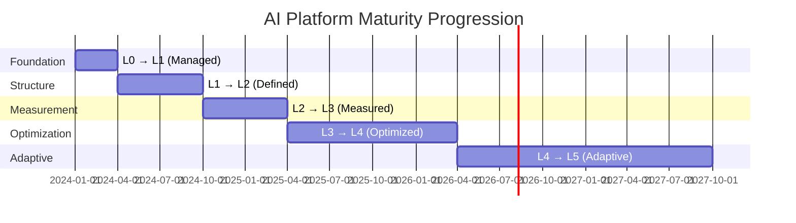

# AI Platform Maturity Model

## What is an AI Platform Maturity Model?

An AI platform maturity model defines the **"skill levels"** for organizations building AI systems. It provides a structured way to assess where you are today, understand what "good" looks like, and plan your journey to get there.

Think of it like martial arts belts — you can't go from white belt to black belt overnight. Each level builds on the previous one, and skipping levels leads to fragile foundations.

### Why You Need a Maturity Model

- **Honest assessment**: stops teams from thinking they're "advanced" when they lack basics
- **Prioritization**: tells you what to work on next (not everything at once)
- **Communication**: gives leadership a clear picture of capability and gaps
- **Benchmarking**: compare against industry peers
- **Investment justification**: "we need X to get from L2 to L3"

---

## The 6 Maturity Levels

```
L5 ████████████████████████████ ADAPTIVE (Self-healing, org-wide)
L4 ██████████████████████████   OPTIMIZED (Automated governance)
L3 ████████████████████████     MEASURED (Quantified quality/cost)
L2 ██████████████████████       DEFINED (Formal processes)
L1 ████████████████████         MANAGED (Basic standards)
L0 ██████████████████           AD HOC (Individual experiments)
```

---

### Level 0: Ad Hoc

**"Everyone's experimenting, nobody's coordinating"**

| Dimension | State |
|-----------|-------|
| Governance | None — individual developers make all decisions |
| Tooling | Each team picks their own LLM, framework, vector DB |
| Evaluation | Manual spot-checking, "looks good to me" |
| Monitoring | None — ship and forget |
| Security | API keys in code, no guardrails |
| Cost | Nobody tracks spend, surprise bills |

**Signs you're at L0:**
- Multiple teams independently signed up for OpenAI accounts
- No shared prompt templates or best practices
- "Evaluation" means the developer tried 5 prompts manually
- Nobody knows total AI spend across the organization
- Security has no visibility into AI tool usage

**Typical organizations**: Early-stage startups, companies just starting AI exploration

**Risk**: Shadow AI proliferation, security incidents, wasted spend on duplicate efforts

---

### Level 1: Managed

**"We have some standards, but they're loosely followed"**

| Dimension | State |
|-----------|-------|
| Governance | Basic policies exist (acceptable use, approved vendors) |
| Tooling | Shared API keys, some common libraries |
| Evaluation | Basic test sets, manual review before launch |
| Monitoring | Basic uptime monitoring, error rates |
| Security | API keys in secrets manager, basic input validation |
| Cost | Monthly spend reports, budget alerts |

**Signs you're at L1:**
- Centralized API key management (but not a full gateway)
- Shared prompt templates exist (but not enforced)
- Someone reviews AI outputs before launch (but no automated eval)
- You know your monthly AI spend (but can't attribute to features)
- Basic security review for new AI features (but no red teaming)

**Gap from L2**: No evaluation pipeline, no production monitoring, no formal architecture process

---

### Level 2: Defined

**"We have formal processes and they're consistently followed"**

| Dimension | State |
|-----------|-------|
| Governance | AI gateway, architecture review board, ADRs |
| Tooling | Prompt registry, shared evaluation framework |
| Evaluation | Golden datasets, automated eval in CI/CD |
| Monitoring | Quality monitoring, basic dashboards |
| Security | Guardrails, regular security review, DLP |
| Cost | Cost per feature tracking, budgets per team |

**Signs you're at L2:**
- All AI traffic routes through a central gateway
- Architecture decisions are documented in ADRs
- Evaluation runs automatically on every prompt/model change
- You have golden datasets for each AI feature
- Security reviews happen before every AI feature launch
- Cost is attributed to specific features and teams

**Gap from L3**: Limited real-time observability, reactive rather than proactive, manual cost optimization

---

### Level 3: Measured

**"We quantify everything and make data-driven decisions"**

| Dimension | State |
|-----------|-------|
| Governance | Risk register, compliance automation, maturity tracking |
| Tooling | Full platform with self-service, model catalog |
| Evaluation | Continuous eval, A/B testing, statistical significance |
| Monitoring | Real-time dashboards, SLOs, anomaly detection |
| Security | Automated red teaming, continuous vulnerability scanning |
| Cost | Cost optimization, model routing by cost/quality, chargebacks |

**Signs you're at L3:**
- Every AI feature has defined SLOs (quality, latency, cost)
- Dashboards show real-time quality metrics per feature
- You can answer "what's our hallucination rate this week?" in 30 seconds
- Cost optimization runs automatically (caching, model routing)
- Risk register is actively maintained and reviewed monthly
- Compliance checks are automated in deployment pipeline

**Gap from L4**: Still some manual review processes, limited self-healing, optimization is periodic not continuous

---

### Level 4: Optimized

**"Continuous improvement is automated, governance scales effortlessly"**

| Dimension | State |
|-----------|-------|
| Governance | Policy-as-code, automated compliance, self-service with guardrails |
| Tooling | Platform-as-product, developer experience focus |
| Evaluation | Automated eval selection, dynamic benchmarks, production evals |
| Monitoring | Predictive monitoring, automatic alerting, drift detection |
| Security | Auto-remediation, continuous red teaming, threat modeling |
| Cost | Auto-scaling, dynamic routing, waste elimination |

**Signs you're at L4:**
- New AI features can be launched with self-service (within policy guardrails)
- Model routing automatically optimizes for cost/quality trade-off
- Quality regressions are detected and rolled back automatically
- Compliance is checked at every stage without manual intervention
- Cost anomalies trigger automatic investigation and mitigation
- A/B testing is standard for all AI feature changes

**Gap from L5**: May still be team-specific platforms, not fully organization-wide; some manual escalation paths

---

### Level 5: Adaptive

**"The platform learns and improves itself across the entire organization"**

| Dimension | State |
|-----------|-------|
| Governance | Organization-wide AI governance, cross-team learning |
| Tooling | Unified platform serving all teams, marketplace of capabilities |
| Evaluation | Evaluation improves itself (meta-evaluation), org-wide benchmarks |
| Monitoring | Self-healing systems, predictive capacity management |
| Security | Adaptive security (learns new threats), zero-trust AI |
| Cost | Organization-wide optimization, shared resource pool |

**Signs you're at L5:**
- Every team in the org uses the same AI platform
- Platform automatically incorporates learnings from incidents across teams
- Evaluation criteria evolve automatically based on production feedback
- Self-healing: quality drops are detected and remediated without human intervention
- Organization can spin up new AI capabilities in hours, not weeks
- AI governance metrics reported to board alongside financial metrics

**Reality check**: Very few organizations achieve L5. It's an aspiration that drives continuous improvement.

---

## Assessment Questionnaire

Score each question 0-5 (0 = not at all, 5 = fully mature):

### Governance (Questions 1-5)
1. Do you have a standardized model selection process with documented criteria?
2. Do you have an AI-specific risk register that's reviewed regularly?
3. Are AI architecture decisions documented in ADRs?
4. Do you have defined roles for AI governance (risk owner, ethics, security)?
5. Does leadership receive regular AI risk and quality reports?

### Evaluation (Questions 6-10)
6. Do you have automated evaluation in your CI/CD pipeline?
7. Do you maintain golden datasets for each AI feature?
8. Do you run A/B tests for AI feature changes?
9. Do you have domain-expert evaluation (not just automated metrics)?
10. Do you track evaluation quality over time (meta-evaluation)?

### Operations (Questions 11-15)
11. Do you track cost per request and attribute it to features?
12. Do you have SLOs for AI quality metrics (not just availability)?
13. Do you have incident runbooks specific to AI failures?
14. Do you have automated rollback for AI quality regressions?
15. Do you have model versioning and reproducible deployments?

### Security (Questions 16-20)
16. Do you have guardrails on all production AI outputs?
17. Do you conduct regular red teaming / adversarial testing?
18. Do you have data loss prevention (DLP) for AI interactions?
19. Do you monitor for prompt injection attempts?
20. Do you have an AI-specific incident response process?

### Scoring

| Total Score | Maturity Level |
|-------------|---------------|
| 0-15 | L0: Ad Hoc |
| 16-35 | L1: Managed |
| 36-55 | L2: Defined |
| 56-75 | L3: Measured |
| 76-90 | L4: Optimized |
| 91-100 | L5: Adaptive |

### Category Scores
Your weakest category indicates your biggest gap. An organization at L3 overall but L1 in security has a critical vulnerability.

---

## Maturity Roadmap

### L0 → L1 (Foundation) — 2-3 months
```
Priority actions:
1. Centralize API key management
2. Write acceptable use policy for AI
3. Create shared prompt templates for common patterns
4. Set up monthly spend tracking
5. Basic security review checklist for new AI features
```

### L1 → L2 (Structure) — 3-6 months
```
Priority actions:
1. Deploy AI gateway for traffic management
2. Establish architecture review board
3. Build evaluation pipeline with golden datasets
4. Implement prompt registry with versioning
5. Create ADR template and require for all new AI features
6. Set up basic production monitoring (error rates, latency)
```

### L2 → L3 (Measurement) — 6 months
```
Priority actions:
1. Define SLOs for every AI feature (quality, latency, cost)
2. Build real-time quality dashboards
3. Implement cost optimization (caching, model routing)
4. Create and maintain risk register
5. Automate compliance checks in CI/CD
6. Implement continuous red teaming
7. Start A/B testing framework
```

### L3 → L4 (Optimization) — 12 months
```
Priority actions:
1. Implement policy-as-code for AI governance
2. Build self-service platform with guardrails
3. Automated model routing based on cost/quality
4. Predictive monitoring and auto-remediation
5. Continuous evaluation in production
6. Cross-team platform standardization
```

---

## Typical Progression Timeline



### Reality Check
- Most organizations are at **L0-L1** today
- Getting to **L2 is the critical milestone** (foundational processes in place)
- **L3 is "good enough"** for most companies (measured, data-driven)
- **L4+ requires dedicated platform team** (significant investment)
- **Don't skip levels** — L3 without L2 foundations crumbles under pressure

---

## Maturity by Organization Type

| Organization | Typical Current | Reasonable Target (12 mo) |
|-------------|----------------|--------------------------|
| Startup (< 50 people) | L0 | L1-L2 |
| Growth company (50-500) | L0-L1 | L2-L3 |
| Enterprise (500+) | L1-L2 | L3-L4 |
| Regulated industry | L1 (with compliance gaps) | L3 (compliance-driven) |
| AI-native company | L2-L3 | L4 |

---

## Using Maturity Assessment Results

1. **Identify current level** (honest assessment, not aspirational)
2. **Set target level** (realistic for your org size and timeline)
3. **Find gaps** (which dimensions are lagging?)
4. **Prioritize** (address weakest dimensions first — chain is only as strong as weakest link)
5. **Create roadmap** (quarterly milestones with specific deliverables)
6. **Reassess** (every 6 months, track progress)
