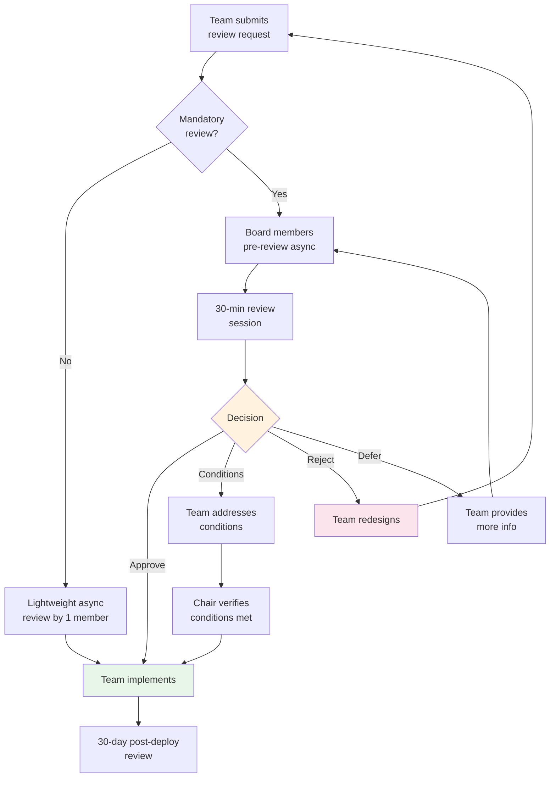

# AI Architecture Review Board (ARB)

## What is an AI Architecture Review Board?

An AI Architecture Review Board (ARB) is a **cross-functional team** that reviews AI architecture decisions before they're implemented. It ensures consistency, security, quality, and governance across all AI initiatives in an organization.

Think of it as a "building permit" process — you don't just start construction, you get your plans reviewed by experts who check structural integrity, safety codes, and zoning compliance. The ARB does the same for AI systems.

### Why a Dedicated AI ARB?

Traditional architecture review boards aren't equipped for AI-specific concerns:
- They don't assess model quality trade-offs
- They miss AI-specific security vectors (prompt injection, data extraction)
- They lack fairness and bias evaluation expertise
- They don't understand the AI cost model (per-token billing)
- They can't evaluate non-deterministic system behavior

---

## Board Composition

| Role | Responsibility | Focus Areas |
|------|---------------|-------------|
| **AI Architect** (Chair) | Technical architecture decisions, meeting facilitation | System design, patterns, scalability |
| **Security Lead** | Security and privacy review | Threat modeling, attack vectors, DLP |
| **Data Engineer** | Data pipeline and quality review | Data lineage, quality, freshness |
| **Product Manager** | Business alignment review | User impact, business value, prioritization |
| **Legal/Compliance** | Regulatory compliance review | GDPR, AI Act, industry regulations |
| **Ethics Representative** | Fairness and responsible AI | Bias, transparency, societal impact |

### Optional Members (invited per topic)
- **ML Engineer**: when reviewing model architecture or training decisions
- **Infrastructure Lead**: when reviewing scaling or deployment decisions
- **Domain Expert**: when reviewing industry-specific AI applications
- **Finance**: when reviewing high-cost decisions

### Board Operations
- **Meeting cadence**: Weekly (30-min slots, 2-3 reviews per session)
- **Quorum**: Chair + 3 members minimum
- **Decision authority**: can approve, approve with conditions, reject, or defer
- **Escalation**: rejected decisions can be escalated to CTO

---

## What Gets Reviewed

### Mandatory Review (before building)

| Trigger | Examples | Why |
|---------|----------|-----|
| New AI use case | "We want to add AI-powered hiring screening" | High-risk decisions need upfront review |
| Model change | "Switching from GPT-4 to Claude for production" | Quality, cost, security implications |
| Architecture change | "Moving from RAG to fine-tuning" | Fundamental approach change |
| Security-sensitive tools | "Giving agent access to database" | Attack surface expansion |
| Data access expansion | "Adding customer PII to RAG knowledge base" | Privacy and compliance risk |
| External-facing AI | "Customer chatbot going live" | Reputation and liability risk |

### Lightweight Review (async, no meeting)
- Prompt template changes (reviewed by 1 board member)
- Minor model parameter adjustments
- Adding new documents to existing RAG corpus
- Non-production experiments and prototypes

### Exempt (no review needed)
- Internal-only experiments in sandbox
- Evaluation and testing activities
- Documentation updates
- Bug fixes to existing approved systems

---

## Review Process

### 1. Request Phase
Team submits architecture proposal (template below):

```markdown
## Architecture Review Request

**Team**: Customer Experience AI
**Date**: 2024-02-15
**Reviewer requested by**: 2024-02-22

### Summary
We want to deploy a customer-facing chatbot powered by GPT-4o
with RAG over our knowledge base (5000 articles).

### Architecture
[Diagram or description of proposed architecture]

### Risk Assessment
- Risk level: MEDIUM (customer-facing, but human escalation available)
- Data sensitivity: LOW (public knowledge base, no PII in context)
- Estimated cost: $3,000/month at projected volume

### Questions for Board
1. Is the model choice appropriate for customer-facing use?
2. Are our guardrails sufficient?
3. Do we need additional monitoring?
```

### 2. Pre-Review Phase (Async, 3-5 days)
- Board members review the proposal independently
- Leave comments/questions asynchronously
- Identify areas of concern before the meeting
- Request additional information if needed

### 3. Session Phase (Synchronous, 30 minutes)
```
Agenda (30 minutes):
─────────────────────
[0-5 min]  Team presents proposal (brief, board already read it)
[5-20 min] Board questions and discussion
[20-25 min] Board deliberates (team may be asked to leave)
[25-30 min] Decision communicated with rationale
```

### 4. Decision Phase

| Decision | Meaning | Next Step |
|----------|---------|-----------|
| **Approve** | Good to proceed as proposed | Team implements |
| **Approve with conditions** | Proceed, but must address specific items | Team addresses conditions, verified by chair |
| **Reject** | Cannot proceed as proposed | Team redesigns and resubmits |
| **Defer** | Need more information | Team provides info, re-reviewed next session |

### 5. Follow-Up Phase
- For "Approve with conditions": chair verifies conditions met before deployment
- Post-deployment: team reports on actual vs expected metrics (30-day review)
- Annual: all approved architectures get a lightweight annual review

---

## Review Criteria Checklist

### Security
- [ ] What are the attack vectors? (prompt injection, data extraction, tool misuse)
- [ ] Are guardrails in place for all user inputs?
- [ ] Is output filtered before returning to users?
- [ ] Are API keys and credentials properly managed?
- [ ] Is there data loss prevention for sensitive information?
- [ ] Has threat modeling been completed?

### Privacy
- [ ] Does the system handle PII? If so, how is it protected?
- [ ] Is there proper consent for data processing?
- [ ] Can data be deleted upon request (right to erasure)?
- [ ] Is data residency compliance maintained?
- [ ] Are AI interactions logged? If so, what's the retention policy?

### Quality
- [ ] How will you evaluate quality? (metrics, datasets, frequency)
- [ ] What's the baseline quality and minimum acceptable threshold?
- [ ] How will you detect quality degradation in production?
- [ ] Is there a human-in-the-loop for critical decisions?
- [ ] Have you tested edge cases and failure modes?

### Cost
- [ ] What's the expected cost per request? Per month?
- [ ] Who pays? (team budget, shared platform budget, customer-funded)
- [ ] What happens if volume spikes 10x unexpectedly?
- [ ] Are there cost controls (rate limits, budget caps)?
- [ ] Have you considered cost optimization (caching, model routing)?

### Scale
- [ ] Will it work at production scale? (latency, throughput)
- [ ] What's the expected volume? Peak volume?
- [ ] Is there auto-scaling? What are the limits?
- [ ] How does quality change under load?
- [ ] Are there dependencies that might not scale? (vector DB, external APIs)

### Governance
- [ ] Does it comply with organizational AI policies?
- [ ] Is there an ADR documenting the key decisions?
- [ ] Is the risk register updated for this system?
- [ ] Does it meet regulatory requirements? (GDPR, sector-specific)
- [ ] Is there an owner accountable for ongoing governance?

### Observability
- [ ] Can you monitor quality in real-time?
- [ ] Are all interactions logged for debugging?
- [ ] Are there alerts for anomalies?
- [ ] Can you trace a user complaint to specific model behavior?
- [ ] Is there a dashboard for key metrics?

### Rollback
- [ ] Can you revert if it fails? How quickly?
- [ ] Is there a fallback if the model is unavailable?
- [ ] Can you disable the AI feature without downtime?
- [ ] Is there a kill switch for emergencies?
- [ ] Have you tested the rollback process?

---

## Review Process Flow



---

## Making the ARB Effective (Not Bureaucratic)

### Speed
- **SLA**: decisions within 5 business days of submission
- **Fast-track**: low-risk changes reviewed in 24 hours by chair alone
- **Standing approvals**: pre-approved patterns don't need review (e.g., "adding docs to existing approved RAG")

### Value
- Board provides **constructive guidance**, not just gatekeeping
- Maintain a **patterns library** of approved architectures (teams can copy without review)
- Share **lessons learned** from reviews (anonymized) with the wider org

### Culture
- **Collaborative, not adversarial**: board helps teams succeed
- **Consistent standards**: same criteria applied to all teams
- **Transparent decisions**: rationale always documented
- **Feedback loop**: teams can rate the review process

### Anti-Patterns to Avoid
- **Rubber stamping**: approving everything without real scrutiny
- **Bottleneck**: review backlog blocks teams for weeks
- **Scope creep**: reviewing things that don't need review
- **Ivory tower**: board members disconnected from implementation reality
- **Inconsistency**: different standards for different teams
- **No follow-up**: conditions set but never verified

---

## Templates and Artifacts

### Review Request Template
Include: summary, architecture diagram, risk assessment, questions for board, timeline

### Decision Record
Include: decision, rationale, conditions (if any), review date, board members present

### Patterns Library Entry
Include: pattern name, when to use, architecture diagram, approved parameters, known limitations

### Annual Review Checklist
Include: systems still in use, quality metrics vs baseline, incidents since approval, changes since approval
