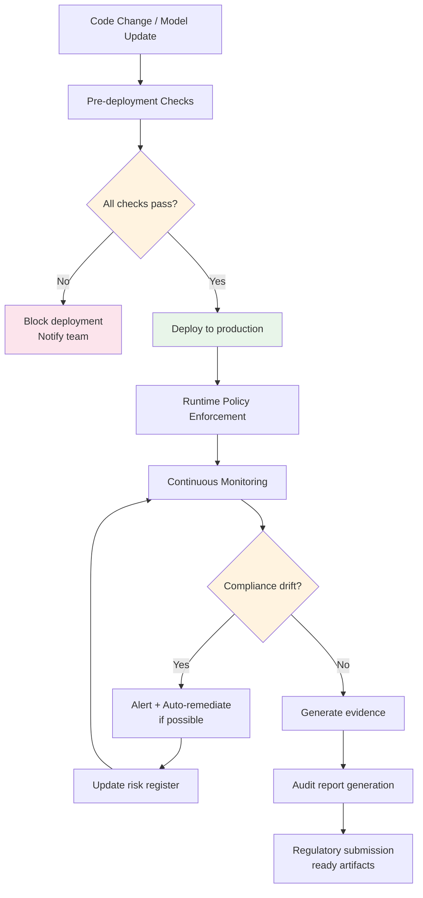

# Compliance Automation for AI Systems

## The Problem: Manual Compliance Doesn't Scale

When you have 5 AI features, manual compliance review works. When you have 50, it's painful. When you have 500, it's impossible.

Manual compliance means:
- Weeks of delay before each AI feature launch
- Inconsistent application of policies (reviewer A says yes, reviewer B says no)
- Compliance drift (systems approved 6 months ago no longer meet current standards)
- Audit panic (scrambling to generate evidence when auditors come)
- Human bottleneck (compliance team becomes the blocker for innovation)

**The solution**: encode compliance requirements as automated checks that run continuously, not just at launch time.

---

## Automated Compliance Checks

### Three Enforcement Points

```
┌────────────────────────────────────────────────────────────┐
│                  AI Compliance Automation                    │
├──────────────────┬───────────────────┬─────────────────────┤
│  PRE-DEPLOYMENT  │     RUNTIME       │       AUDIT         │
│                  │                   │                     │
│ CI/CD pipeline   │ Gateway/proxy     │ Scheduled scans     │
│ checks before    │ checks on every   │ and report          │
│ code ships       │ request/response  │ generation          │
│                  │                   │                     │
│ "Can it deploy?" │ "Can it respond?" │ "Can we prove it?"  │
└──────────────────┴───────────────────┴─────────────────────┘
```

### Pre-Deployment Checks (CI/CD)

Run automatically before any AI feature deploys:

```yaml
# .github/workflows/ai-compliance.yml
ai_compliance_checks:
  - name: "Model card exists and is current"
    check: model_card_validator
    severity: blocking
    
  - name: "Evaluation results meet minimum thresholds"
    check: eval_threshold_checker
    severity: blocking
    threshold:
      accuracy: 0.85
      bias_score: 0.05
      
  - name: "PII detection enabled in pipeline"
    check: pii_guardrail_present
    severity: blocking
    
  - name: "Cost estimation within budget"
    check: cost_estimator
    severity: warning
    max_monthly_cost: 5000
    
  - name: "Architecture review approved"
    check: arb_approval_status
    severity: blocking
    
  - name: "Risk register entry exists"
    check: risk_register_linked
    severity: warning
```

### Runtime Checks (Gateway/Proxy)

Enforced on every AI request/response:

```python
# Runtime compliance rules at the AI gateway
runtime_policies = [
    {
        "name": "pii_output_filter",
        "description": "No PII in AI outputs",
        "check": "output must not contain SSN, credit card, or email patterns",
        "action": "redact and log violation"
    },
    {
        "name": "cost_per_request_limit",
        "description": "Single request cost cap",
        "check": "estimated_cost < $0.50",
        "action": "reject request, alert team"
    },
    {
        "name": "rate_limit_per_user",
        "description": "Prevent abuse",
        "check": "user_requests_per_minute < 60",
        "action": "throttle, log anomaly"
    },
    {
        "name": "content_safety",
        "description": "No harmful outputs",
        "check": "output passes content safety classifier",
        "action": "block response, return safe fallback"
    },
    {
        "name": "data_residency",
        "description": "EU data stays in EU",
        "check": "if user.region == 'EU' then endpoint.region == 'EU'",
        "action": "route to EU endpoint or reject"
    }
]
```

### Audit Checks (Scheduled)

Run periodically to detect drift and generate evidence:

```yaml
audit_schedule:
  daily:
    - cost_anomaly_detection
    - error_rate_threshold_check
    - unauthorized_model_usage_scan
    
  weekly:
    - bias_drift_analysis
    - access_control_review
    - guardrail_effectiveness_report
    
  monthly:
    - full_compliance_assessment
    - risk_register_staleness_check
    - model_card_currency_check
    - data_retention_compliance
    
  quarterly:
    - comprehensive_audit_report
    - regulatory_mapping_update
    - third_party_vendor_review
```

---

## Policy-as-Code for AI

### What is Policy-as-Code?

Instead of policies living in Word documents that humans interpret, encode them as executable rules that machines enforce. This ensures:
- **Consistency**: same rule applied the same way every time
- **Speed**: millisecond enforcement, not days of review
- **Auditability**: every enforcement logged with policy version
- **Versioning**: policies tracked in git like code

### Policy Languages

| Language | Best For | Example Use |
|----------|----------|-------------|
| OPA/Rego | Infrastructure and API policies | "Only approved models can be deployed" |
| Cedar | Fine-grained access control | "User X can access data source Y" |
| Python rules | Complex AI-specific checks | "Bias score must be below threshold" |
| JSON Schema | Configuration validation | "System config must include guardrails" |

### Example Policies

**Policy 1: PII Protection**
```python
# All AI outputs must pass PII detection before returning to user
def check_pii_protection(system_config):
    """Every customer-facing AI must have PII filtering enabled."""
    if system_config["deployment_type"] == "customer_facing":
        assert "pii_filter" in system_config["guardrails"], \
            "Customer-facing AI must have PII filter enabled"
        assert system_config["guardrails"]["pii_filter"]["enabled"] == True
        assert system_config["guardrails"]["pii_filter"]["action"] in ["redact", "block"]
    return {"compliant": True, "policy": "PII-001"}
```

**Policy 2: High-Risk Deployment Gate**
```python
# Models with risk level > HIGH require human approval for deployment
def check_deployment_approval(system_config):
    """High-risk systems require explicit human approval."""
    if system_config["risk_level"] in ["HIGH", "CRITICAL"]:
        assert system_config.get("arb_approval") is not None, \
            "High-risk systems require Architecture Review Board approval"
        assert system_config["arb_approval"]["status"] == "approved"
        approval_age_days = (today() - system_config["arb_approval"]["date"]).days
        assert approval_age_days < 180, \
            "Approval expired (> 6 months old), re-review required"
    return {"compliant": True, "policy": "DEPLOY-002"}
```

**Policy 3: Cost Control**
```python
# Cost per request must not exceed $0.10 without escalation
def check_cost_controls(system_config):
    """Systems must have cost controls appropriate to their budget."""
    max_cost = system_config.get("max_cost_per_request", float("inf"))
    assert max_cost <= 0.10, \
        f"Max cost per request (${max_cost}) exceeds $0.10 limit. " \
        f"Requires finance approval for higher limit."
    assert "budget_alert_threshold" in system_config, \
        "Must define budget alert threshold"
    return {"compliant": True, "policy": "COST-001"}
```

**Policy 4: Evaluation Requirements**
```python
# All production AI must have evaluation pipeline
def check_evaluation_exists(system_config):
    """Production systems must have automated evaluation."""
    if system_config["environment"] == "production":
        eval_config = system_config.get("evaluation")
        assert eval_config is not None, \
            "Production AI must have evaluation configuration"
        assert eval_config.get("golden_dataset_size", 0) >= 50, \
            "Golden dataset must have at least 50 examples"
        assert eval_config.get("frequency") in ["on_deploy", "daily", "weekly"], \
            "Evaluation must run at least weekly"
    return {"compliant": True, "policy": "EVAL-001"}
```

**Policy 5: Data Residency**
```python
# EU user data must be processed in EU region
def check_data_residency(system_config):
    """Data must be processed in compliant regions."""
    for data_source in system_config.get("data_sources", []):
        if data_source.get("contains_eu_data"):
            assert data_source["processing_region"].startswith("eu-"), \
                f"EU data source '{data_source['name']}' processed in " \
                f"non-EU region: {data_source['processing_region']}"
    model_endpoint = system_config.get("model_endpoint", {})
    if system_config.get("serves_eu_users"):
        assert model_endpoint.get("region", "").startswith("eu-") or \
               model_endpoint.get("data_residency_compliant") == True, \
            "Systems serving EU users must use EU endpoints"
    return {"compliant": True, "policy": "RESIDENCY-001"}
```

### Policy Enforcement Architecture

```
┌─────────────┐     ┌──────────────┐     ┌─────────────────┐
│  Policy     │     │   Policy     │     │   Enforcement   │
│  Repository │────▶│   Engine     │────▶│   Points        │
│  (Git)      │     │  (Evaluator) │     │                 │
└─────────────┘     └──────────────┘     │  • CI/CD gate   │
                           │              │  • API gateway   │
                           ▼              │  • Deployment    │
                    ┌──────────────┐     │    controller    │
                    │   Audit Log  │     └─────────────────┘
                    │  (Evidence)  │
                    └──────────────┘
```

---

## Automated Compliance Monitoring

### Data Residency Checks
```yaml
monitoring:
  data_residency:
    check: "All API calls logged with source region and processing region"
    alert: "EU user request processed outside EU"
    frequency: "Real-time"
    evidence: "Request log with region tags"
```

### Consent Verification
```yaml
monitoring:
  consent:
    check: "User consent record exists and covers current processing purpose"
    alert: "Processing without valid consent"
    frequency: "Per-request"
    evidence: "Consent record ID linked to each AI interaction"
```

### Access Control Audit
```yaml
monitoring:
  access:
    check: "Only authorized services access AI-generated data stores"
    alert: "Unauthorized access to AI output database"
    frequency: "Real-time + daily review"
    evidence: "Access logs with principal identity and authorization check result"
```

### Model Card Verification
```yaml
monitoring:
  model_cards:
    check: "Model card exists, is current (< 90 days), and matches deployed config"
    alert: "Model card missing, stale, or inconsistent with deployment"
    frequency: "Daily"
    evidence: "Model card document with last-updated timestamp"
```

---

## Compliance Reporting

### Automated SOC2 Evidence Collection

SOC2 requires evidence that controls are operating effectively. For AI systems:

| SOC2 Control | AI Evidence | Automated Collection |
|-------------|-------------|---------------------|
| CC6.1 (Logical access) | Who can deploy AI models | IAM policy snapshots, deployment logs |
| CC6.6 (System boundaries) | Data flow diagrams | Auto-generated from gateway logs |
| CC7.2 (Monitoring) | Quality monitoring | Dashboard screenshots, alert history |
| CC8.1 (Change management) | Model change process | ADRs, ARB decisions, deployment history |
| A1.2 (Availability) | Uptime and failover | Uptime metrics, failover test results |

### GDPR Compliance Dashboard

```
┌────────────────────────────────────────────────────┐
│            GDPR AI Compliance Dashboard             │
├────────────────────────────────────────────────────┤
│                                                    │
│  Lawful Basis Coverage:  ████████████░░  85%      │
│  Consent Records:        █████████████░  92%      │
│  Data Residency:         ██████████████  100%     │
│  Right to Erasure:       ████████░░░░░░  60%  ⚠️  │
│  DPIA Completed:         █████████████░  95%      │
│  Data Retention:         ██████████░░░░  75%  ⚠️  │
│                                                    │
│  Non-compliant systems: 3                          │
│  Overdue DPIAs: 1                                  │
│  Pending deletion requests: 7                      │
└────────────────────────────────────────────────────┘
```

### Audit Trail Export

Every AI interaction should be exportable for regulatory review:

```json
{
  "interaction_id": "int_abc123",
  "timestamp": "2024-02-15T10:30:00Z",
  "system": "CustomerBot v3",
  "user_id": "user_hash_xyz",
  "user_region": "EU",
  "processing_region": "eu-west-1",
  "model": "gpt-4o-2024-02-01",
  "input_tokens": 150,
  "output_tokens": 200,
  "guardrails_applied": ["pii_filter", "content_safety"],
  "guardrail_triggers": [],
  "consent_basis": "legitimate_interest",
  "consent_record_id": "consent_456",
  "cost_usd": 0.0035,
  "quality_score": 0.89,
  "compliance_checks_passed": ["PII-001", "RESIDENCY-001", "COST-001"],
  "retention_expiry": "2024-05-15T10:30:00Z"
}
```

### Risk Register Auto-Update

Monitoring feeds back into the risk register automatically:

```yaml
auto_update_triggers:
  - condition: "guardrail_bypass_rate > 1%"
    action: "Increase likelihood score for related risk"
    
  - condition: "new_incident_reported"
    action: "Add incident to risk register entry"
    
  - condition: "model_drift_detected"
    action: "Flag risk for immediate review"
    
  - condition: "cost_anomaly_detected"
    action: "Update financial risk entry"
```

---

## Compliance Automation Pipeline



---

## Implementation Roadmap

### Phase 1: Foundation (Month 1-2)
- Define top 10 compliance policies in code
- Implement as CI/CD checks (blocking for critical, warning for others)
- Set up audit logging for all AI interactions

### Phase 2: Runtime (Month 3-4)
- Deploy policy engine at AI gateway
- Implement real-time PII detection and data residency enforcement
- Set up alerting for policy violations

### Phase 3: Monitoring (Month 5-6)
- Build compliance dashboard
- Implement drift detection
- Auto-generate monthly compliance reports
- Connect monitoring to risk register

### Phase 4: Maturity (Month 7+)
- Auto-remediation for common violations
- Predictive compliance (detect issues before they occur)
- Self-service compliance checking for development teams
- Regulatory report auto-generation

---

## Key Principles

1. **Shift left**: catch compliance issues in development, not production
2. **Automate evidence**: if you can't prove it automatically, you can't prove it at scale
3. **Version policies**: policies in git, changes tracked, rollback possible
4. **Fail safely**: when in doubt, block and alert (not silently pass)
5. **Continuous, not periodic**: compliance is a state, not an event
