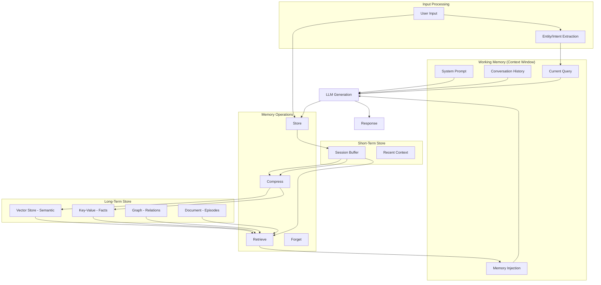

# Memory Architecture Overview for AI Agents

## Why Memory is the DIFFERENTIATOR for Production AI Agents

### The "Goldfish" Problem

Without memory, every AI agent conversation starts from absolute zero:

```
Session 1: "I prefer Python and concise answers"
Session 2: "Who are you? I don't know anything about you."
```

This is unacceptable for production agents. Users expect continuity.

### Without Memory
- Every conversation is isolated
- User must re-explain context every time
- Agent cannot learn from past mistakes
- No personalization possible
- Cannot track multi-session projects
- Feels like talking to a stranger each time

### With Memory
- Agent recalls user preferences immediately
- Context carries over across sessions
- Agent improves responses based on past feedback
- Personalized interaction style
- Tracks ongoing projects and deadlines
- Feels like working with a knowledgeable colleague

### The Business Case for Memory

| Metric | Without Memory | With Memory |
|--------|---------------|-------------|
| User satisfaction | Low (repetitive) | High (personalized) |
| Task completion time | Slow (re-explaining) | Fast (contextual) |
| Error rate | High (no learning) | Decreasing over time |
| User retention | Poor | Strong |
| Complex task support | Limited to single session | Multi-session workflows |

---

## Memory Types in Detail

### 1. Working Memory

The agent's "currently thinking about" buffer. Equivalent to human working memory.

**Characteristics:**
- **Capacity**: Limited by model context window (4K-128K tokens depending on model)
- **Persistence**: Dies when conversation ends (or when context is truncated)
- **Content**: System prompt + recent messages + current task context
- **Speed**: Instant (already in context)

**What lives in working memory:**
```
┌─────────────────────────────────────────┐
│ System Prompt (instructions, persona)    │
│ Memory Injection (retrieved memories)    │
│ Conversation History (recent messages)   │
│ Current Tool Results                     │
│ Current User Query                       │
│ [Space for generation]                   │
└─────────────────────────────────────────┘
```

**Key constraint**: Everything the model "knows" right now must fit in working memory. This is why retrieval and compression matter.

---

### 2. Short-Term Memory

Recent interactions within the current session, beyond what's in the immediate context.

**Characteristics:**
- **Capacity**: Last N exchanges (configurable, typically 10-50 messages)
- **Persistence**: Within session only, lost when session ends
- **Content**: Recent Q&A pairs, tool results, intermediate reasoning
- **Speed**: Fast retrieval (in-memory or Redis)

**Use cases:**
- Referencing something said 20 messages ago
- Maintaining coherence in long conversations
- Tracking multi-step task progress within a session

**Implementation:**
```python
class ShortTermMemory:
    def __init__(self, max_items=50):
        self.buffer = deque(maxlen=max_items)
    
    def add(self, message):
        self.buffer.append({
            "content": message,
            "timestamp": datetime.now(),
            "turn_number": len(self.buffer)
        })
    
    def get_recent(self, n=10):
        return list(self.buffer)[-n:]
    
    def search(self, query):
        # Simple keyword or embedding search over buffer
        pass
```

---

### 3. Long-Term Memory

Persistent knowledge that survives across sessions indefinitely.

**Characteristics:**
- **Capacity**: Unlimited (stored externally in databases)
- **Persistence**: Indefinite (or until explicitly deleted)
- **Content**: User preferences, learned facts, past decisions, project context
- **Speed**: Slower (requires retrieval from external store)

**Categories of long-term memory:**
1. **Facts**: "User works at Acme Corp"
2. **Preferences**: "User prefers TypeScript over JavaScript"
3. **Decisions**: "On Jan 10, we chose Qdrant over Pinecone"
4. **Context**: "User is building a RAG system for legal documents"
5. **Relationships**: "User's manager is Sarah, project lead is Mike"

**Implementation:**
```python
class LongTermMemory:
    def __init__(self, vector_store, structured_store):
        self.vector_store = vector_store      # For semantic search
        self.structured_store = structured_store  # For exact lookups
    
    def store(self, memory, metadata):
        embedding = embed(memory)
        self.vector_store.insert(embedding, memory, metadata)
        
        # Also extract structured facts
        facts = extract_facts(memory)
        for fact in facts:
            self.structured_store.upsert(fact)
    
    def recall(self, query, top_k=5):
        embedding = embed(query)
        return self.vector_store.search(embedding, top_k=top_k)
```

---

### 4. Episodic Memory

Specific events and interactions remembered with context, like human autobiographical memory.

**Characteristics:**
- **Content**: "Last Tuesday, user asked about X and was frustrated because Y"
- **Includes**: temporal context, emotional valence, outcome, participants
- **Purpose**: Learn from specific past experiences

**Structure of an episodic memory:**
```json
{
  "episode_id": "ep_001",
  "timestamp": "2024-01-15T14:30:00Z",
  "summary": "User asked about database migration, was frustrated with slow responses",
  "context": {
    "topic": "PostgreSQL to MongoDB migration",
    "user_mood": "frustrated",
    "session_length": "45 minutes"
  },
  "outcome": {
    "resolved": true,
    "approach": "Provided step-by-step migration script",
    "user_satisfaction": "positive after resolution"
  },
  "lessons": [
    "User prefers step-by-step guides over explanations",
    "Migration topics need concrete code examples"
  ]
}
```

**When to create episodic memories:**
- Significant interactions (breakthroughs, frustrations)
- Task completions (what worked, what didn't)
- User feedback (explicit or implicit)
- Unusual or novel situations

---

### 5. Semantic Memory

General knowledge and structured facts about the user and their world.

**Characteristics:**
- **Content**: Structured knowledge like "user prefers brief answers"
- **Organization**: Entity-relationship structure
- **Updates**: Refined over time as new information arrives

**Categories:**
```
User Knowledge:
  - Identity: name, role, company
  - Preferences: communication style, technical level, tools
  - Skills: what they know, what they're learning
  
Domain Knowledge:
  - Project facts: architecture, tech stack, team
  - Business rules: constraints, requirements, policies
  - Terminology: domain-specific terms and meanings

Relationship Knowledge:
  - User → Project (works on)
  - User → Team (member of)
  - Project → Technology (uses)
```

**Implementation as knowledge graph:**
```python
class SemanticMemory:
    def __init__(self):
        self.entities = {}  # entity_id -> attributes
        self.relations = []  # (subject, predicate, object)
    
    def add_fact(self, subject, predicate, obj, confidence=1.0):
        self.relations.append({
            "subject": subject,
            "predicate": predicate,
            "object": obj,
            "confidence": confidence,
            "last_updated": datetime.now()
        })
    
    def query(self, subject=None, predicate=None, obj=None):
        results = self.relations
        if subject:
            results = [r for r in results if r["subject"] == subject]
        if predicate:
            results = [r for r in results if r["predicate"] == predicate]
        if obj:
            results = [r for r in results if r["object"] == obj]
        return results
```

---

### 6. Procedural Memory

Learned behaviors, skills, and patterns. How to do things.

**Characteristics:**
- **Content**: "When user asks about billing, check these 3 sources first"
- **Learned from**: Repeated patterns, explicit instructions, successful outcomes
- **Applied**: Automatically when similar situations arise

**Examples:**
```yaml
procedures:
  - trigger: "user asks about deployment"
    actions:
      - "Check which environment (staging/prod)"
      - "Verify they have correct permissions"
      - "Provide environment-specific steps"
    learned_from: "Sessions on 2024-01-10, 2024-01-15"
    
  - trigger: "user shares error log"
    actions:
      - "Parse error type first"
      - "Check if similar error seen before"
      - "Provide fix with explanation"
    learned_from: "User feedback: 'just tell me the fix'"
    
  - trigger: "user says 'quick question'"
    actions:
      - "Keep response under 100 words"
      - "Skip preambles"
      - "Provide direct answer then offer elaboration"
    learned_from: "User preference observation"
```

---

## Memory Architecture Diagram



---

## Comparison Table

| Type | Capacity | Persistence | Retrieval Speed | Storage | Use Case |
|------|----------|-------------|-----------------|---------|----------|
| Working | 4K-128K tokens | Current turn | Instant | In-context | Active reasoning |
| Short-term | 10-50 messages | Session | <10ms | RAM/Redis | Recent context |
| Long-term | Unlimited | Indefinite | 50-200ms | DB/Vector | Persistent knowledge |
| Episodic | Thousands | Indefinite | 50-200ms | Document DB | Past experiences |
| Semantic | Thousands | Indefinite | 10-50ms | Graph/KV | Structured facts |
| Procedural | Hundreds | Indefinite | 10-50ms | Config/DB | Learned behaviors |

---

## Memory Lifecycle

```
1. ACQUISITION: New information enters through conversation
2. ENCODING: Information is processed, categorized, embedded
3. STORAGE: Written to appropriate backend by memory type
4. CONSOLIDATION: Compressed, deduplicated, linked to existing memories
5. RETRIEVAL: Found and injected into context when relevant
6. UPDATING: Modified when new information contradicts or extends
7. FORGETTING: Removed when expired, irrelevant, or user-requested
```

---

## Key Design Principles

1. **Memory should be invisible**: Users shouldn't have to manage memory explicitly
2. **Retrieval > Storage**: Storing everything is easy; retrieving the RIGHT thing is hard
3. **Compression is inevitable**: You cannot keep everything in full detail forever
4. **Privacy by design**: Memory creates liability; treat it as sensitive data
5. **Graceful degradation**: Agent should work fine without memory, better with it
6. **User control**: Users should see and manage what the agent remembers
7. **Context budget**: Always leave room in context window for actual task work

---

## Memory in Production Systems

### Mem0 (Open Source)
- Automatic memory extraction from conversations
- Multi-backend support (vector + graph)
- User/session/agent scoping

### OpenAI Memory (ChatGPT)
- Automatic preference extraction
- User-facing memory management
- Cross-conversation persistence

### LangGraph Memory
- Checkpoint-based state persistence
- Thread-scoped and cross-thread memory
- Integrated with LangChain ecosystem

### Custom Systems
- Most production agents build custom memory
- Reason: memory strategy is deeply tied to use case
- No one-size-fits-all solution exists

---

## Next Steps

- [02-memory-storage-backends.md](./02-memory-storage-backends.md) - Where to store each memory type
- [03-memory-retrieval-strategies.md](./03-memory-retrieval-strategies.md) - How to find the right memories
- [04-memory-compression-and-summarization.md](./04-memory-compression-and-summarization.md) - Managing memory growth
- [05-cross-session-memory.md](./05-cross-session-memory.md) - Persistence across conversations
- [06-memory-safety-and-privacy.md](./06-memory-safety-and-privacy.md) - Privacy and security concerns
