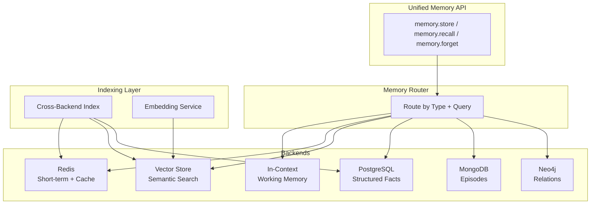

# Memory Storage Backends

## Storage Options for Each Memory Type

The choice of storage backend directly impacts retrieval speed, query flexibility, scalability, and cost. No single backend handles all memory types well.

---

## Backend Options

### 1. In-Context (Prompt Injection)

**How it works:** Memory is literally text in the LLM prompt.

```python
system_prompt = f"""You are a helpful assistant.

## User Memory
- Prefers concise answers
- Works at Acme Corp on Project Alpha
- Technical level: Senior engineer
- Last session: discussed migration to Kubernetes

## Conversation Summary
Previously discussed moving from ECS to EKS. User chose managed node groups.
Decision pending: which CNI plugin to use.
"""
```

**Pros:**
- Zero latency (already in context)
- No infrastructure needed
- Guaranteed to be "seen" by the model

**Cons:**
- Extremely limited capacity (eats into context window)
- No search capability
- Must be manually curated

**Best for:** Working memory, critical user preferences, session summaries

---

### 2. Vector Store (ChromaDB, Pinecone, Qdrant, Weaviate)

**How it works:** Memories are embedded and stored as vectors. Retrieved via semantic similarity search.

```python
import chromadb

client = chromadb.Client()
collection = client.create_collection("memories")

# Store
collection.add(
    documents=["User prefers Python over JavaScript"],
    metadatas=[{"type": "preference", "user_id": "user_123", "timestamp": "2024-01-15"}],
    ids=["mem_001"]
)

# Retrieve
results = collection.query(
    query_texts=["What programming language does the user like?"],
    n_results=5
)
```

**Pros:**
- Semantic search (finds related memories even with different wording)
- Scales to millions of memories
- Good for unstructured text memories

**Cons:**
- Approximate results (may miss exact matches)
- Embedding cost per memory
- No structured queries (can't do "all memories from January")

**Best for:** Long-term semantic memory, episodic memories, conversation chunks

---

### 3. Key-Value Store (Redis)

**How it works:** Simple key-value pairs with optional TTL and data structures.

```python
import redis

r = redis.Redis()

# Store user preferences
r.hset("user:123:prefs", mapping={
    "response_style": "concise",
    "language": "Python",
    "expertise_level": "senior"
})

# Store with TTL (session-scoped)
r.setex("session:abc:context", 3600, json.dumps(session_data))

# Retrieve
prefs = r.hgetall("user:123:prefs")
```

**Pros:**
- Extremely fast (<1ms latency)
- Built-in TTL for auto-expiration
- Rich data structures (hashes, lists, sets, sorted sets)
- Good for session-scoped data

**Cons:**
- No semantic search
- Limited query flexibility
- Memory-bound (expensive at scale)
- No persistence by default (configure AOF/RDB)

**Best for:** Short-term memory, session state, structured user preferences, caches

---

### 4. Relational Database (PostgreSQL)

**How it works:** Structured tables with SQL queries. With pgvector extension, also supports vector search.

```sql
CREATE TABLE memories (
    id UUID PRIMARY KEY,
    user_id VARCHAR(255) NOT NULL,
    memory_type VARCHAR(50) NOT NULL,
    content TEXT NOT NULL,
    metadata JSONB,
    embedding vector(1536),
    importance_score FLOAT DEFAULT 0.5,
    access_count INTEGER DEFAULT 0,
    created_at TIMESTAMP DEFAULT NOW(),
    last_accessed TIMESTAMP DEFAULT NOW(),
    expires_at TIMESTAMP
);

CREATE INDEX idx_memories_user ON memories(user_id);
CREATE INDEX idx_memories_type ON memories(user_id, memory_type);
CREATE INDEX idx_memories_embedding ON memories USING ivfflat (embedding vector_cosine_ops);

-- Query: Get user preferences
SELECT content, importance_score 
FROM memories 
WHERE user_id = 'user_123' 
  AND memory_type = 'preference'
  AND (expires_at IS NULL OR expires_at > NOW())
ORDER BY importance_score DESC;

-- Query: Semantic search with pgvector
SELECT content, 1 - (embedding <=> $1) as similarity
FROM memories
WHERE user_id = 'user_123'
ORDER BY embedding <=> $1
LIMIT 5;
```

**Pros:**
- Complex queries (filter by type, date, importance, etc.)
- ACID transactions
- pgvector for hybrid search
- Mature tooling and operations
- Good for compliance/auditing

**Cons:**
- Slower than Redis for simple lookups
- Schema management overhead
- Vector search less optimized than dedicated vector DBs

**Best for:** Long-term structured memory, audit trails, complex memory queries, hybrid search

---

### 5. Graph Database (Neo4j)

**How it works:** Memories as nodes, relationships as edges. Excellent for connected knowledge.

```cypher
// Store knowledge
CREATE (u:User {id: "user_123", name: "Alice"})
CREATE (p:Project {name: "RAG Migration", status: "active"})
CREATE (t:Technology {name: "Qdrant"})
CREATE (u)-[:WORKS_ON {since: "2024-01-01"}]->(p)
CREATE (p)-[:USES {reason: "vector search"}]->(t)
CREATE (u)-[:PREFERS {confidence: 0.9}]->(t)

// Query: What does the user work on and what tech is involved?
MATCH (u:User {id: "user_123"})-[:WORKS_ON]->(p:Project)-[:USES]->(t:Technology)
RETURN p.name, t.name

// Query: Multi-hop - colleagues working on same tech
MATCH (u:User {id: "user_123"})-[:WORKS_ON]->(p)-[:USES]->(t)<-[:USES]-(other_p)<-[:WORKS_ON]-(colleague)
RETURN colleague.name, t.name
```

**Pros:**
- Natural for relationship-heavy memory
- Multi-hop queries (connections between entities)
- Visual and intuitive for knowledge representation
- Good for "how is X related to Y?" queries

**Cons:**
- Overkill for simple key-value memories
- Operational complexity
- Smaller ecosystem than SQL
- Learning curve for Cypher

**Best for:** Semantic memory (entity relationships), organizational knowledge, complex context graphs

---

### 6. Document Store (MongoDB)

**How it works:** Flexible JSON documents with rich querying.

```python
# Store episodic memory
db.episodes.insert_one({
    "user_id": "user_123",
    "session_id": "sess_abc",
    "timestamp": datetime(2024, 1, 15, 14, 30),
    "type": "episode",
    "summary": "Discussed database migration strategy",
    "context": {
        "topic": "PostgreSQL to MongoDB migration",
        "user_mood": "focused",
        "tools_used": ["code_search", "web_search"],
        "duration_minutes": 45
    },
    "messages": [...],  # Can store full conversation
    "outcome": {
        "resolved": True,
        "approach": "phased migration with dual-write",
        "user_satisfaction": "positive"
    },
    "extracted_facts": [
        "User's database has 50M rows",
        "Migration deadline is March 15"
    ],
    "tags": ["database", "migration", "mongodb"]
})

# Query: Recent episodes about databases
db.episodes.find({
    "user_id": "user_123",
    "tags": "database",
    "timestamp": {"$gte": datetime(2024, 1, 1)}
}).sort("timestamp", -1).limit(5)
```

**Pros:**
- Flexible schema (episodes can have different structures)
- Rich querying on nested documents
- Good for storing variable-structure memories
- Horizontal scaling

**Cons:**
- No native semantic search (need Atlas Vector Search or separate index)
- Consistency tradeoffs at scale
- Can become unstructured mess without discipline

**Best for:** Episodic memory, conversation archives, variable-structure memories

---

## Comparison Table

| Backend | Speed | Capacity | Query Type | Cost | Best For |
|---------|-------|----------|------------|------|----------|
| In-context | Instant | Very limited (tokens) | None (all visible) | Free | Working memory |
| Vector (Pinecone) | 10-50ms | Billions | Semantic similarity | $$$ | Long-term semantic |
| Vector (ChromaDB) | 5-20ms | Millions | Semantic similarity | $ (self-hosted) | Long-term semantic |
| Redis | <1ms | GB-scale | Key lookup, patterns | $$ | Short-term, session |
| PostgreSQL | 5-50ms | Billions | SQL + vector | $ | Structured + hybrid |
| Neo4j | 5-30ms | Billions | Graph traversal | $$ | Relationships |
| MongoDB | 5-20ms | Billions | Document queries | $ | Episodes, archives |

---

## Recommended Architecture

```
Memory Type        → Primary Backend     → Secondary/Fallback
─────────────────────────────────────────────────────────────
Working Memory     → In-context prompt   → N/A
Short-term         → Redis (TTL=session) → In-memory fallback
Long-term Semantic → Vector store        → PostgreSQL (pgvector)
Long-term Facts    → PostgreSQL          → Redis cache
Episodic           → MongoDB/PostgreSQL  → Vector index for search
Procedural         → Config files + DB   → Redis cache
Relationships      → Neo4j/PostgreSQL    → Vector store
```

---

## Hybrid Memory Backend Architecture



---

## Unified Memory API

```python
class HybridMemoryBackend:
    def __init__(self):
        self.redis = RedisBackend()
        self.vector = VectorBackend()
        self.postgres = PostgresBackend()
        self.document = DocumentBackend()
    
    def store(self, memory_type: str, content: str, metadata: dict):
        """Route storage to appropriate backend."""
        if memory_type == "working":
            return  # Managed by prompt builder
        elif memory_type == "short_term":
            self.redis.store(content, metadata, ttl=3600)
        elif memory_type == "long_term_semantic":
            embedding = self.embed(content)
            self.vector.store(content, embedding, metadata)
        elif memory_type == "long_term_fact":
            self.postgres.store(content, metadata)
        elif memory_type == "episodic":
            self.document.store(content, metadata)
            # Also index in vector store for semantic search
            embedding = self.embed(content)
            self.vector.store(content, embedding, {**metadata, "source": "episodic"})
    
    def recall(self, query: str, memory_type: str = None, top_k: int = 5):
        """Retrieve memories, optionally filtered by type."""
        results = []
        
        if memory_type is None or memory_type == "short_term":
            results += self.redis.search(query)
        
        if memory_type is None or memory_type in ["long_term_semantic", "episodic"]:
            embedding = self.embed(query)
            results += self.vector.search(embedding, top_k=top_k)
        
        if memory_type is None or memory_type == "long_term_fact":
            results += self.postgres.search(query)
        
        # Score and rank across backends
        return self.rank(results, query)[:top_k]
    
    def forget(self, memory_id: str = None, user_id: str = None, query: str = None):
        """Delete memories by ID, user, or matching query."""
        for backend in [self.redis, self.vector, self.postgres, self.document]:
            backend.delete(memory_id=memory_id, user_id=user_id, query=query)
```

---

## Backend Selection Decision Tree

```
Is it needed RIGHT NOW in this turn?
  → Yes: In-context (working memory)
  → No: Continue...

Will it expire after this session?
  → Yes: Redis with TTL
  → No: Continue...

Is it a structured fact (key-value)?
  → Yes: PostgreSQL
  → No: Continue...

Is it about relationships between entities?
  → Yes: Neo4j or PostgreSQL with JSONB
  → No: Continue...

Is it a full conversation/episode to archive?
  → Yes: MongoDB/Document store + Vector index
  → No: Continue...

Is it unstructured knowledge to find semantically?
  → Yes: Vector store
  → No: PostgreSQL (default safe choice)
```

---

## Cost Considerations

| Scale | Recommended Stack | Monthly Cost Estimate |
|-------|-------------------|----------------------|
| Prototype | In-memory + SQLite | $0 |
| Small (1K users) | Redis + PostgreSQL(pgvector) | $50-100 |
| Medium (100K users) | Redis + Pinecone + PostgreSQL | $500-2000 |
| Large (1M+ users) | Redis Cluster + Qdrant + PostgreSQL + MongoDB | $5000+ |

**Cost drivers:**
- Vector storage: ~$0.10 per 1M vectors/month (managed services)
- Embedding generation: ~$0.10 per 1M tokens (OpenAI ada-002)
- Redis: ~$0.05 per GB/hour
- PostgreSQL: ~$0.10 per GB/month (storage) + compute
