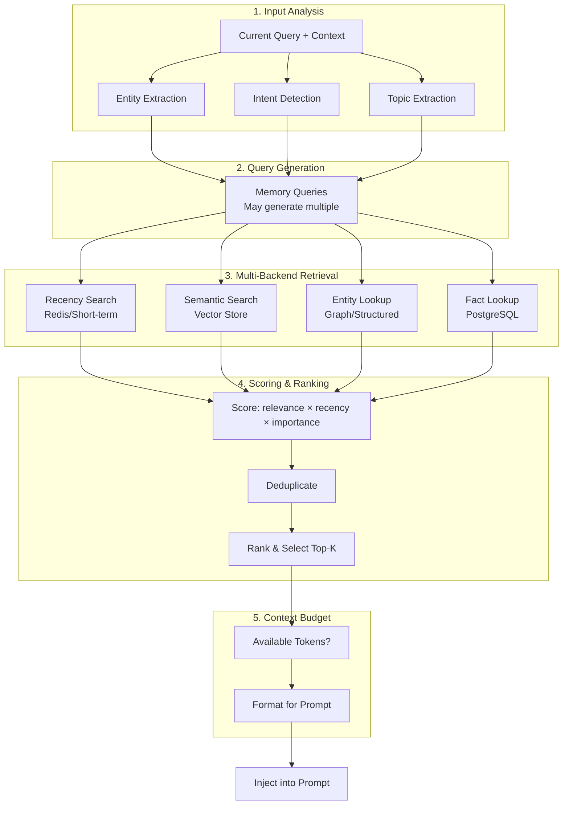

# Memory Retrieval Strategies

## The Retrieval Challenge

You may have millions of stored memories, but you need to find the RIGHT ones for THIS specific context, within a strict token budget. Retrieval quality determines whether memory helps or hurts.

**The paradox:** More memories stored = harder to find the right ones = more irrelevant context = worse performance.

---

## Retrieval Strategies

### 1. Recency-Based Retrieval

**Principle:** Most recent memories are most likely relevant.

```python
def recency_retrieval(memories, top_k=10):
    """Simple: sort by timestamp, return most recent."""
    sorted_memories = sorted(memories, key=lambda m: m["timestamp"], reverse=True)
    return sorted_memories[:top_k]
```

**When to use:**
- Continuing a conversation from earlier today
- Recent context is likely relevant (ongoing project)
- Session resumption

**Pros:** Simple, fast, no embedding needed
**Cons:** Misses highly relevant older memories

---

### 2. Relevance-Based Retrieval (Semantic Search)

**Principle:** Find memories semantically similar to the current query.

```python
def relevance_retrieval(query, vector_store, top_k=10):
    """Embed query, search vector store for similar memories."""
    query_embedding = embed(query)
    results = vector_store.search(
        query_embedding, 
        top_k=top_k,
        threshold=0.7  # Minimum similarity score
    )
    return results
```

**When to use:**
- Answering questions about past interactions
- Finding related knowledge
- "What do I know about X?"

**Pros:** Finds semantically related content regardless of age
**Cons:** May surface irrelevant but linguistically similar memories

---

### 3. Importance-Based Retrieval

**Principle:** Some memories matter more than others. Prioritize high-importance memories.

```python
def importance_retrieval(memories, top_k=10):
    """Score memories by importance, return highest-scoring."""
    for memory in memories:
        memory["importance"] = calculate_importance(memory)
    
    sorted_memories = sorted(memories, key=lambda m: m["importance"], reverse=True)
    return sorted_memories[:top_k]

def calculate_importance(memory):
    score = 0.5  # Base score
    
    # Factors that increase importance
    score += memory.get("access_count", 0) * 0.05   # Frequently accessed
    score += memory.get("user_emphasis", 0) * 0.2     # User said "remember this"
    score += memory.get("decision_impact", 0) * 0.3   # Led to important decision
    
    # Factors that decrease importance
    days_old = (now() - memory["timestamp"]).days
    score -= days_old * 0.001  # Slight decay over time
    
    if memory.get("contradicted_by"):
        score -= 0.5  # Superseded by newer info
    
    return min(max(score, 0), 1)  # Clamp to [0, 1]
```

**When to use:**
- Context window is tight
- Need to select from many potentially relevant memories
- Building a "memory summary" for the prompt

**Pros:** Ensures most valuable information is included
**Cons:** Requires importance scoring (which adds complexity)

---

### 4. Temporal-Relevance (Combined)

**Principle:** Combine semantic relevance with recency. Recent and relevant > old and relevant.

```python
def temporal_relevance_retrieval(query, memories, top_k=10, decay_rate=0.01):
    """Score = relevance * time_decay."""
    query_embedding = embed(query)
    
    scored = []
    for memory in memories:
        # Semantic relevance (0-1)
        relevance = cosine_similarity(query_embedding, memory["embedding"])
        
        # Time decay (exponential)
        hours_ago = (now() - memory["timestamp"]).total_seconds() / 3600
        time_factor = math.exp(-decay_rate * hours_ago)
        
        # Combined score
        score = relevance * (0.7 + 0.3 * time_factor)  # Relevance weighted more
        scored.append((memory, score))
    
    scored.sort(key=lambda x: x[1], reverse=True)
    return [m for m, s in scored[:top_k]]
```

**When to use:**
- Default strategy for most applications
- Balances "what's relevant" with "what's current"
- Good general-purpose retrieval

**Tuning `decay_rate`:**
- 0.001: Very slow decay (old memories retain value for weeks)
- 0.01: Moderate decay (memories lose significance over days)
- 0.1: Fast decay (only recent hours matter much)

---

### 5. Entity-Based Retrieval

**Principle:** Extract entities from the current query, retrieve all memories about those entities.

```python
def entity_retrieval(query, memory_store, top_k=10):
    """Extract entities from query, find memories about those entities."""
    # Step 1: Extract entities
    entities = extract_entities(query)
    # e.g., ["Project Alpha", "Kubernetes", "Sarah"]
    
    # Step 2: Retrieve memories tagged with those entities
    results = []
    for entity in entities:
        entity_memories = memory_store.query(
            filter={"entities": {"$contains": entity}}
        )
        results.extend(entity_memories)
    
    # Step 3: Deduplicate and rank
    results = deduplicate(results)
    results = rank_by_relevance(results, query)
    return results[:top_k]
```

**When to use:**
- "What did we discuss about Project X?"
- "What's the status of the migration?"
- Entity-centric conversations

**Pros:** Precise retrieval when entities are mentioned
**Cons:** Misses relevant memories not tagged with the entity

---

### 6. Goal-Based Retrieval

**Principle:** Retrieve memories from similar past tasks/goals.

```python
def goal_retrieval(current_goal, memory_store, top_k=10):
    """Find memories from past similar goals/tasks."""
    # Classify current goal
    goal_embedding = embed(current_goal)
    
    # Search episodic memories with successful outcomes
    results = memory_store.search(
        embedding=goal_embedding,
        filter={
            "type": "episode",
            "outcome.resolved": True
        },
        top_k=top_k
    )
    
    # Extract lessons and approaches from past episodes
    retrieval = []
    for episode in results:
        retrieval.append({
            "past_goal": episode["summary"],
            "approach": episode["outcome"]["approach"],
            "lessons": episode.get("lessons", [])
        })
    
    return retrieval
```

**When to use:**
- Agent executing a multi-step task
- "I've done something similar before"
- Learning from past successes/failures

---

## The Full Retrieval Pipeline



### Pipeline Implementation

```python
class MemoryRetrievalPipeline:
    def __init__(self, backends, embedder, budget_tokens=4000):
        self.backends = backends
        self.embedder = embedder
        self.budget_tokens = budget_tokens
    
    def retrieve(self, query: str, conversation_history: list) -> str:
        # 1. Analyze input
        entities = self.extract_entities(query)
        intent = self.classify_intent(query)
        topics = self.extract_topics(query + str(conversation_history[-3:]))
        
        # 2. Generate memory queries
        queries = self.generate_memory_queries(query, entities, intent, topics)
        
        # 3. Retrieve from backends (parallel)
        all_results = []
        for mq in queries:
            results = self.search_all_backends(mq)
            all_results.extend(results)
        
        # 4. Score and rank
        scored = self.score_results(all_results, query)
        deduplicated = self.deduplicate(scored)
        ranked = sorted(deduplicated, key=lambda x: x["score"], reverse=True)
        
        # 5. Apply context budget
        selected = self.apply_budget(ranked)
        
        # 6. Format for injection
        return self.format_memories(selected)
    
    def apply_budget(self, ranked_memories):
        """Select memories that fit within token budget."""
        selected = []
        tokens_used = 0
        
        for memory in ranked_memories:
            memory_tokens = count_tokens(memory["content"])
            if tokens_used + memory_tokens > self.budget_tokens:
                break
            selected.append(memory)
            tokens_used += memory_tokens
        
        return selected
    
    def format_memories(self, memories):
        """Format selected memories for prompt injection."""
        if not memories:
            return ""
        
        sections = {
            "preference": [],
            "fact": [],
            "episode": [],
            "context": []
        }
        
        for m in memories:
            mtype = m.get("type", "context")
            sections.get(mtype, sections["context"]).append(m["content"])
        
        output = "## Relevant Memories\n\n"
        if sections["preference"]:
            output += "**User Preferences:**\n" + "\n".join(f"- {p}" for p in sections["preference"]) + "\n\n"
        if sections["fact"]:
            output += "**Known Facts:**\n" + "\n".join(f"- {f}" for f in sections["fact"]) + "\n\n"
        if sections["episode"]:
            output += "**Relevant Past Interactions:**\n" + "\n".join(f"- {e}" for e in sections["episode"]) + "\n\n"
        if sections["context"]:
            output += "**Context:**\n" + "\n".join(f"- {c}" for c in sections["context"]) + "\n\n"
        
        return output
```

---

## Context Budget Management

The context window is a shared, finite resource. Memory must compete with other needs.

### Token Budget Allocation

```
Total Context Window: 128,000 tokens
├── System Prompt:           2,000 tokens (fixed)
├── Memory Injection:        4,000 tokens (variable)
├── Retrieved Documents:     8,000 tokens (RAG)
├── Conversation History:   10,000 tokens (sliding window)
├── Current Query:           1,000 tokens
└── Output Space:          103,000 tokens (generation)
```

### Dynamic Budget Allocation

```python
class ContextBudget:
    def __init__(self, total_tokens=128000):
        self.total = total_tokens
        self.fixed_allocations = {
            "system_prompt": 2000,
            "output_reserve": 4000,  # Minimum output space
        }
    
    def allocate(self, query_tokens, history_tokens, rag_tokens=0):
        """Dynamically allocate remaining budget."""
        used = sum(self.fixed_allocations.values()) + query_tokens + history_tokens + rag_tokens
        remaining = self.total - used
        
        # Memory gets up to 30% of remaining, max 8000 tokens
        memory_budget = min(int(remaining * 0.3), 8000)
        
        # If conversation is short, give more to memory
        if history_tokens < 2000:
            memory_budget = min(int(remaining * 0.5), 12000)
        
        return memory_budget
```

### Priority-Based Injection

When budget is tight, inject memories in priority order:

```
Priority 1: Active user preferences (always include)
Priority 2: Current task context (if relevant)
Priority 3: Recent relevant episodes
Priority 4: Background knowledge
Priority 5: Historical context (only if space permits)
```

---

## Retrieval Quality Metrics

### Precision
- Of memories retrieved, what fraction was actually useful?
- Target: >80% of injected memories should be referenced in response

### Recall
- Of memories that SHOULD have been retrieved, what fraction was?
- Harder to measure; use human evaluation on sample

### Latency
- Total retrieval pipeline time
- Target: <200ms for real-time applications
- Budget: 50ms embedding + 50ms search + 50ms scoring + 50ms formatting

### Relevance Feedback Loop

```python
def update_memory_scores(response, injected_memories, user_feedback):
    """After response, update memory importance based on usage."""
    for memory in injected_memories:
        if memory_referenced_in_response(memory, response):
            memory["access_count"] += 1
            memory["importance"] += 0.05  # Reward useful memories
        else:
            memory["importance"] -= 0.01  # Penalize unused memories
        
        if user_feedback == "negative":
            memory["importance"] -= 0.1  # Wrong memories hurt
```

---

## Advanced Retrieval Patterns

### Multi-Query Retrieval

Generate multiple search queries from a single user input:

```python
def multi_query_retrieve(user_query, llm, vector_store):
    """Generate multiple queries to improve recall."""
    prompt = f"""Given this user query, generate 3 different search queries 
    that would help find relevant memories:
    
    Query: {user_query}
    
    Generate queries that capture different aspects or phrasings."""
    
    queries = llm.generate(prompt)  # Returns list of 3 queries
    
    all_results = []
    for q in queries:
        results = vector_store.search(embed(q), top_k=5)
        all_results.extend(results)
    
    return deduplicate_and_rank(all_results)
```

### Contextual Retrieval

Use conversation history to improve retrieval:

```python
def contextual_retrieve(query, history, vector_store):
    """Use conversation context to disambiguate queries."""
    # "What was the decision?" is ambiguous alone
    # But with context: last 3 messages were about database choice
    
    context = "\n".join([m["content"] for m in history[-3:]])
    enriched_query = f"{context}\n\nCurrent question: {query}"
    
    embedding = embed(enriched_query)
    return vector_store.search(embedding, top_k=10)
```

### Retrieval with Reranking

Two-stage: fast retrieval + precise reranking:

```python
def retrieve_and_rerank(query, vector_store, reranker, top_k=5):
    """Fast retrieval (top 50) then precise reranking (top 5)."""
    # Stage 1: Fast vector search (broad recall)
    candidates = vector_store.search(embed(query), top_k=50)
    
    # Stage 2: Cross-encoder reranking (precise relevance)
    scored = reranker.score_pairs(
        [(query, c["content"]) for c in candidates]
    )
    
    ranked = sorted(zip(candidates, scored), key=lambda x: x[1], reverse=True)
    return [c for c, s in ranked[:top_k]]
```

---

## Strategy Selection Guide

| Situation | Primary Strategy | Secondary |
|-----------|-----------------|-----------|
| Continuing conversation | Recency | Relevance |
| New topic, existing user | Relevance + Entity | Importance |
| Complex multi-step task | Goal-based | Episodic |
| "What did we discuss about X?" | Entity | Temporal-relevance |
| First message in new session | Importance | Recency |
| Context window almost full | Importance (strict budget) | - |
| User explicitly references past | Temporal-relevance | Entity |
