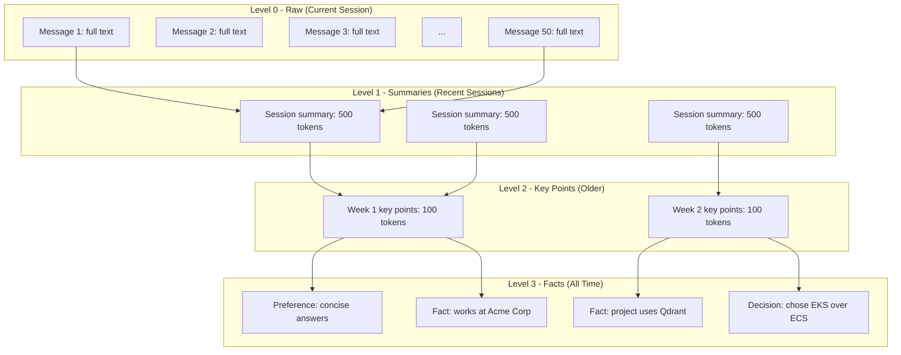

# Memory Compression and Summarization

## The Compression Problem

An AI agent that runs for months accumulates vast amounts of memory:
- 100 conversations × 50 messages × 200 tokens = 1,000,000 tokens of raw memory
- Context window: 128,000 tokens (and you can't use all of it for memory)
- Available memory budget per turn: ~4,000 tokens

**You MUST compress.** The question is how to do it without losing critical information.

---

## Compression Strategies

### 1. Summarization

Compress long conversations into concise summaries.

```python
def summarize_conversation(messages, llm):
    """Summarize a conversation into key points."""
    prompt = f"""Summarize the following conversation into key points.
Focus on:
- Decisions made
- User preferences expressed
- Important facts learned
- Unresolved questions
- Action items

Conversation:
{format_messages(messages)}

Summary (be concise, use bullet points):"""
    
    return llm.generate(prompt)
```

**Progressive Summarization:**
```
Raw (today): Full 50-message conversation
Summary L1 (yesterday): 500-token summary of conversation
Summary L2 (last week): 100-token summary of the summary
Summary L3 (last month): Single sentence: "Discussed DB migration, chose Qdrant"
```

**Implementation:**
```python
class ProgressiveSummarizer:
    def __init__(self, llm):
        self.llm = llm
    
    def summarize_level1(self, messages):
        """Full conversation → detailed summary (500 tokens)"""
        return self.llm.generate(f"""Summarize this conversation in detail 
        (max 500 tokens). Include all decisions, preferences, and facts:
        {format_messages(messages)}""")
    
    def summarize_level2(self, level1_summaries):
        """Multiple L1 summaries → session summary (100 tokens)"""
        combined = "\n---\n".join(level1_summaries)
        return self.llm.generate(f"""Condense these conversation summaries 
        into the most important points (max 100 tokens):
        {combined}""")
    
    def summarize_level3(self, level2_summaries):
        """Multiple L2 summaries → essence (1-2 sentences)"""
        combined = "\n".join(level2_summaries)
        return self.llm.generate(f"""In 1-2 sentences, what is the essence 
        of these interactions?
        {combined}""")
```

---

### 2. Selective Forgetting

Not all memories deserve to be kept. Actively forget low-value memories.

```python
class SelectiveForgetting:
    def __init__(self, memory_store):
        self.store = memory_store
    
    def decay_and_forget(self):
        """Apply importance decay and forget low-scoring memories."""
        all_memories = self.store.get_all()
        
        for memory in all_memories:
            # Decay importance over time
            days_since_access = (now() - memory["last_accessed"]).days
            decay = 0.95 ** days_since_access  # 5% decay per day
            memory["importance"] *= decay
            
            # Forget if below threshold
            if memory["importance"] < 0.1:
                self.store.delete(memory["id"])
            else:
                self.store.update(memory["id"], {"importance": memory["importance"]})
    
    def remove_redundant(self):
        """Remove memories that are redundant with others."""
        all_memories = self.store.get_all()
        
        for i, mem_a in enumerate(all_memories):
            for mem_b in all_memories[i+1:]:
                similarity = cosine_similarity(mem_a["embedding"], mem_b["embedding"])
                if similarity > 0.95:  # Nearly identical
                    # Keep the more important/recent one
                    to_delete = mem_a if mem_a["importance"] < mem_b["importance"] else mem_b
                    self.store.delete(to_delete["id"])
    
    def resolve_contradictions(self):
        """When memories contradict, keep the newer one."""
        # Use LLM to detect contradictions
        facts = self.store.get_by_type("fact")
        for i, fact_a in enumerate(facts):
            for fact_b in facts[i+1:]:
                if self.contradicts(fact_a, fact_b):
                    # Keep newer, mark older as superseded
                    older = fact_a if fact_a["timestamp"] < fact_b["timestamp"] else fact_b
                    self.store.delete(older["id"])
```

**Forgetting criteria:**
| Criterion | Action | Example |
|-----------|--------|---------|
| Low importance + old | Delete | Trivial fact from 6 months ago |
| Redundant | Merge/delete | Two memories saying same thing |
| Contradicted | Delete older | "Uses Python 3.8" superseded by "Upgraded to 3.11" |
| Expired (TTL) | Delete | Temporary project context |
| User-requested | Delete immediately | "Forget what I said about..." |

---

### 3. Hierarchical Compression

Maintain memories at multiple levels of detail simultaneously.

```
Level 0 (Raw):     Full messages, word-for-word
                   Kept for: current session only
                   Size: 100%

Level 1 (Detailed): Message-level summaries
                   Kept for: last 3 sessions
                   Size: ~20% of original

Level 2 (Session):  Session-level summaries  
                   Kept for: last 30 days
                   Size: ~5% of original

Level 3 (Facts):    Extracted entities and facts
                   Kept for: indefinitely
                   Size: ~1% of original
```



---

### 4. Entity-Based Compression

Extract structured knowledge about entities, discard raw conversations.

```python
class EntityCompressor:
    def __init__(self, llm):
        self.llm = llm
        self.entity_store = {}  # entity -> facts
    
    def extract_and_compress(self, conversation):
        """Extract entity facts from conversation, store compactly."""
        prompt = f"""Extract all facts about entities from this conversation.
Format as entity -> list of facts.

Conversation:
{conversation}

Entities and facts:"""
        
        extracted = self.llm.generate(prompt)
        # Parse and merge with existing knowledge
        new_facts = self.parse_entity_facts(extracted)
        
        for entity, facts in new_facts.items():
            if entity not in self.entity_store:
                self.entity_store[entity] = []
            
            for fact in facts:
                # Check for contradictions with existing facts
                if not self.contradicts_existing(entity, fact):
                    self.entity_store[entity].append(fact)
                else:
                    # Replace contradicted fact with new one
                    self.update_fact(entity, fact)
    
    def get_compact_representation(self):
        """Get all entity knowledge in compact format."""
        output = ""
        for entity, facts in self.entity_store.items():
            output += f"**{entity}**: {'; '.join(facts)}\n"
        return output
```

**Example compression:**

Before (raw conversation, 2000 tokens):
```
User: I'm working on Project Alpha at Acme Corp
Agent: What's Project Alpha about?
User: It's a RAG system for legal documents. We're using Python and Qdrant.
Agent: Great choices. What's the timeline?
User: We need to launch by March 15. Team is 5 people.
... (20 more messages)
```

After (entity facts, 100 tokens):
```
User: works at Acme Corp, senior engineer, prefers Python
Project Alpha: RAG system for legal docs, uses Python + Qdrant, 
              deadline March 15, team of 5, status: in progress
```

**Compression ratio: 20:1**

---

### 5. Sliding Window + Summary

The most practical approach for real-time conversations.

```python
class SlidingWindowMemory:
    def __init__(self, window_size=10, llm=None):
        self.window_size = window_size
        self.messages = []
        self.summary = ""
        self.llm = llm
    
    def add_message(self, message):
        self.messages.append(message)
        
        if len(self.messages) > self.window_size:
            self._compress()
    
    def _compress(self):
        """Summarize older messages, keep recent ones in full."""
        old_messages = self.messages[:-self.window_size]
        
        # Summarize old messages
        old_text = format_messages(old_messages)
        new_summary = self.llm.generate(
            f"""Update this running summary with new information.
            
Current summary: {self.summary}

New messages to incorporate:
{old_text}

Updated summary (be concise, preserve key facts):"""
        )
        
        self.summary = new_summary
        self.messages = self.messages[-self.window_size:]
    
    def get_context(self):
        """Get full context: summary + recent messages."""
        context = ""
        if self.summary:
            context += f"[Previous conversation summary: {self.summary}]\n\n"
        context += format_messages(self.messages)
        return context
```

**Visualization:**
```
Turn 1-10:   [Full messages in context]
Turn 11:     Messages 1-5 → summarized, Messages 6-11 in full
Turn 20:     Messages 1-15 → summarized, Messages 16-20 in full
Turn 50:     Messages 1-45 → summarized (summary of summaries), Messages 46-50 in full
```

---

## Progressive Summarization Algorithm

```python
class ProgressiveMemoryManager:
    """Complete progressive summarization implementation."""
    
    WINDOW_SIZE = 10          # Messages to keep in full
    SUMMARY_THRESHOLD = 20    # When to trigger summarization
    MAX_SUMMARY_TOKENS = 500  # Max size of running summary
    
    def __init__(self, llm):
        self.llm = llm
        self.messages = []
        self.running_summary = ""
        self.entity_facts = {}
        self.session_summaries = []  # Summaries of past sessions
    
    def process_turn(self, user_msg, assistant_msg):
        """Process a conversation turn."""
        self.messages.append({"role": "user", "content": user_msg})
        self.messages.append({"role": "assistant", "content": assistant_msg})
        
        # Check if compression needed
        if len(self.messages) > self.SUMMARY_THRESHOLD:
            self._compress_in_session()
        
        # Extract entities continuously
        self._extract_entities(user_msg + " " + assistant_msg)
    
    def _compress_in_session(self):
        """Compress during an active session."""
        old = self.messages[:-self.WINDOW_SIZE]
        old_text = format_messages(old)
        
        self.running_summary = self.llm.generate(f"""
Update the running summary with new conversation content.
Preserve: decisions, preferences, facts, action items.
Drop: pleasantries, repeated information, failed attempts.

Current summary: {self.running_summary or '(none yet)'}
New content: {old_text}

Updated summary (max {self.MAX_SUMMARY_TOKENS} tokens):""")
        
        self.messages = self.messages[-self.WINDOW_SIZE:]
    
    def end_session(self):
        """Called when session ends. Create session summary."""
        all_content = self.running_summary + "\n" + format_messages(self.messages)
        
        session_summary = self.llm.generate(f"""
Create a concise session summary. Include:
1. Main topics discussed
2. Decisions made
3. User preferences observed
4. Unresolved items / follow-ups needed

Session content: {all_content}

Session summary:""")
        
        self.session_summaries.append({
            "date": now(),
            "summary": session_summary,
            "entities": dict(self.entity_facts)
        })
        
        # Reset for next session
        self.messages = []
        self.running_summary = ""
    
    def start_session(self):
        """Called when new session starts. Build initial context."""
        context = ""
        
        # Include entity facts (always, most compact)
        if self.entity_facts:
            context += "## Known Facts\n"
            for entity, facts in self.entity_facts.items():
                context += f"- **{entity}**: {'; '.join(facts)}\n"
            context += "\n"
        
        # Include recent session summaries
        recent_sessions = self.session_summaries[-3:]
        if recent_sessions:
            context += "## Recent Sessions\n"
            for s in recent_sessions:
                context += f"- [{s['date'].strftime('%Y-%m-%d')}]: {s['summary']}\n"
            context += "\n"
        
        return context
```

---

## When to Summarize

| Trigger | Action | Reason |
|---------|--------|--------|
| Every N messages (10-20) | Sliding window compress | Prevent context overflow |
| End of session | Full session summary | Persist for cross-session |
| Topic change detected | Summarize previous topic | Clean transition |
| Context budget exceeded | Emergency compress | Must fit in window |
| User explicitly asks | Summarize on demand | "Summarize what we discussed" |
| Daily/weekly batch | Compress old sessions | Storage optimization |

### Topic Change Detection

```python
def detect_topic_change(recent_messages, threshold=0.3):
    """Detect when conversation topic changes significantly."""
    if len(recent_messages) < 4:
        return False
    
    # Compare embedding of last 2 messages vs previous 2
    recent = embed(" ".join(m["content"] for m in recent_messages[-2:]))
    previous = embed(" ".join(m["content"] for m in recent_messages[-4:-2]))
    
    similarity = cosine_similarity(recent, previous)
    return similarity < threshold  # Low similarity = topic change
```

---

## Quality of Compression: Information Retention

How much information survives compression?

### Measuring Retention

```python
def measure_retention(original_messages, compressed_summary, llm):
    """Check if key information survived compression."""
    # Extract facts from original
    original_facts = llm.generate(f"""
    List all distinct facts, decisions, and preferences from:
    {format_messages(original_messages)}
    Format: one fact per line""")
    
    # Check which facts are in the summary
    facts = original_facts.strip().split("\n")
    retained = 0
    
    for fact in facts:
        check = llm.generate(f"""
        Is this fact captured in the summary? Answer YES or NO.
        Fact: {fact}
        Summary: {compressed_summary}""")
        
        if "YES" in check.upper():
            retained += 1
    
    retention_rate = retained / len(facts)
    return retention_rate, retained, len(facts)
```

**Target retention rates:**
| Compression Level | Target Retention | Acceptable Loss |
|-------------------|-----------------|-----------------|
| L0 → L1 (summarize) | 90%+ | Pleasantries, repetition |
| L1 → L2 (condense) | 70%+ | Details, minor facts |
| L2 → L3 (extract facts) | 50%+ | Context, reasoning |

---

## Compression in Practice: Full Example

### Input: 50-message conversation (10,000 tokens)

**Messages 1-10** (topic: project setup):
```
Setting up new Python project, chose FastAPI + PostgreSQL + Redis.
User wants async everywhere. Deployment on AWS ECS.
```

**Messages 11-30** (topic: database schema):
```
Designed user, project, and memory tables. Discussed indexing.
Decision: use pgvector for embeddings. UUID primary keys.
```

**Messages 31-50** (topic: API design):
```
RESTful API with /memories endpoint. CRUD + search.
Authentication via JWT. Rate limiting with Redis.
```

### Output after compression:

**Running Summary (200 tokens):**
```
Setting up Python project: FastAPI + PostgreSQL + Redis on AWS ECS.
Architecture: async everywhere, pgvector for embeddings, UUID PKs.
DB schema: users, projects, memories tables with vector indexes.
API: RESTful /memories endpoint, JWT auth, Redis rate limiting.
User preference: async patterns, minimal dependencies.
```

**Entity Facts (80 tokens):**
```
Project: FastAPI + PostgreSQL + Redis, deployed on AWS ECS
Tech choices: pgvector (embeddings), UUID PKs, JWT auth
User: prefers async, minimal dependencies, Python
Status: schema designed, API design in progress
```

**Compression: 10,000 tokens → 280 tokens (96% reduction)**
**Retention: ~85% of key facts preserved**
