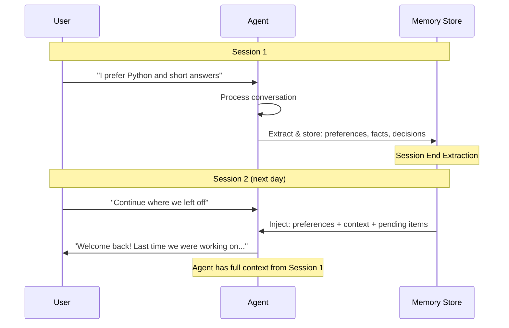

# Cross-Session Memory

## The Challenge

User returns tomorrow. The agent should remember yesterday's conversation.

```
Session 1 (Monday):    "I'm migrating from PostgreSQL to MongoDB"
Session 2 (Tuesday):   "How's the migration going?" 
                        Agent: "What migration?" ← UNACCEPTABLE
```

Cross-session memory bridges the gap between ephemeral conversations and persistent knowledge.

---

## What to Persist Across Sessions

### Categories of Cross-Session Information

| Category | Example | Persistence |
|----------|---------|-------------|
| Preferences | "Prefers Python, concise answers" | Indefinite |
| Context facts | "Working on Project X, deadline March 15" | Until outdated |
| Relationship state | "Last discussed migration plan step 3" | Until topic closes |
| Unresolved items | "Bug in auth module, couldn't fix" | Until resolved |
| Learned patterns | "Asks follow-up questions after code" | Indefinite |
| Decisions | "Chose Qdrant over Pinecone on Jan 10" | Indefinite |
| Emotional context | "Was frustrated last session" | Short-lived |

---

## Cross-Session Memory Architecture



### Session-End Extraction

When a session ends, extract what should persist:

```python
class SessionEndExtractor:
    def __init__(self, llm, memory_store):
        self.llm = llm
        self.memory_store = memory_store
    
    def extract_and_persist(self, session_messages, user_id):
        """Extract important information at session end."""
        conversation = format_messages(session_messages)
        
        extraction = self.llm.generate(f"""
Analyze this conversation and extract information to remember for future sessions.

Conversation:
{conversation}

Extract in JSON format:
{{
    "preferences": ["list of user preferences observed"],
    "facts": ["factual information learned about user/project"],
    "decisions": ["decisions made during this session"],
    "pending_items": ["unresolved questions or tasks"],
    "context_updates": ["changes to ongoing project/work context"],
    "session_summary": "one paragraph summary of this session"
}}""")
        
        data = json.loads(extraction)
        
        # Store each type appropriately
        for pref in data["preferences"]:
            self.memory_store.upsert_preference(user_id, pref)
        
        for fact in data["facts"]:
            self.memory_store.store_fact(user_id, fact)
        
        for decision in data["decisions"]:
            self.memory_store.store_decision(user_id, decision, date=now())
        
        for item in data["pending_items"]:
            self.memory_store.store_pending(user_id, item)
        
        self.memory_store.store_session_summary(
            user_id, data["session_summary"], date=now()
        )
```

### Session-Start Injection

When a new session begins, retrieve and inject relevant memories:

```python
class SessionStartInjector:
    def __init__(self, memory_store):
        self.memory_store = memory_store
    
    def build_memory_context(self, user_id, initial_message=None):
        """Build memory context to inject at session start."""
        context_parts = []
        
        # 1. Always include: user preferences
        prefs = self.memory_store.get_preferences(user_id)
        if prefs:
            context_parts.append("## User Preferences\n" + 
                "\n".join(f"- {p}" for p in prefs))
        
        # 2. Always include: pending items
        pending = self.memory_store.get_pending(user_id)
        if pending:
            context_parts.append("## Pending from Last Session\n" + 
                "\n".join(f"- {p}" for p in pending))
        
        # 3. Recent session summaries (last 3)
        summaries = self.memory_store.get_recent_summaries(user_id, n=3)
        if summaries:
            context_parts.append("## Recent Sessions\n" + 
                "\n".join(f"- [{s['date']}]: {s['summary']}" for s in summaries))
        
        # 4. If initial message provided, retrieve relevant memories
        if initial_message:
            relevant = self.memory_store.semantic_search(
                user_id, initial_message, top_k=5
            )
            if relevant:
                context_parts.append("## Relevant Context\n" + 
                    "\n".join(f"- {r['content']}" for r in relevant))
        
        return "\n\n".join(context_parts)
```

---

## User Memory Profile

The persistent representation of what the agent knows about a user.

```json
{
  "user_id": "user_123",
  "created_at": "2024-01-01T00:00:00Z",
  "last_session": "2024-01-15T16:30:00Z",
  "session_count": 12,
  
  "preferences": {
    "response_style": "concise",
    "preferred_language": "Python",
    "expertise_level": "senior",
    "formatting": "bullet points and code blocks",
    "tone": "direct, no fluff"
  },
  
  "context": {
    "current_project": "RAG Migration",
    "company": "Acme Corp",
    "role": "Senior Backend Engineer",
    "team_size": 5,
    "tech_stack": ["Python", "FastAPI", "PostgreSQL", "Qdrant", "AWS"]
  },
  
  "history": [
    {
      "date": "2024-01-10",
      "topic": "Vector DB selection",
      "outcome": "Chose Qdrant over Pinecone (cost + self-hosting)",
      "key_facts": ["Need to index 10M documents", "Budget: $500/mo"]
    },
    {
      "date": "2024-01-12",
      "topic": "Embedding model selection",
      "outcome": "Testing E5-large vs OpenAI ada-002",
      "key_facts": ["Latency matters more than marginal quality"]
    },
    {
      "date": "2024-01-15",
      "topic": "Chunking strategy",
      "outcome": "Settled on recursive character splitter, 512 tokens",
      "key_facts": ["Legal documents have specific structure"]
    }
  ],
  
  "pending": [
    "Follow up on indexing performance (was getting 200 docs/sec, needs 1000)",
    "User wanted to discuss hybrid search (dense + sparse)"
  ],
  
  "learned_patterns": [
    "Usually asks for code examples after explanation",
    "Prefers to see tradeoffs before making decisions",
    "Often works late evenings (timezone: PST)"
  ],
  
  "entities": {
    "Project Alpha": {"type": "project", "status": "active", "domain": "legal RAG"},
    "Sarah": {"type": "person", "relation": "manager", "context": "approves architecture"},
    "Qdrant": {"type": "technology", "relation": "chosen vector DB"}
  }
}
```

---

## Memory Synchronization

### Multi-Device / Multi-Session Challenges

```
Device A (laptop):  User discusses project, memory updated
Device B (phone):   User asks follow-up, stale memory
```

### Conflict Resolution Strategies

```python
class MemorySyncManager:
    def __init__(self, memory_store):
        self.store = memory_store
    
    def resolve_conflict(self, memory_a, memory_b):
        """Resolve conflicting memory updates."""
        # Strategy 1: Last-write-wins (simple but lossy)
        if memory_a["timestamp"] > memory_b["timestamp"]:
            return memory_a
        return memory_b
    
    def merge_preferences(self, pref_a, pref_b):
        """Merge preference updates from different sessions."""
        merged = {}
        all_keys = set(pref_a.keys()) | set(pref_b.keys())
        
        for key in all_keys:
            if key in pref_a and key in pref_b:
                # Both have the key - use most recent
                if pref_a.get(f"{key}_updated", 0) > pref_b.get(f"{key}_updated", 0):
                    merged[key] = pref_a[key]
                else:
                    merged[key] = pref_b[key]
            elif key in pref_a:
                merged[key] = pref_a[key]
            else:
                merged[key] = pref_b[key]
        
        return merged
```

### Consistency Model

For most AI agent memory systems, **eventual consistency** is acceptable:
- Memory updates propagate within seconds
- Slight staleness rarely causes problems
- Strong consistency adds latency and complexity

**Exception:** Explicit deletions should be strongly consistent (privacy requirement).

---

## Memory Expiration

Not all memories should live forever.

```python
class MemoryExpiration:
    # Default TTLs by memory type
    TTL_MAP = {
        "preference": None,          # Never expires
        "fact": timedelta(days=90),   # Refresh after 90 days
        "decision": None,             # Never expires
        "pending": timedelta(days=30),# Auto-close after 30 days
        "session_summary": timedelta(days=180),  # 6 months
        "emotional_context": timedelta(days=1),  # Very short-lived
        "temporary_context": timedelta(days=7),  # One week
    }
    
    def should_expire(self, memory):
        """Check if memory should be expired."""
        ttl = self.TTL_MAP.get(memory["type"])
        
        if ttl is None:
            return False  # Never expires
        
        age = now() - memory["created_at"]
        
        # Override: high-importance memories get extended TTL
        if memory.get("importance", 0) > 0.8:
            ttl = ttl * 3  # Triple TTL for important memories
        
        return age > ttl
    
    def run_expiration(self, memory_store, user_id):
        """Expire old memories for a user."""
        all_memories = memory_store.get_all(user_id)
        expired = []
        
        for memory in all_memories:
            if self.should_expire(memory):
                # Before deleting, check if it contains unique important facts
                if not self.has_unique_important_facts(memory, all_memories):
                    memory_store.delete(memory["id"])
                    expired.append(memory["id"])
                else:
                    # Extract facts before expiring the full memory
                    facts = extract_facts(memory["content"])
                    for fact in facts:
                        memory_store.store_fact(user_id, fact)
                    memory_store.delete(memory["id"])
                    expired.append(memory["id"])
        
        return expired
```

### Expiration Policies

| Memory Type | Default TTL | Extension Rule | On Expiry |
|-------------|-------------|----------------|-----------|
| Preferences | Never | N/A | N/A |
| Decisions | Never | N/A | N/A |
| Session summaries | 180 days | +90 if accessed recently | Extract facts first |
| Pending items | 30 days | +30 if still relevant | Mark as abandoned |
| Temporary context | 7 days | None | Delete |
| Emotional context | 1 day | None | Delete |
| Facts | 90 days | Reset on access | Verify or delete |

---

## Implementation Pattern: Full Cross-Session Flow

```python
class CrossSessionMemory:
    """Complete cross-session memory manager."""
    
    def __init__(self, llm, storage):
        self.llm = llm
        self.storage = storage
        self.extractor = SessionEndExtractor(llm, storage)
        self.injector = SessionStartInjector(storage)
    
    # === Session Lifecycle ===
    
    def on_session_start(self, user_id, first_message=None):
        """Called when a new session begins."""
        # Build memory context
        memory_context = self.injector.build_memory_context(user_id, first_message)
        
        # Check for pending items to proactively mention
        pending = self.storage.get_pending(user_id)
        
        return {
            "memory_context": memory_context,  # Inject into system prompt
            "pending_items": pending,           # Agent can mention these
            "session_count": self.storage.get_session_count(user_id)
        }
    
    def on_session_end(self, user_id, messages):
        """Called when session ends."""
        # Extract and persist
        self.extractor.extract_and_persist(messages, user_id)
        
        # Run maintenance
        self.run_maintenance(user_id)
    
    def on_message(self, user_id, message, response):
        """Called after each message exchange (optional real-time extraction)."""
        # Light extraction during conversation
        # Only extract obvious preferences/facts, not full analysis
        quick_facts = self.quick_extract(message, response)
        for fact in quick_facts:
            self.storage.store_fact(user_id, fact, importance=0.5)
    
    # === Maintenance ===
    
    def run_maintenance(self, user_id):
        """Periodic maintenance: expire, compress, deduplicate."""
        MemoryExpiration().run_expiration(self.storage, user_id)
        self.deduplicate_facts(user_id)
        self.compress_old_summaries(user_id)
    
    def deduplicate_facts(self, user_id):
        """Remove redundant facts."""
        facts = self.storage.get_by_type(user_id, "fact")
        # Group similar facts, keep most recent/important
        # ... deduplication logic ...
    
    def compress_old_summaries(self, user_id):
        """Compress old session summaries into higher-level summaries."""
        old_summaries = self.storage.get_summaries_older_than(user_id, days=30)
        if len(old_summaries) > 5:
            compressed = self.llm.generate(f"""
Compress these old session summaries into key facts only:
{json.dumps([s['summary'] for s in old_summaries])}

Key facts (one per line):""")
            
            # Store compressed version, delete originals
            for fact in compressed.strip().split("\n"):
                self.storage.store_fact(user_id, fact.strip("- "))
            for s in old_summaries:
                self.storage.delete(s["id"])
```

---

## Proactive Memory Use

The best cross-session memory doesn't just respond to queries - it proactively surfaces relevant context.

```python
def proactive_memory_check(user_id, current_message, memory_store):
    """Check if any memories should be proactively surfaced."""
    proactive = []
    
    # Check pending items related to current topic
    pending = memory_store.get_pending(user_id)
    for item in pending:
        if is_related(current_message, item["content"]):
            proactive.append(f"Reminder: you had a pending item: {item['content']}")
    
    # Check if user is repeating a past question
    similar_past = memory_store.semantic_search(user_id, current_message, top_k=1)
    if similar_past and similar_past[0]["similarity"] > 0.9:
        past = similar_past[0]
        proactive.append(f"Note: you asked something similar on {past['date']}. "
                        f"The resolution was: {past.get('outcome', 'unknown')}")
    
    # Check for contradictions with known facts
    stated_facts = extract_facts(current_message)
    for fact in stated_facts:
        contradiction = memory_store.find_contradiction(user_id, fact)
        if contradiction:
            proactive.append(f"Note: this seems different from what I know: "
                           f"{contradiction['content']}")
    
    return proactive
```

---

## Testing Cross-Session Memory

```python
def test_cross_session():
    """Integration test for cross-session memory."""
    mem = CrossSessionMemory(llm, storage)
    user_id = "test_user"
    
    # Session 1
    session1_messages = [
        {"role": "user", "content": "I prefer Python and concise answers"},
        {"role": "assistant", "content": "Noted! I'll keep things brief and Python-focused."},
        {"role": "user", "content": "I'm working on a RAG system for legal docs"},
        {"role": "assistant", "content": "Got it. What's your current progress?"},
    ]
    mem.on_session_end(user_id, session1_messages)
    
    # Session 2 (next day)
    context = mem.on_session_start(user_id, "How should I chunk the documents?")
    
    # Verify memory injection contains:
    assert "Python" in context["memory_context"]
    assert "concise" in context["memory_context"]
    assert "RAG" in context["memory_context"]
    assert "legal" in context["memory_context"]
    
    print("Cross-session memory working correctly!")
```
