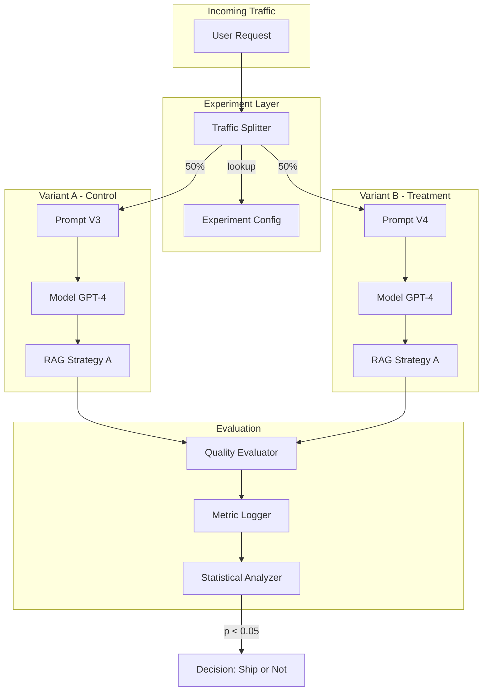
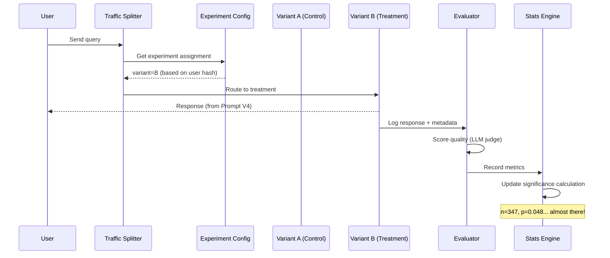

# A/B Testing for AI Systems

## Why A/B Testing AI Is Different from Traditional A/B Testing

Traditional A/B testing was designed for deterministic systems: button color A vs B, page layout X vs Y.
The user sees the same thing every time, and you measure click-through rates. Simple.

AI systems break every assumption traditional A/B testing relies on.

### Non-Deterministic Outputs

The same input can produce different outputs across calls:

```
Input: "Explain quantum computing"
Call 1: "Quantum computing leverages quantum mechanical phenomena..."
Call 2: "At its core, quantum computing uses qubits..."
Call 3: "Unlike classical computers that use bits..."
```

This means:
- You can't reproduce a specific result for debugging
- Variance within a variant is HIGH (not just between variants)
- You need MORE samples to distinguish signal from noise
- A single bad response doesn't mean the variant is bad

### Quality Is Subjective

How do you measure "better answer"?

| Metric | Challenge |
|--------|-----------|
| Faithfulness | Requires ground truth or human judgment |
| Helpfulness | User-dependent (expert vs novice) |
| Completeness | More isn't always better |
| Coherence | Hard to quantify programmatically |
| Safety | Binary but edge cases are subtle |

Traditional A/B testing has clear metrics: conversion rate, revenue, click-through.
AI testing requires composite metrics that approximate human judgment.

### Multiple Metrics Simultaneously

Every AI change affects multiple dimensions:

```
Prompt V4 results:
  ✅ Faithfulness: +5% (great!)
  ❌ Latency: +200ms (bad!)
  ❌ Cost: +15% (expensive!)
  ✅ Safety: no change (good)
  ✅ Helpfulness: +3% (nice!)
```

Is this a win? It depends on your priorities. Traditional tests rarely face this tradeoff complexity.

### Longer Time to Statistical Significance

- AI queries are expensive ($0.01-$0.10 per request)
- You need human evaluation for quality (slow, expensive)
- Lower query volumes than web traffic (100s vs millions per day)
- Higher variance means more samples needed

A web A/B test might reach significance in hours. An AI test might take weeks.

---

## What to A/B Test in AI Systems

### Model Version

```
Control:   GPT-4 (current production)
Treatment: GPT-4o (faster, cheaper)
Hypothesis: GPT-4o maintains quality while reducing latency by 40%
```

### Prompt Version

```
Control:   Prompt V3 (current)
Treatment: Prompt V4 (added chain-of-thought, examples)
Hypothesis: V4 increases faithfulness by 5%
```

### RAG Strategy

```
Control:   Semantic search only (cosine similarity top-5)
Treatment: Hybrid search (semantic + keyword BM25, RRF fusion)
Hypothesis: Hybrid retrieval increases answer accuracy by 8%
```

### Chunking Strategy

```
Control:   512 token chunks with 50 token overlap
Treatment: 1024 token chunks with 100 token overlap
Hypothesis: Larger chunks provide more context, improving completeness by 10%
```

### Temperature / Parameters

```
Control:   temperature=0.7, top_p=0.9
Treatment: temperature=0.3, top_p=0.95
Hypothesis: Lower temperature reduces hallucination rate by 15%
```

### Guardrail Thresholds

```
Control:   Block if toxicity_score > 0.8
Treatment: Block if toxicity_score > 0.6
Hypothesis: Stricter threshold reduces safety incidents by 50% with <2% false positive increase
```

### Agent Architecture

```
Control:   ReAct agent (reason-act loop)
Treatment: Planner-executor (plan all steps, then execute)
Hypothesis: Planner-executor completes complex tasks 20% more often
```

---

## Experiment Design

Every experiment needs a rigorous design document BEFORE launch:

### Template

```
EXPERIMENT: prompt-v4-faithfulness
━━━━━━━━━━━━━━━━━━━━━━━━━━━━━━━━━━

Hypothesis:
  "Prompt V4 will increase faithfulness score by 5% (from 0.85 to 0.90)
   without degrading latency, cost, or safety metrics"

Control (A):
  - Current production: Prompt V3
  - Baseline metrics: faithfulness=0.85, p95_latency=1.2s, cost=$0.03/req

Treatment (B):
  - New version: Prompt V4 (added CoT reasoning, 2 examples)
  - Expected: faithfulness=0.90, p95_latency≈1.4s, cost≈$0.04/req

Traffic Split: 50/50
  - Rationale: Low risk change (prompt only), want fast results

Duration: Until statistical significance OR 14 days max
  - Expected: ~350 samples per variant needed
  - At 500 queries/day: ~1.5 days minimum

Primary Metric: faithfulness_score (LLM-judge evaluated)
  - Success threshold: statistically significant improvement (p < 0.05)

Guardrail Metrics (must NOT degrade >10%):
  - p95_latency: must stay < 1.5s
  - cost_per_request: must stay < $0.05
  - error_rate: must stay < 1%
  - safety_score: must stay > 0.99

Auto-Stop Rules:
  - Stop immediately if safety_score < 0.95
  - Stop if error_rate > 5%
```

---

## Traffic Splitting Strategies

### Random Splitting

Each incoming request is randomly assigned to a variant:

```python
import random

def assign_variant(experiment):
    roll = random.random()  # 0.0 to 1.0
    cumulative = 0
    for variant in experiment.variants:
        cumulative += variant.weight / 100
        if roll < cumulative:
            return variant
```

**Pros:** Simple, no state needed, natural randomization
**Cons:** Same user might see different variants across requests (inconsistent experience)

### User-Based Splitting

Hash the user ID to deterministically assign variants:

```python
import hashlib

def assign_variant_by_user(user_id, experiment_id):
    hash_input = f"{user_id}:{experiment_id}"
    hash_value = int(hashlib.md5(hash_input.encode()).hexdigest(), 16)
    bucket = hash_value % 100  # 0-99

    if bucket < 50:
        return "control"
    else:
        return "treatment"
```

**Pros:** User always sees same variant (consistency), no storage needed
**Cons:** Users with few queries contribute little data

### Session-Based Splitting

Assign variant at session start, maintain throughout:

```python
def assign_variant_by_session(session_id, experiment_id):
    # Same logic as user-based but with session ID
    hash_input = f"{session_id}:{experiment_id}"
    hash_value = int(hashlib.md5(hash_input.encode()).hexdigest(), 16)
    return "control" if (hash_value % 100) < 50 else "treatment"
```

**Pros:** Consistent within conversation, captures multi-turn effects
**Cons:** Short sessions provide little data

### Query-Type Based (Conditional)

Only route certain queries to the experiment:

```python
def should_include_in_experiment(query, experiment):
    # Only test on queries matching criteria
    if experiment.query_filter == "complex_only":
        return len(query.split()) > 20 or "?" in query
    if experiment.query_filter == "rag_required":
        return requires_retrieval(query)
    return True  # default: include all
```

**Pros:** Focus experiment on relevant queries, faster significance for targeted changes
**Cons:** Results may not generalize to all traffic

---

## Architecture





---

## Common Pitfalls

### 1. Peeking at Results Too Early

Checking daily and stopping when it "looks significant" inflates false positive rates.
Use sequential testing methods or commit to a fixed sample size.

### 2. Testing Too Many Things at Once

If you change prompt + model + temperature simultaneously, you can't attribute the improvement.
Test ONE change at a time (or use multivariate testing with proper design).

### 3. Ignoring Variance Within Variants

AI outputs are highly variable. A variant might look better on average but have terrible worst-case:
- Control: mean=0.85, std=0.05 (consistent)
- Treatment: mean=0.87, std=0.15 (inconsistent — sometimes great, sometimes awful)

Always check distribution shape, not just mean.

### 4. Not Accounting for Query Difficulty

If, by chance, one variant gets more hard queries:
- Control gets: "What's the weather?" (easy)
- Treatment gets: "Explain quantum entanglement to a 5-year-old" (hard)

Solution: stratified sampling or including query difficulty as a covariate.

### 5. Insufficient Experiment Duration

Even with enough samples, run for at least 7 days to capture:
- Day-of-week effects
- Different user populations (weekday workers vs weekend browsers)
- System load variations

---

## Key Takeaways

1. **AI A/B testing requires more samples** due to non-deterministic outputs
2. **Multiple metrics are the norm** — use a decision framework, not gut feeling
3. **User-based splitting** for consistency, **random** for speed
4. **Statistical rigor is non-negotiable** — p-values, confidence intervals, power analysis
5. **One change at a time** — isolate variables to know what worked
6. **Minimum 7 days** — even if you hit sample size earlier
7. **Guardrail metrics** — never ship something that degrades safety or reliability
