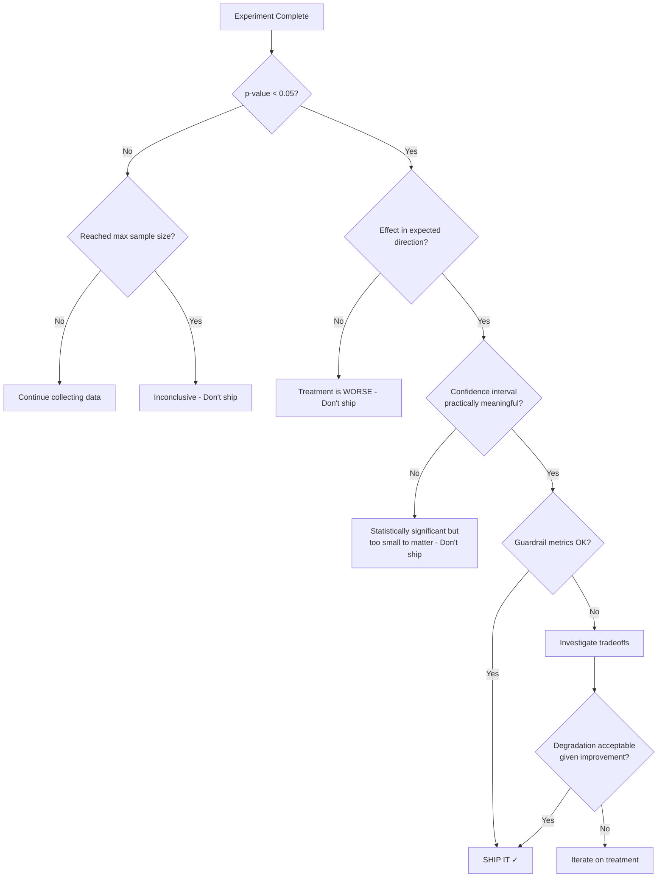

# Statistical Significance for AI Experiments

## Why Statistics Matter

You ran an experiment. Prompt V4 got a faithfulness score of 0.88. Prompt V3 got 0.85.
V4 is better, right? Ship it!

**Wrong.** With only 50 samples, that difference could easily be random noise.

Statistics answers one critical question:
**"Is this difference real, or could it have happened by chance?"**

Without statistical rigor, you'll ship changes that:
- Don't actually improve anything (false positive)
- Happen to look good due to random variation
- Degrade over time as the "lucky streak" regresses to the mean

---

## Key Concepts

### P-Value

The probability of observing a difference THIS large (or larger) if there were NO real difference.

```
p-value = 0.03 means:
  "If the variants were identical, there's only a 3% chance
   we'd see a difference this big by random chance"

p-value < 0.05 → statistically significant (standard threshold)
p-value < 0.01 → highly significant
p-value > 0.05 → NOT significant (could be random noise)
```

**Common misconception:** p=0.03 does NOT mean "97% probability V4 is better."
It means: "Assuming no real difference, this result would be unlikely."

### Confidence Interval

The range where the TRUE difference likely falls:

```
Difference: 0.03 (V4 scored 3% higher than V3)
95% Confidence Interval: [0.005, 0.055]

Interpretation:
  - We're 95% confident the true improvement is between 0.5% and 5.5%
  - Since the interval doesn't include 0, it's statistically significant
  - The improvement could be as small as 0.5% or as large as 5.5%
```

If the confidence interval includes 0 (or crosses zero), the result is NOT significant.

### Statistical Power

The probability of detecting a real difference when one exists:

```
Power = 0.80 means:
  "If V4 truly IS 5% better, we have an 80% chance of detecting it"

  Equivalently: 20% chance of MISSING a real improvement (false negative)
```

Low power = you might conclude "no difference" when there actually IS one.
Causes: too few samples, too small an effect, too much variance.

### Effect Size

How big is the difference you're trying to detect?

```
Large effect:  15% improvement (easy to detect, few samples needed)
Medium effect:  5% improvement (moderate samples needed)
Small effect:   1% improvement (many samples needed)
```

The smaller the effect you want to detect, the more samples you need.

---

## Sample Size Calculation

### The Formula

For comparing two proportions (binary outcome):

```
n = (Z_α/2 + Z_β)² × [p1(1-p1) + p2(1-p2)] / (p1 - p2)²

Where:
  n = samples needed PER variant
  Z_α/2 = Z-score for significance level (1.96 for α=0.05)
  Z_β = Z-score for power (0.84 for power=0.80)
  p1 = baseline rate (control)
  p2 = expected rate (treatment)
```

### Worked Example: Faithfulness Improvement

```
Goal: Detect 5% improvement in faithfulness (0.85 → 0.90)
Parameters:
  α = 0.05 (5% false positive rate)
  power = 0.80 (80% chance of detecting real effect)
  p1 = 0.85 (control faithfulness)
  p2 = 0.90 (expected treatment faithfulness)

Calculation:
  Z_α/2 = 1.96
  Z_β = 0.84
  
  n = (1.96 + 0.84)² × [0.85×0.15 + 0.90×0.10] / (0.85 - 0.90)²
  n = (2.80)² × [0.1275 + 0.09] / (0.05)²
  n = 7.84 × 0.2175 / 0.0025
  n = 7.84 × 87
  n ≈ 682 / 2 ≈ 341 per variant

  → Need ~350 samples per variant (round up for safety)
```

### How Long Will It Take?

```
Scenario 1: High-traffic AI product
  - 1000 queries/day
  - 50/50 split → 500 per variant per day
  - Need 350 per variant
  - Duration: < 1 day ✓

Scenario 2: Medium-traffic AI product
  - 200 queries/day
  - 50/50 split → 100 per variant per day
  - Need 350 per variant
  - Duration: ~3.5 days

Scenario 3: Low-traffic, cautious rollout
  - 100 queries/day
  - 90/10 split → 10 per day for treatment
  - Need 350 for treatment
  - Duration: ~35 days for treatment group!

Scenario 4: Small effect size (2% improvement)
  - Need ~2000 samples per variant
  - At 200 queries/day, 50/50 split: ~20 days
```

### Sample Size Table (Quick Reference)

| Effect Size | Power 0.80 | Power 0.90 | Power 0.95 |
|-------------|-----------|-----------|-----------|
| 1% (0.85→0.86) | ~14,000 | ~18,700 | ~22,700 |
| 2% (0.85→0.87) | ~3,500 | ~4,700 | ~5,700 |
| 5% (0.85→0.90) | ~350 | ~470 | ~570 |
| 10% (0.85→0.95) | ~75 | ~100 | ~120 |
| 15% (0.80→0.95) | ~40 | ~55 | ~65 |

Key insight: **Detecting small improvements requires 10-100x more samples.**

---

## Statistical Tests for AI Metrics

### Binary Metrics (Success/Failure)

Examples: task completion, hallucination (yes/no), safety violation

**Chi-Squared Test:**
```
            Success  Failure  Total
Control:      170      30      200
Treatment:    185      15      200

χ² = Σ (observed - expected)² / expected
If χ² > 3.84 (for df=1, α=0.05) → significant
```

**Fisher's Exact Test** (for small samples < 30):
- Exact probability calculation
- No approximation needed
- Use when any cell count < 5

### Continuous Metrics (Scores 0-1)

Examples: faithfulness score, relevance score, overall quality

**Independent Samples T-Test:**
```
H₀: μ_control = μ_treatment
H₁: μ_control ≠ μ_treatment

t = (x̄₁ - x̄₂) / √(s₁²/n₁ + s₂²/n₂)

If |t| > t_critical → reject H₀ (significant difference)
```

Assumptions: approximately normal distribution, similar variance.
If violated → use Mann-Whitney U test.

**Mann-Whitney U Test (Non-Parametric):**
- No normality assumption
- Compares ranks rather than raw values
- Use for: latency (heavily skewed), scores with floor/ceiling effects

### Latency Metrics (Skewed Distributions)

Latency is NEVER normally distributed. It has a long right tail:

```
Latency distribution:
  Most requests: 200-500ms
  Some requests: 500-1000ms
  Few requests:  1000-5000ms (but they matter!)

Don't compare means! Use:
  - Median comparison (Mann-Whitney U)
  - Percentile comparison (p50, p95, p99)
  - Bootstrap confidence intervals
```

### Multiple Metrics: Bonferroni Correction

Testing 5 metrics at α=0.05 each → 23% chance of at least one false positive!

**Bonferroni correction:** divide α by number of tests:
```
5 metrics, desired α=0.05
Corrected α = 0.05 / 5 = 0.01

Each individual test must have p < 0.01 to be "significant"
```

More conservative but prevents false discoveries.

**Alternative: Benjamini-Hochberg (FDR control)**
- Less conservative than Bonferroni
- Controls expected proportion of false discoveries
- Better when you have many metrics (10+)

---

## Sequential Testing

### The Problem with Fixed-Sample Testing

Traditional approach: "We'll collect 350 samples then analyze."
But what if after 100 samples, treatment is clearly winning by 15%? You waste time and money collecting 250 more.

And what if after 350 samples, treatment is winning by 1%? Do you extend?

### Always-Valid P-Values (Sequential Testing)

You can check results at ANY time without inflating false positive rates:

```
Method: Use a spending function that "budgets" your α across checks

Example: O'Brien-Fleming boundaries
  Check 1 (25% of data): need p < 0.0001 to stop (very strict early)
  Check 2 (50% of data): need p < 0.004 to stop
  Check 3 (75% of data): need p < 0.019 to stop
  Check 4 (100% of data): need p < 0.043 to stop (close to 0.05)

Benefit: You can stop early with a clear winner while maintaining overall α=0.05
```

### CUSUM (Cumulative Sum Control Charts)

Designed to detect shifts in a process:

```
Track cumulative difference from expected:
  S_n = Σ (x_i - target)

If S_n exceeds threshold h → detected a shift

For A/B testing:
  Track cumulative difference between variants
  If it consistently grows → real difference
  If it fluctuates around 0 → no difference
```

### Benefits of Sequential Testing

1. **Stop early if clear winner** — save time and money
2. **Stop early if clearly harmful** — protect users
3. **No wasted samples** — check frequently, decide when confident
4. **Ethical** — don't expose users to inferior variant longer than necessary

### Practical Implementation

```python
# Simplified sequential testing
class SequentialTest:
    def __init__(self, alpha=0.05, power=0.80, max_samples=1000):
        self.alpha = alpha
        self.samples_a = []
        self.samples_b = []
        # O'Brien-Fleming-like boundaries
        self.boundaries = self._compute_boundaries()
    
    def add_observation(self, variant, value):
        if variant == 'A':
            self.samples_a.append(value)
        else:
            self.samples_b.append(value)
        return self.check_significance()
    
    def check_significance(self):
        n = min(len(self.samples_a), len(self.samples_b))
        if n < 20:  # minimum before checking
            return "CONTINUE"
        
        # Compute test statistic
        z = self._compute_z_score()
        boundary = self._get_current_boundary(n)
        
        if abs(z) > boundary:
            return "SIGNIFICANT" if z > 0 else "SIGNIFICANT_NEGATIVE"
        return "CONTINUE"
```

---

## Practical Considerations

### Day-of-Week Effects

```
Monday:   Business queries, formal tone expected
Tuesday:  Similar to Monday
Wednesday: Peak volume
Thursday:  Complex queries (end-of-week research)
Friday:   Shorter queries, quick answers
Saturday: Personal queries, casual
Sunday:   Low volume, exploratory queries
```

If your experiment runs Monday-Wednesday only, you miss half the user patterns.
**Rule: minimum 7 days to capture full weekly cycle.**

### Time-of-Day Effects

```
6am-9am:   Early adopters, focused queries
9am-12pm:  Peak business hours, work-related
12pm-2pm:  Casual, lunch-break browsing
2pm-5pm:   Afternoon work, complex questions
5pm-9pm:   Personal use, diverse topics
9pm-12am:  Late night, exploratory/creative
```

Your prompt might work great for business queries but poorly for creative ones.
Ensure your experiment captures all time periods.

### Novelty Effects

Users may behave differently simply because something is "new":
- They might engage more with a new response format (temporary boost)
- They might be confused by different behavior (temporary dip)

**Mitigation:** Run experiment for 2+ weeks. Compare week 1 vs week 2 behavior.
If improvement fades, it was novelty, not genuine quality.

### Learning Effects

Users adapt to AI behavior over time:
- They learn what queries work well
- They adjust their expectations
- Their behavior with variant B at day 1 ≠ day 14

**Mitigation:** Analyze time-series within each variant. Look for trends.

---

## Statistical Decision Framework



---

## Bayesian vs Frequentist Approaches

### Frequentist (Traditional)

```
- Fixed sample size, then decide
- P-value: "probability of data given no effect"
- Binary decision: significant or not
- Easier to explain, industry standard
```

### Bayesian

```
- Update beliefs as data arrives
- Posterior: "probability of effect given data"
- Continuous: "73% probability treatment is better"
- More intuitive, harder to set up
```

### When to Use Each

| Scenario | Recommendation |
|----------|---------------|
| Standard product A/B test | Frequentist (well-understood) |
| Need to communicate probability | Bayesian ("85% chance V4 is better") |
| Sequential testing needed | Bayesian (natural fit) |
| Regulatory/compliance | Frequentist (established standards) |
| Small sample sizes | Bayesian (incorporates prior knowledge) |
| Many simultaneous experiments | Bayesian (handles naturally) |

---

## Key Formulas Summary

```
Sample Size (proportions):
  n = (Z_α/2 + Z_β)² × [p1(1-p1) + p2(1-p2)] / (p1-p2)²

Sample Size (continuous):
  n = 2 × (Z_α/2 + Z_β)² × σ² / δ²
  (σ = standard deviation, δ = minimum detectable effect)

Confidence Interval (proportion):
  p̂ ± Z_α/2 × √[p̂(1-p̂)/n]

T-statistic:
  t = (x̄₁ - x̄₂) / √(s₁²/n₁ + s₂²/n₂)

Effect Size (Cohen's d):
  d = (x̄₁ - x̄₂) / s_pooled

Minimum Detectable Effect:
  MDE = (Z_α/2 + Z_β) × √(2σ²/n)
```

---

## Key Takeaways

1. **Always calculate sample size BEFORE starting** — know how long you'll need
2. **Use sequential testing** for AI experiments (they're expensive and slow)
3. **Bonferroni correct** when testing multiple metrics
4. **Non-parametric tests** for latency and skewed metrics
5. **Minimum 7 days** regardless of sample size (weekly patterns)
6. **Practical significance ≠ statistical significance** — a 0.1% improvement doesn't matter even if p < 0.05
7. **Consider Bayesian** for AI experiments — natural fit for sequential decisions
