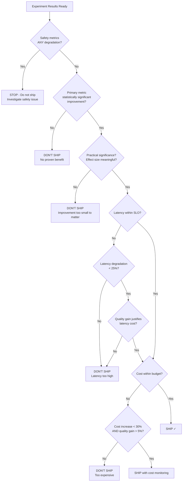

# Multi-Metric Experiments

## The Challenge

Traditional A/B testing optimizes ONE metric: conversion rate, revenue, click-through.

AI experiments have 5-10 metrics that ALL matter:

```
Experiment: Prompt V4 vs V3
━━━━━━━━━━━━━━━━━━━━━━━━━━
Metrics being tracked:
  1. Faithfulness score (primary)
  2. Helpfulness score
  3. Completeness score
  4. Latency (p50, p95, p99)
  5. Cost per request
  6. Error rate
  7. Safety violation rate
  8. User satisfaction (thumbs up/down)
  9. Follow-up question rate (lower = better answer)
  10. Token count (output length)
```

You can't just look at one number. A prompt that's more faithful but 3x slower is not automatically better.

---

## Metric Classification

### Primary Metric

The ONE metric you're trying to improve. This drives the experiment decision.

```
Examples:
  - "Increase faithfulness score" → primary = faithfulness
  - "Reduce hallucination rate" → primary = hallucination_rate (lower is better)
  - "Improve task completion" → primary = completion_rate
```

**Rule:** Pick exactly ONE primary metric. If you can't decide, you don't have a clear hypothesis.

### Guardrail Metrics

Metrics that must NOT degrade beyond a threshold. They don't need to improve — they just can't get worse.

```
Guardrail metrics for an AI experiment:
  - Latency p95 < 2.0s (current: 1.2s, threshold: must not exceed 2.0s)
  - Cost per request < $0.05 (current: $0.03)
  - Error rate < 2% (current: 0.5%)
  - Safety violation rate < 0.1% (current: 0.02%)
```

### Observational Metrics

Metrics you track for insight but don't use for decisions:

```
  - Average response length
  - Number of tool calls
  - Retrieval count
  - User session duration
```

These inform future experiments but don't block this one.

---

## Decision Framework

### The Decision Matrix

```
┌─────────────────────────────────────────────────────────────────┐
│ PRIMARY METRIC         │ GUARDRAILS        │ DECISION            │
├─────────────────────────────────────────────────────────────────┤
│ ✅ Improved (sig.)     │ ✅ All OK         │ SHIP IT             │
│ ✅ Improved (sig.)     │ ⚠️  Minor degrade │ INVESTIGATE         │
│ ✅ Improved (sig.)     │ ❌ Major degrade  │ DON'T SHIP          │
│ ➡️  No change          │ ✅ All OK         │ DON'T SHIP (why?)   │
│ ➡️  No change          │ ❌ Degraded       │ DEFINITELY DON'T    │
│ ❌ Degraded            │ (any)             │ DEFINITELY DON'T    │
└─────────────────────────────────────────────────────────────────┘
```

### Detailed Decision Rules

**SHIP IT** — Primary improved, no guardrails degraded:
```
Faithfulness: 0.85 → 0.90 (p=0.02) ✅
Latency p95:  1.2s → 1.3s (within threshold) ✅
Cost:         $0.03 → $0.032 (within threshold) ✅
Safety:       0.02% → 0.01% (improved!) ✅

Decision: SHIP. Clear win on primary, guardrails all healthy.
```

**INVESTIGATE** — Primary improved but a guardrail is concerning:
```
Faithfulness: 0.85 → 0.91 (p=0.01) ✅
Latency p95:  1.2s → 1.8s (within threshold but +50%) ⚠️
Cost:         $0.03 → $0.045 (within threshold but +50%) ⚠️
Safety:       0.02% → 0.02% (no change) ✅

Decision: INVESTIGATE. Great quality gain but latency/cost concerning.
Questions: Can we optimize the prompt to reduce tokens? Is the latency
increase acceptable for the quality gain? What's the cost at scale?
```

**DON'T SHIP** — Not worth the risk:
```
Faithfulness: 0.85 → 0.86 (p=0.04) — barely significant
Latency p95:  1.2s → 1.5s (+25%) ⚠️
Cost:         $0.03 → $0.04 (+33%) ⚠️

Decision: DON'T SHIP. Tiny quality gain doesn't justify cost/latency increase.
```

---

## Metric Hierarchy

Not all metrics are created equal. Here's the priority order:

### 1. Safety Metrics (HIGHEST — Instant Stop)

```
Priority: ABSOLUTE
Threshold: ANY regression = immediate experiment stop
Examples:
  - Toxic/harmful content rate
  - PII leakage rate
  - Jailbreak success rate
  
Rule: If safety degrades by ANY measurable amount, stop the experiment
      immediately. Don't wait for significance. Don't investigate.
      STOP.
```

### 2. Reliability Metrics (System Health)

```
Priority: Very High
Threshold: >2x degradation = stop, <2x = investigate
Examples:
  - Error rate (5xx, timeouts)
  - Availability
  - Response rate (% of requests that get a response)
  
Rule: Users can't benefit from a "better" AI if it's down or erroring.
```

### 3. Quality Metrics (Primary — What We're Improving)

```
Priority: High (this is why we're running the experiment)
Threshold: Must show statistically significant improvement
Examples:
  - Faithfulness / groundedness
  - Helpfulness
  - Task completion rate
  - Answer accuracy
  
Rule: This must improve to justify shipping. The whole point of the experiment.
```

### 4. Performance Metrics (User Experience)

```
Priority: Medium-High
Threshold: Must stay within SLO
Examples:
  - Latency (p50, p95, p99)
  - Throughput
  - Time to first token
  
Rule: Acceptable to degrade slightly if quality gain is substantial.
      Must stay within SLO bounds.
```

### 5. Cost Metrics (Business Viability)

```
Priority: Medium
Threshold: Must not exceed budget by >25%
Examples:
  - Cost per request (tokens × price)
  - Total monthly cost projection
  - GPU utilization
  
Rule: Acceptable to increase if quality improvement justifies it.
      Always project to monthly scale to understand business impact.
```

---

## Composite Scoring

When you need a single number to compare variants:

### Weighted Score

```
Overall = α × quality + β × performance + γ × cost_efficiency

Example weights (quality-focused product):
  α = 0.60 (quality is paramount)
  β = 0.25 (latency matters for UX)
  γ = 0.15 (cost matters but secondary)

Variant A: 0.60×0.85 + 0.25×0.90 + 0.15×0.80 = 0.855
Variant B: 0.60×0.90 + 0.25×0.80 + 0.15×0.70 = 0.845

Despite better quality, B loses on overall score due to latency/cost.
```

### Normalized Metrics

Before combining, normalize each metric to 0-1 scale:

```python
def normalize(value, min_acceptable, max_observed):
    """Normalize metric to 0-1 where 1 is best."""
    return (value - min_acceptable) / (max_observed - min_acceptable)

# Latency: lower is better → invert
latency_score = 1 - normalize(latency, 0, max_latency)

# Quality: higher is better → direct
quality_score = normalize(quality, 0, 1.0)

# Cost: lower is better → invert  
cost_score = 1 - normalize(cost, 0, max_budget)
```

### Pareto Optimality

A variant is Pareto-optimal if no other variant is better on ALL metrics:

```
Variant A: quality=0.85, latency=1.0s, cost=$0.03
Variant B: quality=0.90, latency=1.5s, cost=$0.04
Variant C: quality=0.88, latency=0.8s, cost=$0.03

Pareto frontier: A and C (neither dominates the other)
B is dominated by... no one (it has highest quality)
Actually all three are Pareto-optimal (none dominates another on ALL metrics)
```

---

## Tradeoff Decisions

### The Core Question

"Is the improvement worth the cost?"

### Framework: Value-per-Dollar

```
Quality improvement:  +5% faithfulness
Cost increase:        +$0.01/request (+33%)
Monthly traffic:      100,000 requests
Monthly cost increase: $1,000

Question: Is 5% better faithfulness worth $1,000/month?
Answer depends on:
  - Customer tier (enterprise paying $50k/month? YES)
  - Use case (medical advice? YES. Casual chat? Maybe not)
  - Competitive pressure (competitors at 0.90? Must match)
```

### Framework: User Impact Estimation

```
5% faithfulness improvement means:
  - 5,000 queries/month that would have had inaccurate answers now don't
  - If 10% of inaccurate answers cause support tickets: 500 fewer tickets
  - If each ticket costs $15 to handle: $7,500 saved
  - Net: $7,500 saved - $1,000 cost = $6,500 net positive

Decision: SHIP (clear ROI)
```

### Framework: Threshold-Based

```
Simple rules for common tradeoffs:

| Quality Gain | Max Acceptable Latency Increase | Max Cost Increase |
|-------------|-------------------------------|------------------|
| 1-2%        | 0% (not worth any degradation) | 0%              |
| 3-5%        | 10% latency increase OK        | 15% cost OK     |
| 5-10%       | 25% latency increase OK        | 30% cost OK     |
| 10%+        | 50% latency increase OK        | 50% cost OK     |
```

---

## Multi-Metric Decision Tree



---

## Real-World Example: Complete Multi-Metric Analysis

```
EXPERIMENT: hybrid-rag-vs-semantic-only
━━━━━━━━━━━━━━━━━━━━━━━━━━━━━━━━━━━━━━

Results after 500 samples per variant:

                        Control     Treatment   Diff      p-value   Status
                        (Semantic)  (Hybrid)
━━━━━━━━━━━━━━━━━━━━━━━━━━━━━━━━━━━━━━━━━━━━━━━━━━━━━━━━━━━━━━━━━━━━━━━━
PRIMARY:
  Faithfulness          0.82        0.89        +8.5%     0.001     ✅ SIG
  
GUARDRAILS:
  Latency p95           1.1s        1.4s        +27%      0.003     ⚠️ DEGRADE
  Cost/request          $0.028      $0.031      +11%      0.04      ✅ WITHIN
  Error rate            0.5%        0.6%        +0.1%     0.72      ✅ OK
  Safety violations     0.02%       0.01%       -50%      0.31      ✅ OK
  
OBSERVATIONAL:
  Avg response length   245 tokens  280 tokens  +14%      -         📊
  Retrieval count       5.0         7.2         +44%      -         📊
  User thumbs up        34%         41%         +21%      0.02      📊

DECISION ANALYSIS:
━━━━━━━━━━━━━━━━━
✅ Primary metric: Significant 8.5% improvement (p=0.001)
⚠️  Latency: 27% increase (1.1s → 1.4s). SLO is 2.0s → still within SLO
✅ Cost: 11% increase, within acceptable range for 8.5% quality gain
✅ Safety: No degradation (actually improved, though not significant)

RECOMMENDATION: SHIP with latency monitoring
  - The 8.5% faithfulness gain is substantial and significant
  - Latency increase is notable but within SLO (1.4s < 2.0s)
  - Cost increase is modest and justified by quality gain
  - Set alert if latency p95 exceeds 1.8s (approaching SLO)
  - Plan follow-up experiment to optimize hybrid search latency
```

---

## Key Takeaways

1. **Classify metrics** into primary, guardrail, and observational BEFORE launching
2. **Safety is non-negotiable** — any degradation = instant stop
3. **One primary metric** drives the decision — the rest are constraints
4. **Use a decision framework** — don't make subjective calls after seeing data
5. **Quantify tradeoffs** in business terms (dollars, tickets, user impact)
6. **Composite scores** are useful but can hide important details — always look at individual metrics too
7. **Document the decision** — future you will want to know why you shipped (or didn't)
