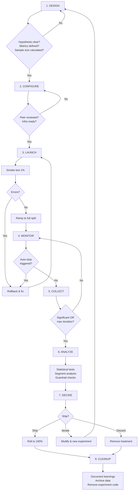

# Experiment Lifecycle

## End-to-End Experiment Lifecycle

Every AI experiment follows eight phases:

```
┌──────────┐   ┌───────────┐   ┌────────┐   ┌─────────┐
│ 1.DESIGN │──▶│2.CONFIGURE│──▶│3.LAUNCH│──▶│4.MONITOR│
└──────────┘   └───────────┘   └────────┘   └─────────┘
                                                  │
┌──────────┐   ┌───────────┐   ┌────────┐        ▼
│ 8.CLEANUP│◀──│ 7.DECIDE  │◀──│6.ANALYZE│◀──┌─────────┐
└──────────┘   └───────────┘   └────────┘   │5.COLLECT│
                                             └─────────┘
```

---

## Phase 1: Design

Define what you're testing and how you'll know if it worked.

### Hypothesis Template

```
We believe that [CHANGE]
will result in [EXPECTED OUTCOME]
for [TARGET USERS/QUERIES]
as measured by [PRIMARY METRIC]
without degrading [GUARDRAIL METRICS]
```

### Example

```
We believe that adding chain-of-thought reasoning to the system prompt (V4)
will result in a 5% increase in faithfulness scores
for all user queries requiring factual answers
as measured by LLM-judge faithfulness evaluation
without degrading p95 latency beyond 2.0s or cost beyond $0.05/request
```

### Design Checklist

- [ ] Clear hypothesis with expected effect size
- [ ] Primary metric defined with measurement method
- [ ] Guardrail metrics defined with thresholds
- [ ] Sample size calculated (how many observations needed)
- [ ] Duration estimated (how many days)
- [ ] Traffic split decided (50/50 or conservative)
- [ ] Target population defined (all users or subset)
- [ ] Auto-stop rules defined (when to kill the experiment)
- [ ] Rollback plan documented

---

## Phase 2: Configure

Set up the experiment infrastructure.

### Experiment Configuration Schema

```json
{
  "experiment_id": "exp_001_prompt_v4",
  "name": "Prompt V4 vs V3 - Faithfulness",
  "hypothesis": "V4 increases faithfulness by 5% without degrading latency or cost",
  "status": "configured",
  "owner": "ml-team",
  "created_at": "2024-01-15T10:00:00Z",
  
  "variants": [
    {
      "name": "control",
      "weight": 50,
      "description": "Current production prompt V3",
      "config": {
        "prompt_version": "v3",
        "model": "gpt-4",
        "temperature": 0.7
      }
    },
    {
      "name": "treatment",
      "weight": 50,
      "description": "New prompt V4 with CoT reasoning",
      "config": {
        "prompt_version": "v4",
        "model": "gpt-4",
        "temperature": 0.7
      }
    }
  ],
  
  "metrics": {
    "primary": {
      "name": "faithfulness_score",
      "type": "continuous",
      "direction": "higher_is_better",
      "minimum_detectable_effect": 0.05
    },
    "guardrails": [
      {
        "name": "latency_p95",
        "type": "continuous",
        "direction": "lower_is_better",
        "threshold": 2.0,
        "unit": "seconds"
      },
      {
        "name": "cost_per_request",
        "type": "continuous",
        "direction": "lower_is_better",
        "threshold": 0.05,
        "unit": "dollars"
      },
      {
        "name": "error_rate",
        "type": "proportion",
        "direction": "lower_is_better",
        "threshold": 0.02
      },
      {
        "name": "safety_violation_rate",
        "type": "proportion",
        "direction": "lower_is_better",
        "threshold": 0.001
      }
    ]
  },
  
  "traffic": {
    "splitting_strategy": "user_based",
    "target_population": "all",
    "exclusions": ["internal_users", "bot_traffic"]
  },
  
  "duration": {
    "min_samples_per_variant": 350,
    "min_duration_days": 7,
    "max_duration_days": 14
  },
  
  "auto_stop_rules": {
    "safety_violation_rate_exceeds": 0.005,
    "error_rate_exceeds": 0.05,
    "guardrail_degradation_percent": 50
  }
}
```

---

## Phase 3: Launch

Start routing traffic to variants.

### Launch Checklist

- [ ] Configuration reviewed by peer
- [ ] Monitoring dashboards set up
- [ ] Alerting configured for auto-stop rules
- [ ] Logging verified (both variants recording metrics)
- [ ] Rollback mechanism tested
- [ ] On-call team notified
- [ ] Start with 1% traffic for 1 hour (smoke test)
- [ ] Ramp to full traffic split

### Gradual Ramp-Up

```
Hour 0:    1% treatment (smoke test — any errors?)
Hour 1:    5% treatment (low-volume validation)
Hour 4:   10% treatment (confirm no issues)
Hour 12:  Full split (50/50 or configured ratio)
```

This catches catastrophic bugs before full exposure.

---

## Phase 4: Monitor

Watch for immediate problems in the first 24-48 hours.

### Real-Time Monitoring Dashboard

```
EXPERIMENT: exp_001_prompt_v4 | Status: RUNNING | Duration: 2d 4h
━━━━━━━━━━━━━━━━━━━━━━━━━━━━━━━━━━━━━━━━━━━━━━━━━━━━━━━━━━━━━━━━

Traffic:
  Control:   1,247 requests (49.8%)
  Treatment: 1,253 requests (50.2%)
  → Split is balanced ✓

Guardrail Status (last 1 hour):
  Latency p95:    Control=1.1s  Treatment=1.3s  [■■■■■■░░░░] OK
  Error rate:     Control=0.4%  Treatment=0.5%  [■■░░░░░░░░] OK
  Safety:         Control=0     Treatment=0     [░░░░░░░░░░] OK
  Cost/req:       Control=$0.03 Treatment=$0.035 [■■■░░░░░░░] OK

Primary Metric (cumulative):
  Faithfulness:   Control=0.84  Treatment=0.88  [trending positive]
  Significance:   p=0.12 (NOT YET SIGNIFICANT)
  Est. remaining: ~150 more samples needed

Auto-Stop Rules:  ALL PASSING ✓
```

### Alert Rules

```yaml
alerts:
  - name: safety_violation_spike
    condition: safety_violation_rate > 0.005
    action: STOP_EXPERIMENT_IMMEDIATELY
    notify: [oncall, experiment_owner, safety_team]
    
  - name: error_rate_spike  
    condition: error_rate > 0.05 for 5 minutes
    action: STOP_EXPERIMENT
    notify: [oncall, experiment_owner]
    
  - name: latency_degradation
    condition: latency_p95 > threshold * 1.5
    action: ALERT (don't stop yet)
    notify: [experiment_owner]
```

---

## Phase 5: Collect

Accumulate observations until statistical significance or max duration.

### Data Collection

Each request generates a record:

```json
{
  "request_id": "req_abc123",
  "experiment_id": "exp_001_prompt_v4",
  "variant": "treatment",
  "user_id": "user_456",
  "timestamp": "2024-01-17T14:30:00Z",
  "query": "What causes climate change?",
  "metrics": {
    "faithfulness_score": 0.92,
    "latency_ms": 1340,
    "cost_dollars": 0.034,
    "token_count": 487,
    "error": false,
    "safety_violation": false
  }
}
```

### Progress Tracking

```
Day 1:  Control=245, Treatment=251  | p=0.34  | CONTINUE
Day 2:  Control=502, Treatment=498  | p=0.08  | CONTINUE (getting close)
Day 3:  Control=748, Treatment=756  | p=0.03  | SIGNIFICANT ✓
Day 4-7: Continue to capture weekly patterns (min 7 days rule)
```

---

## Phase 6: Analyze

Run statistical tests and generate the experiment report.

### Analysis Steps

1. **Verify data quality**: any missing data? Imbalanced splits?
2. **Check for novelty effects**: compare week 1 vs week 2
3. **Run primary metric test**: t-test or Mann-Whitney U
4. **Run guardrail checks**: each metric within threshold?
5. **Check for segments**: does treatment help some users but hurt others?
6. **Generate confidence intervals**: what's the range of the true effect?

### Segment Analysis

Don't just look at averages — check if the effect varies:

```
Overall: Treatment +5% faithfulness (p=0.02) ✓

By query type:
  Factual questions:   +8% (p=0.01) — big win
  Creative questions:  +1% (p=0.65) — no effect
  Code questions:      +3% (p=0.15) — trending positive

By user segment:
  New users:          +7% (p=0.03) — helps newcomers most
  Power users:        +2% (p=0.40) — less impact on experts
```

This reveals: Prompt V4 mostly helps with factual queries for new users.
May inform future targeted experiments.

---

## Phase 7: Decide

Ship, iterate, or discard based on evidence.

### Decision Options

| Decision | When | Action |
|----------|------|--------|
| **SHIP** | Primary improved, guardrails OK | Roll treatment to 100% |
| **ITERATE** | Promising but issues exist | Modify treatment, run new experiment |
| **EXTEND** | Close to significance | Continue collecting (within max duration) |
| **DISCARD** | No improvement or degraded | Remove treatment, document learnings |

### Decision Document Template

```markdown
## Experiment Decision: exp_001_prompt_v4

**Decision:** SHIP

**Evidence:**
- Faithfulness: +5.2% (0.84 → 0.89), p=0.003, 95% CI [2.1%, 8.3%]
- Latency p95: +18% (1.1s → 1.3s), within SLO of 2.0s
- Cost: +10% ($0.03 → $0.033), acceptable for quality gain
- Safety: No change (0 violations in both variants)
- Sample: 756 control, 762 treatment over 8 days

**Risks:**
- Latency increase may compound with future changes
- Cost increase projects to +$300/month at current volume

**Follow-ups:**
- Monitor latency for 2 weeks post-ship
- Plan prompt optimization experiment to reduce token count
- Update documentation with new prompt version

**Approved by:** [Tech Lead], [Product], [ML Lead]
**Ship date:** 2024-01-24
```

---

## Phase 8: Cleanup

Remove experiment infrastructure and document learnings.

### Cleanup Checklist

- [ ] Remove traffic splitting logic (all traffic → winner)
- [ ] Remove variant B code if discarded (or A if B won)
- [ ] Archive experiment data (keep for future analysis)
- [ ] Update experiment tracking system (mark as completed)
- [ ] Write post-experiment summary
- [ ] Share learnings with team (what did we learn?)
- [ ] Update baseline metrics documentation
- [ ] Remove monitoring alerts specific to this experiment

### Knowledge Base Entry

```markdown
## Learning: Prompt V4 Experiment (Jan 2024)

**What we tested:** Adding chain-of-thought reasoning to system prompt
**Result:** +5% faithfulness, +18% latency, +10% cost
**Decision:** Shipped

**Key learnings:**
1. CoT reasoning significantly improves factual accuracy
2. Latency increase is proportional to added reasoning tokens
3. Effect is strongest for new users (expert users already prompt well)
4. No effect on creative tasks (CoT doesn't help creativity)

**Implications for future experiments:**
- Consider CoT only for factual query types (conditional prompting)
- Explore shorter CoT formats to reduce latency impact
- Test selective CoT (only trigger when confidence is low)
```

---

## Interacting Experiments

### The Problem

Running multiple experiments simultaneously can cause interference:

```
Experiment A: Testing Prompt V4 (changes system prompt)
Experiment B: Testing temperature=0.3 (changes generation params)

If user is in BOTH experiments:
  - Prompt V4 + temperature 0.3 → interaction effect
  - You can't attribute results to either experiment alone
  - Results of A are contaminated by B and vice versa
```

### Rules for Simultaneous Experiments

**Rule 1: Never run two experiments that touch the same component**

```
❌ BAD:  Experiment A (prompt change) + Experiment B (different prompt change)
✅ GOOD: Experiment A (prompt change) + Experiment B (retrieval change)
         (different components, unlikely to interact)
```

**Rule 2: Use layers for isolation**

```
Layer 1 (Retrieval):    Experiment A — hybrid vs semantic
Layer 2 (Prompting):    Experiment B — V4 vs V3
Layer 3 (Generation):   Experiment C — temp 0.3 vs 0.7

Each layer has independent randomization.
A user can be in ONE experiment per layer.
```

**Rule 3: Maintain a holdout group**

```
Traffic allocation:
  5%  → Holdout (NEVER in any experiment — eternal baseline)
  95% → Available for experiments

The holdout group tells you:
  - Long-term baseline without any experimental changes
  - Whether cumulative experiments are helping or hurting overall
  - Whether novelty effects are inflating your results
```

### Experiment Isolation

```
User assignment:
  hash(user_id + "layer1") % 100 → Layer 1 variant
  hash(user_id + "layer2") % 100 → Layer 2 variant

Different hash salts per layer ensure independent assignment.
A user's layer 1 assignment tells you nothing about their layer 2 assignment.
```

---

## Experiment Lifecycle Flow



---

## Timing and Scheduling Best Practices

### When to Launch

```
✅ GOOD times to launch:
  - Tuesday morning (full week ahead, team available)
  - After a quiet deployment period (stable baseline)
  
❌ BAD times to launch:
  - Friday afternoon (no one to monitor over weekend)
  - During major product launches (confounding traffic changes)
  - Holiday periods (non-representative traffic)
  - Right after another experiment shipped (baseline shifting)
```

### Experiment Calendar

```
Week 1: Launch experiment, monitor heavily
Week 2: Continue collection, mid-experiment check
Week 3: Analyze results if significant, decide
Week 4: Ship or discard, document, plan next experiment

Cadence: ~2 experiments per month per team
```

---

## Key Takeaways

1. **Follow ALL eight phases** — skipping design or cleanup causes long-term debt
2. **Peer review the design** — catch flawed hypotheses early
3. **Gradual ramp-up** — catch catastrophic bugs before full exposure
4. **Monitor guardrails actively** — don't just wait for auto-stop
5. **7-day minimum** — even if significance is reached earlier
6. **Document everything** — future experiments build on past learnings
7. **Never run conflicting experiments** — use layers and holdout groups
8. **Cleanup is mandatory** — dead experiment code is technical debt
