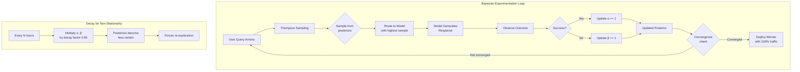

# Bayesian A/B Testing for AI Systems

## Why Bayesian for AI Experiments

Traditional frequentist A/B testing assumes:
- Fixed sample sizes determined upfront
- Stationary data distributions
- No peeking at results before completion

AI systems violate ALL of these:
- **Non-stationary data**: Model performance drifts as user behavior changes
- **Small sample sizes**: Some segments have few users (enterprise customers)
- **Early stopping pressure**: Business wants to ship the better model NOW
- **Continuous deployment**: Models update weekly, can't wait 4 weeks for significance
- **Multi-dimensional outcomes**: Latency + quality + cost + safety simultaneously

Bayesian methods handle these naturally because they:
1. Update beliefs incrementally as data arrives
2. Provide probability statements ("90% chance Model B is better")
3. Allow principled early stopping
4. Incorporate prior knowledge from previous experiments

---

## Bayesian vs Frequentist: Decision Framework

| Criterion | Frequentist | Bayesian |
|-----------|-------------|----------|
| Sample size | Must be fixed upfront | Can stop anytime |
| Interpretation | "Reject null hypothesis" | "Probability Model B is better" |
| Prior experiments | Ignored (fresh start) | Incorporated as priors |
| Multiple peeking | Inflates false positive rate | Natural, no penalty |
| Computational cost | Low (closed-form) | Higher (MCMC sampling) |
| Small samples | Unreliable | Handles well with priors |
| Communication to stakeholders | Confusing (p-values) | Intuitive (probabilities) |

### When to Use Frequentist
- Regulatory requirements (clinical trials analogy)
- Very large sample sizes (millions of queries/day)
- Simple binary outcomes with no prior data
- Team lacks Bayesian expertise

### When to Use Bayesian
- AI model comparisons with prior experiment data
- Small traffic segments (enterprise, specific languages)
- Need to make decisions quickly (< 1 week)
- Multiple metrics with different importance weights
- Continuous experimentation pipeline

---

## Core Bayesian Concepts for AI Experiments

### Prior Distribution

The prior represents what you believe BEFORE seeing experiment data.

```python
import numpy as np
from scipy import stats

# Uninformative prior: "I have no idea what the success rate is"
# Beta(1, 1) = Uniform distribution on [0, 1]
uninformative_prior = stats.beta(1, 1)

# Weakly informative prior: "Success rate is probably 60-80%"
# Based on previous model performance
weakly_informative = stats.beta(30, 15)  # Mean ~0.67

# Informative prior: "Previous experiment showed 72% success"
# Beta(72, 28) concentrates around 0.72
informative_prior = stats.beta(72, 28)
```

### Posterior Distribution

After observing data, the posterior combines prior + evidence:

```python
def compute_posterior(prior_alpha, prior_beta, successes, failures):
    """
    Beta-Binomial conjugate update.
    Posterior is also Beta distributed.
    """
    posterior_alpha = prior_alpha + successes
    posterior_beta = prior_beta + failures
    return stats.beta(posterior_alpha, posterior_beta)

# Model A: 450 successes out of 600 trials
posterior_a = compute_posterior(1, 1, 450, 150)  # Beta(451, 151)

# Model B: 480 successes out of 600 trials
posterior_b = compute_posterior(1, 1, 480, 120)  # Beta(481, 121)

# Probability that B > A
n_samples = 100000
samples_a = posterior_a.rvs(n_samples)
samples_b = posterior_b.rvs(n_samples)
prob_b_better = np.mean(samples_b > samples_a)
print(f"P(B > A) = {prob_b_better:.4f}")  # ~0.97
```

### Credible Intervals vs Confidence Intervals

**Credible Interval (Bayesian)**: "There is a 95% probability that the true parameter lies in this interval."
- Direct probability statement about the parameter
- What stakeholders actually want to know

**Confidence Interval (Frequentist)**: "If we repeated this experiment infinitely, 95% of intervals would contain the true parameter."
- Statement about the procedure, not this specific interval
- Commonly misinterpreted as a credible interval

```python
# 95% Credible Interval for Model B's success rate
ci_lower, ci_upper = posterior_b.ppf(0.025), posterior_b.ppf(0.975)
print(f"95% CI: [{ci_lower:.4f}, {ci_upper:.4f}]")
# "We are 95% sure Model B's true success rate is between these values"
```

---

## Thompson Sampling for Model Selection

Thompson Sampling solves the explore-exploit tradeoff:
- **Explore**: Try uncertain models to learn their performance
- **Exploit**: Route traffic to the best-known model

### Algorithm

```python
class ThompsonSamplingRouter:
    """Route queries to AI models using Thompson Sampling."""
    
    def __init__(self, models: list[str]):
        self.models = models
        # Beta(1,1) priors for each model's success rate
        self.alphas = {m: 1.0 for m in models}
        self.betas = {m: 1.0 for m in models}
    
    def select_model(self) -> str:
        """Sample from each model's posterior, pick the highest."""
        samples = {
            model: np.random.beta(self.alphas[model], self.betas[model])
            for model in self.models
        }
        return max(samples, key=samples.get)
    
    def update(self, model: str, success: bool):
        """Update posterior after observing outcome."""
        if success:
            self.alphas[model] += 1
        else:
            self.betas[model] += 1
    
    def get_allocation(self, n_samples: int = 10000) -> dict:
        """Estimate current traffic allocation percentages."""
        selections = [self.select_model() for _ in range(n_samples)]
        return {m: selections.count(m) / n_samples for m in self.models}


# Usage
router = ThompsonSamplingRouter(["gpt-4", "claude-3", "mixtral"])

# After some observations:
router.alphas = {"gpt-4": 150, "claude-3": 160, "mixtral": 90}
router.betas = {"gpt-4": 50, "claude-3": 40, "mixtral": 110}

print(router.get_allocation())
# {'gpt-4': 0.25, 'claude-3': 0.65, 'mixtral': 0.10}
# Claude gets most traffic because highest posterior mean
```

### Why Thompson Sampling for AI Model Routing

1. **Automatically balances exploration/exploitation** - no tuning epsilon
2. **Adapts to non-stationarity** - use decayed posteriors for drift
3. **Handles cold-start** - new models get explored due to high uncertainty
4. **Minimizes regret** - proven optimal in many settings

---

## Multi-Armed Bandits for AI Routing



### Contextual Bandits for AI

Different queries may need different models:

```python
class ContextualBandit:
    """Route based on query features, not just global performance."""
    
    def __init__(self, models: list[str], n_features: int):
        self.models = models
        # Linear model per arm: reward ~ features @ weights
        self.weights = {m: np.zeros(n_features) for m in models}
        self.covariances = {m: np.eye(n_features) for m in models}
    
    def select_model(self, features: np.ndarray) -> str:
        """LinUCB-style selection with Thompson Sampling."""
        samples = {}
        for model in self.models:
            # Sample weight vector from posterior
            w_sample = np.random.multivariate_normal(
                self.weights[model],
                self.covariances[model]
            )
            samples[model] = features @ w_sample
        return max(samples, key=samples.get)
    
    def extract_features(self, query: str) -> np.ndarray:
        """Extract routing features from query."""
        return np.array([
            len(query),                    # Query length
            query.count("code"),           # Code-related
            query.count("?"),              # Question marks
            1 if len(query) > 500 else 0,  # Long query flag
            # ... more features
        ])
```

---

## Prior Selection for AI Metrics

### Common AI Metrics and Appropriate Priors

| Metric | Distribution | Typical Prior | Reasoning |
|--------|-------------|---------------|-----------|
| Success rate | Beta | Beta(50, 50) | Start at 50%, moderate certainty |
| Latency (ms) | LogNormal | LogNormal(6, 1) | ~400ms median, right-skewed |
| Cost per query ($) | Gamma | Gamma(2, 0.01) | ~$0.02 mean, always positive |
| User rating (1-5) | Normal | Normal(3.5, 0.5) | Centered, bounded |
| Tokens generated | NegBinomial | NegBin(100, 0.5) | Count data, overdispersed |

### Informative Prior from Previous Experiments

```python
def prior_from_previous_experiment(prev_successes, prev_failures, discount=0.5):
    """
    Use previous experiment as prior, with discount factor.
    Discount < 1 makes prior less influential (accounts for drift).
    """
    alpha = 1 + prev_successes * discount
    beta = 1 + prev_failures * discount
    return alpha, beta

# Previous experiment: Model got 720/1000 correct
# Use as prior with 50% discount (things might have changed)
prior_alpha, prior_beta = prior_from_previous_experiment(720, 280, discount=0.5)
# Beta(361, 141) - centered at ~0.72 but with reduced confidence
```

### Empirical Bayes for Multiple Experiments

When running many experiments simultaneously:

```python
def empirical_bayes_prior(historical_rates: list[float]):
    """
    Estimate prior from distribution of historical experiment outcomes.
    Method of moments for Beta distribution.
    """
    mean = np.mean(historical_rates)
    var = np.var(historical_rates)
    
    # Method of moments
    common_factor = (mean * (1 - mean) / var) - 1
    alpha = mean * common_factor
    beta = (1 - mean) * common_factor
    
    return alpha, beta

# Historical success rates from 20 previous AI experiments
rates = [0.65, 0.72, 0.68, 0.71, 0.69, 0.74, 0.66, 0.70, 0.73, 0.67,
         0.71, 0.69, 0.72, 0.68, 0.70, 0.74, 0.66, 0.71, 0.69, 0.73]
alpha, beta = empirical_bayes_prior(rates)
# Gives informed prior centered around historical mean
```

---

## Expected Loss Function for AI Model Decisions

Instead of "Is B better than A?", ask "What do we lose by choosing wrong?"

```python
def expected_loss(samples_a, samples_b):
    """
    Expected loss of choosing each model.
    Loss = how much worse is our choice vs the true best?
    """
    # Loss of choosing A when B might be better
    loss_choose_a = np.maximum(samples_b - samples_a, 0).mean()
    
    # Loss of choosing B when A might be better  
    loss_choose_b = np.maximum(samples_a - samples_b, 0).mean()
    
    return {"loss_choose_a": loss_choose_a, "loss_choose_b": loss_choose_b}

# Decision rule: choose the model with lower expected loss
# Stop experiment when min(loss) < threshold (e.g., 0.001)

samples_a = posterior_a.rvs(100000)
samples_b = posterior_b.rvs(100000)
losses = expected_loss(samples_a, samples_b)

print(f"Expected loss choosing A: {losses['loss_choose_a']:.5f}")
print(f"Expected loss choosing B: {losses['loss_choose_b']:.5f}")

if min(losses.values()) < 0.001:
    winner = "A" if losses["loss_choose_a"] < losses["loss_choose_b"] else "B"
    print(f"Decision: Ship Model {winner} (expected loss < threshold)")
```

### Why Expected Loss > P(B > A)

- P(B > A) = 0.95 sounds compelling, but what if the difference is tiny?
- Expected loss accounts for the MAGNITUDE of being wrong
- A model that's 0.1% better with 95% probability → low loss either way
- A model that's 10% better with 70% probability → high loss if you choose wrong

---

## Practical Implementation with PyMC

```python
import pymc as pm
import arviz as az

def bayesian_ab_test(
    successes_a: int, trials_a: int,
    successes_b: int, trials_b: int,
    prior_alpha: float = 1.0,
    prior_beta: float = 1.0,
    rope: float = 0.01  # Region of Practical Equivalence
):
    """
    Full Bayesian A/B test with PyMC.
    ROPE: minimum difference to be practically significant.
    """
    with pm.Model() as model:
        # Priors
        p_a = pm.Beta("p_a", alpha=prior_alpha, beta=prior_beta)
        p_b = pm.Beta("p_b", alpha=prior_alpha, beta=prior_beta)
        
        # Likelihood
        obs_a = pm.Binomial("obs_a", n=trials_a, p=p_a, observed=successes_a)
        obs_b = pm.Binomial("obs_b", n=trials_b, p=p_b, observed=successes_b)
        
        # Derived quantities
        diff = pm.Deterministic("diff", p_b - p_a)
        relative_uplift = pm.Deterministic("relative_uplift", (p_b - p_a) / p_a)
        
        # Sample
        trace = pm.sample(5000, tune=1000, cores=4, random_seed=42)
    
    # Analysis
    diff_samples = trace.posterior["diff"].values.flatten()
    
    results = {
        "p_b_better": (diff_samples > 0).mean(),
        "p_practically_better": (diff_samples > rope).mean(),
        "p_equivalent": (np.abs(diff_samples) < rope).mean(),
        "expected_diff": diff_samples.mean(),
        "95_credible_interval": (np.percentile(diff_samples, 2.5),
                                  np.percentile(diff_samples, 97.5)),
        "expected_loss_a": np.maximum(diff_samples, 0).mean(),
        "expected_loss_b": np.maximum(-diff_samples, 0).mean(),
    }
    
    return results, trace

# Example: Comparing two AI models
results, trace = bayesian_ab_test(
    successes_a=1450, trials_a=2000,  # Model A: 72.5% success
    successes_b=1520, trials_b=2000,  # Model B: 76.0% success
    prior_alpha=30, prior_beta=15,     # Prior: ~67% (from previous model)
    rope=0.01                          # Need >1% improvement to matter
)

print(f"P(B > A): {results['p_b_better']:.3f}")
print(f"P(B practically better): {results['p_practically_better']:.3f}")
print(f"Expected difference: {results['expected_diff']:.4f}")
print(f"95% CI: {results['95_credible_interval']}")
```

---

## Early Stopping with Bayesian Methods

```python
class BayesianExperimentMonitor:
    """Monitor running experiment with principled early stopping."""
    
    def __init__(self, models: list[str], 
                 loss_threshold: float = 0.001,
                 min_samples: int = 100):
        self.models = models
        self.loss_threshold = loss_threshold
        self.min_samples = min_samples
        self.data = {m: {"successes": 0, "failures": 0} for m in models}
    
    def record(self, model: str, success: bool):
        if success:
            self.data[model]["successes"] += 1
        else:
            self.data[model]["failures"] += 1
    
    def should_stop(self) -> tuple[bool, str | None]:
        """Check if we can make a decision."""
        total_samples = sum(
            d["successes"] + d["failures"] for d in self.data.values()
        )
        
        if total_samples < self.min_samples * len(self.models):
            return False, None
        
        # Compute expected loss for each model
        posteriors = {}
        for model in self.models:
            d = self.data[model]
            posteriors[model] = stats.beta(
                1 + d["successes"], 1 + d["failures"]
            )
        
        n_samples = 50000
        samples = {m: posteriors[m].rvs(n_samples) for m in self.models}
        
        # Find model with minimum expected loss
        losses = {}
        for model in self.models:
            # Loss = max performance of others minus this model (clipped at 0)
            others_max = np.maximum.reduce([
                samples[m] for m in self.models if m != model
            ])
            losses[model] = np.maximum(others_max - samples[model], 0).mean()
        
        best_model = min(losses, key=losses.get)
        min_loss = losses[best_model]
        
        if min_loss < self.loss_threshold:
            return True, best_model
        
        return False, None
```

---

## Handling Non-Stationarity

AI systems drift. User behavior changes. Models degrade. Bayesian methods handle this:

```python
class DecayingBayesianTracker:
    """Track model performance with exponential decay for non-stationarity."""
    
    def __init__(self, decay_factor: float = 0.995, window_hours: int = 24):
        self.decay_factor = decay_factor
        self.alpha = 1.0
        self.beta = 1.0
        self.last_decay = time.time()
        self.decay_interval = window_hours * 3600
    
    def maybe_decay(self):
        """Apply decay if enough time has passed."""
        now = time.time()
        if now - self.last_decay > self.decay_interval:
            self.alpha = max(1.0, self.alpha * self.decay_factor)
            self.beta = max(1.0, self.beta * self.decay_factor)
            self.last_decay = now
    
    def update(self, success: bool):
        self.maybe_decay()
        if success:
            self.alpha += 1
        else:
            self.beta += 1
    
    @property
    def effective_sample_size(self) -> float:
        """How many observations the current posterior represents."""
        return self.alpha + self.beta - 2
```

---

## Staff Decision: When Bayesian Wins for AI Experiments

### Always Use Bayesian When:
1. **Traffic < 10K queries/day per variant** - frequentist needs more data
2. **Stakeholders want "probability B is better"** - natural Bayesian output
3. **Running continuous experiments** - no fixed endpoint
4. **Prior data exists** - previous experiments inform current
5. **Need to stop early** - business pressure to ship
6. **Multiple variants (>2)** - Thompson Sampling handles naturally
7. **Non-stationary metrics** - decaying posteriors adapt

### Stick with Frequentist When:
1. **Massive traffic** (>1M queries/day) - converges quickly anyway
2. **Regulatory/compliance requirements** - frequentist is standard
3. **Simple binary decision** with no time pressure
4. **Team expertise is frequentist** - wrong Bayesian > right frequentist

### The Staff Engineer's Recommendation:
For AI systems, **default to Bayesian** and use frequentist only when there's a specific reason. The natural fit with Thompson Sampling, early stopping, and continuous deployment makes Bayesian the pragmatic choice for modern AI experimentation.

---

## Anti-Patterns

### 1. Wrong Priors
**Problem**: Using Beta(1000, 1) because "we're confident the model is good"
**Impact**: Takes thousands of observations to overcome a bad prior
**Fix**: Use weakly informative priors; validate with prior predictive checks

### 2. Too-Early Stopping
**Problem**: Stopping at P(B>A) = 0.92 after 50 observations
**Impact**: High variance estimates, unreliable decisions
**Fix**: Use expected loss threshold + minimum sample size, not just probability

### 3. Ignoring Non-Stationarity
**Problem**: Accumulating months of data in posteriors
**Impact**: Old data drowns out recent performance changes
**Fix**: Decaying posteriors or sliding window approaches

### 4. Point Estimate Thinking
**Problem**: "The posterior mean is 0.73, so the model has 73% accuracy"
**Impact**: Ignoring uncertainty leads to overconfident decisions
**Fix**: Always report credible intervals and expected loss

### 5. Conjugate-Only Thinking
**Problem**: Forcing Beta-Binomial when metric is continuous (latency, cost)
**Impact**: Wrong model → wrong conclusions
**Fix**: Use PyMC/Stan for complex metrics; conjugacy is convenient, not required

### 6. Ignoring Multiple Comparisons
**Problem**: Running 20 Bayesian tests, finding 1 with P(B>A) > 0.95
**Impact**: Same multiplicity problem as frequentist
**Fix**: Hierarchical models that share information across experiments

### 7. Not Calibrating
**Problem**: Never checking if your 90% credible intervals contain truth 90% of the time
**Impact**: Systematically overconfident or underconfident decisions
**Fix**: Track calibration metrics across experiments; adjust priors

---

## Summary

Bayesian A/B testing for AI gives you:
- **Probability statements** stakeholders understand
- **Early stopping** without statistical penalty  
- **Thompson Sampling** for automatic exploration/exploitation
- **Prior incorporation** from previous experiments
- **Expected loss** for principled decision-making

The cost is computational complexity and the need to choose priors carefully. For AI systems with continuous deployment and non-stationary data, this tradeoff is almost always worth it.
