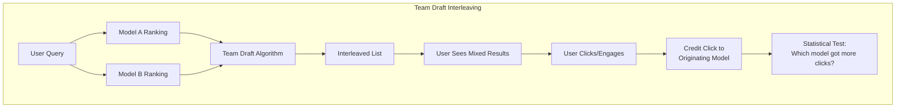
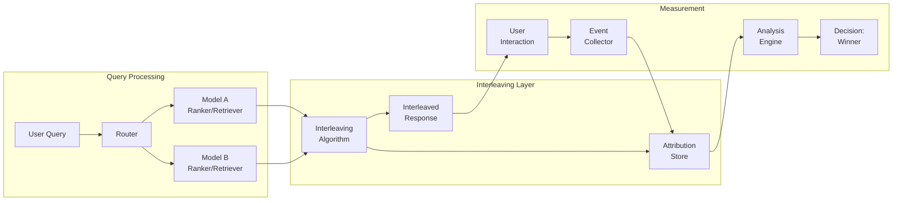

# Interleaving Experiments for AI Systems

## What Is Interleaving?

Interleaving shows results from **two or more models in the same response** to a single user, then measures which model's results the user prefers.

Traditional A/B test:
- User A sees only Model 1's results
- User B sees only Model 2's results
- Compare aggregate metrics across user groups

Interleaving:
- Same user sees results from BOTH models, mixed together
- User's interactions reveal which model produced better results
- Every user is their own control → massive variance reduction

**Key insight**: Interleaving requires 10-100x fewer samples than traditional A/B testing to detect the same effect size.

---

## Why Interleaving for AI Systems

| Challenge | Traditional A/B | Interleaving |
|-----------|----------------|--------------|
| User variance | High (different users, different needs) | Low (same user, same query) |
| Sample size needed | Large (weeks of traffic) | Small (days of traffic) |
| Novelty effects | Confounded | Controlled |
| Sensitivity | Detects ~2% differences | Detects ~0.5% differences |
| Signal-to-noise | Low | High |

### When Speed Matters

AI systems iterate fast. If you need 4 weeks to detect a 1% improvement:
- You're already 2 model versions behind
- User behavior has shifted
- The experiment is stale before it concludes

Interleaving gives you the same confidence in **3-5 days**.

---

## Team Draft Interleaving

The most common interleaving method for ranked results (search, recommendations):



### Algorithm

```python
import random

def team_draft_interleave(ranking_a: list, ranking_b: list, k: int) -> tuple[list, dict]:
    """
    Team Draft Interleaving.
    Returns interleaved list and attribution (which model contributed each item).
    """
    interleaved = []
    attribution = {}  # item -> "A" or "B"
    
    team_a = set()  # Items selected by team A
    team_b = set()  # Items selected by team B
    
    ptr_a, ptr_b = 0, 0
    
    while len(interleaved) < k:
        # Team with fewer picks goes first (coin flip if tied)
        if len(team_a) < len(team_b):
            first, second = "A", "B"
        elif len(team_b) < len(team_a):
            first, second = "B", "A"
        else:
            first, second = ("A", "B") if random.random() < 0.5 else ("B", "A")
        
        if first == "A":
            # Team A picks next item from its ranking not already in list
            while ptr_a < len(ranking_a) and ranking_a[ptr_a] in interleaved:
                ptr_a += 1
            if ptr_a < len(ranking_a):
                item = ranking_a[ptr_a]
                interleaved.append(item)
                team_a.add(item)
                attribution[item] = "A"
                ptr_a += 1
        else:
            while ptr_b < len(ranking_b) and ranking_b[ptr_b] in interleaved:
                ptr_b += 1
            if ptr_b < len(ranking_b):
                item = ranking_b[ptr_b]
                interleaved.append(item)
                team_b.add(item)
                attribution[item] = "B"
                ptr_b += 1
    
    return interleaved, attribution


# Example
ranking_a = ["doc1", "doc2", "doc3", "doc4", "doc5"]
ranking_b = ["doc2", "doc5", "doc1", "doc3", "doc6"]

interleaved, attr = team_draft_interleave(ranking_a, ranking_b, k=5)
# interleaved might be: ["doc1", "doc2", "doc5", "doc3", "doc4"]
# attr: {"doc1": "A", "doc2": "B", "doc5": "B", "doc3": "A", "doc4": "A"}
```

---

## Interleaving Architecture for AI



### Implementation Components

```python
class InterleavingExperiment:
    """End-to-end interleaving experiment for search/retrieval."""
    
    def __init__(self, model_a, model_b, method="team_draft"):
        self.model_a = model_a
        self.model_b = model_b
        self.method = method
        self.results = []  # (query_id, a_clicks, b_clicks)
    
    def serve_query(self, query: str, user_id: str) -> dict:
        """Generate interleaved results for a query."""
        ranking_a = self.model_a.rank(query)
        ranking_b = self.model_b.rank(query)
        
        interleaved, attribution = team_draft_interleave(
            ranking_a, ranking_b, k=10
        )
        
        # Store attribution for later credit assignment
        query_id = f"{user_id}_{hash(query)}"
        self.store_attribution(query_id, attribution)
        
        return {
            "query_id": query_id,
            "results": interleaved,
            # Don't expose attribution to user!
        }
    
    def record_click(self, query_id: str, clicked_item: str):
        """Assign click credit to the model that contributed the item."""
        attribution = self.get_attribution(query_id)
        model = attribution.get(clicked_item)
        if model:
            self.results.append((query_id, model))
    
    def analyze(self) -> dict:
        """Run statistical test on accumulated results."""
        a_wins = sum(1 for _, m in self.results if m == "A")
        b_wins = sum(1 for _, m in self.results if m == "B")
        total = a_wins + b_wins
        
        if total == 0:
            return {"status": "no_data"}
        
        # Binomial test: is B's win rate significantly > 0.5?
        from scipy.stats import binomtest
        result = binomtest(b_wins, total, p=0.5, alternative="two-sided")
        
        return {
            "a_wins": a_wins,
            "b_wins": b_wins,
            "b_win_rate": b_wins / total,
            "p_value": result.pvalue,
            "significant": result.pvalue < 0.05,
            "winner": "B" if b_wins > a_wins and result.pvalue < 0.05 
                     else "A" if a_wins > b_wins and result.pvalue < 0.05
                     else "inconclusive"
        }
```

---

## Preference Judgments

### Click-Based Attribution

For search/retrieval:
- User clicks item from Model A → Model A gets +1
- User clicks item from Model B → Model B gets +1
- Per-query winner = model with more clicks for that query

### Engagement-Based Attribution

For recommendations:
- Time spent on item → weighted credit
- Add to cart / purchase → strong signal
- Skip/dismiss → negative signal

### Quality-Based (for AI-generated content)

When items have ratings:
```python
def weighted_preference(clicks: list[tuple[str, float]]) -> dict:
    """
    Weighted preference: each click weighted by engagement quality.
    clicks: [(item_id, engagement_score), ...]
    """
    a_score = sum(score for item, score in clicks if attribution[item] == "A")
    b_score = sum(score for item, score in clicks if attribution[item] == "B")
    return {"a_score": a_score, "b_score": b_score}
```

---

## When Interleaving Works

### Ideal Use Cases

1. **Search/Retrieval**: Compare two retrieval models by mixing their results
2. **Recommendation feeds**: Interleave recommendations from different algorithms
3. **RAG document ranking**: Mix retrieved documents from two strategies
4. **Code completion**: Show completions from two models in suggestion list
5. **Email/notification ranking**: Mix items from two prioritization models

### Requirements for Interleaving
- Results are **discrete items** that can be mixed
- Items are **independently evaluable** (user can engage with one without seeing others)
- **Position bias is manageable** (or correctable)
- Results from both models are **compatible** (same format, same type)

---

## When Interleaving Doesn't Work

### Generative AI Responses

You cannot interleave two paragraphs of text from different models into one response — it would be incoherent.

**Problem**: "Summarize this document" → can't mix sentences from GPT-4 and Claude

### Why Not
- Generated text is holistic, not decomposable into ranked items
- Coherence requires single-source generation
- User can't meaningfully "click" on parts of a paragraph

---

## Alternatives for Generative AI

### Paired Comparison (Side-by-Side)

Show both responses, ask user to pick:

```python
class PairedComparisonExperiment:
    """Side-by-side evaluation for generative AI."""
    
    def __init__(self, model_a, model_b):
        self.model_a = model_a
        self.model_b = model_b
        self.comparisons = []
    
    def generate_pair(self, prompt: str) -> dict:
        """Generate responses from both models."""
        response_a = self.model_a.generate(prompt)
        response_b = self.model_b.generate(prompt)
        
        # Randomize position to avoid position bias
        if random.random() < 0.5:
            return {"left": response_a, "right": response_b, 
                    "left_model": "A", "right_model": "B"}
        else:
            return {"left": response_b, "right": response_a,
                    "left_model": "B", "right_model": "A"}
    
    def record_preference(self, left_model: str, right_model: str, 
                          preference: str):
        """Record: 'left', 'right', or 'tie'."""
        if preference == "left":
            winner = left_model
        elif preference == "right":
            winner = right_model
        else:
            winner = "tie"
        self.comparisons.append(winner)
```

### Implicit Paired Comparison

Don't ask users explicitly — measure downstream behavior:
- Show Model A to user, track if they regenerate/edit
- Next similar query, show Model B
- Compare edit rates, regeneration rates, task completion

### LLM-as-Judge for Generative

```python
def llm_judge_comparison(prompt: str, response_a: str, response_b: str) -> str:
    """Use a third LLM to judge which response is better."""
    judge_prompt = f"""Compare these two AI responses to the same prompt.
    
Prompt: {prompt}

Response A: {response_a}

Response B: {response_b}

Which response is better? Consider: accuracy, helpfulness, 
completeness, and clarity. Output only 'A', 'B', or 'TIE'."""
    
    # Run both orderings to reduce position bias
    judgment_ab = judge_model.generate(judge_prompt)
    judgment_ba = judge_model.generate(judge_prompt.replace("A:", "B:").replace("B:", "A:"))
    
    # Only count if both orderings agree
    if judgment_ab == judgment_ba:
        return judgment_ab
    return "TIE"
```

---

## Statistical Analysis of Interleaving

### Per-Query Analysis

```python
def per_query_analysis(experiment_data: list[dict]) -> dict:
    """
    Analyze interleaving results at the query level.
    Each entry: {"query_id": ..., "a_clicks": N, "b_clicks": M}
    """
    a_wins = 0
    b_wins = 0
    ties = 0
    
    for query in experiment_data:
        if query["a_clicks"] > query["b_clicks"]:
            a_wins += 1
        elif query["b_clicks"] > query["a_clicks"]:
            b_wins += 1
        else:
            ties += 1
    
    # Sign test (ignoring ties)
    n = a_wins + b_wins
    if n == 0:
        return {"status": "no_decisive_queries"}
    
    from scipy.stats import binomtest
    result = binomtest(b_wins, n, p=0.5)
    
    # Effect size: Delta (difference in win rates)
    delta = (b_wins - a_wins) / (a_wins + b_wins + ties)
    
    return {
        "a_wins": a_wins,
        "b_wins": b_wins,
        "ties": ties,
        "delta": delta,
        "p_value": result.pvalue,
        "confident_winner": "B" if result.pvalue < 0.05 and b_wins > a_wins
                           else "A" if result.pvalue < 0.05 and a_wins > b_wins
                           else None,
        "power_estimate": n / (n + ties)  # Higher is better
    }
```

### Sample Size Estimation

```python
def interleaving_sample_size(
    expected_delta: float,  # Expected win rate difference (e.g., 0.02)
    alpha: float = 0.05,
    power: float = 0.80,
    tie_rate: float = 0.30  # Fraction of queries with no clicks
) -> int:
    """Estimate queries needed for interleaving experiment."""
    from scipy.stats import norm
    
    z_alpha = norm.ppf(1 - alpha / 2)
    z_beta = norm.ppf(power)
    
    # Effective sample is queries with at least one click
    p = 0.5 + expected_delta / 2
    n_decisive = ((z_alpha + z_beta) ** 2 * 0.25) / (expected_delta / 2) ** 2
    
    # Account for ties
    n_total = n_decisive / (1 - tie_rate)
    
    return int(np.ceil(n_total))

# Detect 2% difference with 80% power
n = interleaving_sample_size(expected_delta=0.02, tie_rate=0.3)
# ~3500 queries (vs ~50000 for traditional A/B!)
```

---

## Position Bias Correction

Users click top results more regardless of quality. Must correct for this:

```python
def position_bias_correction(clicks: list[dict], attribution: dict) -> dict:
    """
    Correct for position bias in interleaving.
    Uses inverse propensity weighting.
    """
    # Estimate position click probability from historical data
    position_ctrs = {1: 0.35, 2: 0.22, 3: 0.15, 4: 0.10, 5: 0.08,
                     6: 0.05, 7: 0.04, 8: 0.03, 9: 0.02, 10: 0.01}
    
    a_score = 0.0
    b_score = 0.0
    
    for click in clicks:
        position = click["position"]
        item = click["item"]
        model = attribution[item]
        
        # Weight inversely by position probability
        weight = 1.0 / position_ctrs.get(position, 0.01)
        
        if model == "A":
            a_score += weight
        else:
            b_score += weight
    
    total = a_score + b_score
    return {
        "a_share": a_score / total if total > 0 else 0.5,
        "b_share": b_score / total if total > 0 else 0.5,
    }
```

---

## Staff Decision Framework: Choosing the Right Method

```
┌─────────────────────────────────────────────────────┐
│           EXPERIMENT METHOD SELECTION                │
├─────────────────────────────────────────────────────┤
│                                                     │
│  Is your output a ranked list of items?             │
│  ├── YES → Are items independently clickable?       │
│  │         ├── YES → INTERLEAVING ✓                 │
│  │         └── NO  → Standard A/B                   │
│  └── NO  → Is it generative text?                  │
│            ├── YES → Can you do side-by-side?       │
│            │         ├── YES → Paired Comparison    │
│            │         └── NO  → Standard A/B         │
│            └── NO  → Standard A/B                   │
│                                                     │
│  Traffic level:                                     │
│  ├── < 1K queries/day → Bayesian + Interleaving    │
│  ├── 1K-100K/day → Interleaving or Bandit          │
│  └── > 100K/day → Any method works                 │
│                                                     │
│  Decision urgency:                                  │
│  ├── Need answer in days → Interleaving            │
│  ├── Need answer in 1-2 weeks → Bayesian A/B      │
│  └── Can wait weeks → Frequentist A/B             │
│                                                     │
│  Effect size expected:                              │
│  ├── Large (>5%) → Any method, small sample        │
│  ├── Medium (1-5%) → Interleaving preferred        │
│  └── Small (<1%) → Interleaving required           │
│                                                     │
└─────────────────────────────────────────────────────┘
```

### Method Comparison Summary

| Method | Sample Efficiency | Complexity | Best For |
|--------|------------------|------------|----------|
| Standard A/B | Low | Low | Simple binary outcomes, high traffic |
| Bayesian A/B | Medium | Medium | Early stopping, prior knowledge |
| Thompson Sampling | High | Medium | Continuous optimization, multi-model |
| Interleaving | Very High | High | Ranked results, low traffic |
| Paired Comparison | Medium | Low | Generative AI, explicit feedback |

### The Staff Engineer's Recommendation

1. **Default to interleaving** for any ranking/retrieval AI system
2. Use **Bayesian A/B + Thompson Sampling** for generative systems
3. Reserve **standard A/B** only for high-traffic, simple metric cases
4. Always have a **fallback method** — if interleaving infrastructure breaks, you need traditional A/B as backup
5. **Combine methods**: Use interleaving for fast directional signal, then validate with standard A/B before full rollout

---

## Summary

Interleaving is the highest-sensitivity experimentation method available for AI systems that produce ranked outputs. It achieves 10-100x sample efficiency by using each user as their own control. The limitation is that it only works for decomposable, independently-evaluable results — not for holistic generative outputs where paired comparison or standard A/B remains necessary.
