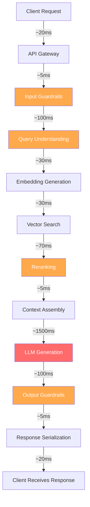
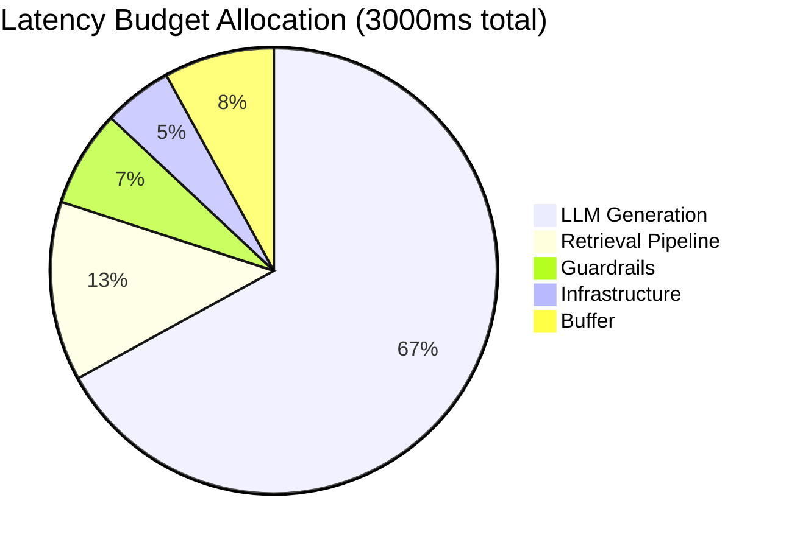

# Latency Budgeting Fundamentals

## What is Latency Budgeting?

Latency budgeting is the practice of allocating a fixed "time budget" across all components
of a system to ensure the total end-to-end latency stays within an acceptable threshold.

### The "Time Budget" Analogy

Think of it like a financial budget:
- You have **3 seconds total** (your income)
- You must "spend" that time across many steps
- Some steps are expensive (LLM generation = rent)
- Some steps are cheap (serialization = coffee)
- If you overspend on one step, you must cut another
- Going over budget = unhappy users

```
Total Budget: 3000ms
├── LLM Generation:     2000ms (67%) ← "rent"
├── Retrieval Pipeline:  400ms (13%) ← "groceries"
├── Guardrails:          200ms  (7%) ← "utilities"
├── Infrastructure:      150ms  (5%) ← "transport"
└── Buffer/Slack:        250ms  (8%) ← "savings"
```

### Why "Budget" and Not Just "Limit"?

A limit says "don't exceed 3 seconds." A budget says:
- Here's how we'll ALLOCATE the 3 seconds
- Each team owns their component's budget
- If one component needs more, another must give up some
- It forces explicit tradeoff decisions

## Why Latency Budgeting Matters for AI

AI systems are uniquely latency-challenged because:

### 1. Many Sequential Steps

A traditional web request: DB query + template render = 2 steps.
An AI request: 10-12 sequential steps, each adding latency.

### 2. LLM Calls Are Inherently Slow

LLMs generate tokens one at a time. Even fast models take 500ms+ for useful responses.
This consumes most of the budget, leaving little for everything else.

### 3. Multiple LLM Calls Per Request

Modern AI systems often make 2-4 LLM calls per request:
- Query classification
- Generation
- Input guardrails
- Output guardrails

### 4. Retrieval Adds Steps

RAG systems add embedding + search + reranking before generation even starts.

### 5. Variability is High

LLM latency varies wildly based on:
- Output length (10 tokens vs 500 tokens)
- Input length (prompt size affects prefill time)
- Load on the serving infrastructure
- Model size and quantization

## The Full-Stack AI Request Path

Every step in an AI request takes time. Here's the complete breakdown:

### Step 1: Network (Client → Server) — ~20ms

```
Client sends HTTP request over the internet
- DNS resolution (cached): ~1ms
- TLS handshake (reused): ~0ms (new: ~30ms)
- TCP transmission: ~10-20ms depending on distance
```

### Step 2: API Gateway — ~5ms

```
Gateway processes the request:
- Authentication (JWT validation): ~2ms
- Rate limiting check: ~1ms
- Request routing: ~1ms
- Logging: ~1ms
```

### Step 3: Input Guardrails — ~50-200ms

```
Check if the user's input is safe/appropriate:
- Rule-based (regex, blocklist): ~5ms
- ML classifier: ~50ms
- LLM-based guardrail: ~200ms (another LLM call!)
```

### Step 4: Query Understanding/Classification — ~100-300ms

```
Understand what the user wants:
- Intent classification: ~100ms (small model)
- Query rewriting for search: ~200ms (LLM call)
- Entity extraction: ~100ms
```

### Step 5: Embedding Generation — ~20-50ms

```
Convert query to vector for search:
- Model inference: ~20ms (batch of 1)
- If batched with others: ~30ms (amortized)
```

### Step 6: Vector Search — ~20-50ms

```
Find similar documents:
- HNSW search: ~5-20ms (in-memory)
- With filtering: ~20-50ms
- Distributed search: ~30-50ms (fan-out + merge)
```

### Step 7: Reranking — ~50-100ms

```
Reorder retrieved documents by relevance:
- Cross-encoder model: ~50-100ms for top 20 results
- Each pair scored independently
```

### Step 8: Context Assembly — ~5ms

```
Build the final prompt:
- Select top-k documents: ~1ms
- Format into prompt template: ~2ms
- Token counting/truncation: ~2ms
```

### Step 9: LLM Generation — ~500-3000ms (BIGGEST PORTION)

```
The main LLM generates the response:
- Prefill (process input): ~100-500ms (depends on prompt length)
- Decode (generate output): ~400-2500ms (depends on output length)
  - At ~30ms/token, 100 tokens = 3000ms
  - At ~30ms/token, 50 tokens = 1500ms
```

### Step 10: Output Guardrails — ~50-200ms

```
Check if the model's output is safe/appropriate:
- Rule-based checks: ~5ms
- Toxicity classifier: ~50ms
- LLM-based guardrail: ~200ms
```

### Step 11: Response Serialization — ~5ms

```
Package the response:
- JSON serialization: ~2ms
- Compression (gzip): ~3ms
```

### Step 12: Network (Server → Client) — ~20ms

```
Response travels back to user:
- TCP transmission: ~10-20ms
- Response is typically larger than request
```

### Total Latency Range

```
BEST CASE (cached, short response):    ~850ms
TYPICAL CASE:                          ~2000ms
WORST CASE (long response, no cache):  ~4000ms+
```

## Budget Allocation Strategy

### Setting the Total Budget (SLO)

The total budget comes from your Service Level Objective:

| Use Case | P95 SLO | Rationale |
|----------|---------|-----------|
| Chat assistant | 3000ms | Users expect conversational speed |
| Code completion | 500ms | Must feel instantaneous |
| Search with AI summary | 5000ms | Users accept longer for quality |
| Background processing | 30000ms | No user waiting |
| Voice assistant | 1500ms | Conversational turn-taking |

### Allocation Principles

1. **LLM generation gets 60-70%** — it's the core value, can't be eliminated
2. **Retrieval gets 10-15%** — must be fast, user is waiting
3. **Guardrails get 5-10%** — safety tax, minimize with rules
4. **Infrastructure gets 5%** — optimize once, benefits all requests
5. **Buffer gets 8-15%** — absorbs spikes, enables retries

### Example: 3000ms Budget for Chat Assistant

```
Component               | Budget  | % of Total
------------------------|---------|----------
LLM Generation          | 2000ms  | 67%
Retrieval Pipeline      |  400ms  | 13%
  - Embedding           |   50ms  |
  - Vector Search       |  100ms  |
  - Reranking           |  150ms  |
  - Assembly            |  100ms  |
Guardrails              |  200ms  |  7%
  - Input               |  100ms  |
  - Output              |  100ms  |
Infrastructure          |  150ms  |  5%
  - Network RTT         |   40ms  |
  - Auth/Gateway        |   10ms  |
  - Serialization       |   10ms  |
  - Misc overhead       |   90ms  |
Buffer                  |  250ms  |  8%
------------------------|---------|----------
TOTAL                   | 3000ms  | 100%
```

## Latency Percentiles

### Why Average Latency is Misleading

```
Request 1:  100ms
Request 2:  100ms
Request 3:  100ms
Request 4:  100ms
Request 5: 5000ms  ← terrible experience

Average: 1080ms  ← "looks fine!"
P50:     100ms   ← most users are happy
P95:    5000ms   ← 1 in 20 users waits 5 seconds!
```

### Percentile Definitions

| Percentile | Meaning | Who Experiences It |
|------------|---------|-------------------|
| P50 | Median — half of requests are faster | Most users, most of the time |
| P75 | 75th percentile | 1 in 4 requests |
| P90 | 90th percentile | 1 in 10 requests |
| P95 | 95th percentile | 1 in 20 requests |
| P99 | 99th percentile | 1 in 100 requests |
| P99.9 | Three nines | 1 in 1000 requests |

### Why P95/P99 Matter More Than P50

1. **Repeat users hit the tail**: A user making 20 requests/day WILL hit P95 daily
2. **Tail latency compounds**: If one service is P99=5s, and you call 3 services...
3. **LLMs have fat tails**: Variable output length → huge P99/P50 ratio
4. **Your worst users are often your best customers**: Power users make more requests

### LLM Tail Latency

```
Typical LLM latency distribution:

P50:  800ms   (short responses, ~20 tokens)
P75: 1500ms   (medium responses, ~40 tokens)
P90: 2500ms   (longer responses, ~80 tokens)
P95: 3500ms   (detailed responses, ~120 tokens)
P99: 6000ms   (very long responses, ~200 tokens)

Ratio P99/P50 = 7.5x ← THIS IS HUGE
(Compare to a database: P99/P50 ≈ 2-3x)
```

### Budget at Different Percentiles

Your budget allocation should account for percentile variation:

```
Component      | P50 Budget | P95 Budget | P99 Budget
---------------|-----------|-----------|----------
LLM Generation |   800ms   |  2000ms   |  3500ms
Retrieval      |   100ms   |   300ms   |   500ms
Guardrails     |    80ms   |   200ms   |   400ms
Infrastructure |    50ms   |   100ms   |   200ms
---------------|-----------|-----------|----------
Total          |  1030ms   |  2600ms   |  4600ms
```

At P95, you're already at 2600ms — close to the 3000ms SLO!
At P99, you EXCEED the SLO — this is where the buffer helps.

## Full Request Flow Diagram





## Key Takeaways

1. **AI systems are latency-challenged** — 10+ sequential steps vs 2-3 in traditional apps
2. **LLM generation dominates** — 60-70% of total time, optimize everything else aggressively
3. **Budget forces tradeoffs** — if you add guardrails, something else must get faster
4. **Measure percentiles, not averages** — P95 is what users remember
5. **Tail latency is extreme for LLMs** — P99 can be 7-10x P50 due to variable output length
6. **Buffer is essential** — systems have variability, plan for it
7. **Budgets are contracts** — each team owns their allocation, must stay within it

## Mental Model

```
Think of a relay race with 12 runners (= steps):
- Total race time budget: 3 seconds
- One runner (LLM) is slow but essential: uses 2 seconds
- The other 11 runners must share the remaining 1 second
- If any runner is slower than expected, the race is lost
- Training (optimization) focuses on the slowest runners
- Sometimes you can have runners run simultaneously (parallelism)
```
