# Component-Level Latency Budgets

## Budget Allocation by Component

Each component in an AI pipeline has a latency budget. This document breaks down
how to allocate, monitor, and optimize each component's budget.

## Retrieval Pipeline: 150ms Total Budget

The retrieval pipeline finds relevant context for the LLM. It's a sequence of
steps that must complete before generation can begin.

### Embedding Generation: 30ms Budget

```
What happens:
- User query → embedding model → 768/1536-dim vector
- Single inference call to embedding model

Typical latency:
- Local model (e5-small): 5-15ms
- API call (OpenAI ada-002): 20-50ms
- Batched (10 queries): 30-50ms total (amortized: 3-5ms each)

Budget pressure:
- Usually within budget
- Risk: API latency spikes (cold starts)
- Mitigation: local model, connection pooling
```

### Vector Search: 50ms Budget

```
What happens:
- Query vector → search index → top-K candidates
- ANN (approximate nearest neighbor) search

Typical latency by index type:
- HNSW (in-memory): 1-10ms ← fastest
- IVF (disk-based): 5-30ms
- Distributed (Pinecone/Weaviate): 20-50ms (network included)
- Brute force (small dataset): 1-5ms

Budget pressure:
- Filtering increases latency (metadata filters)
- Large datasets (>10M vectors) increase search time
- Multi-index queries (search 3 collections) multiply latency

Tuning knobs:
- ef_search (HNSW): lower = faster, less accurate
- nprobe (IVF): fewer probes = faster
- top-K: fewer results = faster
```

### Reranking: 70ms Budget

```
What happens:
- Top-K candidates → cross-encoder model → re-scored + reordered
- Each (query, document) pair scored independently

Typical latency:
- 10 documents: 30-50ms
- 20 documents: 50-100ms
- 50 documents: 150-250ms ← OVER BUDGET

Budget pressure:
- Linear in number of documents
- Longer documents = more tokens = slower
- Model size matters (MiniLM vs large cross-encoder)

Tradeoff:
- More reranking = better quality, higher latency
- Less reranking = lower quality, faster
- Sweet spot: rerank top 10-20 results
```

## LLM Inference: 2000ms Budget

The largest budget allocation. Divided into two phases.

### Time to First Token (TTFT): 200ms

```
What happens:
- Full prompt processed by the model (prefill phase)
- All input tokens processed in parallel
- First output token generated

Depends on:
- Prompt length: 100 tokens → 50ms, 4000 tokens → 300ms
- Model size: 7B → fast, 70B → slow
- Hardware: A100 → fast, T4 → slow
- KV cache hit: if prefix cached, near-instant

Why TTFT matters:
- For streaming, this is when the user FIRST sees output
- User perceives this as "response time"
- Everything before this is "thinking time"
```

### Token Generation: 1800ms

```
What happens:
- Tokens generated one at a time (autoregressive)
- Each token depends on all previous tokens
- Fundamentally sequential

Calculation:
- Speed: ~30-50ms per token (API) or ~15-30ms (optimized local)
- Budget: 1800ms
- Tokens possible: 1800ms / 30ms = 60 tokens at 30ms/token
- Tokens possible: 1800ms / 50ms = 36 tokens at 50ms/token

Budget pressure:
- Output length varies WILDLY (10 tokens to 500+)
- Cannot predict output length in advance
- Long outputs WILL exceed budget

Strategies:
- max_tokens limit: cap output at 150 tokens
- Streaming: user reads while tokens generate (perceived latency is TTFT)
- Model routing: short answers → fast small model
```

### LLM Budget Breakdown by Scenario

```
Scenario 1: Simple factual answer
- TTFT: 100ms (short prompt)
- Generation: 15 tokens × 30ms = 450ms
- Total: 550ms ← UNDER budget by 1450ms!

Scenario 2: Detailed explanation
- TTFT: 200ms (longer prompt with context)
- Generation: 100 tokens × 30ms = 3000ms
- Total: 3200ms ← OVER budget by 1200ms!

Scenario 3: Code generation
- TTFT: 300ms (complex prompt)
- Generation: 200 tokens × 30ms = 6000ms
- Total: 6300ms ← WAY over budget

Solution: Streaming makes scenarios 2 & 3 acceptable
- User sees first token at 200-300ms
- Reads along as tokens stream
- Total wait is distributed across reading time
```

## Guardrails: 200ms Budget

Safety checks that add latency tax on every request.

### Input Guardrails: 100ms Budget

```
Types (fastest to slowest):
1. Regex/blocklist:        ~1ms   (catch known bad patterns)
2. ML text classifier:    ~20ms   (toxicity, PII detection)
3. Small LLM guardrail:  ~100ms   (intent analysis)
4. Full LLM guardrail:   ~300ms   (nuanced safety check) ← OVER BUDGET

Strategy: Layered approach
- Layer 1 (always): Regex + blocklist (~1ms)
- Layer 2 (always): ML classifier (~20ms)
- Layer 3 (if uncertain): Small LLM check (~100ms)
- Layer 4 (rarely): Full LLM (only if layer 3 is uncertain)

Total typical: 21ms (layers 1+2)
Total worst case: 121ms (layers 1+2+3)
```

### Output Guardrails: 100ms Budget

```
Types:
1. Regex/pattern check:    ~1ms (hallucination patterns, format check)
2. Factuality classifier: ~50ms (check against retrieved context)
3. LLM-as-judge:         ~300ms (quality/safety assessment) ← OVER BUDGET

Strategy:
- Always: regex/pattern (format, basic checks)
- Usually: factuality classifier
- Async: LLM-as-judge (don't block response, log for review)

Key insight: Output guardrails can run AFTER streaming starts
- Stream tokens to user immediately
- Run guardrail on accumulated text
- If violation detected mid-stream → stop + apologize
```

## Infrastructure: 150ms Budget

The "overhead" that everything else runs on.

### Network Round-Trip: 40ms

```
Breakdown:
- Client → edge (CDN/LB): ~10ms (same continent)
- Edge → API server: ~5ms (same region)
- API server → model server: ~5ms (same VPC)
- Return path: ~20ms

Optimization:
- Edge deployment (run API close to users)
- Keep-alive connections (skip TLS handshake)
- Regional model deployment (avoid cross-region calls)
- gRPC instead of HTTP (less overhead)
```

### Authentication: 10ms

```
Breakdown:
- JWT validation (local): ~1ms (verify signature)
- API key lookup (cache): ~2ms (in-memory cache)
- API key lookup (DB): ~10ms (avoid this on hot path)
- OAuth token introspection: ~50ms (AVOID — call external service)

Optimization:
- Always validate locally (JWT with cached public key)
- Cache API key → user mapping in memory
- Never call external auth service on critical path
```

### Serialization: 10ms

```
Breakdown:
- JSON parse (request): ~2ms (typical payload)
- JSON serialize (response): ~3ms (typical response)
- Compression (gzip): ~3ms (if response > 1KB)
- Protocol buffers: ~1ms total (much faster)

Optimization:
- Use protobuf/msgpack for internal service communication
- JSON only at the edge (client-facing)
- Stream JSON instead of building full response in memory
```

### Queue Wait Time: 50ms

```
What:
- Time request spends waiting before processing starts
- Depends on system load and concurrency limits

Breakdown:
- No queue (low load): 0ms
- Light load: 5-20ms
- Normal load: 20-50ms
- High load: 100-500ms ← PROBLEM
- Overloaded: 1000ms+ (shed this traffic)

Optimization:
- Auto-scaling (reduce queue depth)
- Priority queues (important requests skip ahead)
- Load shedding (reject when queue too deep)
- Pre-warming (avoid cold starts adding to queue)
```

### Cache Lookup: 10ms

```
Types:
- In-process cache (LRU): <1ms
- Redis/Memcached (same AZ): 1-3ms
- Redis (cross-AZ): 5-10ms
- Semantic cache (embedding + search): 30-50ms ← expensive!

Optimization:
- L1: in-process (exact match), <1ms
- L2: Redis (exact match), 1-3ms
- L3: semantic (similar match), 30-50ms (only if L1/L2 miss)
```

## Buffer: 500ms

The "savings account" in your budget.

```
Why buffer exists:
- Systems have variability (P95 ≠ P50)
- Retries need time (if first attempt fails)
- Spikes happen (thundering herd, model cold start)
- New features need room (adding a guardrail? Use buffer)

How buffer is used:
- Normal: unused (request completes with room to spare)
- Spike: absorbs temporary latency increase
- Retry: allows one retry of a fast component (<100ms)
- Degraded mode: allows fallback to slower path

Buffer rules:
- If you consistently USE the buffer → you're over budget
- If you consistently DON'T use it → buffer is too large
- Target: buffer used on <5% of requests
```

## Optimization Strategies Per Component

### Retrieval Optimization

| Strategy | Latency Savings | Complexity |
|----------|----------------|------------|
| Pre-compute embeddings (cache queries) | 20-40ms | Low |
| Use local embedding model | 10-30ms | Medium |
| Tune HNSW ef_search down | 5-20ms | Low |
| Reduce reranking candidates (20→10) | 30-50ms | Low |
| Use faster reranker model | 20-40ms | Medium |
| Hybrid search (skip reranking) | 50-100ms | Medium |
| Pre-fetch for predictable queries | 100-150ms | High |

### LLM Optimization

| Strategy | Latency Savings | Complexity |
|----------|----------------|------------|
| Streaming (perceived) | 1500-2500ms perceived | Low |
| Model routing (small for simple) | 500-1500ms | Medium |
| KV cache / prefix caching | 100-300ms TTFT | Medium |
| Prompt compression | 50-200ms TTFT | Medium |
| Speculative decoding | 30-50% generation time | High |
| max_tokens limit | Caps worst case | Low |
| Quantization (INT8/INT4) | 20-40% faster | Medium |

### Guardrails Optimization

| Strategy | Latency Savings | Complexity |
|----------|----------------|------------|
| Rule-based for common cases | 80-290ms | Low |
| Async output guardrails | 100-200ms (off critical path) | Medium |
| Smaller guardrail model | 50-150ms | Medium |
| Batch guardrail checks | 50-100ms | Medium |
| Skip guardrails for trusted users | 100-200ms | Low |

### Infrastructure Optimization

| Strategy | Latency Savings | Complexity |
|----------|----------------|------------|
| Connection pooling | 20-50ms (skip TLS) | Low |
| Regional deployment | 20-100ms | Medium |
| In-process caching | 5-10ms per lookup | Low |
| gRPC between services | 5-15ms | Medium |
| Pre-warming | 0ms queue wait | Medium |

## Parallel vs Sequential Execution

### Sequential (Default)

Most AI pipeline steps are sequential — each needs the previous step's output:

```
Query → Embed → Search → Rerank → Assemble → Generate → Guardrail → Return
  |       |       |        |         |          |           |          |
  0      30ms   80ms    150ms     155ms      2155ms      2255ms    2275ms

Total: 2275ms (sum of all steps)
```

### Parallel Opportunities

Some steps DON'T depend on each other:

```
Opportunity 1: Input guardrails PARALLEL with embedding
- Guardrails check the query text
- Embedding encodes the query text
- Neither needs the other's output!

Sequential: guardrails (100ms) → embedding (30ms) = 130ms
Parallel:   max(guardrails, embedding) = 100ms
Savings: 30ms
```

```
Opportunity 2: Multiple retrieval sources in parallel
- Search knowledge base
- Search conversation history
- Search user profile

Sequential: 50ms + 30ms + 20ms = 100ms
Parallel:   max(50ms, 30ms, 20ms) = 50ms
Savings: 50ms
```

```
Opportunity 3: Pre-fetch while LLM generates
- While LLM is generating tokens...
- Pre-fetch data for potential follow-up queries
- Log request metrics
- Update user session

Cost: 0ms additional (hidden behind LLM generation)
```

### Critical Path Analysis

The critical path is the longest sequential chain:

```
CRITICAL PATH (cannot parallelize):
Query → Embed → Search → Rerank → Assemble Prompt → LLM Prefill → LLM Decode
  0      30ms    80ms    150ms       155ms            355ms         2155ms

NON-CRITICAL (can be parallelized):
Input Guardrails: 100ms (parallel with embed+search)
Output Guardrails: 100ms (can be async after streaming starts)
Auth: 10ms (before anything, but fast)
```

**Minimum possible latency** = Critical path length = ~2155ms
(Even with infinite parallelism, you can't go below this)

### Optimization Priority

1. **Shorten the critical path** (biggest impact)
   - Faster LLM = biggest win (it dominates the critical path)
   - Faster search/reranking = next biggest win
2. **Move work off the critical path** (medium impact)
   - Parallelize guardrails with retrieval
   - Async output guardrails
3. **Speed up non-critical components** (smaller impact)
   - Faster auth doesn't help much (already not on critical path if parallelized)

## Parallel vs Sequential Diagram

```mermaid
gantt
    title Sequential Execution (Total: 2475ms)
    dateFormat X
    axisFormat %L ms

    section Sequential
    Auth           :0, 10
    Input Guard    :10, 110
    Embedding      :110, 140
    Vector Search  :140, 190
    Reranking      :190, 260
    Assembly       :260, 265
    LLM Generation :265, 2265
    Output Guard   :2265, 2365
    Serialize      :2365, 2370
    Network        :2370, 2390
```

```mermaid
gantt
    title Optimized Parallel Execution (Total: 2170ms)
    dateFormat X
    axisFormat %L ms

    section Critical Path
    Auth           :0, 10
    Embedding      :10, 40
    Vector Search  :40, 90
    Reranking      :90, 160
    Assembly       :160, 165
    LLM Generation :165, 2165
    Serialize      :2165, 2170

    section Parallel
    Input Guard    :10, 110
    Output Guard   :2165, 2265

    section Hidden
    Logging        :165, 185
    Pre-fetch      :1000, 1100
```





**Savings from parallelization: ~305ms (12% reduction)**

## Budget Violation Handling

What to do when a component exceeds its budget:

### Detection

```python
# Pseudo-code for budget enforcement
component_start = time.now()
result = await run_component(input)
component_duration = time.now() - component_start

if component_duration > component_budget:
    # Log violation
    metrics.increment("budget_violation", component=name)
    
    # If total budget is still OK, continue
    if total_elapsed < total_budget:
        continue_processing()
    else:
        # Total budget exceeded — degrade gracefully
        return degraded_response()
```

### Graceful Degradation

When budget is exceeded:

| Trigger | Action |
|---------|--------|
| Retrieval over budget | Use fewer results, skip reranking |
| LLM over budget | Set lower max_tokens, use smaller model |
| Guardrails over budget | Fall back to rule-based only |
| Total over budget | Return partial result with streaming |
| Way over budget | Return cached/fallback response |

## Key Takeaways

1. **Each component has an explicit budget** — no "it'll probably be fine"
2. **LLM generation dominates** — 60-70% of total budget
3. **Parallelize where possible** — guardrails + retrieval can overlap
4. **Critical path determines minimum latency** — optimize it first
5. **Buffer absorbs variability** — but if always used, budget is wrong
6. **Graceful degradation** — when over budget, serve something rather than nothing
7. **Budget violations are signals** — track them, fix systematic ones
