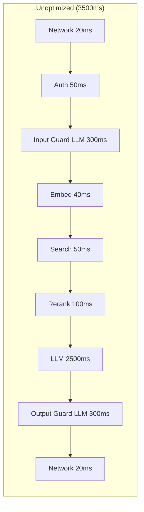
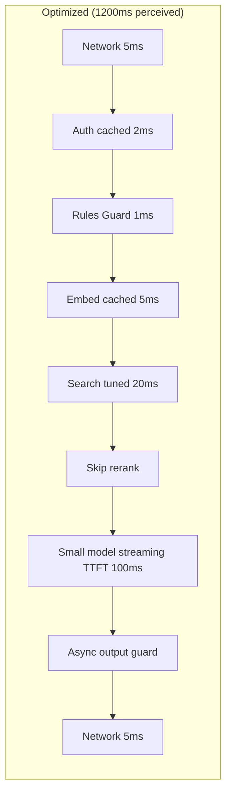

# Latency Optimization Techniques for AI Systems

## Overview

15 techniques to reduce AI system latency, ordered by impact.
Each technique includes: what it does, latency savings, implementation complexity, and tradeoffs.

---

## Technique 1: Streaming

### What It Does

Send tokens to the user as they're generated, rather than waiting for the
complete response.

### How It Works

```
WITHOUT streaming:
User waits... waits... waits... [3 seconds] → sees full response

WITH streaming:
User waits [200ms] → sees first word → reads along as words appear

Same TOTAL latency (3 seconds), but perceived latency drops from 3s to 200ms
```

### Latency Impact

| Metric | Without Streaming | With Streaming |
|--------|-------------------|----------------|
| Time to first visible content | 3000ms | 200ms (TTFT) |
| Time to complete response | 3000ms | 3000ms |
| Perceived wait time | 3000ms | 200ms |
| User satisfaction | Low | High |

**Perceived latency reduction: ~80-90%**

### Implementation

```python
# Server-Sent Events (SSE) streaming
async def stream_response(prompt):
    response = await llm.generate(prompt, stream=True)
    
    async for token in response:
        yield f"data: {json.dumps({'token': token})}\n\n"
    
    yield "data: [DONE]\n\n"
```

### Tradeoffs

- (+) Massive perceived latency improvement
- (+) Users start reading immediately
- (-) Cannot run output guardrails on complete response before user sees it
- (-) More complex client implementation
- (-) Harder to cache complete responses
- Complexity: **Low** (most LLM APIs support streaming natively)

---

## Technique 2: Semantic Caching

### What It Does

Cache responses for queries that are semantically similar to previous queries.
Identical or near-identical questions get instant answers.

### How It Works

```
Request 1: "What is photosynthesis?"
→ Cache miss → LLM generates answer (2000ms) → Store in cache

Request 2: "Explain photosynthesis"  (semantically similar)
→ Cache hit (similarity > 0.95) → Return cached answer (5ms)

Savings: 2000ms → 5ms (99.75% reduction)
```

### Latency Impact

| Scenario | Latency |
|----------|---------|
| Cache miss (first time) | Normal (2000ms+) |
| Exact cache hit | ~1-5ms |
| Semantic cache hit | ~30-50ms (embedding + similarity search) |
| Cache hit rate (typical) | 10-40% depending on use case |

**Average latency reduction: 20-50% (depending on hit rate)**

### Implementation

```python
class SemanticCache:
    def __init__(self, similarity_threshold=0.95):
        self.threshold = similarity_threshold
        self.cache = VectorStore()
    
    async def get(self, query: str):
        embedding = await embed(query)
        results = self.cache.search(embedding, top_k=1)
        
        if results and results[0].score > self.threshold:
            return results[0].response  # Cache hit!
        return None  # Cache miss
    
    async def put(self, query: str, response: str):
        embedding = await embed(query)
        self.cache.insert(embedding, response)
```

### Tradeoffs

- (+) Near-zero latency for repeat queries
- (+) Reduces LLM API costs significantly
- (-) Stale answers if underlying data changes
- (-) Semantic similarity can return wrong cached answers
- (-) Cache miss adds 30-50ms (embedding + search overhead)
- (-) Doesn't work well for personalized responses
- Complexity: **Medium**

---

## Technique 3: Model Routing

### What It Does

Route simple queries to small/fast models and complex queries to large/slow models.
Most queries don't need GPT-4 — GPT-3.5 or a 7B model is fine.

### How It Works

```
Query: "What's 2+2?"
→ Classifier: SIMPLE (confidence: 99%)
→ Route to: Fast model (7B, ~200ms)

Query: "Explain the philosophical implications of quantum mechanics on free will"
→ Classifier: COMPLEX (confidence: 95%)
→ Route to: Large model (70B, ~2000ms)
```

### Latency Impact

| Query Type | Large Model | Small Model | Savings |
|------------|------------|-------------|---------|
| Simple factual | 1500ms | 200ms | 1300ms |
| Moderate | 2000ms | 500ms | 1500ms |
| Complex (stays on large) | 2500ms | N/A | 0ms |

**Typical traffic mix: 60% simple, 25% moderate, 15% complex**
**Average latency reduction: ~50%**

### Implementation

```python
class ModelRouter:
    def __init__(self):
        self.classifier = load_model("query_complexity_classifier")
        self.models = {
            "simple": FastModel(name="gpt-3.5-turbo"),
            "complex": SlowModel(name="gpt-4"),
        }
    
    async def route(self, query: str):
        complexity = self.classifier.predict(query)
        
        if complexity.score < 0.3:
            return self.models["simple"]
        else:
            return self.models["complex"]
```

### Tradeoffs

- (+) Massive latency and cost savings for simple queries
- (+) Quality preserved for complex queries
- (-) Router adds ~10-20ms latency (classification step)
- (-) Risk of misrouting complex queries to small model (quality degradation)
- (-) Need to train/maintain the routing classifier
- Complexity: **Medium**

---

## Technique 4: Prompt Compression

### What It Does

Reduce the number of tokens in the prompt. Fewer input tokens = faster prefill = lower TTFT.

### How It Works

```
BEFORE compression (2000 tokens):
System prompt (500 tokens) + Context (1200 tokens) + Query (300 tokens)
Prefill time: ~200ms

AFTER compression (800 tokens):
System prompt (200 tokens) + Context (500 tokens) + Query (100 tokens)
Prefill time: ~80ms

Savings: 120ms on TTFT
```

### Techniques

1. **Summarize retrieved context** instead of including full documents
2. **Compress system prompts** (remove redundant instructions)
3. **Use LLMLingua/AutoCompressor** for automatic prompt compression
4. **Include only relevant paragraphs** not full documents
5. **Remove examples** when query is straightforward

### Latency Impact

| Prompt Size | TTFT (approx) | With Compression | Savings |
|-------------|---------------|------------------|---------|
| 500 tokens | 50ms | 30ms | 20ms |
| 2000 tokens | 200ms | 80ms | 120ms |
| 8000 tokens | 600ms | 250ms | 350ms |
| 32000 tokens | 2000ms | 800ms | 1200ms |

**Impact scales with prompt size. Biggest win for long-context applications.**

### Tradeoffs

- (+) Directly reduces TTFT
- (+) Also reduces cost (fewer input tokens)
- (-) May lose important context details
- (-) Compression itself takes time (if using ML compressor)
- (-) Quality may degrade if over-compressed
- Complexity: **Medium**

---

## Technique 5: Speculative Decoding

### What It Does

Use a small "draft" model to generate candidate tokens quickly, then verify
them in batch with the large model. Correct tokens are accepted for free.

### How It Works

```
Traditional decoding (large model):
Token 1 → Token 2 → Token 3 → Token 4 → Token 5
  50ms      50ms      50ms      50ms      50ms    = 250ms for 5 tokens

Speculative decoding:
Draft model generates 5 candidates: [t1, t2, t3, t4, t5] (10ms total)
Large model verifies all 5 in one forward pass: (60ms)
Result: 3 accepted, 2 rejected, regenerate from token 4
Total: 70ms for 3 tokens (vs 150ms traditional) = 2.1x speedup
```

### Latency Impact

- **Speedup: 2-3x for token generation**
- Depends on acceptance rate (how often draft model matches target model)
- Best for: predictable text (code, structured output)
- Worst for: creative/diverse text

### Tradeoffs

- (+) Mathematically equivalent output (no quality loss)
- (+) 2-3x faster generation
- (-) Requires running two models simultaneously
- (-) Complex infrastructure setup
- (-) Less effective when draft model is poor predictor
- Complexity: **High**

---

## Technique 6: KV Cache Reuse (Prefix Caching)

### What It Does

Cache the key-value pairs from processing common prompt prefixes (like system prompts).
Subsequent requests skip re-processing the shared prefix.

### How It Works

```
Request 1: [System prompt: 500 tokens] + [User query: 50 tokens]
→ Process all 550 tokens in prefill (100ms)
→ Cache KV for system prompt

Request 2: [Same system prompt: 500 tokens] + [New query: 40 tokens]
→ Load cached KV for system prompt (5ms)
→ Only process 40 new tokens in prefill (10ms)
→ Total TTFT: 15ms (vs 100ms) = 85% reduction in TTFT
```

### Latency Impact

| Scenario | Without KV Cache | With KV Cache | Savings |
|----------|-----------------|---------------|---------|
| 500-token system prompt | 100ms TTFT | 15ms TTFT | 85ms |
| 2000-token shared context | 300ms TTFT | 30ms TTFT | 270ms |
| 8000-token few-shot examples | 800ms TTFT | 50ms TTFT | 750ms |

**Best for: Applications with long, shared system prompts or few-shot examples.**

### Tradeoffs

- (+) Significant TTFT reduction
- (+) No quality impact (exact same computation)
- (-) Memory intensive (KV cache is large)
- (-) Only helps when prompts share prefixes
- (-) Cache invalidation complexity
- Complexity: **Medium** (many serving frameworks support this natively)

---

## Technique 7: Pre-computation

### What It Does

Start computing before the user finishes their action. Embed queries during typing,
pre-fetch likely context, warm up models.

### How It Works

```
TYPEAHEAD EMBEDDING:
User types: "How do I..."
→ At 200ms pause, compute embedding of partial query
→ Pre-fetch potential results
→ When user submits, retrieval is already done

TIME SAVED: Entire embedding + search latency (100-150ms)
```

### Implementation Ideas

1. **Typeahead embedding**: embed partial queries as user types
2. **Predictive pre-fetch**: based on conversation history, pre-retrieve likely needed context
3. **Model warming**: keep model loaded and warm (avoid cold start)
4. **Connection pre-establishment**: open connections to services before needed
5. **Pre-compute follow-ups**: while streaming, predict and pre-compute follow-up context

### Latency Impact

- Typeahead: saves 50-150ms (embedding + search happen before submit)
- Predictive pre-fetch: saves 100-200ms (context already assembled)
- Model warming: saves 1-10 seconds (cold start avoidance)

### Tradeoffs

- (+) Latency hidden completely (user doesn't wait)
- (-) Wasted computation if prediction is wrong
- (-) Increased infrastructure cost
- (-) Complex to implement correctly
- Complexity: **High**

---

## Technique 8: Connection Pooling

### What It Does

Reuse TCP/TLS connections to external services instead of creating new ones per request.

### How It Works

```
WITHOUT pooling:
Each request: DNS → TCP → TLS → HTTP → response → close
                1ms   10ms  30ms   Xms

WITH pooling:
First request: DNS → TCP → TLS → HTTP → response (keep alive)
Next requests: HTTP → response (reuse existing connection)
Savings: 41ms per request (DNS + TCP + TLS)
```

### Latency Impact

| Connection Type | New Connection | Pooled | Savings |
|-----------------|---------------|--------|---------|
| HTTP (local) | 15ms | 1ms | 14ms |
| HTTPS (remote) | 50ms | 1ms | 49ms |
| gRPC (with TLS) | 40ms | 1ms | 39ms |
| Database | 30ms | 1ms | 29ms |

**Savings: 15-50ms per external call. Multiple calls = multiplied savings.**

### Tradeoffs

- (+) Simple to implement (most HTTP clients support this)
- (+) No quality impact
- (+) Also reduces server load
- (-) Pool management complexity (sizing, health checking)
- (-) Stale connections can cause errors
- Complexity: **Low**

---

## Technique 9: Geographic Routing

### What It Does

Serve requests from the nearest data center to the user, reducing network latency.

### Latency Impact

| User Location → Server | Latency (one way) |
|------------------------|-------------------|
| Same city | 1-5ms |
| Same country | 10-30ms |
| Same continent | 30-60ms |
| Cross-continent | 80-150ms |

Round-trip doubles these numbers. Moving from cross-continent to same-country
saves **100-240ms** round-trip.

### Tradeoffs

- (+) Significant for global users
- (-) Must replicate models/data to multiple regions
- (-) Increased infrastructure cost
- (-) Data residency/compliance complexity
- Complexity: **Medium-High**

---

## Technique 10: Batching

### What It Does

Process multiple items together in a single operation, amortizing overhead.

### Examples

```
EMBEDDING BATCHING:
Individual: 10 chunks × 20ms each = 200ms
Batched:    10 chunks in 1 call = 30ms total
Savings: 170ms

GUARDRAIL BATCHING:
Check 5 retrieved docs for safety:
Individual: 5 × 50ms = 250ms
Batched:    5 docs in 1 call = 70ms
Savings: 180ms
```

### Tradeoffs

- (+) Massive throughput improvement
- (+) Better GPU utilization
- (-) Adds latency for first item (waits for batch to fill)
- (-) Batch size tuning required
- Complexity: **Low-Medium**

---

## Technique 11: Async Processing

### What It Does

Use non-blocking I/O for all external calls. While waiting for one service,
do useful work for other requests or pipeline steps.

### Impact

```
BLOCKING:
embed() → wait 30ms → search() → wait 50ms → rerank() → wait 70ms
Total wall time: 150ms, CPU utilization: ~5%

ASYNC:
await embed() → while waiting, serve other requests
Throughput: 20x higher, individual latency: same

ASYNC + PARALLEL:
await gather(embed(), guardrail_check())
Wall time: max(30ms, 100ms) = 100ms instead of 130ms
```

### Tradeoffs

- (+) Better throughput under load
- (+) Enables parallelism within a request
- (-) More complex error handling
- (-) Harder to debug
- Complexity: **Low-Medium**

---

## Technique 12: Index Optimization

### What It Does

Tune vector search index parameters to trade accuracy for speed.

### HNSW Tuning

| Parameter | Lower Value | Higher Value |
|-----------|-------------|--------------|
| ef_search | Faster (less accurate) | Slower (more accurate) |
| M (connections) | Faster build, less accurate | Slower build, more accurate |

```
ef_search=50:  search time=5ms,  recall=0.90
ef_search=100: search time=10ms, recall=0.95
ef_search=200: search time=20ms, recall=0.98
ef_search=500: search time=50ms, recall=0.99

If recall 0.95 is acceptable: save 10ms vs 0.98, save 40ms vs 0.99
```

### Tradeoffs

- (+) Direct latency control
- (-) Lower recall = potentially worse answers
- Complexity: **Low**

---

## Technique 13: Rule-Based Guardrails

### What It Does

Replace LLM-based guardrails with regex/rules for common patterns.

### Latency Comparison

```
LLM guardrail:   200-400ms  (another full LLM call)
ML classifier:   20-50ms    (small model inference)
Regex/rules:     0.1-1ms    (pattern matching)

Speed ratio: Rules are 1000x faster than LLM guardrails
```

### What Rules Can Catch

- PII patterns (SSN, credit card, email, phone)
- Known prompt injection patterns
- Output format violations (JSON structure)
- Length violations
- Blocked word lists
- Code injection patterns

### Strategy

```
Coverage:
- Rules catch 80% of violations (common patterns)
- ML classifier catches 15% more (learned patterns)
- LLM needed for only 5% (nuanced cases)

Latency:
- 80% of checks: 1ms (rules)
- 15% of checks: 50ms (classifier)
- 5% of checks: 300ms (LLM)
- Average: ~20ms vs 300ms for all-LLM approach
```

### Tradeoffs

- (+) 100-1000x faster than LLM guardrails
- (+) Deterministic (no variability)
- (-) Can't catch nuanced violations
- (-) Rules need manual maintenance
- Complexity: **Low**

---

## Technique 14: Early Termination

### What It Does

Stop processing when you already have a good enough answer.

### Examples

```
RETRIEVAL EARLY TERMINATION:
- Found 3 documents with similarity > 0.95
- Don't need to search the remaining indexes
- Skip reranking (results are already highly relevant)
- Savings: 50-100ms

LLM EARLY TERMINATION:
- Model generated "I don't know" after 5 tokens
- Stop generation immediately (don't generate 50 more tokens of uncertainty)
- Savings: proportional to skipped tokens

GUARDRAIL EARLY TERMINATION:
- First rule catches a clear violation
- Skip all subsequent checks
- Return rejection immediately
- Savings: 50-300ms
```

### Tradeoffs

- (+) Can save significant time in best cases
- (-) Risk of premature termination (missing better results)
- (-) Need good confidence thresholds
- Complexity: **Medium**

---

## Technique 15: Background Pre-fetch

### What It Does

Predict what the user will ask next and pre-compute the answer in the background.

### How It Works

```
User asks: "What is RAG?"
→ Generate answer (2000ms)
→ While streaming, predict follow-ups:
  - "How does RAG work?"
  - "RAG vs fine-tuning?"
  - "RAG implementation example?"
→ Pre-retrieve context for these (hidden behind streaming time)

User asks: "How does RAG work?"
→ Context already retrieved! Skip 150ms of retrieval
→ Possibly pre-generated answer available (0ms generation)
```

### Latency Impact

- If prediction correct: **save 150-2000ms** (retrieval + possibly generation)
- If prediction wrong: **save nothing** (wasted compute)
- Typical hit rate: 20-40% for conversational flows

### Tradeoffs

- (+) Can make follow-ups feel instant
- (-) Wasted compute for wrong predictions
- (-) Complex prediction logic
- (-) Memory/cost overhead
- Complexity: **High**

---

## Priority Order: Biggest Impact First

```
TIER 1 — Implement First (highest ROI):
┌─────────────────────────────────────────────────────────┐
│ 1. Streaming          → 80% perceived latency reduction │
│ 2. Semantic Caching   → 0ms for repeat queries          │
│ 3. Model Routing      → 50% average latency reduction   │
│ 4. Connection Pooling → 15-50ms per external call       │
│ 5. Rule-based Guards  → 100-300ms savings               │
└─────────────────────────────────────────────────────────┘

TIER 2 — Implement Next (good ROI, more effort):
┌─────────────────────────────────────────────────────────┐
│ 6. KV Cache Reuse     → 85-750ms TTFT reduction         │
│ 7. Prompt Compression → 50-350ms TTFT reduction         │
│ 8. Batching           → 170ms+ savings                  │
│ 9. Index Optimization → 10-40ms savings                 │
│ 10. Async Processing  → enables parallelism             │
└─────────────────────────────────────────────────────────┘

TIER 3 — Advanced (high effort, situational):
┌─────────────────────────────────────────────────────────┐
│ 11. Speculative Decoding  → 2-3x generation speedup    │
│ 12. Geographic Routing    → 100-240ms for global users  │
│ 13. Pre-computation       → hides latency completely    │
│ 14. Early Termination     → variable savings            │
│ 15. Background Pre-fetch  → instant follow-ups          │
└─────────────────────────────────────────────────────────┘
```

## Optimized vs Unoptimized Flow





```
COMPARISON:
                    Unoptimized    Optimized       Technique Used
Network:            40ms           10ms            Geographic routing
Auth:               50ms           2ms             JWT cached validation
Input Guardrails:   300ms          1ms             Rule-based
Embedding:          40ms           5ms             Cached embeddings
Search:             50ms           20ms            Index optimization
Reranking:          100ms          0ms             Early termination
LLM (perceived):    2500ms         100ms           Streaming + small model
Output Guardrails:  300ms          0ms (async)     Async after stream
─────────────────────────────────────────────────────────────────
TOTAL (perceived):  3380ms         138ms           96% reduction!
TOTAL (actual):     3380ms         ~1200ms         65% reduction
```

## Key Takeaways

1. **Streaming is the #1 optimization** — it changes perceived latency from seconds to milliseconds
2. **Caching eliminates latency** for repeat queries — aim for high hit rates
3. **Model routing saves 50%+** — most queries don't need the biggest model
4. **Rule-based guardrails are 1000x faster** than LLM guardrails
5. **Combine techniques** — they stack multiplicatively
6. **Measure before optimizing** — find your actual bottleneck first
7. **Tier 1 techniques** give 80% of the benefit with 20% of the effort
