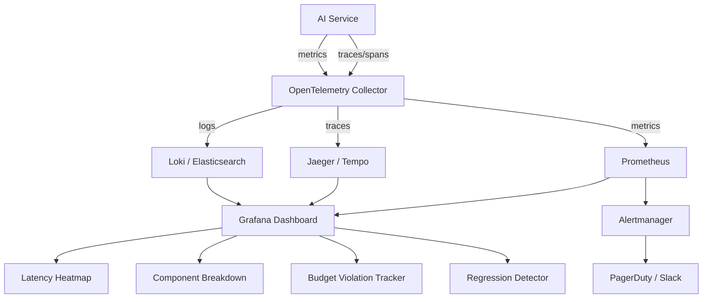
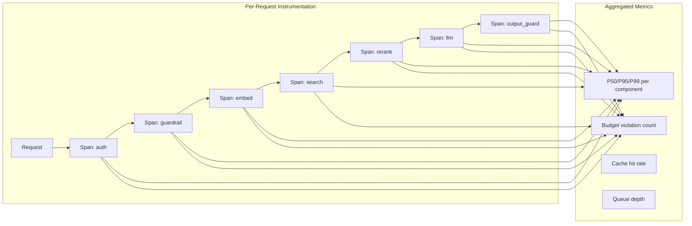

# Measuring and Monitoring AI System Latency

## What to Measure

### End-to-End Latency

The total time from user's perspective: request sent → response complete.

```
End-to-end = Network(request) + Processing + Network(response)

For streaming:
- E2E (first byte): request sent → first token received
- E2E (complete): request sent → last token received
- E2E (perceived): request sent → first token (what user "feels")
```

### Time to First Token (TTFT)

The most important metric for streaming AI applications.

```
TTFT = time from request received → first token generated

Components of TTFT:
- Queue wait time
- Input processing (guardrails, retrieval)
- LLM prefill (processing the prompt)

Why it matters:
- This is when the user STOPS waiting and STARTS reading
- Target: <500ms for conversational apps, <200ms for code completion
```

### Per-Component Latency

Where is time actually spent? Break down by component.

```
Measured per component:
- Duration (how long this step took)
- Queue time (how long waiting before this step started)
- Percentage of total (this component / total)

Example trace:
  auth:          12ms  (0.5%)
  input_guard:   85ms  (3.4%)
  embedding:     28ms  (1.1%)
  vector_search: 42ms  (1.7%)
  reranking:     67ms  (2.7%)
  assembly:       4ms  (0.2%)
  llm_prefill:  180ms  (7.2%)
  llm_decode:  2050ms (82.0%)
  output_guard:  25ms  (1.0%)
  network:       7ms   (0.3%)
  ─────────────────────────────
  total:       2500ms (100%)
```

### Queue Wait Time

How long before processing starts — indicator of capacity issues.

```
Healthy:    queue_wait < 10ms (immediate processing)
Concerning: queue_wait 50-200ms (approaching capacity)
Critical:   queue_wait > 500ms (overloaded, need to scale)

Measure:
- request_received_time - processing_start_time = queue_wait
```

### Inter-Token Latency (ITL)

How fast tokens stream — affects reading experience.

```
Target: 20-50ms between tokens (readable streaming speed)
Problem: >100ms between tokens (feels "stuttery")

Measure:
- Time between consecutive token emissions
- P50 ITL, P95 ITL, P99 ITL
- Spikes indicate GPU contention or batching delays
```

## How to Measure: OpenTelemetry

### Span Structure

One span per component, nested under a parent request span.

```python
from opentelemetry import trace

tracer = trace.get_tracer("ai-pipeline")

async def handle_request(query: str):
    with tracer.start_as_current_span("ai_request") as root_span:
        root_span.set_attribute("query.length", len(query))
        
        # Each component gets its own span
        with tracer.start_as_current_span("input_guardrails") as span:
            span.set_attribute("guardrail.type", "rule_based")
            result = await check_input(query)
            span.set_attribute("guardrail.passed", result.passed)
        
        with tracer.start_as_current_span("embedding") as span:
            span.set_attribute("model", "text-embedding-ada-002")
            embedding = await embed(query)
            span.set_attribute("embedding.dimensions", len(embedding))
        
        with tracer.start_as_current_span("vector_search") as span:
            span.set_attribute("index", "knowledge_base")
            span.set_attribute("top_k", 10)
            results = await search(embedding, top_k=10)
            span.set_attribute("results.count", len(results))
            span.set_attribute("results.max_score", results[0].score)
        
        with tracer.start_as_current_span("llm_generation") as span:
            span.set_attribute("model", "gpt-4")
            span.set_attribute("prompt.tokens", count_tokens(prompt))
            response = await generate(prompt)
            span.set_attribute("response.tokens", count_tokens(response))
            span.set_attribute("ttft_ms", response.ttft_ms)
```

### Key Span Attributes

```yaml
# Request-level attributes
ai.request.id: "req_abc123"
ai.request.type: "chat"  # chat, completion, embedding
ai.model.name: "gpt-4"
ai.model.provider: "openai"
ai.cache.hit: false
ai.routing.model_selected: "gpt-4"  # which model was routed to

# Token attributes
ai.tokens.prompt: 1500
ai.tokens.completion: 85
ai.tokens.total: 1585

# Latency attributes
ai.latency.ttft_ms: 180
ai.latency.total_ms: 2500
ai.latency.itl_p50_ms: 30
ai.latency.queue_wait_ms: 12

# Retrieval attributes
ai.retrieval.num_results: 10
ai.retrieval.reranked: true
ai.retrieval.top_score: 0.92

# Guardrail attributes
ai.guardrail.input.passed: true
ai.guardrail.input.method: "rule_based"
ai.guardrail.output.passed: true
ai.guardrail.output.flags: ["none"]
```

### Distributed Tracing

Trace a request across multiple services:

```
[Client] → [API Gateway] → [AI Orchestrator] → [Embedding Service]
                                              → [Vector DB]
                                              → [LLM Service]
                                              → [Guardrail Service]

Each service propagates trace context:
- trace_id: same across all services (links them together)
- span_id: unique per operation
- parent_span_id: creates the tree structure
```

```python
# Propagate context between services
from opentelemetry.propagate import inject, extract

# Client side: inject context into headers
headers = {}
inject(headers)
response = await http_client.post(url, headers=headers)

# Server side: extract context from headers
context = extract(request.headers)
with tracer.start_span("handle", context=context):
    ...
```

## Monitoring and Alerting

### Dashboard Metrics

```
PRIMARY DASHBOARD:
┌─────────────────────────────────────────────────┐
│  E2E Latency (P50, P95, P99) over time          │
│  ▁▂▂▃▃▃▃▄▅▅▅▆▅▅▄▃▃▂▂▁ ← time series graph    │
│  P50: 800ms | P95: 2400ms | P99: 4200ms        │
├─────────────────────────────────────────────────┤
│  TTFT (P50, P95, P99) over time                 │
│  ▁▁▁▂▂▂▂▂▃▃▃▃▂▂▂▂▁▁▁▁ ← time series graph    │
│  P50: 180ms | P95: 450ms | P99: 800ms          │
├─────────────────────────────────────────────────┤
│  Component Breakdown (stacked bar)              │
│  [Auth|Guard|Embed|Search|Rerank|LLM|Guard|Net] │
├─────────────────────────────────────────────────┤
│  Cache Hit Rate: 32%                            │
│  Model Routing: 58% small / 42% large           │
│  Queue Depth: 3 requests                        │
│  Budget Violations: 4.2% of requests            │
└─────────────────────────────────────────────────┘
```

### Alert Rules

```yaml
alerts:
  - name: "P95 latency exceeds SLO"
    condition: p95_latency > 3000ms for 5 minutes
    severity: warning
    action: page on-call

  - name: "P99 latency critical"
    condition: p99_latency > 6000ms for 3 minutes
    severity: critical
    action: page on-call + auto-scale

  - name: "TTFT degraded"
    condition: p95_ttft > 500ms for 5 minutes
    severity: warning
    action: notify team

  - name: "Component budget violation rate high"
    condition: budget_violation_rate > 10% for 5 minutes
    severity: warning
    action: identify violating component

  - name: "Queue depth high"
    condition: queue_depth > 50 for 2 minutes
    severity: critical
    action: auto-scale + load shed

  - name: "Cache hit rate dropped"
    condition: cache_hit_rate < 20% (was > 30%)
    severity: info
    action: investigate cache invalidation
```

### Component Budget Monitoring

```python
# Track budget violations per component
COMPONENT_BUDGETS = {
    "input_guardrails": 100,   # ms
    "embedding": 30,
    "vector_search": 50,
    "reranking": 70,
    "llm_generation": 2000,
    "output_guardrails": 100,
}

def check_budget(component: str, duration_ms: float):
    budget = COMPONENT_BUDGETS[component]
    if duration_ms > budget:
        metrics.increment(
            "budget_violation",
            tags={
                "component": component,
                "budget_ms": budget,
                "actual_ms": duration_ms,
                "overage_ms": duration_ms - budget,
                "overage_pct": (duration_ms - budget) / budget * 100,
            }
        )
```

## Latency Heatmap

Visualize latency patterns over time to find systemic issues.

```
LATENCY HEATMAP (Y=latency bucket, X=time of day):

5000ms+ │                    ░░░░
4000ms  │                   ░░░░░░
3000ms  │          ░       ░░░░░░░░
2000ms  │  ░░░░░░░░░░░░░░░░░░░░░░░░░░░░░░░
1000ms  │ ░░░░░░░░░░░░░░░░░░░░░░░░░░░░░░░░░
500ms   │░░░░░░░░░░░░░░░░░░░░░░░░░░░░░░░░░░
        └──────────────────────────────────────
         6am    9am    12pm    3pm    6pm    9pm

INSIGHT: Latency spikes at 2-4pm = peak traffic, need auto-scaling
```

## Regression Detection

Detect when a new deployment increases latency.

```
BEFORE deployment (baseline):
- P50: 800ms
- P95: 2400ms

AFTER deployment:
- P50: 950ms (+19%)  ← WARNING
- P95: 3200ms (+33%) ← ALERT

Detection method:
1. Compare current percentiles to 7-day rolling baseline
2. Alert if increase > 15% sustained for > 10 minutes
3. Automatic rollback if P95 > SLO for > 5 minutes
```

```python
def detect_regression(current_p95, baseline_p95, threshold_pct=15):
    increase_pct = (current_p95 - baseline_p95) / baseline_p95 * 100
    
    if increase_pct > threshold_pct:
        alert(
            severity="warning",
            message=f"Latency regression: P95 increased {increase_pct:.1f}%",
            current=current_p95,
            baseline=baseline_p95,
        )
        return True
    return False
```

## Capacity-Latency Relationship

As load increases, latency increases non-linearly.

```
LATENCY vs LOAD:

Latency
(ms)
  │
5000│                              ╱ ← overloaded (queueing)
    │                            ╱
3000│                          ╱
    │                        ╱
2000│─ ─ ─ ─ ─ ─ ─ ─ ─ ─ ╱─ ─ ─ ← SLO threshold
    │                    ╱
1000│───────────────────╱
    │  ← stable region
 500│─────────────────
    │
    └─────────────────────────────────
     0%   25%   50%   75%  90% 100%
                 Load (% capacity)

KEY INSIGHT:
- Below 70% capacity: latency is stable
- 70-85%: latency starts increasing
- 85-95%: latency increases rapidly (queueing theory)
- >95%: system is effectively down (everything queued)

RECOMMENDATION: Auto-scale at 70% capacity, not 90%
```

### Queueing Theory (Little's Law)

```
Average items in system (L) = Arrival rate (λ) × Average time in system (W)

As arrival rate approaches service rate:
- Queue length → infinity
- Wait time → infinity
- This is why latency explodes near capacity

Practical implication:
- Target 60-70% utilization for latency-sensitive systems
- Above 80% → latency becomes unpredictable
```

## Monitoring Architecture





## Practical Measurement Checklist

```
□ Every component has a traced span with timing
□ TTFT is measured separately from total latency
□ Percentiles (P50, P95, P99) are computed, not just averages
□ Cache hit/miss is tagged on every cacheable operation
□ Queue wait time is measured (received_time - start_time)
□ Model name and token counts are recorded per LLM call
□ Budget violations are counted and alerted on
□ Latency is broken down by: component, model, cache_hit, query_type
□ Baseline is maintained for regression detection
□ Load vs latency relationship is understood and monitored
□ Auto-scaling triggers are set below the latency degradation point
```

## Key Takeaways

1. **Measure TTFT, not just total latency** — it's what users perceive with streaming
2. **Use percentiles** — P95/P99 reveal problems averages hide
3. **Trace every component** — you can't optimize what you can't measure
4. **Budget violations are your early warning** — catch problems before users notice
5. **Load vs latency is non-linear** — scale BEFORE you hit the knee of the curve
6. **Heatmaps reveal patterns** — time-of-day, day-of-week, deployment correlations
7. **Automate regression detection** — don't rely on humans noticing slowness
