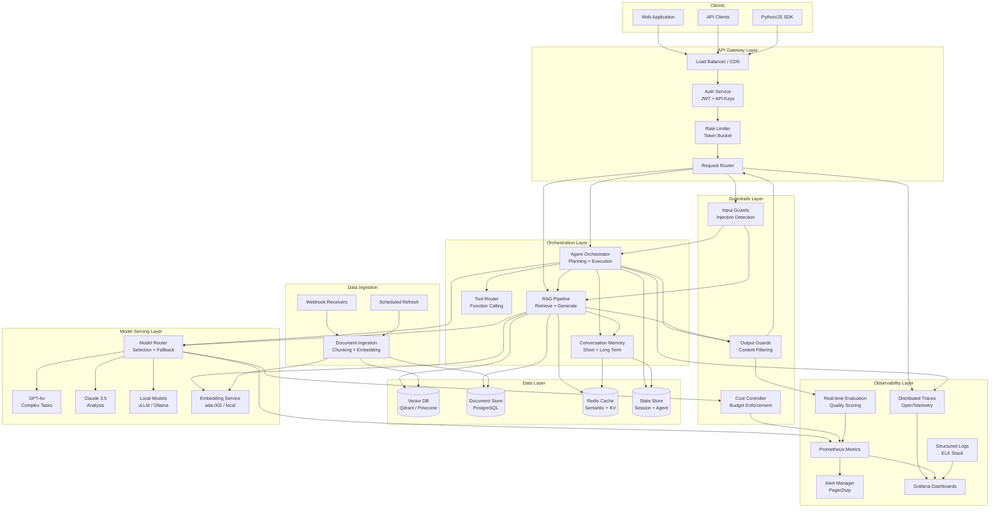
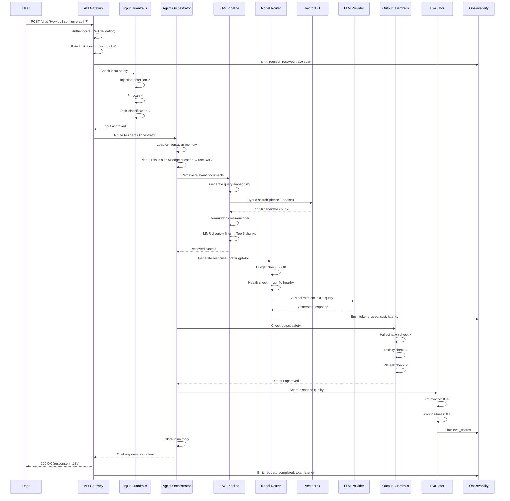

# System Architecture Walkthrough

## Presenting to the VP of Engineering

This document walks through the capstone enterprise AI system architecture as you would present it to senior technical leadership — clear, structured, and decision-oriented.

---

## Executive Summary

### What This System Does

An enterprise AI platform that provides:
- **Retrieval-Augmented Generation (RAG)** over company knowledge bases
- **Autonomous agent orchestration** with tool access and planning
- **Multi-model routing** with intelligent fallback and cost optimization
- **Production guardrails** ensuring safety, quality, and compliance

### Who It Serves

| Audience | Use Case |
|----------|----------|
| Internal engineers | Code assistance, documentation Q&A |
| Customer support | Automated ticket resolution, knowledge retrieval |
| Product teams | Data analysis, report generation |
| End users | Customer-facing AI features via API |

### Scale Parameters

- **Target**: 10K concurrent users, 1M requests/day
- **Latency SLA**: p95 < 2s for RAG, p95 < 5s for agent tasks
- **Availability**: 99.9% (8.7 hours downtime/year)
- **Cost budget**: $50K/month compute + inference

---

## Architecture Layers

The system follows a strict layered architecture with clear separation of concerns:

```
┌─────────────────────────────────────────────────────┐
│                   API Gateway Layer                   │
│         (Auth, Rate Limiting, Request Routing)        │
├─────────────────────────────────────────────────────┤
│                 Orchestration Layer                   │
│      (Agent Planning, Tool Routing, Memory)          │
├─────────────────────────────────────────────────────┤
│                 Model Serving Layer                   │
│    (Multi-Model Router, Inference, Fallback)         │
├─────────────────────────────────────────────────────┤
│                    Data Layer                         │
│   (Vector DB, Document Store, Cache, State)          │
├─────────────────────────────────────────────────────┤
│                Observability Layer                    │
│    (Metrics, Traces, Logs, Evaluation, Alerts)       │
└─────────────────────────────────────────────────────┘
```

### Design Principles

1. **Each layer only talks to adjacent layers** — no skip connections
2. **Every inter-service call has a timeout and fallback**
3. **State is externalized** — services are stateless and horizontally scalable
4. **Observability is not optional** — every component emits structured telemetry

---

## Full System Architecture Diagram



---

## Component Deep Dive

### 1. API Gateway

**Purpose**: Single entry point, security boundary, traffic management.

#### Rate Limiting

```python
class TokenBucketRateLimiter:
    """Per-user rate limiting with token bucket algorithm."""

    def __init__(self, redis_client):
        self.redis = redis_client

    async def check_rate_limit(self, user_id: str, tier: str) -> RateLimitResult:
        """
        Tier-based limits:
        - Free: 10 req/min, 100 req/day
        - Pro: 100 req/min, 10K req/day
        - Enterprise: 1000 req/min, unlimited daily
        """
        config = TIER_CONFIGS[tier]
        bucket_key = f"ratelimit:{user_id}:{current_minute()}"

        current = await self.redis.incr(bucket_key)
        await self.redis.expire(bucket_key, 60)

        if current > config.requests_per_minute:
            return RateLimitResult(
                allowed=False,
                retry_after=seconds_until_next_minute(),
                headers={
                    "X-RateLimit-Limit": str(config.requests_per_minute),
                    "X-RateLimit-Remaining": "0",
                    "X-RateLimit-Reset": str(next_minute_timestamp()),
                }
            )

        return RateLimitResult(allowed=True, remaining=config.requests_per_minute - current)
```

#### Authentication

- **API Keys**: For service-to-service communication
- **JWT tokens**: For user sessions (15-min access, 7-day refresh)
- **OAuth 2.0**: For third-party integrations
- **mTLS**: For internal service mesh communication

#### Routing Logic

```python
class RequestRouter:
    """Routes requests to appropriate orchestration service."""

    ROUTING_TABLE = {
        "chat": "agent_orchestrator",
        "search": "rag_pipeline",
        "embed": "embedding_service",
        "evaluate": "evaluation_service",
    }

    async def route(self, request: IncomingRequest) -> ServiceEndpoint:
        # Classify request type
        request_type = self.classify(request)

        # Check feature flags
        if not self.feature_flags.is_enabled(request_type, request.user):
            raise FeatureDisabledError(request_type)

        # Select service with health awareness
        service = self.ROUTING_TABLE[request_type]
        endpoint = await self.service_discovery.get_healthy_endpoint(service)

        return endpoint
```

---

### 2. RAG Pipeline

The retrieval-augmented generation pipeline handles knowledge-grounded responses.

#### Ingestion Phase

```python
class DocumentIngestionPipeline:
    """Processes documents into searchable vector representations."""

    async def ingest(self, document: Document) -> IngestionResult:
        # 1. Extract text from various formats
        text = await self.extractor.extract(document)  # PDF, DOCX, HTML, MD

        # 2. Chunk with overlap
        chunks = self.chunker.chunk(
            text,
            chunk_size=512,
            overlap=64,
            strategy="semantic"  # Not just character-based
        )

        # 3. Enrich chunks with metadata
        enriched = [
            Chunk(
                text=chunk.text,
                metadata={
                    "source": document.source,
                    "section": chunk.detected_section,
                    "timestamp": document.last_modified,
                    "doc_id": document.id,
                }
            )
            for chunk in chunks
        ]

        # 4. Generate embeddings (batched)
        embeddings = await self.embedding_service.embed_batch(
            [c.text for c in enriched],
            model="text-embedding-3-large"
        )

        # 5. Upsert to vector DB
        await self.vector_db.upsert(
            vectors=embeddings,
            metadata=[c.metadata for c in enriched],
            namespace=document.namespace
        )

        return IngestionResult(chunks_created=len(enriched), document_id=document.id)
```

#### Retrieval Phase

```python
class HybridRetriever:
    """Combines dense + sparse retrieval with reranking."""

    async def retrieve(self, query: str, context: RetrievalContext) -> list[RetrievedChunk]:
        # 1. Dense retrieval (semantic similarity)
        query_embedding = await self.embed(query)
        dense_results = await self.vector_db.search(
            vector=query_embedding,
            top_k=20,
            filter=context.metadata_filter,
            namespace=context.namespace
        )

        # 2. Sparse retrieval (keyword matching via BM25)
        sparse_results = await self.keyword_index.search(
            query=query,
            top_k=20,
            filter=context.metadata_filter
        )

        # 3. Reciprocal Rank Fusion
        fused = self.rrf_merge(dense_results, sparse_results, k=60)

        # 4. Rerank with cross-encoder
        reranked = await self.reranker.rerank(
            query=query,
            documents=fused[:20],
            model="cross-encoder/ms-marco-MiniLM-L-12-v2"
        )

        # 5. Apply diversity filter (avoid redundant chunks)
        diverse = self.mmr_filter(reranked, diversity=0.3)

        return diverse[:5]  # Top 5 diverse, relevant chunks
```

#### Generation Phase

```python
class RAGGenerator:
    """Generates responses grounded in retrieved context."""

    async def generate(self, query: str, chunks: list[RetrievedChunk], history: list) -> RAGResponse:
        # Build grounded prompt
        context_block = "\n---\n".join([
            f"[Source: {c.metadata['source']}]\n{c.text}"
            for c in chunks
        ])

        messages = [
            {"role": "system", "content": self.system_prompt(context_block)},
            *history[-10:],  # Last 10 turns
            {"role": "user", "content": query}
        ]

        # Generate with citation tracking
        response = await self.model_router.generate(
            messages=messages,
            model_preference="gpt-4o",
            max_tokens=1024,
            temperature=0.1  # Low temp for factual responses
        )

        # Extract and validate citations
        citations = self.citation_extractor.extract(response.text, chunks)

        return RAGResponse(
            text=response.text,
            citations=citations,
            chunks_used=chunks,
            confidence=self.calculate_confidence(response, chunks)
        )
```

---

### 3. Agent Orchestrator

**Purpose**: Execute multi-step tasks requiring planning, tool use, and memory.

#### Planning Engine

```python
class AgentOrchestrator:
    """ReAct-style agent with planning and tool execution."""

    async def execute(self, task: str, context: AgentContext) -> AgentResult:
        # Load relevant memory
        memories = await self.memory.recall(task, context.user_id)

        # Create execution plan
        plan = await self.planner.create_plan(
            task=task,
            available_tools=self.tool_registry.list(),
            memories=memories,
            constraints=context.constraints
        )

        # Execute plan steps with ReAct loop
        steps_executed = []
        max_steps = context.constraints.max_steps or 10

        for step_num in range(max_steps):
            # Think: decide next action
            thought = await self.reason(task, steps_executed, plan)

            if thought.action == "finish":
                break

            # Act: execute tool
            tool_result = await self.execute_tool(
                tool_name=thought.tool,
                parameters=thought.parameters,
                timeout=30
            )

            # Observe: record result
            steps_executed.append(Step(
                thought=thought,
                result=tool_result,
                timestamp=now()
            ))

            # Check guardrails after each step
            if not await self.guardrails.check_step(tool_result):
                return AgentResult(
                    status="blocked",
                    reason="Guardrail triggered",
                    steps=steps_executed
                )

        # Synthesize final response
        response = await self.synthesize(task, steps_executed)

        # Store execution in memory
        await self.memory.store(task, response, steps_executed, context.user_id)

        return AgentResult(status="complete", response=response, steps=steps_executed)
```

#### Tool Router

```python
class ToolRouter:
    """Routes agent tool calls to appropriate backends."""

    def __init__(self):
        self.tools = {
            "web_search": WebSearchTool(provider="tavily"),
            "code_execute": SandboxedCodeTool(runtime="e2b"),
            "database_query": ReadOnlyDBTool(connection_pool=pool),
            "api_call": AuthenticatedAPITool(credentials=vault),
            "file_read": ScopedFileReader(allowed_paths=config.paths),
            "calculator": CalculatorTool(),
            "rag_search": RAGSearchTool(pipeline=rag_pipeline),
        }

    async def execute_tool(self, name: str, params: dict, context: ToolContext) -> ToolResult:
        tool = self.tools.get(name)
        if not tool:
            return ToolResult(error=f"Unknown tool: {name}")

        # Permission check
        if not context.user_permissions.allows(name):
            return ToolResult(error=f"Permission denied for tool: {name}")

        # Execute with timeout and resource limits
        try:
            result = await asyncio.wait_for(
                tool.execute(**params),
                timeout=tool.max_execution_time
            )
            return ToolResult(success=True, data=result)
        except asyncio.TimeoutError:
            return ToolResult(error=f"Tool {name} timed out after {tool.max_execution_time}s")
        except ToolExecutionError as e:
            return ToolResult(error=str(e), retryable=e.retryable)
```

#### Memory System

```python
class ConversationMemory:
    """Manages short-term and long-term agent memory."""

    async def recall(self, query: str, user_id: str) -> MemoryContext:
        # Short-term: recent conversation (Redis)
        recent = await self.cache.get(f"conversation:{user_id}")

        # Long-term: semantic search over past interactions
        relevant_memories = await self.vector_db.search(
            vector=await self.embed(query),
            filter={"user_id": user_id},
            top_k=5,
            namespace="memories"
        )

        # Working memory: current task state
        working = await self.state_store.get(f"working:{user_id}")

        return MemoryContext(
            recent_messages=recent[-20:] if recent else [],
            relevant_past=relevant_memories,
            working_state=working
        )

    async def store(self, task: str, response: str, steps: list, user_id: str):
        # Summarize interaction for long-term storage
        summary = await self.summarizer.summarize(task, response, steps)

        # Store in vector DB for future recall
        embedding = await self.embed(summary)
        await self.vector_db.upsert(
            vectors=[embedding],
            metadata=[{"user_id": user_id, "task": task, "timestamp": now()}],
            namespace="memories"
        )
```

---

### 4. Model Router

**Purpose**: Intelligent selection among multiple LLMs based on task, cost, and availability.

```python
class ModelRouter:
    """Selects optimal model based on task characteristics."""

    MODEL_CATALOG = {
        "gpt-4o": ModelConfig(
            cost_per_1k_input=0.005,
            cost_per_1k_output=0.015,
            max_context=128000,
            latency_p50_ms=800,
            capabilities=["reasoning", "coding", "analysis", "vision"],
            provider="openai"
        ),
        "claude-3-5-sonnet": ModelConfig(
            cost_per_1k_input=0.003,
            cost_per_1k_output=0.015,
            max_context=200000,
            latency_p50_ms=600,
            capabilities=["reasoning", "coding", "analysis", "long_context"],
            provider="anthropic"
        ),
        "gpt-4o-mini": ModelConfig(
            cost_per_1k_input=0.00015,
            cost_per_1k_output=0.0006,
            max_context=128000,
            latency_p50_ms=300,
            capabilities=["general", "classification", "extraction"],
            provider="openai"
        ),
        "local-llama-70b": ModelConfig(
            cost_per_1k_input=0.0,  # Self-hosted
            cost_per_1k_output=0.0,
            max_context=8192,
            latency_p50_ms=1500,
            capabilities=["general", "classification"],
            provider="local"
        ),
    }

    async def select_model(self, request: ModelRequest) -> str:
        """Select best model for the request."""
        candidates = self._filter_capable(request.required_capabilities)
        candidates = self._filter_context_window(candidates, request.total_tokens)

        # Check budget
        budget_remaining = await self.cost_controller.get_remaining_budget(request.user_id)
        if budget_remaining < self._estimate_cost(candidates[0], request):
            candidates = self._filter_by_cost(candidates, budget_remaining, request)

        # Check health
        healthy = [m for m in candidates if await self.health_checker.is_healthy(m)]

        if not healthy:
            raise AllModelsUnavailableError(candidates)

        # Score by preference: quality > latency > cost (configurable)
        scored = sorted(healthy, key=lambda m: self._score(m, request), reverse=True)

        return scored[0]

    async def generate_with_fallback(self, request: ModelRequest) -> ModelResponse:
        """Generate with automatic fallback on failure."""
        models_to_try = self._get_fallback_chain(request)

        for model_name in models_to_try:
            try:
                response = await self._call_model(model_name, request)
                return response
            except (ModelOverloadedError, ModelTimeoutError) as e:
                logger.warning(f"Model {model_name} failed: {e}, trying next")
                continue
            except ModelContentFilterError:
                # Don't retry content filter — it will fail on all models
                raise

        raise AllModelsFailed(models_tried=models_to_try)
```

---

### 5. Guardrails

**Purpose**: Protect against adversarial inputs and unsafe outputs.

```python
class GuardrailsPipeline:
    """Input and output protection layer."""

    async def check_input(self, user_input: str, context: RequestContext) -> GuardrailResult:
        checks = await asyncio.gather(
            self.injection_detector.check(user_input),
            self.pii_detector.check(user_input),
            self.topic_classifier.check(user_input, blocked_topics=context.policy.blocked),
            self.token_counter.check(user_input, max_tokens=context.policy.max_input),
        )

        failures = [c for c in checks if not c.passed]

        if failures:
            return GuardrailResult(
                passed=False,
                blocked_reason=failures[0].reason,
                all_checks=checks
            )

        # Sanitize (remove PII if policy requires)
        sanitized = await self.pii_detector.redact(user_input) if context.policy.redact_pii else user_input

        return GuardrailResult(passed=True, sanitized_input=sanitized)

    async def check_output(self, output: str, context: RequestContext) -> GuardrailResult:
        checks = await asyncio.gather(
            self.hallucination_detector.check(output, context.source_chunks),
            self.toxicity_detector.check(output),
            self.pii_detector.check(output),
            self.brand_safety.check(output, guidelines=context.policy.brand_guidelines),
        )

        failures = [c for c in checks if not c.passed]

        if failures:
            # Try auto-remediation for certain failure types
            if all(f.remediable for f in failures):
                remediated = await self.remediator.fix(output, failures)
                return GuardrailResult(passed=True, modified_output=remediated, was_remediated=True)

            return GuardrailResult(passed=False, blocked_reason=failures[0].reason)

        return GuardrailResult(passed=True, output=output)
```

---

### 6. Evaluation System

**Purpose**: Real-time quality monitoring of AI outputs.

```python
class RealTimeEvaluator:
    """Scores every response on multiple quality dimensions."""

    async def evaluate(self, request: str, response: str, context: EvalContext) -> EvalResult:
        scores = await asyncio.gather(
            self.relevance_scorer.score(request, response),
            self.groundedness_scorer.score(response, context.source_chunks),
            self.coherence_scorer.score(response),
            self.helpfulness_scorer.score(request, response),
        )

        eval_result = EvalResult(
            relevance=scores[0],
            groundedness=scores[1],
            coherence=scores[2],
            helpfulness=scores[3],
            overall=sum(s.value for s in scores) / len(scores),
            timestamp=now(),
            request_id=context.request_id
        )

        # Emit metrics
        self.metrics.record_eval(eval_result)

        # Alert if quality drops below threshold
        if eval_result.overall < self.alert_threshold:
            await self.alerter.fire(
                severity="warning",
                message=f"Response quality below threshold: {eval_result.overall:.2f}",
                context={"request_id": context.request_id}
            )

        return eval_result
```

---

### 7. Cost Controller

**Purpose**: Enforce budgets, track spend, prevent cost overruns.

```python
class CostController:
    """Real-time cost tracking and budget enforcement."""

    async def check_budget(self, user_id: str, estimated_cost: float) -> BudgetDecision:
        # Get current spend
        current_spend = await self.get_current_spend(user_id, period="monthly")
        budget_limit = await self.get_budget_limit(user_id)

        remaining = budget_limit - current_spend

        if estimated_cost > remaining:
            # Check if we can downgrade model instead of blocking
            cheaper_alternative = self.suggest_cheaper_model(estimated_cost, remaining)
            if cheaper_alternative:
                return BudgetDecision(
                    allowed=True,
                    action="downgrade",
                    suggested_model=cheaper_alternative
                )
            return BudgetDecision(allowed=False, reason="Budget exceeded", remaining=remaining)

        # Warn at 80% utilization
        utilization = current_spend / budget_limit
        warning = utilization > 0.8

        return BudgetDecision(allowed=True, warning=warning, utilization=utilization)

    async def record_usage(self, request_id: str, model: str, tokens_in: int, tokens_out: int):
        cost = self.calculate_cost(model, tokens_in, tokens_out)

        await self.store.record(UsageRecord(
            request_id=request_id,
            model=model,
            tokens_in=tokens_in,
            tokens_out=tokens_out,
            cost=cost,
            timestamp=now()
        ))

        # Update running totals (atomic increment)
        await self.redis.incrbyfloat(f"spend:{request_id.user_id}:monthly", cost)
```

---

## End-to-End Request Flow

Tracing a single user request through the entire system:



### Latency Breakdown

| Step | Target | Typical |
|------|--------|---------|
| Auth + Rate Limit | < 5ms | 2ms |
| Input Guardrails | < 50ms | 30ms |
| Embedding Generation | < 100ms | 60ms |
| Vector Search | < 50ms | 25ms |
| Reranking | < 200ms | 150ms |
| LLM Generation | < 1500ms | 1000ms |
| Output Guardrails | < 100ms | 70ms |
| Evaluation | < 200ms | 150ms (async) |
| **Total** | **< 2000ms** | **~1400ms** |

---

## Scaling Characteristics

| Component | Scaling Strategy | Bottleneck |
|-----------|-----------------|------------|
| API Gateway | Horizontal (stateless) | Network bandwidth |
| Agent Orchestrator | Horizontal (state in Redis) | Memory per session |
| RAG Pipeline | Horizontal + read replicas | Vector DB query throughput |
| Model Router | Horizontal (stateless) | Provider API rate limits |
| Vector DB | Sharding + replicas | Write throughput during ingestion |
| Cache (Redis) | Cluster mode | Memory capacity |
| Embedding Service | GPU scaling | GPU availability |
| Guardrails | Horizontal (stateless) | ML model inference |

---

## Failure Modes and Recovery

| Component | Failure Mode | Detection | Recovery |
|-----------|-------------|-----------|----------|
| API Gateway | Overload | 5xx rate > 1% | Auto-scale + shed load |
| LLM Provider | Rate limit / outage | 429/503 status | Fallback to secondary model |
| Vector DB | Query timeout | p99 > 500ms | Serve from cache, degrade to keyword search |
| Redis Cache | Node failure | Health check miss | Failover to replica, rebuild |
| Agent Orchestrator | Infinite loop | Step count > max | Force terminate, return partial |
| Embedding Service | GPU OOM | Error rate spike | Queue + batch, scale GPU |
| Guardrails | False positive spike | Block rate > 10% | Alert + manual review, loosen threshold |

### Circuit Breaker Pattern

```python
class CircuitBreaker:
    CLOSED = "closed"      # Normal operation
    OPEN = "open"          # Failing, reject immediately
    HALF_OPEN = "half_open"  # Testing recovery

    def __init__(self, failure_threshold=5, recovery_timeout=30):
        self.state = self.CLOSED
        self.failure_count = 0
        self.failure_threshold = failure_threshold
        self.recovery_timeout = recovery_timeout
        self.last_failure_time = None

    async def call(self, func, *args, **kwargs):
        if self.state == self.OPEN:
            if time_since(self.last_failure_time) > self.recovery_timeout:
                self.state = self.HALF_OPEN
            else:
                raise CircuitOpenError()

        try:
            result = await func(*args, **kwargs)
            self._on_success()
            return result
        except Exception as e:
            self._on_failure()
            raise

    def _on_failure(self):
        self.failure_count += 1
        self.last_failure_time = now()
        if self.failure_count >= self.failure_threshold:
            self.state = self.OPEN

    def _on_success(self):
        self.failure_count = 0
        self.state = self.CLOSED
```

---

## Technology Choices and Rationale

| Choice | Why | Alternatives Considered |
|--------|-----|------------------------|
| FastAPI | Async-native, OpenAPI docs, type safety | Flask (no async), Django (too heavy) |
| Redis | Sub-ms latency, pub/sub, Lua scripting | Memcached (no persistence) |
| Qdrant | Open-source, filtering, payload storage | Pinecone (vendor lock), Weaviate (heavier) |
| PostgreSQL | ACID, JSONB, mature ecosystem | MongoDB (consistency issues at scale) |
| OpenTelemetry | Vendor-neutral, W3C standard | Datadog SDK (vendor lock-in) |
| Kubernetes | Auto-scaling, service mesh, declarative | ECS (AWS-only), bare metal (ops burden) |
| gpt-4o + Claude | Best quality, complementary strengths | Single provider (no fallback) |
| vLLM | Fastest open-source inference | TGI (slower), Ollama (no batching) |

---

## What a Staff Architect Would Do Differently at 100x Scale

At 100x current scale (100M requests/day), fundamental architecture changes are needed:

### 1. Event-Driven Architecture
Replace synchronous request-response with event streaming (Kafka). Components become consumers processing events asynchronously.

### 2. Dedicated Inference Fleet
Move from API providers to self-hosted GPU clusters with custom-optimized models. 100x scale justifies the infrastructure investment.

### 3. Multi-Region Active-Active
Deploy full stack in 3+ regions with global load balancing. Vector DB becomes eventually consistent with conflict resolution.

### 4. Tiered Storage
Hot/warm/cold tiers for vector data. Only frequently accessed documents in high-performance vector DB; rest in cheaper object storage with on-demand loading.

### 5. Custom Model Distillation
Train smaller, faster models that replicate GPT-4 quality for your specific domain. Reduce latency by 10x and cost by 100x for common queries.

### 6. Predictive Scaling
ML-based autoscaling that predicts traffic 15 minutes ahead based on historical patterns, not just reactive CPU metrics.

### 7. Separate Read/Write Paths (CQRS)
Ingestion pipeline completely decoupled from query serving. Different optimization strategies for each path.

### 8. Edge Inference
Deploy small models at CDN edge for classification, routing, and simple queries. Only complex requests reach origin.

---

## Summary

This architecture balances:
- **Quality**: Multi-model with evaluation ensures high-quality outputs
- **Reliability**: Fallbacks and circuit breakers at every level
- **Cost**: Budget enforcement prevents runaway spend
- **Security**: Defense-in-depth with input/output guardrails
- **Observability**: Full request tracing from ingress to response

The key insight: **every component is independently scalable, replaceable, and observable**. No single failure cascades to total system outage. This is what production-grade AI infrastructure looks like.
