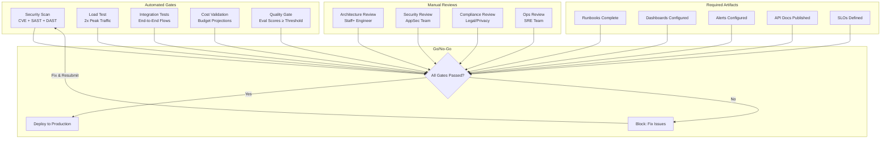

# Production Readiness Checklist

## The Definitive Gate Before Going Live

This checklist represents the minimum bar for deploying an enterprise AI system to production. Every item must be explicitly verified — not assumed.

---

## Security Checklist (20 Items)

### Authentication & Authorization

- [ ] **SEC-01**: All API endpoints require authentication (no anonymous access to AI endpoints)
- [ ] **SEC-02**: JWT tokens have short expiry (≤ 15 minutes) with refresh token rotation
- [ ] **SEC-03**: API keys are scoped to minimum required permissions (read-only, specific namespaces)
- [ ] **SEC-04**: Role-based access control (RBAC) enforced at orchestration layer
- [ ] **SEC-05**: Service-to-service communication uses mTLS or signed tokens

### Injection & Adversarial Protection

- [ ] **SEC-06**: Prompt injection detection active on all user inputs
- [ ] **SEC-07**: System prompts are not extractable via user queries (tested with known attacks)
- [ ] **SEC-08**: Tool calls are parameterized — no raw string interpolation into commands
- [ ] **SEC-09**: SQL/NoSQL injection protection on all database-accessing tools
- [ ] **SEC-10**: File path traversal prevention on any file-reading tools

### Data Protection

- [ ] **SEC-11**: All data encrypted at rest (AES-256 or equivalent)
- [ ] **SEC-12**: All data encrypted in transit (TLS 1.3, no fallback to 1.1)
- [ ] **SEC-13**: PII detection and redaction active on inputs and outputs
- [ ] **SEC-14**: User data isolated by tenant (no cross-tenant data leakage in RAG)
- [ ] **SEC-15**: Vector embeddings cannot be reversed to recover original text (validated)

### Secrets & Infrastructure

- [ ] **SEC-16**: All secrets in vault (HashiCorp Vault, AWS Secrets Manager) — none in env vars or code
- [ ] **SEC-17**: API keys to LLM providers rotated on schedule (≤ 90 days)
- [ ] **SEC-18**: Container images scanned for vulnerabilities (no critical/high CVEs)
- [ ] **SEC-19**: Network policies restrict pod-to-pod communication to declared dependencies
- [ ] **SEC-20**: Audit log captures all administrative actions and data access

---

## Reliability Checklist (15 Items)

### Circuit Breakers & Fallbacks

- [ ] **REL-01**: Circuit breaker on every external API call (LLM providers, vector DB, cache)
- [ ] **REL-02**: Fallback model chain configured and tested (primary → secondary → local)
- [ ] **REL-03**: Graceful degradation defined for each component failure
- [ ] **REL-04**: Timeout configured for every network call (no unbounded waits)
- [ ] **REL-05**: Retry logic with exponential backoff and jitter (no thundering herd)

### Health & Availability

- [ ] **REL-06**: Liveness probe: process is running and responsive
- [ ] **REL-07**: Readiness probe: dependencies are connected and service can handle requests
- [ ] **REL-08**: Startup probe: warm-up complete (models loaded, caches primed)
- [ ] **REL-09**: Health check dashboard shows real-time status of all components
- [ ] **REL-10**: Minimum 2 replicas for every stateless service in production

### Failure Handling

- [ ] **REL-11**: Partial responses returned when some (non-critical) components fail
- [ ] **REL-12**: Queue-based processing for non-real-time tasks (ingestion, evaluation)
- [ ] **REL-13**: Dead letter queue for failed async tasks with retry mechanism
- [ ] **REL-14**: Data durability: vector DB and document store have automated backups
- [ ] **REL-15**: Chaos testing performed: random component shutdown doesn't cause cascade

---

## Observability Checklist (15 Items)

### Logging

- [ ] **OBS-01**: Structured JSON logging on all services (not plain text)
- [ ] **OBS-02**: Request ID propagated through all service calls (correlation)
- [ ] **OBS-03**: Log levels appropriate: no DEBUG in production, errors include context
- [ ] **OBS-04**: Sensitive data (tokens, PII) never appears in logs
- [ ] **OBS-05**: Log retention policy configured (30 days hot, 90 days warm, 1 year cold)

### Metrics

- [ ] **OBS-06**: RED metrics for every service (Rate, Errors, Duration)
- [ ] **OBS-07**: Token usage tracked per model, per user, per endpoint
- [ ] **OBS-08**: Cost metrics updated in real-time (not batch)
- [ ] **OBS-09**: Quality metrics from evaluation system exported to dashboards
- [ ] **OBS-10**: Custom business metrics: queries/user, RAG hit rate, agent success rate

### Tracing & Dashboards

- [ ] **OBS-11**: Distributed tracing (OpenTelemetry) spans entire request lifecycle
- [ ] **OBS-12**: Trace includes: model used, tokens consumed, retrieval results, tool calls
- [ ] **OBS-13**: Dashboard: system health overview (SLI/SLO status)
- [ ] **OBS-14**: Dashboard: AI quality metrics (relevance, groundedness, hallucination rate)
- [ ] **OBS-15**: Alerts configured with appropriate severity and routing (PagerDuty/Slack)

---

## Performance Checklist (10 Items)

- [ ] **PERF-01**: p50 latency < 1s for simple RAG queries
- [ ] **PERF-02**: p95 latency < 2s for RAG, < 5s for agent tasks
- [ ] **PERF-03**: p99 latency < 5s for RAG, < 15s for agent tasks
- [ ] **PERF-04**: Semantic cache hit rate > 30% (reduces LLM calls)
- [ ] **PERF-05**: Vector search returns results in < 50ms at current data volume
- [ ] **PERF-06**: Load tested at 2x expected peak traffic — no errors
- [ ] **PERF-07**: Load tested at 5x expected peak — graceful degradation (no crash)
- [ ] **PERF-08**: Autoscaling tested: scales up within 60s of load increase
- [ ] **PERF-09**: Cold start time < 30s for new pod instances
- [ ] **PERF-10**: Memory usage stable under sustained load (no leaks over 24h test)

---

## Cost Checklist (10 Items)

- [ ] **COST-01**: Per-user budget caps configured and enforced in real-time
- [ ] **COST-02**: Organization-level monthly budget cap with alerts at 50%, 80%, 95%
- [ ] **COST-03**: Cost attribution: can break down spend by user, team, feature, model
- [ ] **COST-04**: Semantic caching reduces LLM API calls by ≥ 30%
- [ ] **COST-05**: Model routing sends simple queries to cheaper models (≥ 60% of traffic)
- [ ] **COST-06**: Embedding generation batched (not one-at-a-time API calls)
- [ ] **COST-07**: Idle GPU/compute scales to zero (or minimum) during off-peak
- [ ] **COST-08**: Token limits enforced on inputs (prevent 100K token queries consuming budget)
- [ ] **COST-09**: Cost projections validated: actual spend within 20% of forecast
- [ ] **COST-10**: Runaway cost kill switch: automatic shutdown if hourly spend exceeds 10x normal

---

## Compliance Checklist (10 Items)

- [ ] **COMP-01**: Data retention policy implemented (auto-delete after configured period)
- [ ] **COMP-02**: User data deletion ("right to be forgotten") works end-to-end including vectors
- [ ] **COMP-03**: Audit log immutable and tamper-evident (append-only, checksummed)
- [ ] **COMP-04**: Data residency: user data stays in declared geographic region
- [ ] **COMP-05**: Model provider data usage: verified no training on our data (API ToS confirmed)
- [ ] **COMP-06**: Content filtering meets regulatory requirements for your industry
- [ ] **COMP-07**: Bias testing performed on model outputs for protected characteristics
- [ ] **COMP-08**: Human-in-the-loop available for high-stakes decisions
- [ ] **COMP-09**: Model card / system card documents capabilities and limitations
- [ ] **COMP-10**: Terms of service clearly state AI involvement to end users

---

## Operational Checklist (10 Items)

- [ ] **OPS-01**: Runbook exists for every alert that can fire
- [ ] **OPS-02**: On-call rotation defined with clear escalation path
- [ ] **OPS-03**: Incident response process documented and practiced (tabletop exercise done)
- [ ] **OPS-04**: Deployment is zero-downtime (rolling update, blue-green, or canary)
- [ ] **OPS-05**: Rollback tested: can revert to previous version in < 5 minutes
- [ ] **OPS-06**: Feature flags control new AI capabilities (gradual rollout possible)
- [ ] **OPS-07**: Capacity planning documented: when to scale, cost of scaling
- [ ] **OPS-08**: Dependency inventory: all external services listed with SLA and alternatives
- [ ] **OPS-09**: Disaster recovery tested: full system restore from backup validated
- [ ] **OPS-10**: Post-incident review (blameless) process established

---

## Production Readiness Gate Architecture



---

## Go/No-Go Decision Framework

### Hard Blockers (Any one blocks deployment)

| Category | Blocker Condition |
|----------|-------------------|
| Security | Any critical/high vulnerability unpatched |
| Security | Prompt injection protection not verified |
| Reliability | No fallback for LLM provider failure |
| Reliability | Single point of failure exists |
| Compliance | Data residency violation |
| Compliance | No user data deletion capability |
| Cost | No budget enforcement mechanism |
| Ops | No rollback procedure tested |

### Soft Blockers (Require explicit VP sign-off to override)

| Category | Condition |
|----------|-----------|
| Performance | p95 latency exceeds SLA by < 20% |
| Quality | Eval scores below target but above minimum |
| Observability | Dashboard incomplete but alerts configured |
| Cost | Projections exceed budget by < 15% |
| Ops | Runbooks exist but not tabletop-tested |

### Acceptable Risks (Document and proceed)

| Category | Condition |
|----------|-----------|
| Performance | Cold start latency on first request after scale-up |
| Quality | Edge case quality issues with plan to address in v1.1 |
| Cost | Cost optimization opportunities identified but not yet implemented |

---

## Staff Deliverable: Production Readiness Review Document

```markdown
# Production Readiness Review: [System Name]

## Review Date: [Date]
## Reviewers: [Names and Roles]
## Decision: [GO / NO-GO / CONDITIONAL GO]

---

## 1. System Overview
- Purpose:
- Users:
- Scale (current):
- Scale (projected 6 months):

## 2. Architecture Summary
[Link to architecture doc]

## 3. SLOs
| Metric | Target | Current Measurement |
|--------|--------|---------------------|
| Availability | 99.9% | [measured] |
| p95 Latency | < 2s | [measured] |
| Error Rate | < 0.1% | [measured] |
| Quality Score | > 0.85 | [measured] |

## 4. Checklist Status

| Category | Items | Passed | Failed | Waived |
|----------|-------|--------|--------|--------|
| Security | 20 | | | |
| Reliability | 15 | | | |
| Observability | 15 | | | |
| Performance | 10 | | | |
| Cost | 10 | | | |
| Compliance | 10 | | | |
| Operational | 10 | | | |
| **Total** | **90** | | | |

## 5. Open Risks

| Risk | Severity | Mitigation | Owner | Due Date |
|------|----------|------------|-------|----------|
| | | | | |

## 6. Dependencies

| Dependency | SLA | Fallback | Last Tested |
|------------|-----|----------|-------------|
| | | | |

## 7. Rollback Plan
- Trigger criteria:
- Rollback steps:
- Expected rollback time:
- Data implications:

## 8. Launch Plan
- Canary %:
- Canary duration:
- Success criteria for full rollout:
- Kill switch location:

## 9. Post-Launch Monitoring
- First 24h: [who watches what]
- First week: [review cadence]
- First month: [optimization targets]

## 10. Sign-offs

| Role | Name | Decision | Date |
|------|------|----------|------|
| Engineering Lead | | | |
| SRE Lead | | | |
| Security | | | |
| Product Owner | | | |
| VP Engineering | | | |
```

---

## Using This Checklist

### For Individual Contributors
Work through each section methodically. If an item doesn't apply, document *why* it doesn't apply rather than skipping it. "Not applicable because we don't store PII" is a valid answer. A blank checkbox is not.

### For Tech Leads
Review the checklist with your team before the formal PRR. Assign owners to each section. Track progress in your sprint board.

### For Staff+ Engineers
Use this as the foundation for your PRR document. Add system-specific items. Challenge any waived items — the waiver should require more justification than the implementation.

### For Engineering Managers
This checklist is your risk register. Every unchecked item is a risk you're accepting. Make that acceptance explicit and documented.

---

## Anti-Patterns: What "Not Production Ready" Looks Like

| Symptom | Root Cause | Fix |
|---------|-----------|-----|
| "It works on my machine" | No load testing | PERF-06, PERF-07 |
| "We'll add monitoring later" | Observability as afterthought | OBS-01 through OBS-15 |
| "The LLM handles safety" | No independent guardrails | SEC-06 through SEC-10 |
| "We trust the provider" | No fallback strategy | REL-01 through REL-05 |
| "Cost is fine for now" | No budget enforcement | COST-01, COST-10 |
| "Users won't do that" | No adversarial testing | SEC-06, SEC-07 |
| "We'll fix it if it breaks" | No runbooks or on-call | OPS-01, OPS-02 |

---

## Summary

90 items. Zero shortcuts. This is the difference between a demo and a production system. Every item exists because a real production incident taught someone it was necessary.

The goal isn't to check boxes — it's to build confidence that your system won't wake someone up at 3 AM, won't leak customer data, won't generate a surprise $100K bill, and won't produce harmful outputs. That confidence comes from verification, not assumption.
