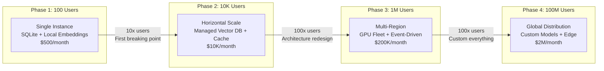
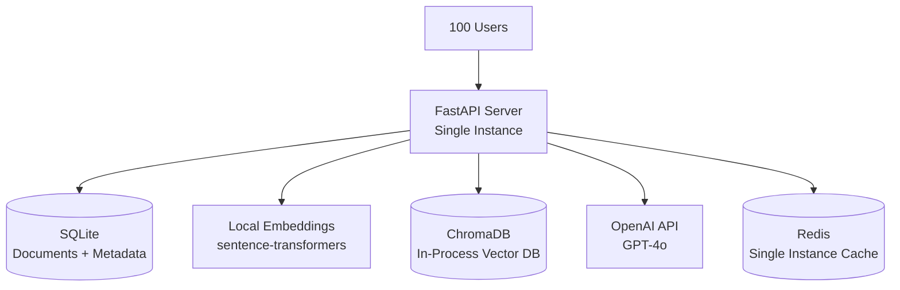
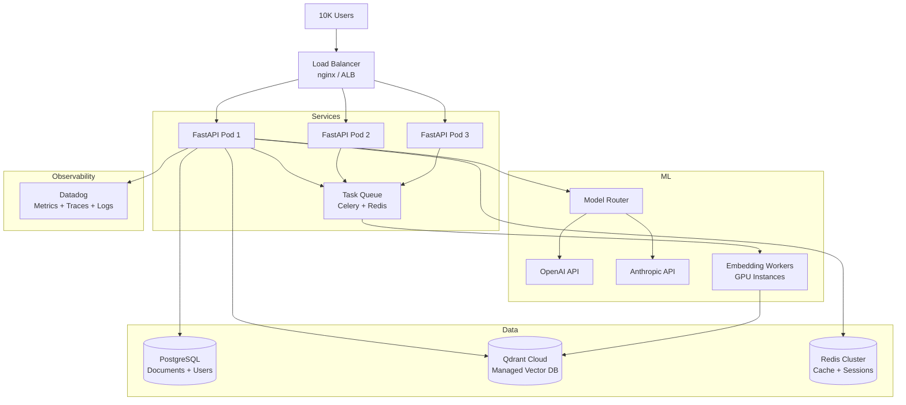
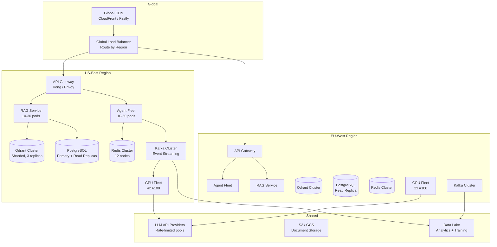
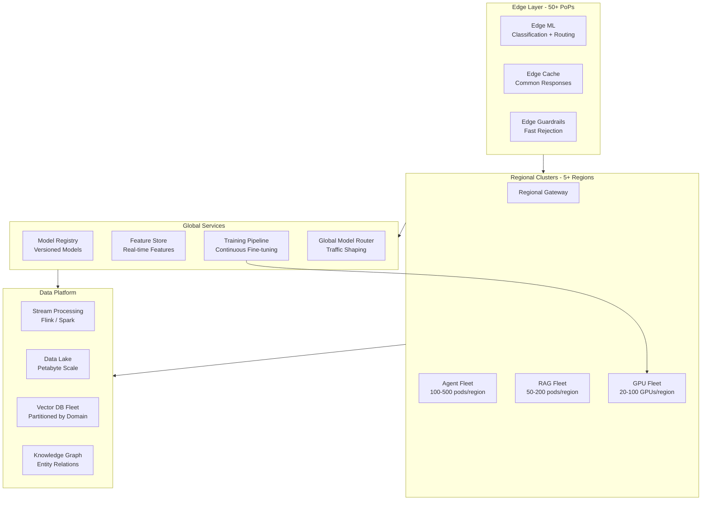

# Scaling Roadmap

## From Demo to Billion-Request Production

This document maps the journey from a single-instance prototype to a globally distributed AI platform, identifying what changes at each phase, what breaks, and what a Staff architect's role becomes.

---

## Scaling Progression Overview

---

## Phase 1: Proof of Concept (100 Users)

### Target Scale
- 100 daily active users
- ~1,000 requests/day
- Single geographic region
- 1-2 engineers

### Architecture

### Technology Stack

| Component | Choice | Why |
|-----------|--------|-----|
| API Server | FastAPI (single process) | Simple, fast to develop |
| Database | SQLite | Zero ops, good enough for 100 users |
| Vector DB | ChromaDB (in-process) | No separate service needed |
| Embeddings | sentence-transformers (local) | Free, low latency |
| LLM | OpenAI API (GPT-4o) | Best quality, pay-per-use |
| Cache | Redis (single instance) | Simple semantic cache |
| Deployment | Single VM or Railway | One command deploy |

### Cost Breakdown

| Item | Monthly Cost |
|------|-------------|
| Compute (1 VM, 4 CPU, 16GB RAM) | $80 |
| OpenAI API (~30K requests) | $300 |
| Redis (small instance) | $20 |
| Storage (50GB) | $10 |
| **Total** | **~$500** |

### What Works at This Scale
- Single process handles all requests
- SQLite handles concurrent reads fine
- In-process vector DB means zero network latency for retrieval
- No need for load balancing, service discovery, or orchestration
- One engineer can operate everything

### What You're Sacrificing
- No high availability (single instance = single point of failure)
- No horizontal scaling
- Limited to one machine's memory for embeddings
- No multi-tenancy isolation

---

## Phase 2: Growth Stage (10K Users)

### Target Scale
- 10,000 daily active users
- ~100,000 requests/day
- Single region, multi-AZ
- 3-5 engineers

### Architecture

### Key Changes from Phase 1

| Component | Phase 1 | Phase 2 | Why Change |
|-----------|---------|---------|------------|
| Database | SQLite | PostgreSQL | Concurrent writes, ACID, JSON support |
| Vector DB | ChromaDB (in-process) | Qdrant Cloud | Separate scaling, persistence, filtering |
| Embeddings | Local (in-process) | Dedicated GPU workers | Don't block API servers |
| Deployment | Single VM | Kubernetes (3+ pods) | Horizontal scaling, health management |
| Cache | Single Redis | Redis Cluster | HA, more memory capacity |
| LLM | Single provider | Multi-provider with fallback | Reliability, cost optimization |
| Observability | Log files | Datadog (managed) | Team needs dashboards and alerts |

### Cost Breakdown

| Item | Monthly Cost |
|------|-------------|
| Kubernetes cluster (3 nodes) | $1,500 |
| PostgreSQL (managed, multi-AZ) | $500 |
| Qdrant Cloud (managed) | $800 |
| Redis Cluster | $300 |
| LLM APIs (~300K requests) | $5,000 |
| GPU instances (embedding workers) | $1,500 |
| Observability (Datadog) | $500 |
| **Total** | **~$10K** |

### Breaking Points Addressed
- **SQLite write contention** → PostgreSQL with connection pooling
- **Single instance failure** → Multiple pods behind load balancer
- **Embedding blocking requests** → Async workers with queue
- **No observability** → Full metrics, traces, and alerts

### New Challenges Introduced
- Distributed system complexity (network partitions, consistency)
- Need for CI/CD pipeline and deployment automation
- Cache invalidation across multiple pods
- Cost management becomes a concern

---

## Phase 3: Scale Stage (1M Users)

### Target Scale
- 1,000,000 daily active users
- ~10,000,000 requests/day
- Multi-region (2-3 regions)
- 15-25 engineers (platform team + feature teams)

### Architecture

### Key Changes from Phase 2

| Aspect | Phase 2 | Phase 3 | Why |
|--------|---------|---------|-----|
| Regions | 1 | 2-3 | Latency for global users, compliance |
| Communication | Synchronous REST | Event-driven (Kafka) | Decouple services, handle bursts |
| Vector DB | Managed cloud | Self-hosted cluster (sharded) | Cost, control, performance |
| GPU | Spot instances for embedding | Dedicated A100 fleet | Self-hosted inference, fine-tuning |
| Models | API-only | Hybrid (API + self-hosted) | Cost reduction, latency, privacy |
| Data | Single store | Data lake + operational stores | Analytics, ML training, compliance |
| Teams | 1 team | Platform + feature teams | Organizational scaling |

### Cost Breakdown

| Item | Monthly Cost |
|------|-------------|
| Kubernetes (multi-region, ~100 nodes) | $50,000 |
| GPU fleet (6x A100) | $60,000 |
| Managed databases (multi-region) | $15,000 |
| LLM APIs (complex queries only) | $40,000 |
| Kafka clusters | $10,000 |
| Storage + CDN | $10,000 |
| Observability | $8,000 |
| Networking (cross-region) | $7,000 |
| **Total** | **~$200K** |

### Breaking Points Addressed
- **Single-region latency** → Multi-region deployment
- **API rate limits** → Self-hosted models for majority of traffic
- **Synchronous bottlenecks** → Event-driven architecture
- **Single vector DB** → Sharded cluster with replicas
- **Cost of 10M API calls** → Self-hosted reduces per-request cost 10x

### New Challenges
- Cross-region consistency (eventual consistency model)
- GPU fleet management and scheduling
- Model versioning and A/B testing
- Data lake governance
- Team coordination (platform vs. feature teams)
- Compliance (GDPR data residency in EU region)

---

## Phase 4: Hyperscale (100M Users)

### Target Scale
- 100,000,000 daily active users
- ~1,000,000,000 requests/day
- Global (5+ regions)
- 50-100+ engineers (multiple platform teams)

### Architecture

### Key Changes from Phase 3

| Aspect | Phase 3 | Phase 4 | Why |
|--------|---------|---------|-----|
| Edge | CDN only | Edge inference | Sub-100ms for simple queries |
| Models | Mixed (API + self-hosted) | Custom fine-tuned fleet | Domain-specific quality + cost |
| Vector DB | Sharded cluster | Partitioned by domain/tenant | Billions of vectors |
| Data | Data lake | Stream processing + lake | Real-time features, continuous learning |
| Knowledge | RAG only | RAG + Knowledge Graph | Entity relationships, reasoning |
| Routing | Simple rules | ML-based routing | Optimal model selection per query |
| Training | Occasional fine-tuning | Continuous training pipeline | Models improve daily |

### Cost Breakdown

| Item | Monthly Cost |
|------|-------------|
| Global compute (500+ nodes) | $500,000 |
| GPU fleet (100+ GPUs) | $800,000 |
| Data platform | $200,000 |
| Networking (global) | $150,000 |
| LLM APIs (complex only, ~5% of traffic) | $100,000 |
| Storage (petabytes) | $100,000 |
| Observability + Security | $50,000 |
| Edge infrastructure | $100,000 |
| **Total** | **~$2M** |

---

## Breaking Points at Each Scale Boundary

### 100 → 10K Users (Phase 1 → 2)

| What Breaks | Symptom | Solution |
|-------------|---------|----------|
| SQLite write locks | Request timeouts on writes | PostgreSQL |
| Single process | CPU saturated, requests queue | Horizontal pods |
| In-process vector DB | OOM on large document sets | Managed vector DB |
| No redundancy | Any crash = total outage | Multi-pod + health checks |
| No observability | "Is it broken?" — unknown | Monitoring stack |

### 10K → 1M Users (Phase 2 → 3)

| What Breaks | Symptom | Solution |
|-------------|---------|----------|
| API rate limits | 429 errors from LLM providers | Self-hosted models |
| Single region latency | 300ms+ for distant users | Multi-region |
| Synchronous processing | Request pileup during spikes | Event-driven + queues |
| Managed vector DB cost | $50K/month for managed service | Self-hosted cluster |
| Single team | Bottlenecked on deployments | Platform + feature teams |

### 1M → 100M Users (Phase 3 → 4)

| What Breaks | Symptom | Solution |
|-------------|---------|----------|
| Generic models | Quality plateaus for domain | Custom fine-tuned models |
| Centralized routing | Origin latency for simple queries | Edge inference |
| Flat vector space | Search quality degrades at billions | Domain-partitioned stores |
| Batch model updates | Stale responses for days | Continuous training |
| Regional clusters | Single region overloaded | Global distribution |

---

## Cost Projection Per Phase

| Phase | Users | Requests/Day | Monthly Cost | Cost/Request |
|-------|-------|-------------|--------------|--------------|
| 1 | 100 | 1K | $500 | $0.017 |
| 2 | 10K | 100K | $10K | $0.003 |
| 3 | 1M | 10M | $200K | $0.0007 |
| 4 | 100M | 1B | $2M | $0.00007 |

**Key insight**: Cost per request decreases 250x from Phase 1 to Phase 4. This is the power of:
- Self-hosted models (eliminating per-token API costs)
- Caching (avoiding redundant computation)
- Batch processing (amortizing GPU cost)
- Custom models (smaller, faster, cheaper)

---

## Team Growth Per Phase

### Phase 1: 1-2 Engineers
- Full-stack engineer (builds everything)
- Optional: ML engineer (model selection, prompt engineering)

### Phase 2: 3-5 Engineers
- Backend engineer (API, services)
- ML engineer (RAG pipeline, evaluation)
- DevOps/SRE (Kubernetes, CI/CD, monitoring)
- Optional: Frontend engineer
- Optional: Data engineer (ingestion pipeline)

### Phase 3: 15-25 Engineers

**Platform Team (8-10)**:
- Platform lead (Staff engineer)
- 2-3 Infrastructure/SRE
- 2 ML platform engineers
- 1-2 Data engineers
- 1 Security engineer

**Feature Teams (7-15)**:
- RAG team (3-4 engineers)
- Agent team (3-4 engineers)
- API/Integration team (2-3 engineers)
- Quality/Evaluation team (2-3 engineers)

### Phase 4: 50-100+ Engineers

**Multiple platform teams**:
- Inference platform team
- Data platform team
- ML training team
- Edge/CDN team
- Security team
- Developer experience team

**Multiple product teams**:
- Each vertical/domain has dedicated team
- Shared component teams (guardrails, evaluation)

---

## Technology Swaps: When to Replace Components

```mermaid
graph TD
    subgraph Database
        SQLite[SQLite] -->|">500 writes/sec"| Postgres[PostgreSQL]
        Postgres -->|">50K writes/sec"| CockroachDB[CockroachDB / Spanner]
    end

    subgraph VectorDB
        Chroma[ChromaDB] -->|">100K vectors"| Qdrant_M[Qdrant Managed]
        Qdrant_M -->|">10M vectors or cost"| Qdrant_S[Qdrant Self-Hosted]
        Qdrant_S -->|">1B vectors"| Custom_VS[Custom Vector Store<br/>Domain-Partitioned]
    end

    subgraph Cache
        Redis_S[Redis Single] -->|">10GB or HA needed"| Redis_C[Redis Cluster]
        Redis_C -->|">100GB"| Redis_C2[Redis Cluster + Tiered]
    end

    subgraph Inference
        API_Only[API Only<br/>OpenAI/Anthropic] -->|"Cost > $20K/mo"| Hybrid[Hybrid<br/>API + vLLM]
        Hybrid -->|"Cost > $100K/mo"| Self_Hosted[Self-Hosted Fleet<br/>Fine-tuned Models]
        Self_Hosted -->|"Latency critical"| Edge_Inf[Edge + Origin<br/>Tiered Inference]
    end

    subgraph Queue
        InMemory[In-Memory Queue] -->|">1K tasks/min"| Redis_Q[Redis Queue / Celery]
        Redis_Q -->|">100K events/sec"| Kafka[Kafka / Pulsar]
    end

    subgraph Observability
        Logs_File[Log Files] -->|"Team > 2"| Managed_Obs[Datadog / Grafana Cloud]
        Managed_Obs -->|"Cost > $20K/mo"| Self_Obs[Self-Hosted<br/>Prometheus + Grafana + Loki]
    end
```

### Decision Triggers

| Current | Replace When | Replace With |
|---------|-------------|--------------|
| SQLite | Write contention or need for concurrent access | PostgreSQL |
| PostgreSQL | Need global distribution or >50K writes/sec | CockroachDB/Spanner |
| ChromaDB | >100K vectors or need separate scaling | Qdrant/Pinecone managed |
| Managed Vector DB | Cost >$5K/month or need custom filtering | Self-hosted Qdrant cluster |
| OpenAI API only | Monthly spend >$20K or need <200ms latency | Add self-hosted models |
| Celery + Redis | >100K events/sec or need event replay | Kafka |
| Datadog | Observability cost >$20K/month | Self-hosted Prometheus + Grafana |

---

## The "Redesign Cliff"

At certain scale boundaries, incremental improvements fail. You hit a **redesign cliff** where the fundamental architecture must change.

### Signs You've Hit the Cliff

1. **Linear cost scaling**: Costs grow proportionally to users (no economies of scale)
2. **Diminishing returns on optimization**: 2 weeks of engineering saves 5% latency
3. **Every change is risky**: Simple deploys cause incidents
4. **Team velocity drops**: More engineers, less output
5. **Cascading failures**: One component fails, everything fails

### The Three Major Redesign Cliffs

#### Cliff 1: Monolith → Services (Phase 1 → 2)
- **Trigger**: Single process can't handle load
- **Effort**: 2-4 weeks
- **Risk**: Low (small system, few users)

#### Cliff 2: Request-Response → Event-Driven (Phase 2 → 3)
- **Trigger**: Synchronous calls create cascading timeouts
- **Effort**: 2-3 months
- **Risk**: Medium (data consistency, dual-write problems)
- **Key insight**: You cannot incrementally add event-driven to a synchronous system. It requires rethinking data flow.

#### Cliff 3: Generic → Custom (Phase 3 → 4)
- **Trigger**: API costs dominate budget, quality plateaus
- **Effort**: 6-12 months
- **Risk**: High (training infrastructure, model quality regression)
- **Key insight**: Building your own model serving + training infrastructure is a massive investment. Only do it when the math clearly justifies it.

### How to Navigate a Redesign

1. **Run both architectures in parallel** (strangler fig pattern)
2. **Migrate traffic gradually** (1% → 10% → 50% → 100%)
3. **Define rollback criteria** before starting
4. **Measure improvement** at each migration step
5. **Accept temporary cost increase** (running two systems)

---

## Staff Architect's Role at Each Phase

### Phase 1: Builder
- Write most of the code
- Make all technology decisions
- Focus: get to market fast, validate the idea
- Key output: working prototype with clean abstractions

### Phase 2: Tech Lead
- Define service boundaries
- Establish coding standards and review process
- Introduce observability and deployment automation
- Focus: enable team to move fast without breaking things
- Key output: architecture decision records (ADRs), service contracts

### Phase 3: Architect
- Design multi-region architecture
- Define SLOs and error budgets
- Establish platform team charter
- Navigate build-vs-buy decisions
- Focus: system reliability and team scalability
- Key output: architecture blueprints, capacity plans, technology radar

### Phase 4: Principal/Distinguished
- Cross-organization technical strategy
- Multi-year technology roadmap
- Industry influence (papers, talks, standards)
- Mentoring Staff engineers across teams
- Focus: industry-leading technical capabilities
- Key output: technology vision documents, patent applications, open-source contributions

---

## Key Principles for Scaling

1. **Measure before optimizing** — gut feelings don't scale
2. **Scale the bottleneck, not everything** — profile first
3. **Add complexity only when forced** — simpler systems are more reliable
4. **Plan for the next phase, not two phases ahead** — over-engineering kills startups
5. **Make reversible decisions** — use abstractions that allow technology swaps
6. **Cost is a feature** — track $/request as carefully as latency
7. **Teams scale like systems** — Conway's Law is real, design for it
8. **Failures at scale are different** — what's rare at 1K happens hourly at 1B

---

## Summary

Scaling is not just about adding servers. It's about:
- **Architecture evolution**: Fundamental patterns change at each phase
- **Technology replacement**: The right tool at 100 users is wrong at 1M
- **Team structure**: Organization must match system architecture
- **Cost economics**: Per-request cost must decrease as scale increases
- **Operational maturity**: What you can tolerate at Phase 1 is unacceptable at Phase 3

The Staff architect's job is to see the next cliff coming, prepare the team for it, and navigate the transition without losing velocity or reliability. You don't build Phase 4 architecture on day one — you build Phase 1 with clean abstractions that let you evolve.
