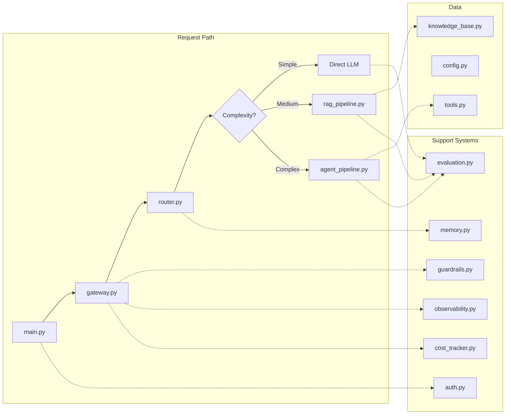
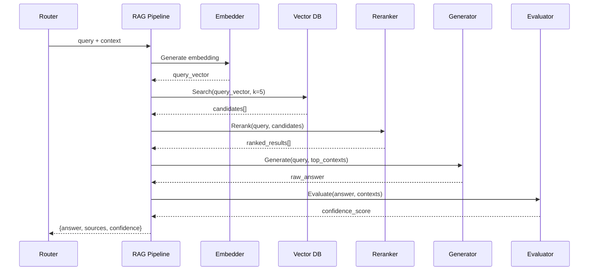
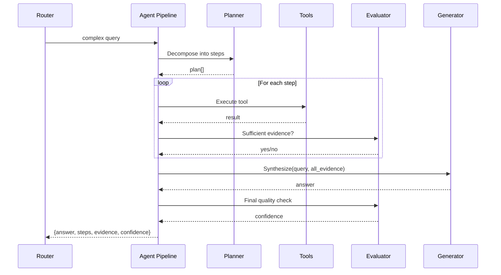

# Architecture Decisions

This document records the key architecture decisions made for the capstone enterprise
AI system, using a lightweight ADR (Architecture Decision Record) format.

---

## ADR-001: Python + FastAPI as Runtime

### Status: Accepted

### Context
We need a web framework for the API gateway and processing pipelines. Options include:
- Python + FastAPI
- Python + Flask
- Node.js + Express
- Go + Gin

### Decision
Use Python 3.10+ with FastAPI.

### Rationale
- **Python dominates AI/ML**: All major AI libraries (OpenAI SDK, LangChain, ChromaDB,
  sentence-transformers) are Python-first
- **FastAPI provides**: async support, automatic OpenAPI docs, Pydantic validation,
  dependency injection — all useful for enterprise systems
- **Type hints**: FastAPI's Pydantic integration demonstrates production-grade
  request/response validation
- **Educational**: Most AI engineers work in Python; transferable skills

### Consequences
- Single-threaded by default (mitigated by async/await)
- Not the fastest option for pure HTTP routing (acceptable for learning)
- Large ecosystem of AI packages available

---

## ADR-002: ChromaDB for Vector Store

### Status: Accepted

### Context
The RAG pipeline needs a vector database. Options:
- ChromaDB (embedded, Python-native)
- Pinecone (hosted, requires API key)
- Weaviate (self-hosted, complex setup)
- pgvector (requires PostgreSQL)
- FAISS (library, no persistence)

### Decision
Use ChromaDB in embedded mode (in-process, no separate server).

### Rationale
- **Zero infrastructure**: No separate database server needed
- **Python-native**: `pip install chromadb` and it works
- **Persistent or ephemeral**: Can use in-memory for demos, disk for persistence
- **Full-featured**: Supports metadata filtering, multiple collections
- **Educational**: Same API patterns as production vector DBs

### Consequences
- Not suitable for production scale (single-node only)
- No distributed search capability
- Perfect for learning — shows the same patterns used at scale

---

## ADR-003: OpenAI API with Simulation Fallback

### Status: Accepted

### Context
The system needs LLM capabilities. Options:
- Require OpenAI API key (blocks users without keys)
- Use local models (requires GPU, complex setup)
- Simulate everything (not realistic)
- Hybrid: real API if available, simulation fallback

### Decision
Support OpenAI API when key is available, fall back to deterministic
simulated responses when no key is present.

### Rationale
- **Accessible**: Anyone can run the system without paying for API calls
- **Realistic**: With an API key, you get real LLM behavior
- **Educational**: The architecture is identical regardless of backend
- **Testable**: Simulated responses enable deterministic testing

### Consequences
- Simulated responses are obviously not as good as real LLM output
- The architecture demonstrates all the patterns regardless
- Users can upgrade to real API at any time by adding a key

---

## ADR-004: Complexity-Based Routing (3 Levels)

### Status: Accepted

### Context
Not all queries need the same processing. A simple "what is 2+2?" doesn't need
RAG retrieval or agent planning. How do we route efficiently?

### Decision
Implement a 3-level complexity classifier:
1. **Simple**: Direct questions, factual, no context needed → Direct LLM
2. **Medium**: Questions requiring knowledge/context → RAG Pipeline
3. **Complex**: Multi-step, comparison, analysis → Agent Pipeline

### Rationale
- **Cost optimization**: Simple queries use cheaper/faster models
- **Quality optimization**: Complex queries get full pipeline treatment
- **Latency optimization**: Simple queries return in <100ms (simulated)
- **Real-world pattern**: This is exactly how production AI systems work
  (OpenAI's own API routes between models internally)

### Classification Signals
- Query length (longer = more complex)
- Keywords: "compare", "analyze", "step by step" → complex
- Keywords: company names, specific data → medium (needs retrieval)
- Keywords: "what is", simple math → simple

### Consequences
- Misclassification possible (mitigated by cascade/escalation)
- Three separate pipelines to maintain
- Clear separation of concerns

---

## ADR-005: Layered Guardrails (Rule-Based + Heuristic)

### Status: Accepted

### Context
The system needs safety guardrails. Options:
- Rule-based only (regex, keyword matching)
- LLM-based only (use another LLM to judge safety)
- Layered: fast rules first, then LLM for ambiguous cases
- Third-party API (Perspective API, Azure Content Safety)

### Decision
Implement layered guardrails:
1. **Layer 1 (fast)**: Regex-based injection detection, PII patterns
2. **Layer 2 (heuristic)**: Scoring-based safety assessment
3. Input guardrails run BEFORE processing
4. Output guardrails run AFTER generation

### Rationale
- **Speed**: Rule-based checks add <1ms latency
- **No external dependencies**: Works without API keys
- **Educational**: Shows the layered defense principle
- **Production pattern**: Real systems use this exact approach

### Consequences
- Rule-based detection has false positives/negatives
- No ML-based content moderation (would require trained models)
- Demonstrates the architecture pattern effectively

---

## ADR-006: In-Memory Stores (Demo Simplicity)

### Status: Accepted

### Context
The system needs persistence for: session memory, user preferences, cost tracking,
metrics. Options:
- Redis (fast, requires separate server)
- PostgreSQL (durable, requires separate server)
- SQLite (file-based, no separate server)
- In-memory Python dicts (simplest)

### Decision
Use in-memory Python dictionaries for all stores.

### Rationale
- **Zero setup**: No database installation needed
- **Educational focus**: Shows the patterns without infrastructure noise
- **Clear upgrade path**: Each store has a clear interface that could be
  backed by Redis/Postgres in production
- **Deterministic**: Easy to test and reason about

### Consequences
- Data lost on restart (acceptable for learning)
- No concurrent access guarantees (single-process anyway)
- Won't work for multi-instance deployment
- Production upgrade path is clear (swap dict for Redis client)

---

## Tradeoffs: Learning vs Production

### This System Is For Learning

| Aspect | This System | Production System |
|--------|-------------|-------------------|
| Storage | In-memory dicts | Redis + PostgreSQL + S3 |
| Vector DB | ChromaDB embedded | Pinecone / Weaviate cluster |
| Auth | Simple JWT | OAuth2 + RBAC + SSO |
| Scaling | Single process | Kubernetes + auto-scaling |
| LLM | OpenAI direct | AI Gateway (LiteLLM/custom) |
| Observability | Console logs | Datadog / Grafana + alerts |
| Guardrails | Regex + heuristics | ML models + third-party APIs |
| Cost tracking | In-memory counter | Billing system integration |

### What Changes at Scale

**10x scale** (100 users):
- Add Redis for session/rate limiting
- Add PostgreSQL for audit logs
- Add proper logging (structured JSON)

**100x scale** (10,000 users):
- Kubernetes deployment
- Horizontal scaling of API servers
- Separate services for RAG, Agent, Guardrails
- Message queue between services
- Distributed tracing (Jaeger/Zipkin)

**1000x scale** (1M users):
- Multi-region deployment
- CDN for static assets
- Sharded vector database
- Model serving infrastructure (vLLM, TGI)
- A/B testing framework
- Feature flags service
- Dedicated ML platform for evaluation

---

## Component Interaction Diagram

---

## Data Flow: RAG Query

---

## Data Flow: Agent Query

