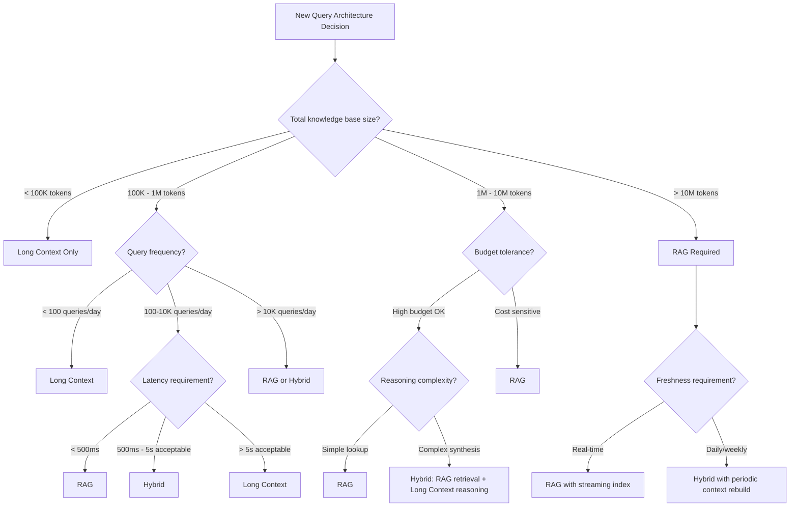

# Context Window Revolution: From 4K to 10M Tokens

## The Timeline That Changed Everything

```
2022 Q1: GPT-3          →  4,096 tokens (~3K words)
2022 Q4: ChatGPT        →  4,096 tokens
2023 Q1: GPT-4          →  8,192 tokens (32K variant)
2023 Q2: Claude 1       → 100,000 tokens (first "long context" model)
2023 Q3: GPT-4 Turbo    → 128,000 tokens
2024 Q1: Claude 3       → 200,000 tokens
2024 Q2: Gemini 1.5 Pro →   1,000,000 tokens
2024 Q4: Gemini 1.5     →  2,000,000 tokens
2025 Q1: Gemini 2.0     → 10,000,000 tokens (experimental)
```

Each jump wasn't just "more tokens" — it fundamentally changed what architectures were viable.

## What Changed Architecturally

### The 4K Era (2022): Everything Was Retrieval

With 4K tokens, you couldn't fit a single long document. Every system needed:
- Chunking (512-token chunks with overlap)
- Embedding + vector store
- Retrieval pipeline
- Careful prompt engineering to fit retrieved context

**Architecture was forced**: RAG was the only option for knowledge-intensive tasks.

### The 32K Era (2023 H1): "Maybe We Don't Need RAG"

At 32K tokens (~50 pages), you could fit:
- An entire codebase module
- A complete legal contract
- A full research paper

First cracks in RAG's dominance appeared. Simple use cases (Q&A over a single document) no longer needed retrieval.

### The 128K Era (2023 H2): The Tipping Point

128K tokens (~200 pages) meant:
- Entire codebases of small-medium projects
- Multiple research papers simultaneously
- Full conversation histories spanning days

**This is where the "RAG is dead" debate ignited.**

### The 1M+ Era (2024-2025): New Paradigm

1M tokens (~1,500 pages / ~3 novels):
- Complete technical documentation sets
- Entire book-length works
- Full project repositories with all dependencies

10M tokens (experimental):
- Multiple codebases simultaneously
- Entire knowledge bases for specialized domains
- Complete audit trails with full context

## The "RAG Is Dead" Debate

### Why It's Partially Right

1. **For small-medium corpora**: If your entire knowledge base fits in context, RAG adds latency, complexity, and failure modes for zero benefit.

2. **For reasoning tasks**: Long-context models can cross-reference, synthesize, and reason across documents in ways that RAG + chunking fundamentally cannot.

3. **For code understanding**: Stuffing an entire repo into context gives models structural understanding that isolated chunk retrieval destroys.

4. **RAG introduces errors**: Chunking splits context, retrieval misses relevant docs, reranking isn't perfect. Each step has a failure rate that compounds.

### Why It's Wrong

1. **Cost at scale**: 1M tokens × $3/M input = $3 per request. At 1000 QPS, that's $260K/day. RAG with retrieval costs pennies.

2. **Freshness**: Long context requires rebuilding the full prompt when data changes. RAG indexes update incrementally in milliseconds.

3. **Multi-tenancy**: You can't share a 1M-token context across users with different access permissions. RAG handles this naturally with filtered retrieval.

4. **Beyond-context knowledge**: When your knowledge base exceeds even 10M tokens (common in enterprise), you still need retrieval.

5. **Latency**: Time-to-first-token for 1M-token prompts is 10-30 seconds. RAG with retrieval + short prompt: 200ms.

## Decision Tree



## Cost Analysis: When Is Long Context Viable?

### Raw Token Costs (2025 Prices)

| Provider | Model | Input Cost/1M | 128K Request | 1M Request |
|----------|-------|---------------|--------------|------------|
| Anthropic | Claude 3.5 Sonnet | $3.00 | $0.38 | $3.00 |
| OpenAI | GPT-4o | $2.50 | $0.32 | $2.50 |
| Google | Gemini 1.5 Pro | $1.25 | $0.16 | $1.25 |
| Anthropic | Claude 3 Haiku | $0.25 | $0.03 | $0.25 |

### Break-Even Analysis

**Scenario**: Enterprise Q&A system, 10K queries/day

| Approach | Per-Query Cost | Daily Cost | Monthly Cost |
|----------|---------------|------------|--------------|
| RAG (retrieval + short context) | $0.005 | $50 | $1,500 |
| Long Context (1M tokens) | $3.00 | $30,000 | $900,000 |
| Hybrid (RAG retrieval + 32K reasoning) | $0.10 | $1,000 | $30,000 |

**Long context only makes economic sense when:**
- Query volume is low (< 100/day)
- Accuracy improvement justifies 100-600x cost premium
- The task requires full-document reasoning that RAG fundamentally cannot provide

### With Prompt Caching

Anthropic's prompt caching: 90% discount on cached prefix tokens.

| Approach | Without Cache | With Cache (90% hit rate) |
|----------|--------------|---------------------------|
| 1M context, no cache | $3.00/query | - |
| 1M context, cached prefix | $3.00 first | $0.30 subsequent |

**This changes the calculus dramatically** for stable knowledge bases with repeated queries.

## The Lost-in-the-Middle Problem

### What It Is

Research (Liu et al., 2023) showed that LLMs attend strongly to:
- The **beginning** of the context (primacy bias)
- The **end** of the context (recency bias)
- But poorly to the **middle**

### Measured Impact

```
Position in 128K context:     | Accuracy
------------------------------|----------
First 10%                     | 92%
Middle 40-60%                 | 71%
Last 10%                      | 89%
```

This is a ~20% accuracy drop for information in the middle of long contexts.

### Architectural Implications

1. **Document ordering matters**: Place most relevant documents at the start and end
2. **Retrieval still helps**: Even in long-context scenarios, reranking puts important info at top
3. **Chunking strategy**: Use hierarchical summarization with key info promoted to front
4. **Redundancy**: Repeat critical information at multiple positions

### Mitigation Strategies

```
Strategy                    | Complexity | Effectiveness
----------------------------|------------|---------------
Relevant-first ordering     | Low        | High
Summarize-then-detail       | Medium     | High  
Periodic re-statement       | Low        | Medium
Structured headers/markers  | Low        | Medium
Multi-pass prompting        | High       | Very High
```

## Needle-in-a-Haystack Benchmarks

### What They Measure

Place a specific fact ("needle") at various positions in a long context ("haystack"), then ask the model to retrieve it.

### What They Don't Measure

- **Synthesis across multiple needles** (the real use case)
- **Reasoning over retrieved information** (just tests recall)
- **Distractor resilience** (real contexts have contradictory info)
- **Multi-hop retrieval** (finding fact A that leads to fact B)

### Better Benchmarks for Architecture Decisions

| Benchmark | What It Tests | Relevance |
|-----------|--------------|-----------|
| Needle-in-haystack | Pure recall | Low |
| Multi-needle | Multi-fact recall | Medium |
| RULER | Reasoning at length | High |
| InfiniteBench | Real tasks at scale | High |
| LongBench | Diverse long tasks | High |

## Anti-Patterns: What Not To Do

### 1. "Just Stuff Everything In"
**Problem**: No relevance filtering means noise drowns signal. Models get confused by contradictory or irrelevant information.
**Fix**: Always pre-filter, even for long-context approaches.

### 2. "RAG Is Dead, Delete the Vector Store"
**Problem**: Throws away infrastructure that handles scale, freshness, and cost that long-context cannot.
**Fix**: Evaluate hybrid architectures before abandoning RAG.

### 3. "Use 1M Context for Every Query"
**Problem**: 10-30s latency + $3/request for queries that need 3 sentences of context.
**Fix**: Route queries to appropriate context sizes dynamically.

### 4. "Context Window = Knowledge Base"
**Problem**: Treats the context window as a database. It's not — it's expensive, ephemeral, and lacks CRUD operations.
**Fix**: Context is for reasoning, not storage.

### 5. "Longer Context = Better Results"
**Problem**: More irrelevant context actually degrades performance (lost-in-the-middle, attention dilution).
**Fix**: Optimal context is the minimum needed for the task, not the maximum available.

## Key Decisions for Staff Architects

1. **Default to hybrid**: Pure RAG and pure long-context are both edge cases. Most production systems benefit from RAG for retrieval + long context for reasoning.

2. **Design for context growth**: Today's 1M will be tomorrow's 10M. Architect systems that can gracefully migrate from RAG-heavy to context-heavy as windows expand and costs drop.

3. **Measure, don't assume**: The right architecture depends on your specific query patterns, corpus size, latency requirements, and budget. Build A/B testing infrastructure.

4. **Prompt caching changes everything**: If your workload has stable prefixes (system prompts, reference docs), caching makes long-context 10x cheaper.

5. **Lost-in-the-middle is real**: Even with long context, you still need retrieval and reranking to position information optimally within the window.

## What's Coming Next

- **10M+ token windows**: Will obsolete RAG for another class of use cases
- **Sub-linear attention**: O(n log n) attention mechanisms will reduce long-context costs
- **Native caching**: Models that maintain persistent KV caches across sessions
- **Adaptive context**: Models that dynamically decide how much context to attend to
- **Context-aware pricing**: Pay only for tokens the model actually attends to

The trend is clear: context windows will keep growing and getting cheaper. But retrieval will always be needed for corpora that exceed the window, for real-time freshness, and for cost-sensitive high-QPS workloads.

---

## Context Window Sizing Methodology

How to decide how much context your application actually needs:

1. **Measure your corpus**: What's the total token count of relevant information?
2. **Identify access patterns**: Do users need the full corpus or subsets?
3. **Calculate per-request needs**: Average query touches how many documents?
4. **Add overhead**: System prompt + conversation history + output tokens
5. **Apply safety margin**: 20% buffer for edge cases

| Use Case | Typical Context Needed | Recommended Window |
|----------|----------------------|-------------------|
| Single document Q&A | 5-30K tokens | 32K sufficient |
| Multi-document synthesis | 50-200K tokens | 128K-200K |
| Full codebase analysis | 200K-1M tokens | 1M (Gemini/Claude) |
| Legal contract review | 100-500K tokens | 200K-1M |
| Book summarization | 300K-800K tokens | 1M |

## Cost Implications at 1M Tokens

| Model | Input Cost (1M tokens) | Output Cost (1M tokens) | Cached Input |
|-------|----------------------|------------------------|--------------|
| GPT-4o | $2.50 | $10.00 | $1.25 |
| Claude 3.5 Sonnet | $3.00 | $15.00 | $0.30 (prompt caching) |
| Gemini 1.5 Pro | $1.25 | $5.00 | $0.315 (context caching) |
| GPT-4o-mini | $0.15 | $0.60 | $0.075 |

**Cost optimization strategies:**
- **Prompt caching**: Reuse static context across requests (60-90% savings on repeated prefixes)
- **Tiered approach**: Use cheap model for initial filtering, expensive model only for final answer
- **Context pruning**: Remove demonstrably irrelevant sections before sending to model
- **Batch processing**: Amortize long context across multiple questions about same document

## Model Comparison for Long Context

| Model | Max Context | Long-Context Quality | Best For |
|-------|-------------|---------------------|----------|
| Gemini 1.5 Pro | 2M tokens | Excellent recall across full window | Largest corpora, video/audio |
| Claude 3.5 Sonnet | 200K tokens | Very good; strong at "needle in haystack" | Code analysis, detailed reasoning |
| GPT-4o | 128K tokens | Good up to ~80K, degrades after | General purpose, structured output |
| Llama 3.1 405B | 128K tokens | Moderate; struggles past 64K | Self-hosted, cost-sensitive |
| Mistral Large | 128K tokens | Good up to ~100K | European data residency needs |

**Key finding**: Advertised context length ≠ usable context length. Most models degrade in quality in the last 20-30% of their window. Design for 70% of advertised maximum as your practical ceiling.
