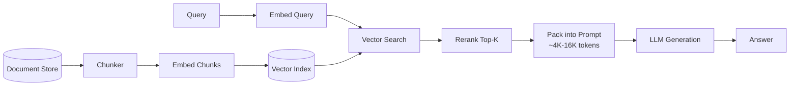
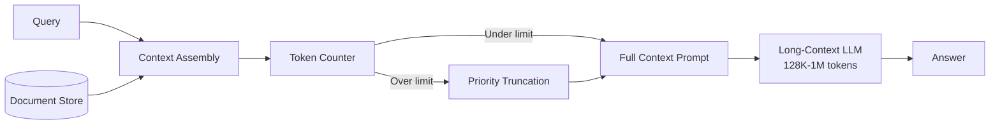
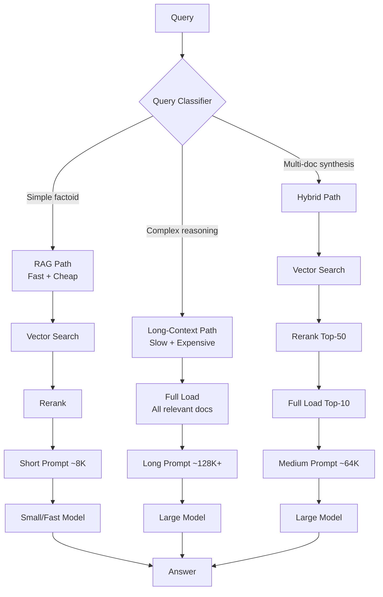

# RAG vs Context Stuffing: The Definitive Comparison

## The Core Trade-off

RAG and long-context are not competing technologies — they solve different problems with different trade-off profiles. The industry conflates them because both answer the question "how do I give an LLM knowledge?"

**RAG**: Retrieve relevant fragments → inject into small context → generate answer
**Long-Context**: Load entire knowledge base into context → generate answer
**Hybrid**: Retrieve candidates → load into large context → reason over full set

## The Definitive Comparison Table

| Dimension | RAG | Long-Context | Hybrid |
|-----------|-----|-------------|--------|
| **Latency (p50)** | 200-500ms | 5-30s | 1-5s |
| **Latency (p99)** | 2-5s | 30-60s | 10-20s |
| **Cost per query** | $0.001-0.01 | $0.25-3.00 | $0.05-0.50 |
| **Accuracy (single fact)** | 85-92% | 88-95% | 92-97% |
| **Accuracy (synthesis)** | 60-75% | 85-95% | 90-97% |
| **Max corpus size** | Unlimited | 10M tokens | Unlimited |
| **Freshness** | Real-time | Batch rebuild | Near real-time |
| **Multi-tenancy** | Native | Expensive | Native |
| **Hallucination risk** | Medium (retrieval errors) | Low (full context) | Low |
| **Infrastructure** | Vector DB + embeddings | Just API calls | Both |
| **Scaling cost** | O(log n) per query | O(n) per query | O(log n + k) |
| **Cold start** | Index build (minutes-hours) | None | Index build |
| **Reasoning depth** | Shallow (chunk-limited) | Deep (full context) | Deep |
| **Failure modes** | Missing retrieval, bad chunks | Lost-in-middle, cost | Retrieval errors filtered by reasoning |

## When RAG Wins

### 1. Corpus Exceeds Context Window (>10M tokens)
- Enterprise knowledge bases: 100K+ documents
- Customer support: millions of tickets
- Legal: millions of case files

### 2. Real-Time Freshness Required
- News/market data (updates per second)
- Product catalogs (updates per minute)  
- User-generated content (continuous stream)

### 3. Cost-Sensitive at Scale
```
10,000 queries/day:
  RAG:          10K × $0.005 = $50/day
  Long-Context: 10K × $3.00  = $30,000/day
  
Ratio: 600x more expensive for long-context
```

### 4. Multi-Tenant Systems
- Different users see different documents
- Access control at document/chunk level
- Personalized retrieval per user profile

### 5. Simple Factoid Queries
- "What is the return policy?"
- "When does the store close?"
- Questions answered by 1-3 sentences of context

### RAG Architecture Pattern



## When Long-Context Wins

### 1. Small-Medium Corpus (<100 docs)
- Company handbook (50 pages)
- API documentation (200 pages)
- Single codebase (< 500 files)

### 2. Complex Reasoning Tasks
- "Compare the approaches in papers A, B, and C and synthesize a novel method"
- "Find all security vulnerabilities in this codebase considering how modules interact"
- "Identify contradictions between these 5 legal contracts"

### 3. Code Understanding
- Entire repo in context gives structural understanding
- Cross-file dependencies visible simultaneously
- Refactoring suggestions that account for full impact

### 4. When Chunking Destroys Context
- Long-form narratives
- Mathematical proofs
- Complex arguments that span pages

### 5. Low Query Volume, High Value
- Executive briefings (5/day, each worth $1000s of analyst time)
- Legal document review ($500/hour lawyer equivalent)
- Research synthesis (saves days of manual work)

### Long-Context Architecture Pattern



## When Hybrid Wins

### Most Production Systems

The hybrid pattern dominates because it gets the best of both worlds:
- RAG's cost efficiency and scalability for retrieval
- Long-context's reasoning depth for generation

### Specific Wins

1. **Enterprise search + analysis**: Retrieve 50 relevant docs (RAG), load top 10 fully into 128K context (long-context), synthesize answer (reasoning)

2. **Code assistants**: Index entire codebase (RAG), load relevant files + dependencies into context (long-context), generate code with full awareness

3. **Legal review**: Search case law (RAG), load relevant cases fully (long-context), identify patterns across cases (reasoning)

4. **Customer support escalation**: Quick RAG for Tier-1 answers, escalate complex queries to long-context analysis

### Hybrid Architecture Pattern



## Real Case Studies

### Case Study 1: Coding Assistants (Long-Context Wins)

**Cursor/Copilot Architecture:**
- Load entire active file + imported files + related files into context
- Typical context: 30K-100K tokens of code
- Why RAG fails: Chunking code at arbitrary boundaries destroys syntax and semantic meaning
- Why long-context works: Models see full function signatures, class hierarchies, import chains

**Key insight**: Code has dense cross-references. A function call on line 50 might depend on a type defined on line 500 in another file. RAG over code chunks misses these connections.

**Numbers:**
- Average context per completion: 50K tokens
- Cost per completion: ~$0.15 (offset by subscription revenue)
- Latency target: <2s for inline completion
- Accuracy improvement over RAG: +15-25% for multi-file changes

### Case Study 2: Enterprise Search (RAG Wins)

**Typical Enterprise Knowledge Base:**
- 500K+ documents across Confluence, SharePoint, Slack, email
- Total corpus: ~5B tokens (5000x larger than any context window)
- 50K+ queries/day across 10K employees
- Documents update continuously

**Why long-context is impossible:**
- 5B tokens doesn't fit in any context window
- 50K queries/day × $3 = $150K/day (vs $250/day with RAG)
- Multi-tenancy: each user should only see authorized documents
- Sub-second latency requirement for search UX

**Architecture:**
- Embedding model: 768-dim vectors for all chunks
- Vector DB: Pinecone/Weaviate with metadata filtering
- Reranker: Cross-encoder on top-50 results
- Generator: GPT-4o-mini with 8K context (top-5 chunks + query)
- Total latency: 400ms p50

### Case Study 3: Legal Document Review (Hybrid Wins)

**Scenario**: Review 200 contracts for specific clause patterns

**Pure RAG problems:**
- Chunking at 512 tokens splits clauses mid-sentence
- Retrieval misses clauses with unusual wording
- Can't compare clause language across contracts

**Pure Long-Context problems:**
- 200 contracts × 10K tokens each = 2M tokens (borderline)
- Cost: $6 per query × 500 queries per review = $3,000
- Some queries need full contract context, others need cross-contract comparison

**Hybrid solution:**
1. **Index phase**: Embed all contracts, extract clause summaries
2. **Query routing**: Simple queries → RAG path, complex → hybrid path
3. **Hybrid path**: Retrieve relevant contracts (RAG), load full text of top-5 (long-context), compare and analyze (reasoning)
4. **Cost**: $800 per review (vs $3,000 pure long-context, but much higher accuracy than pure RAG)

## Decision Framework: 5 Questions

### Question 1: How Big Is Your Corpus?

```
< 50K tokens    → Long-Context (just load it all)
50K - 500K      → Long-Context or Hybrid (depends on query volume)
500K - 5M       → Hybrid (retrieve + reason)
5M - 50M        → RAG-heavy hybrid
> 50M           → RAG (no choice)
```

### Question 2: What's Your Query Volume?

```
< 10/day        → Long-Context (cost irrelevant)
10-1000/day     → Consider hybrid (cost starts to matter)
1K-100K/day     → RAG or hybrid (cost dominates)
> 100K/day      → RAG (long-context is bankrupting)
```

### Question 3: How Complex Is The Reasoning?

```
Single-fact lookup → RAG (fast, cheap, good enough)
Multi-fact synthesis → Hybrid (need broader context)
Cross-document comparison → Long-context or hybrid
Full-corpus reasoning → Long-context (if fits)
```

### Question 4: How Fresh Must Data Be?

```
Real-time (seconds)     → RAG with streaming index
Near real-time (minutes) → RAG with batch index
Daily updates           → Either (rebuild context daily is fine)
Static corpus           → Long-context (no index maintenance)
```

### Question 5: What's Your Latency Budget?

```
< 200ms  → RAG only (long-context can't achieve this)
200ms-2s → RAG with reranking
2s-10s   → Hybrid
10s-60s  → Long-context acceptable
> 60s    → Batch processing (any approach)
```

## Cost Modeling: Break-Even Analysis

### Variables
- C_rag: Cost per RAG query (retrieval + short-context generation)
- C_lc: Cost per long-context query
- Q: Queries per day
- A_rag: Accuracy of RAG approach
- A_lc: Accuracy of long-context approach
- V_accuracy: Business value per percentage point of accuracy

### Formula
```
Break-even when: Q × C_rag + (1 - A_rag) × V_error = Q × C_lc + (1 - A_lc) × V_error
```

### Example Calculation

```
C_rag = $0.005/query
C_lc = $1.00/query (with caching)
A_rag = 85%
A_lc = 95%
V_error = cost of wrong answer

Break-even: 
$0.005Q + 0.15 × V_error × Q = $1.00Q + 0.05 × V_error × Q
0.10 × V_error × Q = $0.995Q
V_error = $9.95

If each wrong answer costs > $9.95, long-context is worth it.
If each wrong answer costs < $9.95, RAG is more economical.
```

### At Different Scales

| Queries/Day | RAG Cost | Long-Context Cost | Hybrid Cost | Break-even V_error |
|-------------|----------|-------------------|-------------|-------------------|
| 100 | $0.50 | $100 | $10 | $9.95 |
| 1,000 | $5 | $1,000 | $100 | $9.95 |
| 10,000 | $50 | $10,000 | $1,000 | $9.95 |
| 100,000 | $500 | $100,000 | $10,000 | $9.95 |

The break-even V_error is independent of scale — it's the per-error cost threshold.

## Anti-Patterns and Common Mistakes

### 1. "One Size Fits All" Routing
**Mistake**: Sending every query through the same pipeline regardless of complexity.
**Fix**: Query classifier that routes simple queries to RAG (cheap/fast) and complex queries to hybrid (expensive/thorough).

### 2. "RAG Then Forget"
**Mistake**: Retrieving chunks but not loading full documents when context allows.
**Fix**: Retrieve chunks for relevance scoring, then load full source documents into context for the top hits.

### 3. "Maximum Context Always"
**Mistake**: Always filling the context window to capacity.
**Fix**: Use minimum viable context. More irrelevant context hurts (attention dilution, lost-in-middle).

### 4. "Ignoring Caching Economics"
**Mistake**: Calculating long-context cost without considering prompt caching.
**Fix**: With 90% cache hit rate, long-context cost drops 10x, dramatically shifting break-even points.

### 5. "Static Architecture"
**Mistake**: Building a fixed architecture and never re-evaluating.
**Fix**: Context windows grow and get cheaper quarterly. Build migration paths from RAG-heavy to context-heavy.

### 6. "Chunking Without Semantic Boundaries"
**Mistake**: Fixed-size chunking (512 tokens) that splits mid-sentence or mid-paragraph.
**Fix**: Semantic chunking at section/paragraph boundaries, with overlap for continuity.

### 7. "Ignoring Multi-Turn Context"
**Mistake**: Treating each query independently when users have multi-turn conversations.
**Fix**: Maintain conversation context across turns; RAG retrieval should consider full conversation, not just last query.

## Key Decisions for Staff Architects

1. **Build the router first**: The most important component is the query classifier that decides RAG vs long-context vs hybrid per query. Get this right and you can optimize each path independently.

2. **Design for caching from day one**: Prompt caching changes cost models by 10x. Structure your prompts with stable prefixes (system instructions, reference docs) that cache well.

3. **Measure accuracy, not just cost**: The cheapest architecture that doesn't meet accuracy requirements is infinitely expensive (wrong answers have business costs).

4. **Plan for context window growth**: Every 12 months, context windows roughly double and costs halve. Today's hybrid system might become pure long-context in 18 months.

5. **Multi-tenancy is the hard problem**: If different users have different access permissions, pure long-context requires per-user context assembly (expensive). RAG with filtered retrieval handles this naturally.

6. **Latency is non-negotiable for UX**: Users expect <2s for search, <5s for analysis. If long-context can't meet your latency SLA, it's not an option regardless of accuracy.

7. **Test with your actual queries**: Benchmarks don't predict your workload. Run A/B tests with real user queries before committing to an architecture.

8. **Failure modes differ**: RAG fails by missing relevant documents (silent failure). Long-context fails by losing information in the middle (subtle inaccuracy). Hybrid can catch both failure modes if designed well.
