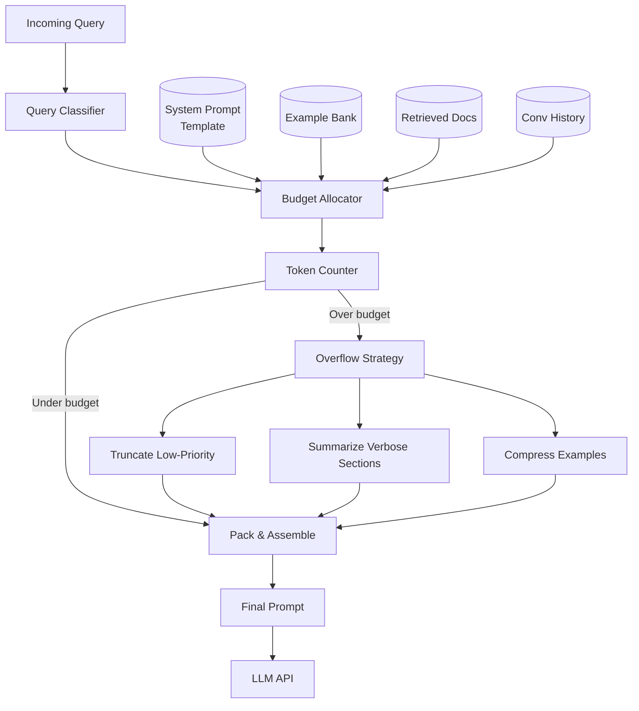
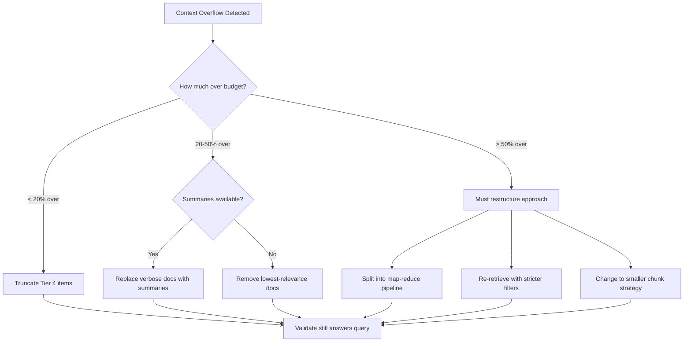

# Context Window Management: Budget Allocation and Packing

## The Context Budget Problem

Every LLM request has a finite token budget. A 128K context window doesn't mean you have 128K tokens for your documents — you need to allocate across competing demands:

```
┌─────────────────────────────────────────┐
│ Total Context Window (e.g., 128K)       │
├─────────────────────────────────────────┤
│ System Prompt         │  2K-8K tokens   │
│ Few-shot Examples     │  1K-4K tokens   │
│ Retrieved Documents   │ 20K-100K tokens │
│ Conversation History  │  5K-30K tokens  │
│ User Query            │  0.1K-2K tokens │
│ Output Reserve        │  2K-8K tokens   │
│ Safety Margin         │  1K-2K tokens   │
└─────────────────────────────────────────┘
```

**The art is in allocation**: How do you decide what gets 60K tokens vs 5K tokens?

## Context Budget Allocation Framework

### Priority Tiers

```
Tier 0 (Non-negotiable): System prompt + User query + Output reserve
Tier 1 (Critical):       Most relevant retrieved documents
Tier 2 (Important):      Recent conversation history, supporting docs
Tier 3 (Nice-to-have):   Few-shot examples, older history, background context
Tier 4 (Expendable):     Verbose formatting, redundant examples, metadata
```

### Allocation Algorithm

```python
def allocate_budget(total_window, components):
    # Reserve non-negotiable space
    reserved = system_prompt + user_query + output_reserve + safety_margin
    available = total_window - reserved
    
    # Score each component: relevance × information_density
    scored = [(score(c), c) for c in components]
    scored.sort(reverse=True)
    
    # Greedy packing with priority tiers
    allocated = []
    remaining = available
    for score, component in scored:
        if component.tokens <= remaining:
            allocated.append(component)
            remaining -= component.tokens
        elif component.is_compressible:
            compressed = compress(component, remaining)
            allocated.append(compressed)
            remaining -= compressed.tokens
            break
        # Skip if doesn't fit and isn't compressible
    
    return allocated
```

### Dynamic Allocation by Query Type

| Query Type | Docs | History | Examples | System |
|-----------|------|---------|----------|--------|
| Factual lookup | 70% | 10% | 5% | 15% |
| Multi-turn conversation | 30% | 50% | 5% | 15% |
| Code generation | 50% | 10% | 25% | 15% |
| Analysis/reasoning | 60% | 15% | 10% | 15% |
| Creative writing | 20% | 20% | 30% | 30% |

## Context Budget Allocator Architecture



## Priority-Based Context Packing Algorithms

### Algorithm 1: Greedy Relevance Packing

Best for: Simple retrieval-augmented queries

```
1. Score all candidate context items by relevance to query
2. Sort descending
3. Pack items until budget exhausted
4. If last item doesn't fit, truncate or skip
```

**Pros**: Simple, fast, good for single-turn factual queries
**Cons**: Doesn't consider diversity, may pack redundant items

### Algorithm 2: Maximal Marginal Relevance (MMR) Packing

Best for: Complex queries needing diverse perspectives

```
1. Score items by relevance
2. Select highest-relevance item
3. For each remaining item, compute:
   MMR(item) = λ × relevance(item) - (1-λ) × max_similarity(item, selected)
4. Select highest MMR item
5. Repeat until budget full
```

**Pros**: Reduces redundancy, covers more ground
**Cons**: Slower (O(n²)), λ tuning required

### Algorithm 3: Hierarchical Packing

Best for: Long documents where you need both overview and detail

```
1. Include summary of all candidate documents (Tier 1)
2. Include full text of top-K most relevant (Tier 2)
3. Include relevant sections of next-K documents (Tier 3)
4. Fill remaining budget with supporting context (Tier 4)
```

**Pros**: Gives model both breadth (summaries) and depth (full docs)
**Cons**: Requires pre-computed summaries

## Context Compression Strategies

### Sliding Window

```
Full history: [msg1, msg2, msg3, ..., msg50]
Window of 10: [msg41, msg42, ..., msg50]
```

**When to use**: Chat applications where recent context matters most
**Token savings**: Proportional to window size vs full history
**Risk**: Loses important early context (user preferences, task setup)

### Summarization

```
Full history: [msg1...msg40] + [msg41...msg50]
                    ↓
Compressed:  [summary_of_1_to_40] + [msg41...msg50]
```

**When to use**: Long conversations where early context contains referenceable decisions
**Token savings**: 10-20x compression of older sections
**Risk**: Summary loses nuance; model can't quote exact earlier statements

### Hierarchical Compression

```
Level 0 (full):     Last 5 messages (verbatim)
Level 1 (condensed): Messages 6-20 (key points only)
Level 2 (summary):   Messages 21-100 (paragraph summary)
Level 3 (metadata):  Messages 100+ (just topics and decisions)
```

**When to use**: Production chat systems with hours-long sessions
**Token savings**: 50-100x for old messages
**Risk**: Complex to implement, summary quality varies

## Token Counting Strategies

### Why Accurate Token Counting Matters

Over-estimate: waste context space (leave money on the table)
Under-estimate: hit token limit errors, fail at runtime

### Token Counting by Model Family

| Model Family | Tokenizer | Library | Avg chars/token |
|-------------|-----------|---------|-----------------|
| GPT-4/4o | cl100k_base | tiktoken | 4.0 |
| Claude 3.x | Custom BPE | anthropic SDK | 3.5 |
| Gemini | SentencePiece | google SDK | 3.8 |
| Llama 3 | tiktoken-compatible | tiktoken | 4.0 |
| Mistral | SentencePiece | mistral_common | 3.7 |

### Practical Token Estimation

```python
# Quick estimation (±10% accuracy)
def estimate_tokens(text: str, model: str = "gpt-4") -> int:
    if model.startswith("gpt") or model.startswith("claude"):
        return len(text) // 4  # ~4 chars per token for English
    return len(text) // 3.5  # More conservative for other models

# Accurate counting (exact)
import tiktoken
enc = tiktoken.encoding_for_model("gpt-4o")
exact_tokens = len(enc.encode(text))
```

### Budget-Safe Token Counting

```python
def safe_token_budget(model_limit: int) -> int:
    """Leave margins for safety."""
    output_reserve = min(4096, model_limit // 8)  # Reserve for output
    safety_margin = 256  # Buffer for tokenizer drift
    return model_limit - output_reserve - safety_margin
```

## Dynamic Context Assembly

### Query-Adaptive Assembly

```python
def assemble_context(query: str, query_type: str, budget: int):
    allocations = ALLOCATION_PROFILES[query_type]
    
    context_parts = []
    
    # System prompt (always included, fixed cost)
    system = get_system_prompt(query_type)
    budget -= count_tokens(system)
    
    # Allocate remaining budget
    doc_budget = int(budget * allocations['documents'])
    history_budget = int(budget * allocations['history'])
    example_budget = int(budget * allocations['examples'])
    
    # Pack documents (highest priority fills first)
    docs = retrieve_and_rank(query)
    packed_docs = pack_to_budget(docs, doc_budget)
    
    # Pack history (most recent first)
    history = get_conversation_history()
    packed_history = pack_to_budget(reversed(history), history_budget)
    
    # Pack examples (if budget remains)
    if example_budget > 500:  # Minimum useful example size
        examples = select_examples(query, example_budget)
        context_parts.append(examples)
    
    return assemble(system, packed_docs, packed_history, context_parts)
```

### Overflow Handling Strategies

When total needed context exceeds the window:

| Strategy | When to Use | Trade-off |
|----------|-------------|-----------|
| Truncate low-priority | Always applicable | Loses potentially useful context |
| Summarize verbose sections | When summaries exist/can be generated | Loses detail, adds latency |
| Split into multiple calls | Complex multi-doc analysis | Higher cost, needs aggregation |
| Reduce examples | When model is capable without | May reduce output quality |
| Compress history | Long conversations | Loses conversational nuance |
| Chunk and map-reduce | Very long documents | Adds latency and complexity |

### Overflow Decision Logic



## Multi-Turn Conversation Context Management

### The Growing Context Problem

```
Turn 1:  System(2K) + Query(100) = 2.1K tokens
Turn 5:  System(2K) + History(4K) + Query(100) = 6.1K tokens
Turn 20: System(2K) + History(30K) + Query(100) = 32.1K tokens
Turn 50: System(2K) + History(80K) + Query(100) = 82.1K tokens → OVERFLOW
```

### Management Strategies at Scale

**Strategy 1: Rolling Window**
```
Keep last N turns verbatim, discard rest.
Pros: Simple, predictable cost
Cons: Loses early context, user must repeat info
```

**Strategy 2: Progressive Summarization**
```
Every K turns, summarize oldest batch into 1 paragraph.
[Summary of turns 1-10] + [Summary of turns 11-20] + [Full turns 21-30]
Pros: Retains all context in compressed form
Cons: Requires summarization calls (cost + latency)
```

**Strategy 3: Relevance-Based Retention**
```
Score each past turn by relevance to current query.
Keep all high-relevance turns verbatim regardless of age.
Summarize medium-relevance, discard low-relevance.
Pros: Intelligent retention
Cons: Complex scoring, may discard contextually important turns
```

**Strategy 4: Topic-Segmented History**
```
Segment conversation into topics.
Keep current topic fully, summarize others.
When topic changes, compress previous topic.
Pros: Natural conversation structure
Cons: Topic detection isn't perfect
```

### Production Implementation

```python
class ConversationManager:
    def __init__(self, max_history_tokens: int = 30000):
        self.max_tokens = max_history_tokens
        self.messages = []  # Full history
        self.summaries = []  # Compressed old sections
        
    def get_context(self, current_query: str, budget: int) -> list:
        # Always include: system + current query
        # Then fill remaining budget:
        
        # 1. Recent messages (always verbatim, last 5 turns)
        recent = self.messages[-10:]  # 5 user + 5 assistant
        recent_tokens = sum(count_tokens(m) for m in recent)
        
        remaining = budget - recent_tokens
        
        # 2. Relevant older messages (semantic search over history)
        if remaining > 2000:
            relevant_old = self.search_history(current_query, remaining // 2)
            remaining -= sum(count_tokens(m) for m in relevant_old)
        else:
            relevant_old = []
        
        # 3. Summaries of everything else
        if remaining > 500 and self.summaries:
            summary_context = self.get_summary(remaining)
        else:
            summary_context = []
        
        return summary_context + relevant_old + recent
```

## Key Decisions for Staff Architects

1. **Budget allocation is query-dependent**: A factoid question needs 80% docs, 5% history. A follow-up question needs 30% docs, 60% history. Build adaptive allocation, not static splits.

2. **Token counting must be exact in production**: Estimation works for planning; production systems need exact counts to avoid runtime failures. Cache token counts for static content.

3. **Progressive summarization is the production answer**: Pure sliding window loses too much; full history is too expensive. Summarize aggressively for old turns, keep recent turns verbatim.

4. **Output reserve is often underestimated**: If you budget 128K for input and the model needs 4K for output, you'll hit limits. Always reserve 5-10% for output.

5. **Context assembly latency matters**: If assembling context takes 2 seconds (summarization, retrieval, token counting), that's 2 seconds of user-perceived latency before the LLM even starts generating.

6. **Cache static context components**: System prompts, few-shot examples, and reference docs rarely change. Pre-compute their token counts and cache assembled versions.

7. **Monitor context utilization**: Track what percentage of the context window you're actually using. Under-utilization means you're leaving accuracy on the table. Over-utilization means frequent overflow handling.

8. **Test with adversarial inputs**: Users paste 50K-token documents, send 10K-character messages, have 200-turn conversations. Your context manager must handle these gracefully.
