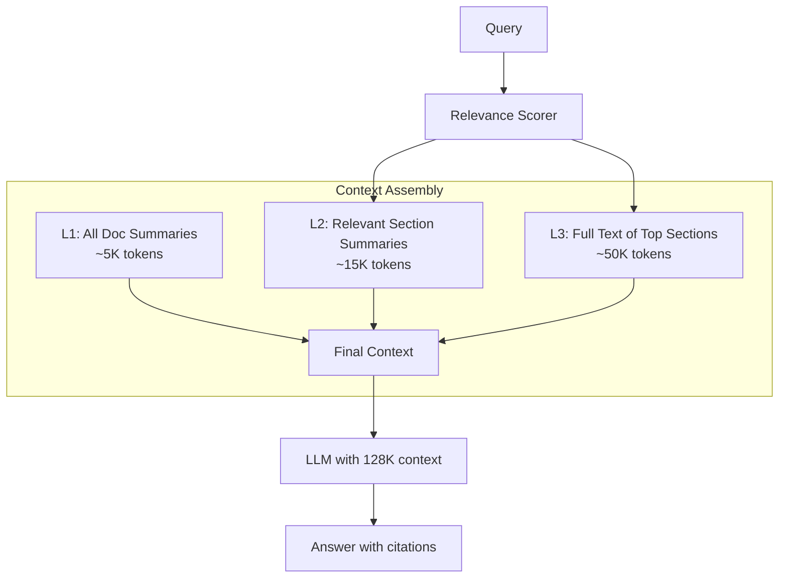
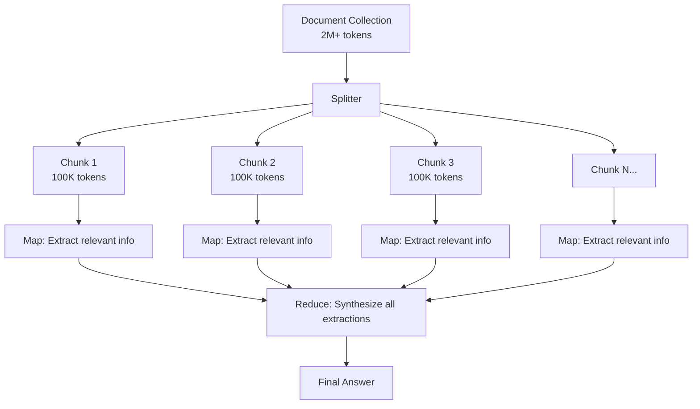
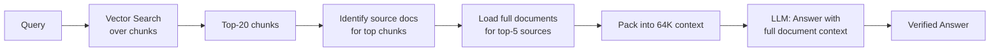

# Long-Context Retrieval Patterns

## Beyond Simple Stuffing

Long context doesn't mean "dump everything in and hope." Effective long-context systems use structured retrieval patterns that leverage the large window while mitigating its weaknesses (lost-in-the-middle, attention dilution, cost).

## Pattern 1: Hierarchical Context (Summary → Detail)

### Architecture

```
Level 1: Table of contents / document summaries (always in context)
Level 2: Section summaries of relevant documents
Level 3: Full text of most relevant sections
```

### Implementation



### When to Use
- Document collections where breadth AND depth matter
- When the model needs to know what it doesn't know (summaries reveal gaps)
- Legal, medical, research domains with structured documents

### Token Budget Example (128K window)
```
System prompt:           3K tokens
L1 (50 doc summaries):  5K tokens (100 tokens each)
L2 (10 section summaries): 10K tokens (1K each)
L3 (5 full sections):   50K tokens (10K each)
Query + output reserve:  10K tokens
Remaining buffer:        50K tokens (for conversation/examples)
```

## Pattern 2: Map-Reduce Over Long Documents

### When Documents Exceed Context

Even with 1M tokens, some tasks involve more content than fits. Map-reduce splits the work:

**Map phase**: Process each document/chunk independently
**Reduce phase**: Synthesize all map outputs into final answer

### Architecture



### Trade-offs

| Aspect | Map-Reduce | Single Long Context |
|--------|-----------|-------------------|
| Max document size | Unlimited | Context window limit |
| Cross-chunk reasoning | Poor (only in reduce) | Excellent |
| Cost | N × map_cost + reduce_cost | Single call cost |
| Latency | Parallelizable maps | Single sequential call |
| Accuracy for synthesis | Lower (info lost in map) | Higher |

### When Map-Reduce Beats Long Context
- Total content > context window (no choice)
- Tasks that are naturally decomposable (extract dates from each contract)
- When parallelism reduces latency below sequential long-context

### When Long Context Beats Map-Reduce
- Tasks requiring cross-reference (contradictions between documents)
- When synthesis quality matters more than speed
- Small enough to fit in window

## Pattern 3: Recursive Summarization Chains

### The Pyramid Pattern

```
Layer 0: Raw documents (1M tokens)
Layer 1: Section summaries (100K tokens) 
Layer 2: Document summaries (10K tokens)
Layer 3: Collection summary (1K tokens)
```

Each layer is a 10x compression. Query routing decides which layer(s) to include:
- High-level question → Layer 3 + relevant Layer 2
- Specific question → Layer 2 for orientation + Layer 0 for relevant section

### Pre-computation vs On-Demand

| Approach | Latency | Cost | Freshness |
|----------|---------|------|-----------|
| Pre-compute all layers | Low (just lookup) | High upfront | Stale until rebuild |
| On-demand summarization | High (+2-5s per layer) | Pay per use | Always fresh |
| Hybrid (pre-compute L2-3, on-demand L0-1) | Medium | Medium | Balanced |

## Pattern 4: Chunk-Then-Verify

### The Problem with Pure Chunking

RAG retrieves 512-token chunks. These chunks may:
- Be taken out of context (pronoun references unresolved)
- Miss critical surrounding information
- Contain irrelevant padding from chunk boundaries

### The Solution: Two-Stage Retrieval

```
Stage 1 (RAG): Retrieve relevant chunks → identify source documents
Stage 2 (Long-Context): Load full source documents → verify and answer with full context
```

### Architecture



### Why This Works
- Chunk retrieval is fast and cheap (identifies relevant docs)
- Full document loading gives complete context for reasoning
- Combines RAG's retrieval precision with long-context's reasoning depth
- Model can verify chunk claims against full document

### Token Math
```
20 chunks × 512 tokens = 10K tokens (retrieval phase, cheap model)
5 full docs × 10K tokens = 50K tokens (reasoning phase, capable model)
Total reasoning context: ~60K tokens (well within 128K)
```

## Pattern 5: Multi-Document Synthesis

### Cross-Document Reasoning

Some questions require synthesizing information across multiple documents:
- "How do these 3 papers' methodologies differ?"
- "Are there contradictions between these contracts?"
- "What's the consensus across these 10 reviews?"

### Strategies

**Strategy A: Load All (if fits)**
```
Load all relevant documents fully → single prompt → synthesize
Best when: total < context window, high reasoning needed
```

**Strategy B: Parallel Extraction + Synthesis**
```
For each document: extract relevant aspects
Then: synthesize extractions in single prompt
Best when: total > context window, extractable structure
```

**Strategy C: Progressive Integration**
```
Start with doc 1 → extract key points
Add doc 2 → compare with doc 1 findings, update synthesis
Add doc 3 → compare with running synthesis, update
...
Best when: ordered documents, building understanding progressively
```

## Attention Heatmaps: Where Models Actually Look

### Empirical Findings

Research on attention patterns in long-context models reveals:

```
Position in context:    Relative attention weight
─────────────────────────────────────────────────
First 5% (primacy):    ████████████████  1.8x
5-20%:                 ██████████        1.1x
20-40%:                ████████          0.9x
40-60% (middle):       ██████            0.7x  ← DANGER ZONE
60-80%:                ████████          0.9x
80-95%:                ██████████        1.1x
Last 5% (recency):     ████████████████  1.7x
Query/instruction:     ████████████████████ 2.5x
```

### Architectural Implications

1. **Put critical information at the start and end** of the context
2. **The query/instruction gets highest attention** — make it specific and detailed
3. **Middle positions need structural markers** (headers, bullet points) to attract attention
4. **Redundancy helps**: repeat key facts at multiple positions
5. **Document ordering by relevance matters** even within long contexts

## Practical Strategies to Combat Lost-in-the-Middle

### Strategy 1: Relevance-Ordered Positioning

```
Most relevant document  → Position 1 (start)
2nd most relevant       → Last position (end)
3rd most relevant       → Position 2
4th most relevant       → 2nd-to-last
... (alternating start/end inward)
Least relevant          → Middle
```

This "bookend" strategy maximizes attention on the most important content.

### Strategy 2: Structural Markers

```markdown
=== CRITICAL DOCUMENT (Relevance: 95%) ===
[document content]
=== END CRITICAL DOCUMENT ===

--- Supporting Document (Relevance: 72%) ---
[document content]
--- END Supporting Document ---
```

Explicit markers help models identify and attend to high-priority sections.

### Strategy 3: Pre-Context Summary

Before the full documents, include a brief summary:

```
CONTEXT OVERVIEW:
- Document 1 (pages 1-10): Contains the pricing model and discount tiers
- Document 2 (pages 11-25): Contains the SLA terms and uptime guarantees  
- Document 3 (pages 26-40): Contains the termination clauses

FULL DOCUMENTS FOLLOW:
[... full text of all documents ...]
```

This gives the model a "map" before the detailed content.

### Strategy 4: Explicit Cross-References

```
[In Document 1, Section 3]: "The discount is 20% for annual contracts"
[NOTE: This contradicts Document 2, Section 7 which states 15%]
```

Pre-annotating cross-references reduces the model's need to independently discover connections in the middle of long text.

### Strategy 5: Multi-Pass Prompting

```
Pass 1: "Read all documents and identify which sections are relevant to: [query]"
Pass 2: "Using only the relevant sections you identified, answer: [query]"
```

First pass forces attention across the full context; second pass focuses reasoning.

## Reranking Within Context Windows

### Why Rerank After Retrieval?

Embedding similarity ≠ answer relevance. A document might be semantically similar but not contain the answer. Reranking with a cross-encoder (or the LLM itself) improves precision.

### Reranking Pipeline

```
Retrieve top-50 by embedding similarity (fast, cheap)
    ↓
Rerank to top-10 with cross-encoder (slower, more accurate)
    ↓
Position top-10 in context using bookend strategy
    ↓
Generate answer with full context of top-10
```

### Cost of Reranking

```
Cross-encoder reranking (50 passages): ~50ms, ~$0.001
LLM-based reranking (50 passages):     ~2s, ~$0.05
Benefit: 5-15% accuracy improvement on downstream task
```

Almost always worth it when using expensive long-context models (spend $0.001-0.05 on reranking to avoid wasting $1-3 on poorly-ordered context).

## Key Decisions for Staff Architects

1. **Hierarchical context is almost always better than flat loading**: Even when everything fits, giving the model a summary layer before details improves accuracy by 10-15%.

2. **Chunk-then-verify is the pragmatic hybrid pattern**: Use cheap RAG retrieval to identify relevant documents, then load full documents for reasoning. Best of both worlds.

3. **Position engineering is real**: The order of documents in your context matters as much as which documents you include. Invest in a positioning strategy.

4. **Map-reduce is a fallback, not a primary pattern**: If content fits in a single context window, prefer it. Map-reduce loses cross-document connections.

5. **Pre-compute summaries for stable corpora**: The latency and cost of runtime summarization usually isn't worth it for documents that don't change daily.

6. **Multi-pass prompting trades cost for accuracy**: For high-value queries, spending 2x on a two-pass approach can improve accuracy by 15-20%.

7. **Reranking before context packing is cheap insurance**: For $0.001-0.05 extra per query, you ensure the right documents are in attention-rich positions.

8. **Measure where your model actually fails**: Lost-in-the-middle may or may not be your biggest problem. Profile failure modes before optimizing for a problem you might not have.
