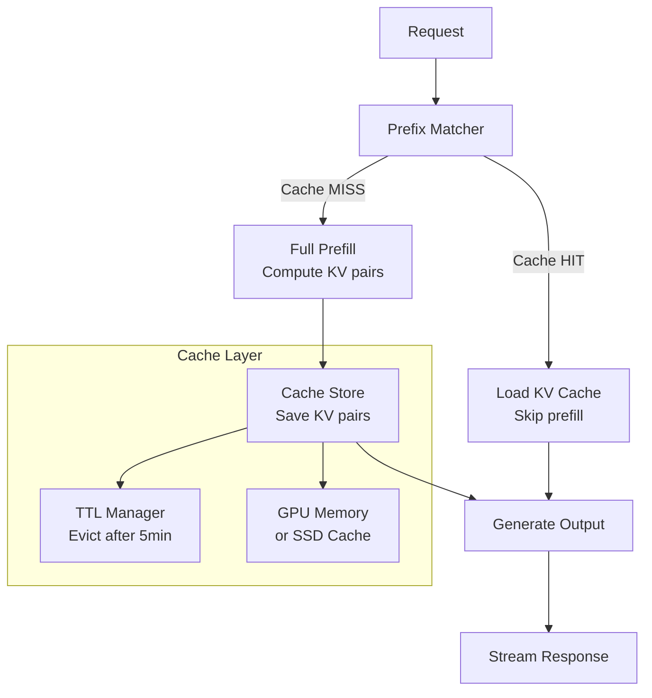
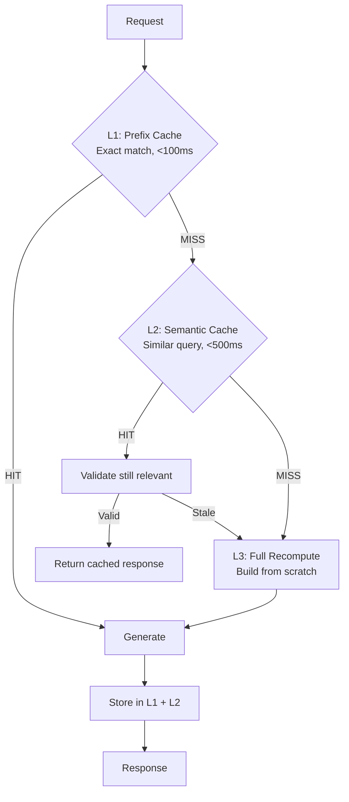

# Caching for Long Context: Prompt Caching and KV Cache Architecture

## Why Caching Changes Everything

Without caching, every request reprocesses the entire context from scratch:
- 1M tokens × $3/M = $3.00 per request
- Time-to-first-token: 10-30 seconds for 1M tokens

With caching (90% discount on cached tokens):
- Cached 1M tokens: $0.30 per request
- Time-to-first-token: 1-3 seconds (skip prefill for cached prefix)

**Caching makes long-context economically viable for high-volume workloads.**

## How Prompt Caching Works

### The KV Cache Explained

During LLM inference, the model computes Key-Value (KV) pairs for every token in the prompt. This is the most expensive step (the "prefill" phase).

```
Standard request:
  Input (1M tokens) → Compute KV pairs (10-30s) → Generate output (streaming)

Cached request:
  Input (1M tokens) → Load cached KV pairs (0.1-1s) → Generate output (streaming)
```

The KV cache stores the intermediate attention computations, allowing the model to skip the expensive prefill for previously-seen prefixes.

### Provider Implementations

#### Anthropic Prompt Caching

```
- Cache unit: exact prefix match (byte-level)
- Minimum cacheable: 1024 tokens (Haiku), 2048 tokens (Sonnet/Opus)
- Cache TTL: 5 minutes (extended on hit)
- Pricing: 
  - Cache write: 25% MORE than base input price
  - Cache read: 90% LESS than base input price
- Max cached prefixes: 4 breakpoints per request
```

#### OpenAI Prompt Caching

```
- Cache unit: automatic prefix matching (no explicit API)
- Minimum cacheable: 1024 tokens
- Cache TTL: 5-10 minutes
- Pricing:
  - Cache write: standard input price
  - Cache read: 50% discount
- Automatic: no API changes needed
```

#### Google Gemini Context Caching

```
- Cache unit: explicit cache objects with TTL
- Minimum cacheable: 32,768 tokens
- Cache TTL: configurable (1 hour default, up to 24 hours)
- Pricing:
  - Cache storage: $1.00/M tokens/hour
  - Cache read: 75% discount on input
- Explicit API: create cache, then reference in requests
```

## Caching Architecture



## Prefix Caching: Shared System Prompt Optimization

### The Key Insight

Most applications send the same system prompt with every request. For long system prompts (2K-50K tokens), this is redundant computation:

```
Request 1: [System Prompt (10K)] + [User Query A (500)]
Request 2: [System Prompt (10K)] + [User Query B (300)]
Request 3: [System Prompt (10K)] + [User Query C (800)]
```

With prefix caching, the system prompt's KV pairs are computed once and reused:

```
Request 1: [COMPUTE System Prompt (10K)] + [User Query A] → Cache system prompt KV
Request 2: [CACHED System Prompt (10K)] + [User Query B] → 90% cheaper
Request 3: [CACHED System Prompt (10K)] + [User Query C] → 90% cheaper
```

### Optimizing for Cache Hits

**Structure your prompts with stable prefixes:**

```
┌─────────────────────────────────────────┐
│ STABLE PREFIX (cache this)              │
│ ├── System instructions (2K tokens)     │
│ ├── Reference documents (50K tokens)    │
│ └── Few-shot examples (5K tokens)       │
├─────────────────────────────────────────┤
│ VARIABLE SUFFIX (changes per request)   │
│ ├── Conversation history                │
│ └── Current user query                  │
└─────────────────────────────────────────┘
```

**Anti-pattern**: Putting variable content (timestamps, request IDs) in the prefix breaks caching:

```
# BAD: timestamp in prefix breaks cache
"You are an assistant. Current time: 2025-01-15T14:30:00Z. ..."

# GOOD: timestamp at end
"You are an assistant. [reference docs...] Current time: {timestamp}. User: ..."
```

## Context Caching Strategies

### Strategy 1: Static Knowledge Base Caching

For systems where the knowledge base changes infrequently:

```
Cache: System prompt + entire knowledge base (100K tokens)
Variable: User query only

Cost per query: 
  Without cache: 100K × $3/M = $0.30
  With cache:    100K × $0.30/M + 1K × $3/M = $0.03 + $0.003 = $0.033
  
Savings: 90% per query
```

### Strategy 2: Session-Based Caching

For multi-turn conversations with growing context:

```
Turn 1: [System(5K) + Docs(50K) + Query1(500)] → Cache prefix: 55K tokens
Turn 2: [CACHED(55K) + Response1(1K) + Query2(500)] → Cache prefix: 56.5K
Turn 3: [CACHED(56.5K) + Response2(1.5K) + Query3(300)] → Cache prefix: 58.3K
```

Each turn extends the cached prefix. Previous turns' KV pairs are reused.

### Strategy 3: Multi-User Shared Prefix

For multi-tenant systems with shared knowledge bases:

```
Shared prefix: System prompt + company docs (80K tokens)
Per-user suffix: User-specific context + query

All users benefit from the shared cache:
  1000 users/hour × 80K cached tokens = massive savings
```

### When NOT to Cache

- Highly dynamic contexts (content changes every request)
- Very short prompts (< 1K tokens, caching overhead > benefit)
- Low request volume (cache evicts before reuse)
- Diverse prefixes (each user has unique context, no sharing)

## Cost Savings Math

### Scenario: Customer Support Bot

```
Parameters:
- System prompt: 5K tokens
- Knowledge base: 50K tokens  
- Average user query: 500 tokens
- Requests: 10,000/day
- Model: Claude 3.5 Sonnet ($3/M input, $0.30/M cached)

Without caching:
  Per request: (5K + 50K + 500) × $3/M = $0.1665
  Daily: $1,665

With caching (prefix = system + knowledge base = 55K tokens):
  Cache write (first request): 55K × $3.75/M = $0.206 (25% surcharge)
  Cache read (subsequent): 55K × $0.30/M = $0.0165
  Variable tokens: 500 × $3/M = $0.0015
  Per request (cached): $0.018
  Daily: $180 + $0.206 (one-time cache write)

Savings: $1,485/day = 89% reduction
Monthly savings: ~$44,500
```

### Scenario: Code Assistant (Large Repo in Context)

```
Parameters:
- Repo context: 200K tokens (stable for a coding session)
- Per-query additions: 2K tokens (current file, query)
- Requests per session: 50
- Sessions: 500/day

Without caching:
  Per request: 202K × $3/M = $0.606
  Daily: 25,000 requests × $0.606 = $15,150

With caching (session-level):
  First request per session: 200K × $3.75/M = $0.75 (cache write)
  Subsequent 49 requests: 200K × $0.30/M + 2K × $3/M = $0.066
  Per session: $0.75 + 49 × $0.066 = $3.98
  Daily: 500 × $3.98 = $1,992

Savings: $13,158/day = 87% reduction
```

## Cache Invalidation for Dynamic Contexts

### The Invalidation Problem

Caches become stale when:
- Knowledge base documents are updated
- System prompts change (A/B tests, feature flags)
- Reference data changes (pricing, availability)

### Invalidation Strategies

**Strategy 1: Version-Based Invalidation**
```
Cache key: hash(prefix_content)
When content changes: new hash → automatic new cache
Old cache: evicts naturally after TTL
```

**Strategy 2: TTL-Based Freshness**
```
Data freshness requirement | Cache TTL | Trade-off
Real-time                  | No cache  | Full cost
Minutes                    | 5 min     | Good savings, mostly fresh
Hours                      | 1 hour    | Great savings, some staleness
Daily                      | 24 hours  | Maximum savings, daily refresh
```

**Strategy 3: Hybrid (Stable + Dynamic Sections)**
```
[CACHED: System prompt + stable reference docs]  ← Long TTL
[NOT CACHED: Dynamic data + real-time context]    ← Always fresh
[NOT CACHED: User query]                          ← Always unique
```

## Multi-Tier Caching Architecture



### L1: Prefix KV Cache (Provider-Level)
- What: KV pairs for exact prefix matches
- Latency: eliminates prefill time (saves 5-30s)
- Cost: 90% input token discount
- TTL: 5-10 minutes
- Hit rate: 60-90% for stable workloads

### L2: Semantic Response Cache (Application-Level)
- What: Cached full responses for semantically similar queries
- Latency: eliminates LLM call entirely (<100ms)
- Cost: zero LLM cost (just cache lookup)
- TTL: configurable (minutes to hours)
- Hit rate: 10-40% depending on query diversity

### L3: Full Recompute
- What: No cache available, full pipeline execution
- Latency: full retrieval + prefill + generation
- Cost: full price
- When: novel queries, cache misses, stale data

### Cost Impact by Tier

```
L1 hit (prefix cache):     10% of full cost, -80% latency
L2 hit (semantic cache):   ~0% LLM cost, -95% latency  
L3 (full recompute):       100% cost, full latency

Blended with 70% L1, 15% L2, 15% L3:
  Average cost: 0.70 × 10% + 0.15 × 0% + 0.15 × 100% = 22% of uncached cost
  Effective savings: 78%
```

## Production Implementation Patterns

### Pattern 1: Warm-Up on Deploy

```python
# Pre-warm cache on deployment with common prefixes
async def warm_cache(common_prefixes: list[str]):
    for prefix in common_prefixes:
        # Send a dummy request with the prefix to populate cache
        await llm.complete(
            messages=[{"role": "user", "content": "Hello"}],
            system=prefix,
            max_tokens=1  # Minimal generation, just cache the prefix
        )
```

### Pattern 2: Cache-Aware Request Batching

```python
# Group requests by shared prefix to maximize cache hits
def batch_by_prefix(requests: list[Request]) -> dict[str, list[Request]]:
    batches = defaultdict(list)
    for req in requests:
        prefix_key = hash(req.system_prompt + req.reference_docs)
        batches[prefix_key].append(req)
    
    # Process each batch: first request warms cache, rest benefit
    for prefix_key, batch in batches.items():
        # Process sequentially within batch to ensure cache is warm
        for req in batch:
            yield process(req)
```

### Pattern 3: Monitoring Cache Performance

```python
# Track cache economics
class CacheMetrics:
    def __init__(self):
        self.cache_hits = 0
        self.cache_misses = 0
        self.tokens_saved = 0  # Tokens served from cache
        self.cost_saved = 0.0  # Dollar savings from caching
    
    def record(self, cached_tokens: int, total_tokens: int, cost_per_m: float):
        if cached_tokens > 0:
            self.cache_hits += 1
            savings = cached_tokens * (cost_per_m * 0.9) / 1_000_000
            self.cost_saved += savings
            self.tokens_saved += cached_tokens
        else:
            self.cache_misses += 1
    
    @property
    def hit_rate(self):
        total = self.cache_hits + self.cache_misses
        return self.cache_hits / total if total > 0 else 0
```

## Key Decisions for Staff Architects

1. **Structure prompts for caching from day one**: The biggest architectural decision is what goes in the stable prefix vs variable suffix. Restructuring later is painful.

2. **Caching makes long-context viable**: Without caching, long-context is 100-600x more expensive than RAG. With caching, it's 10-60x — still more expensive but potentially justified by accuracy gains.

3. **Session-level caching is powerful for multi-turn**: Each conversation turn extends the cached prefix. A 50-turn conversation pays full price only for the first turn.

4. **Provider differences matter**: Anthropic requires explicit cache breakpoints; OpenAI is automatic; Google requires explicit cache objects. Design your abstraction layer accordingly.

5. **Cache hit rate determines ROI**: Below 50% hit rate, caching overhead (write surcharges) may exceed savings. Monitor and optimize for cache-friendly patterns.

6. **Semantic caching is the next frontier**: Beyond exact-prefix caching, caching entire responses for similar (not identical) queries can eliminate LLM calls entirely for common questions.

7. **Cache invalidation is the hard problem**: Stale caches serve wrong answers confidently. Build invalidation into your data update pipeline, not as an afterthought.

8. **Don't cache what changes**: Timestamps, real-time data, personalized content in the prefix breaks caching. Push dynamic content to the suffix.
