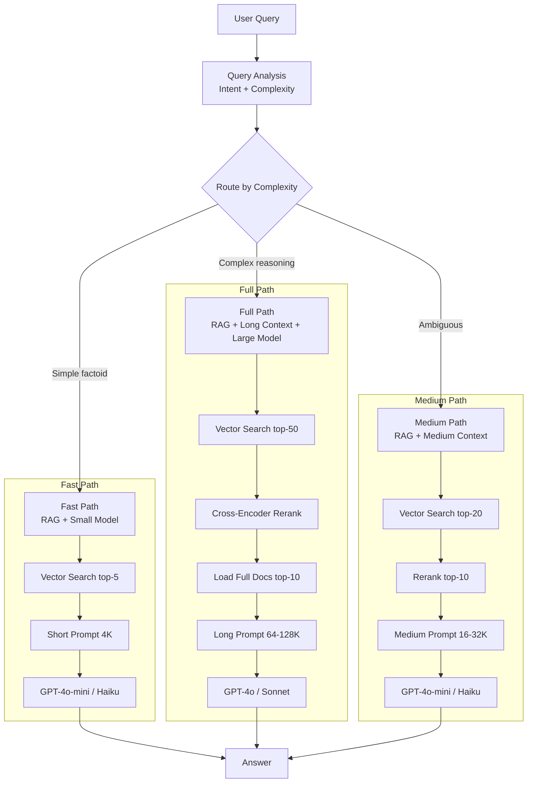
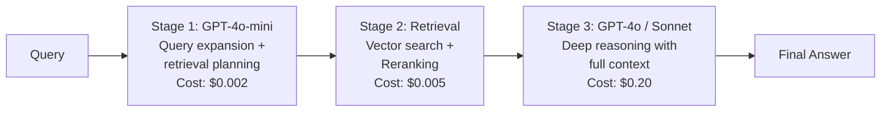

# Hybrid Architectures: The Production Winning Pattern

## Why Hybrid Wins

The debate between RAG and long-context is a false dichotomy. Production systems that achieve the best accuracy-cost-latency trade-offs use both:

- **RAG** handles: discovery, filtering, scale, freshness, multi-tenancy
- **Long-Context** handles: reasoning, synthesis, cross-reference, nuance

Together: Retrieve candidates cheaply → Pack into large context → Reason deeply.

## The Canonical Hybrid Pattern



## Pattern: Retrieve → Rerank → Pack → Reason

### Stage 1: Retrieve (Cheap, Fast, Broad)

```
Input: User query
Method: Embedding similarity search
Output: Top-50 candidate chunks
Cost: ~$0.001 (embedding + vector search)
Latency: 20-50ms
```

Purpose: Cast a wide net. Precision doesn't matter here — recall does.

### Stage 2: Rerank (Moderate Cost, High Precision)

```
Input: Query + 50 candidate chunks
Method: Cross-encoder scoring (e.g., Cohere Rerank, bge-reranker)
Output: Top-10 chunks with confidence scores
Cost: ~$0.002-0.01
Latency: 50-200ms
```

Purpose: Filter noise. Only high-confidence chunks proceed.

### Stage 3: Pack (Context Assembly)

```
Input: Top-10 chunks + their source documents
Method: 
  - Load full source documents for top-5 chunks
  - Include chunk-level context for remaining 5
  - Position using bookend strategy (best first/last)
  - Add structural markers
Output: Assembled context (30K-100K tokens)
Cost: ~$0 (just text assembly)
Latency: 10-50ms (token counting + assembly)
```

Purpose: Give the model maximum useful context in optimal positions.

### Stage 4: Reason (Expensive, Deep)

```
Input: Assembled context + query
Method: Long-context LLM with specific instructions
Output: Synthesized answer with citations
Cost: $0.10-1.00 (depending on context size and model)
Latency: 2-15s
```

Purpose: Deep reasoning over well-curated context.

### End-to-End Economics

```
Stage       | Cost    | Latency | Purpose
Retrieve    | $0.001  | 30ms    | Find candidates
Rerank      | $0.005  | 100ms   | Filter to relevant
Pack        | $0.000  | 20ms    | Optimize context
Reason      | $0.200  | 5s      | Generate answer
────────────────────────────────────────────
Total       | $0.206  | 5.15s   | Full pipeline

vs Pure RAG:    $0.005, 400ms   (but lower accuracy)
vs Pure LC:     $3.00,  20s     (but higher accuracy, way more expensive)
```

## Adaptive Context Sizing

### Query Complexity Detection

```python
def estimate_complexity(query: str, retrieved_chunks: list) -> str:
    """Route queries to appropriate context size."""
    
    signals = {
        'multi_hop': contains_comparison_words(query),  # "compare", "differ", "contrast"
        'synthesis': contains_synthesis_words(query),    # "summarize across", "common themes"
        'specificity': is_specific_factoid(query),      # "what is the value of X"
        'chunk_agreement': chunks_agree(retrieved_chunks),  # Do top chunks agree?
        'chunk_spread': source_diversity(retrieved_chunks),  # From how many docs?
    }
    
    if signals['specificity'] and signals['chunk_agreement']:
        return 'simple'  # 4K context, fast model
    elif signals['multi_hop'] or signals['synthesis']:
        return 'complex'  # 64-128K context, capable model
    elif signals['chunk_spread'] > 5:
        return 'medium'  # 16-32K context
    else:
        return 'medium'
```

### Dynamic Budget Allocation

| Complexity | Context Size | Model Tier | Max Cost | Target Latency |
|-----------|-------------|-----------|----------|----------------|
| Simple | 4-8K | Small (Haiku/4o-mini) | $0.01 | <1s |
| Medium | 16-32K | Medium (Sonnet/4o) | $0.10 | <5s |
| Complex | 64-128K | Large (Opus/4o) | $0.50 | <15s |
| Research | 128K-1M | Large + multi-pass | $2.00 | <60s |

## Multi-Stage Pipelines

### Cheap Model for Retrieval, Expensive Model for Reasoning



**Why multi-stage?**
- Stage 1 (cheap model): Reformulates query, generates search queries, identifies intent. Costs pennies.
- Stage 2 (no LLM): Retrieval + reranking is pure infrastructure cost.
- Stage 3 (expensive model): Only invoked with high-quality, pre-filtered context. Maximum value per dollar.

### Query Expansion with Cheap Model

```
User query: "How does the caching work?"

Stage 1 (GPT-4o-mini) generates:
- Search query 1: "prompt caching architecture KV pairs"
- Search query 2: "cache invalidation strategies"  
- Search query 3: "prefix cache implementation"
- Identified intent: technical deep-dive, needs architectural detail

Cost: $0.002 for query expansion
Benefit: 3x more relevant retrieval results
```

## Scaling Patterns

### At 1K Documents

```
Approach: Likely pure long-context
Reasoning: 1K docs × ~2K tokens = 2M tokens (fits in Gemini's window)
Cost: $2.50/query with Gemini (acceptable for most use cases)
Alternative: Cache the full corpus, $0.25/query with cache hits
```

### At 100K Documents

```
Approach: Hybrid (RAG retrieval + long-context reasoning)
Reasoning: 100K docs = 200M tokens (far exceeds any context window)
Architecture: 
  - Vector index over all 100K docs
  - Retrieve top-50 chunks
  - Load full text of top-5 source docs (~50K tokens)
  - Reason with 64K context
Cost: $0.20/query
```

### At 1M Documents

```
Approach: RAG-heavy hybrid with smart routing
Reasoning: Scale requires efficient filtering before any context packing
Architecture:
  - Multi-index: sparse (BM25) + dense (embeddings) + metadata filters
  - Two-stage retrieval: coarse then fine
  - Load full docs only for highest-confidence matches (top-3)
  - Reason with 32K context (most queries don't need more)
Cost: $0.05-0.30/query depending on complexity routing
```

### At 1B Documents (Web Scale)

```
Approach: Pure RAG with selective long-context escalation
Reasoning: At this scale, you can't afford long-context for every query
Architecture:
  - Inverted index + approximate nearest neighbor (HNSW/ScaNN)
  - Aggressive filtering (metadata, freshness, authority)
  - Short context for 95% of queries (cheap, fast)
  - Escalate to long-context only for complex/high-value queries
Cost: $0.005/query average (95% fast path, 5% expensive path)
```

## Real Production Examples

### Cursor (Code AI)

```
Architecture: Long-context dominant with RAG for discovery
- Index entire codebase for file discovery (RAG)
- Load relevant files fully into context (long-context)
- Typical context: 50-100K tokens of code
- Why: Code requires structural understanding that chunking destroys
- Key insight: Code files are self-contained enough to load fully
```

### Perplexity (AI Search)

```
Architecture: RAG-dominant with medium context for synthesis
- Web search + crawl relevant pages (RAG/retrieval)
- Extract relevant passages from top-10 pages
- Pack 10-20K tokens of curated web content into context
- Synthesize with citations (medium context reasoning)
- Why: Web is infinite, must retrieve first; synthesis needs multi-source context
```

### Legal AI (e.g., Harvey, CaseText)

```
Architecture: Full hybrid with complexity routing
- Simple queries: "What's the deadline?" → RAG with short context
- Complex queries: "Compare indemnification across all 5 contracts" → 
  Retrieve contracts (RAG) → Load fully (long-context) → Synthesize
- Key insight: Legal accuracy requirements justify expensive long-context
  A wrong answer costs more than $3 of compute
```

### Enterprise Knowledge (Glean, etc.)

```
Architecture: RAG with selective long-context escalation
- 95% of queries: factoid lookup → RAG + 8K context → fast model
- 5% of queries: complex analysis → RAG + 64K context → capable model
- Multi-tenancy handled at RAG layer (permission-filtered retrieval)
- Key insight: Most enterprise queries are simple; pay premium only when needed
```

## Future-Proofing: Designing for Growing Context Windows

### The Trend

```
2023: 128K tokens practical, $15/M input
2024: 1M tokens practical, $3/M input
2025: 2-10M tokens available, $1-3/M input
2026: 10M+ expected, <$1/M projected

Every ~12 months: window doubles, cost halves
```

### Architectural Implications

1. **Don't hardcode context limits**: Use configurable budgets, not fixed sizes. When 10M tokens costs $0.50, your RAG system should automatically shift more load to long-context.

2. **Keep RAG infrastructure**: Even at 10M tokens, you'll need retrieval for:
   - Corpora that exceed 10M tokens
   - Multi-tenancy filtering
   - Real-time data
   - Cost-sensitive high-QPS workloads

3. **Build the router**: The query classifier that decides fast-path vs full-path is the most durable component. It adapts as cost curves shift.

4. **Abstract the context assembly layer**: Whether you pack 32K or 1M tokens, the logic (priority, positioning, budget allocation) is the same.

### Migration Path: RAG → Hybrid → Long-Context

```
Phase 1 (today): RAG for everything, long-context for complex queries
Phase 2 (12-18 months): Hybrid default, RAG only for scale/freshness/multi-tenant
Phase 3 (2-3 years): Long-context default, RAG only for >10M token corpora
Phase 4 (future): Models with persistent memory eliminate most retrieval
```

## Migration Guide: Pure RAG to Hybrid

### Step 1: Identify High-Value Queries

```
Not all queries benefit from long-context. Identify:
- Queries where RAG accuracy < 80% (synthesis, comparison, multi-hop)
- Queries where users follow up asking for more detail
- Queries that hit multiple chunks from same document
```

### Step 2: Build Context Assembly Layer

```
Between retrieval and generation, add:
- Full document loading (when top chunks come from same doc)
- Context budgeting (how much to load)
- Position optimization (bookend strategy)
```

### Step 3: Add Query Router

```
Simple classifier (can be rule-based initially):
- Single-fact queries → existing RAG path (cheap, fast)
- Multi-doc/synthesis queries → new hybrid path (expensive, accurate)
```

### Step 4: Implement Caching

```
For hybrid path:
- Cache stable prefix (system prompt + reference docs)
- Session-level caching for multi-turn
- Monitor cache hit rate and ROI
```

### Step 5: A/B Test and Iterate

```
Metrics to compare:
- Answer accuracy (human eval or automated)
- User satisfaction (thumbs up/down)
- Cost per query (track actual spend)
- Latency distribution (p50, p95, p99)
```

## Key Decisions for Staff Architects

1. **The router is your most important component**: It determines cost, latency, and accuracy for every query. Invest in making it smart (ML-based, not just rules).

2. **Start with the fast path, add complexity selectively**: 80% of queries don't need 128K context. Build the cheap path first, then add expensive paths for the 20% that need it.

3. **Caching is not optional for long-context economics**: Without caching, long-context at scale is bankrupting. Budget for cache-friendly architecture from the start.

4. **Multi-tenancy is the hardest hybrid problem**: When different users see different documents, you can't share cached contexts across users. This pushes toward RAG for the retrieval layer.

5. **Measure accuracy per dollar, not just accuracy**: A system that's 95% accurate at $0.50/query may be better than 97% accurate at $3.00/query, depending on error costs.

6. **Plan for the transition, not just today**: Build abstraction layers that let you shift from RAG-heavy to context-heavy as costs drop without rewriting your architecture.

7. **The hybrid pattern is the safest bet**: It naturally adapts as context windows grow (shift more to long-context) and as costs drop (expand context budgets). Pure approaches lock you in.

8. **Production is about the long tail**: Your architecture needs to handle the 95th percentile query (complex, multi-document, ambiguous) gracefully, not just the median query.
